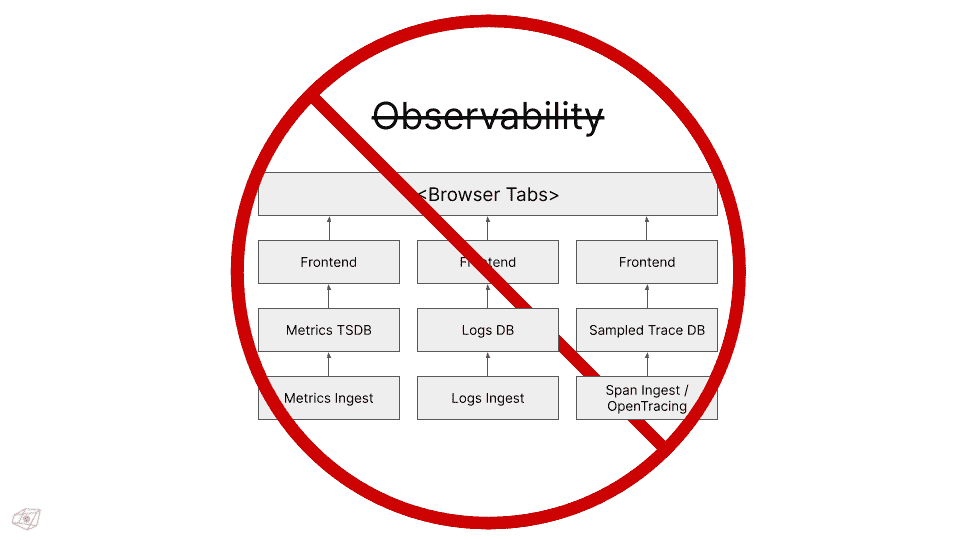
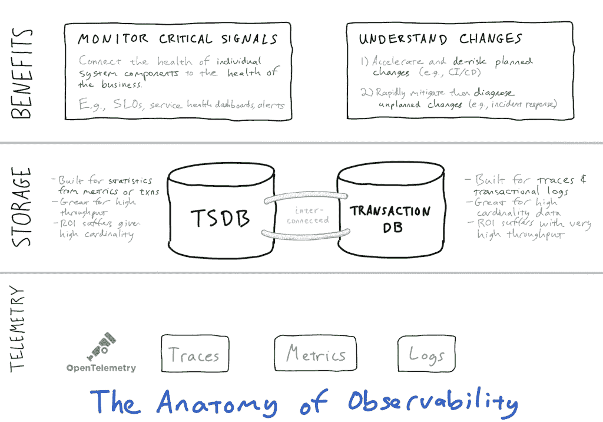
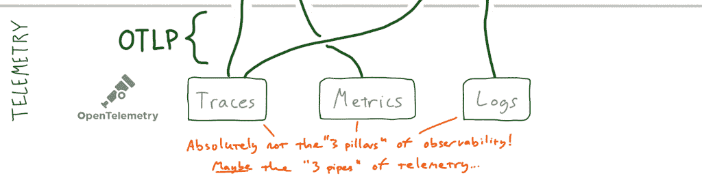
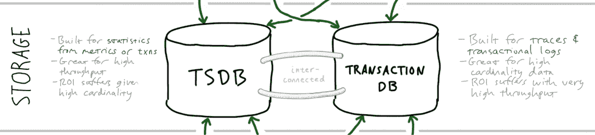
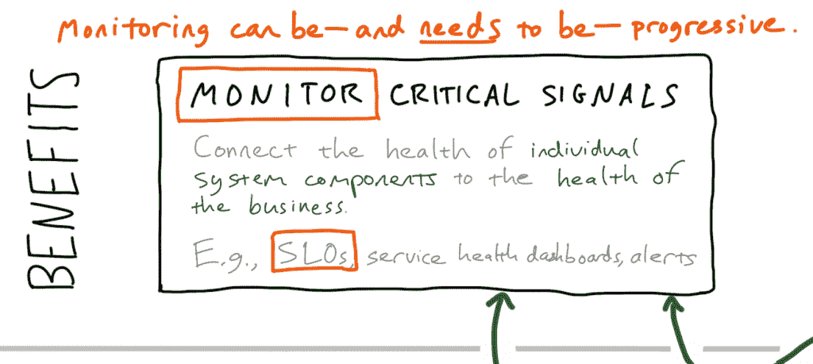
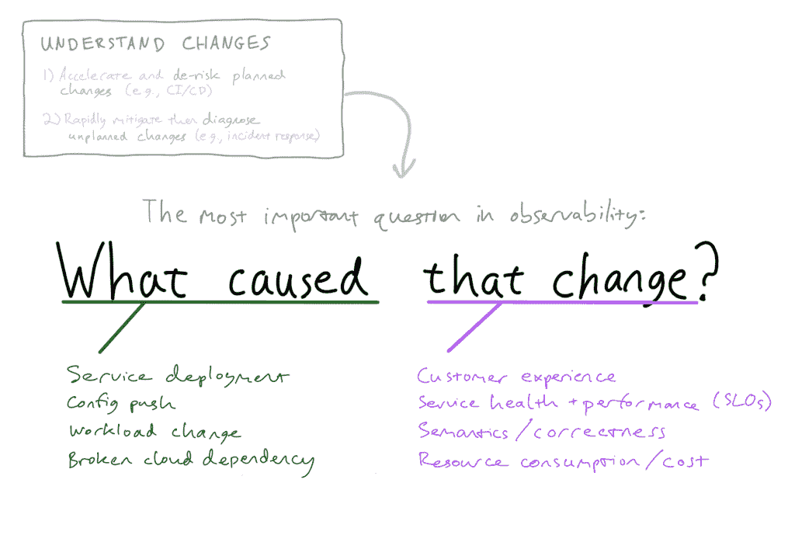

# 可观察性不会取代监控(因为它不应该)

> 原文：<https://thenewstack.io/observability-wont-replace-monitoring-because-it-shouldnt/>

 [本·西格曼

本是 Lightstep 的首席执行官和联合创始人。](https://www.linkedin.com/in/bensigelman/) 

我厌倦了听到可观察性取代监控。它不会，因为它不应该。可观察性不会取代监控，它会增加监控的 T2。

我厌倦了听到度量、日志和跟踪是“可观察性的三大支柱”它们算不上支柱——更像是“管道”——它们是遥测数据，而不是价值。

我厌倦了听到供应商和开源软件项目声称用时序数据库(TSDB)解决所有可观测性用例。我也厌倦了听到供应商和开源项目声称用事件/跟踪/事务存储解决所有可观察性用例。事实上，要使可观察性起作用，我们需要*和*——然而在实践中有效地结合它们是极其困难的。

但是，如果[可观察性不能取代监控](https://thenewstack.io/monitoring-vs-observability-whats-the-difference/)，如果“三大支柱”不是真正的支柱，并且一个闪亮的数据存储永远不够，那么*我们应该如何*对可观察性建模？

几周前，我写了这个，并在 Twitter 上发布了它，引起了共鸣:

在本文中，我将更详细地解释这些概念(一次超过 280 个字符)。然后，我们将了解监控的正确作用和局限性，管理可观察性数据存储的自然法则，以及*如何变化*应该作为大多数可观察性探索的路标。

事不宜迟…

## 可观察性的剖析

在我们谈论什么是可观察性的剖析*是*之前，让我们谈论什么是可观察性的剖析*不是*:

有一种不幸的倾向，将可观测性与遥测术混为一谈。或者，至少，使用构建在遥测筒仓之上的松散集成的用户界面——如上图所示。在这个公式中，可观察性被解释为度量工具、日志工具和跟踪工具的共存。毫不奇怪，这种想法是由那些构建或收购基于这些所谓“支柱”的产品的供应商支持的，现在他们想把它们卖给你！嗯。

简而言之:**不要把指标、跟踪/APM 和日志记录的共存误认为是“可观察性”**

像大多数实际上获得一些动力的坏想法一样，这里有一点真理:特别是，跟踪、度量和日志在最终的解决方案中都有一席之地。但它们不是产品——它们只是原始数据。*遥测*。

那么，如果可观察性不仅仅是“度量、日志和跟踪”，它是什么呢？

【T2

### 第 1 层:(开放式)遥测

事实上，没有原始的遥测数据，我们就不可能有可观测性。就收集遥测数据而言，历史上的工程组织有两种选择:

1.  为一项主要的、持续的计划配备人员，以收集整个基础设施的高质量遥测数据；或者
2.  向供应商支付一大笔钱来部署专有代理，这些代理提供了对基本遥测的更容易的访问，理想情况下没有任何代码更改。

这两种选择都很昂贵，尽管方式不同——但谢天谢地，现在有了一种两全其美的选择:开放式遥测技术。

[OpenTelemetry 项目](https://opentelemetry.io/)(又名“OTel”)旨在“让高质量遥测成为云原生软件的内置功能。”所有主要的云供应商都承诺支持 OTel(包括 [Amazon Web Services、](https://www.diagrid.io/?utm_content=inline-mention) Azure 和 GCP ),对于大多数提供某种可观察性解决方案的供应商来说也是如此(包括 [Lightstep](https://lightstep.com/?utm_content=inline-mention) ，作为 OTel 的创始成员，这是理所当然的！).

由于 OTel 支持自动仪器，现在无需更改代码就可以获得高质量、厂商中立的遥测技术。通过这种方式，OTel 颠覆了专有代理的理念，反过来，也颠覆了与之相区别的供应商。此外，随着原生 OTel 和 OTLP("**O**pen**T**e**L**e metry**P**rotocol ")支持跨越基础架构堆栈，不再需要仅仅为了访问他们的数据集成套件而从供应商那里购买可观测性。任何符合 OTel 标准的可观测性提供商都可以获得高质量的遥测技术，跨越整个堆栈，并且完全不受供应商限制。这对每个人来说都更好——可能除了现有的供应商，他们必须接受他们在无数“云集成”上花费的沉没成本

### 第 2 层:存储

如果“第 1 层”是关于获得高质量遥测数据，那么“第 2 层”是关于你将它发送到哪里，以及你如何存储它以及存储多长时间。当考虑数据存储的可观察性时，我想起了不久前看到的保险杠贴纸。上面写着:

当谈到可观察性数据存储时，我们发现自己处于类似的困境。呈现为保险杠贴纸，可能如下所示:

从根本上说，如果我们想要高效地处理高吞吐量数据(例如，在一个横向扩展的应用程序中传递 100%的消息，或者甚至进行高保真的基础测量，如每个容器的 CPU 负载或内存使用)，我们必须将统计数据记录到一个时间序列数据库中。否则，我们在单个事件的传输和存储上浪费了太多。虽然有些人可能建议您可以对事件进行采样，但对于隐藏在高频消防水管中的低频数据，您可能会完全错过。这种情况需要一个专门的**时间序列数据库** (TSDB):一个专门为像这样的时间序列统计数据的存储、索引和查询而设计的数据存储。

然而。如果我们想要处理高基数数据(例如，每个客户的标签、短暂基础设施的唯一 id 或 URL 片段)，TSDB 就是一场彻头彻尾的灾难——随着标签基数的爆炸，唯一时间序列也随之爆炸，成本也随之爆炸。因此也必须有一个**事务数据库**；传统上，这是一个日志数据库，尽管更明智的做法是围绕一个分布式跟踪本机事务数据库(稍后将详细介绍)进行构建，这样可以一举两得(日志和跟踪)。

尽管如此，找到同类最佳的事务和时间序列数据库是必要的，但还不够。为了使实际的“可观察性”部分无缝，数据层还需要集成和交叉引用——最好是深度集成和交叉引用。

难怪高质量的可观测性让人感觉如此难以捉摸。这就把我们带到了第三层，也是最重要的一层……

### 第三层:**实际收益**

说到底，遥测技术——无论是运动中的还是静止的——都不是*固有的价值。只有构建在其上的工作流和应用程序才是有价值的。然而，在“可观察性作为度量、日志和跟踪”的传统表述中，我们甚至不知道我们正在解决什么问题！更不用说我们如何解决了。*

谈到现代分布式软件应用程序，有两个首要问题值得用可观察性来解决:

*   **了解健康状况:**通过周密的监控，将子系统的健康状况与总体应用程序和业务的目标联系起来。
*   **理解变更:**加速计划变更，同时减轻计划外变更的影响。

### **了解健康:**“贴心监测”

在这个过程中的某个地方，“监控”被扔到了一辆公共汽车下面——这很不幸。如果我们将监控定义为*将系统组件的健康与业务的健康联系起来的努力*，那么它实际上是非常重要的。最干净、最进步的方法是围绕服务水平目标(SLO)建立一个完善的组织流程，但这是一个可伸缩的尺度。最重要的是，对每个子系统中的关键 API 和控制表面进行持续监控，操作员可以快速评估子系统的健康状况(一目了然)，并快速发现特定症状可能在何时何地突然出现。

为了实现最大的灵活性和最小的冗余，周密的监控必须能够测量在时间序列数据库*或*事务数据库中发现的症状。也就是说，监控当然需要访问度量数据，但也需要能够实时查询事务(即跟踪)数据。

在任何情况下，监控只能用于测量子系统的健康状况，并获得关于健康威胁的预警。监测是*而不是*我们应该诊断健康的变化；这就是许多组织误入歧途的地方。

**如果您试图使用您用于事件** ***检测*** **的相同基本监控工具来解决事件** ***响应*** **，您将陷入痛苦之中。**这是因为仪表板和警报——甚至是 SLO——对于检测健康问题非常有用，但对于诊断甚至补救它们却很糟糕。

“监控”得到了一个坏名声，因为操作员试图监控分布式系统的每一种可能的故障模式。那不行，因为他们太多了。这就是你公司有太多仪表板的原因。

那么，我们如何有效地隔离和识别这些故障模式呢？

### **理解变化**

如果我们只需要稳定我们的软件，从哪里开始是毫无疑问的:对于云原生应用程序，超过 70%的事件源于某种有意的更改(通常是服务部署或配置推送)。不幸的是，如果我们停止将新代码投入生产，我们的产品就会输给竞争对手，我们的雇主最终将不复存在！因此，这不可能是长期战略，即使我们仍然希望在假日周末宣布部署冻结。

退一步讲，变化真的只有两种:*计划内*和*计划外*。对于*计划的*变更，可观察性可以关闭 CI/CD 的循环，并让我们对部署的本地和全局健康状况更有信心(更多信息请参见[这里的](https://lightstep.com/deployments/)和[这里的](https://lightstep.com/blog/github-action-predeploy-check/))。

对于*计划外的*变更，可观察性是镇上唯一的游戏:由于分布式应用程序有不可计数的大量潜在故障模式，我们快速理解计划外变更*的方法必须*是动态的，并且*必须*跨越服务边界。从一开始，这意味着我们的工作流必须触及经常启动这些调查的时间序列指标，以及引导我们从一个服务到下一个服务进行分析的跟踪数据。

有些人试图用类似的海量查询语言和大量详细的文档来解决这个海量数据分析问题。出于组织的原因，这不起作用:问题是**可观察性变成了一个专家系统**，在这个过程中，通才工程师/DevOps/SRE 变得无法访问它，他们正在与我们开始的“计划外的变化”搏斗。

让我们陈述一个明显的事实:**如果你需要重新培训你的组织来利用它，那么可观察性是没有价值的。**可观察性*可以*为一个组织带来变革，但前提是它的力量是不言而喻且可及的。没有人喜欢阅读手册，尤其是在事故期间！

这就是为什么“变化”需要成为有效的、被广泛采用的可观察性的基本原语。当可观察性被框定在一个已知变化的背景中时，埋藏在遥测数据的消防水管中的洞察力可以被语境化，并且*被排名*。这样，对“改变”的关注对于操作者*和工具*都是相互的:它给工具一个清晰的目标函数来解释，并且给操作者一个更容易理解的 UX。

[变更智能](http://lightstep.com/product#change-intelligence)的全部要点是从已识别的变更开始——可能来自警报，可能来自 CI/CD 系统，可能只是点击仪表板中的偏差——然后*让可观察性解决方案解释变更*，所有这些都不需要干预手动查询或考虑遥测来自哪里或存储在哪里。

## 最后

可观察性似乎很重要，因为它*很重要*。但是仅仅因为它重要并不意味着它需要感觉复杂；当然也不需要感到困惑。

因此，让我们将上述内容归结为四条简短的指导原则:

1.  采用开放、便携的方式收集原始数据(“遥测”)OpenTelemetry 是明确的默认方式。
2.  存储遥测数据是非常复杂的。当心任何声称只使用*事件数据或*时间序列统计数据的解决方案——这两者都是规模化所需要的。**
3.  监控不会消失，因为了解系统的健康状况总是很重要。但是监控需要发展，以尽可能直接地将业务需求与应用程序的行为联系起来。
4.  最后:当可观察性围绕*变化*时，它是最容易接近、可操作和广泛适用的。软件部署的计划内变更或事件响应的计划外变更。

借助这一框架，我们可以了解如何集成遥测技术，如何发现好得令人难以置信的数据层，以及如何发展传统监控，同时集成现代可观测性解决方案的宝贵见解。

通过 Pixabay 引导图像。

<svg xmlns:xlink="http://www.w3.org/1999/xlink" viewBox="0 0 68 31" version="1.1"><title>Group</title> <desc>Created with Sketch.</desc></svg>