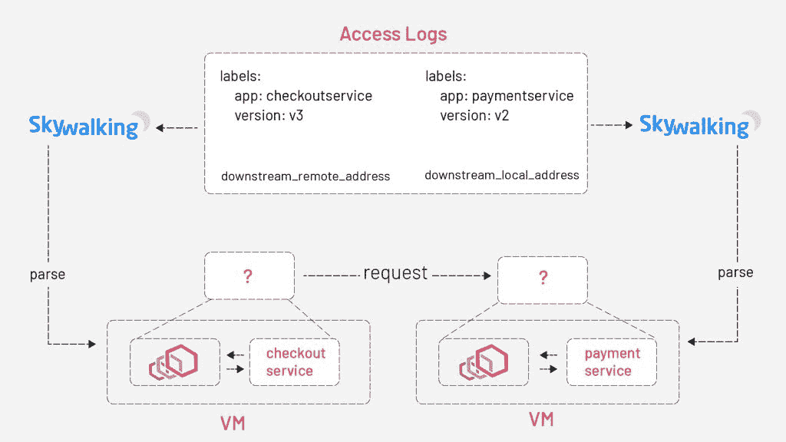
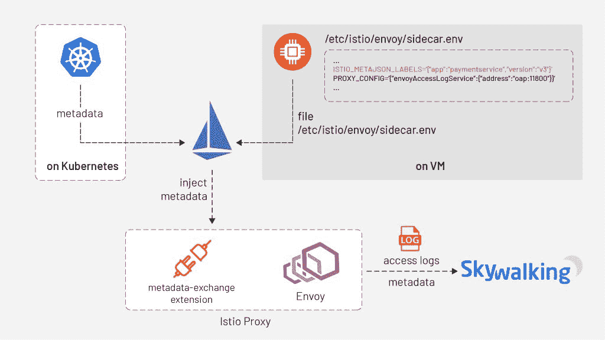
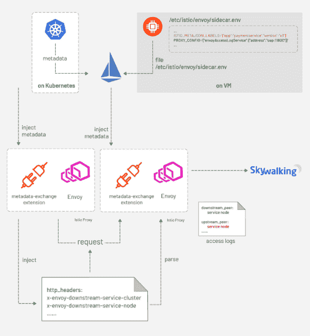
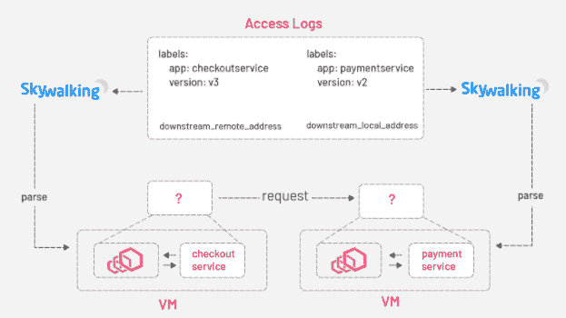
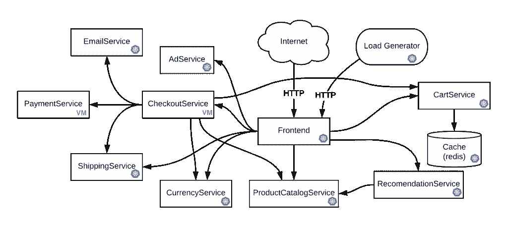
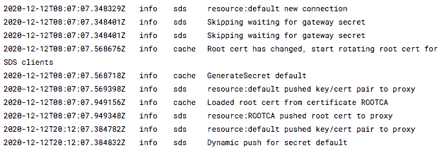
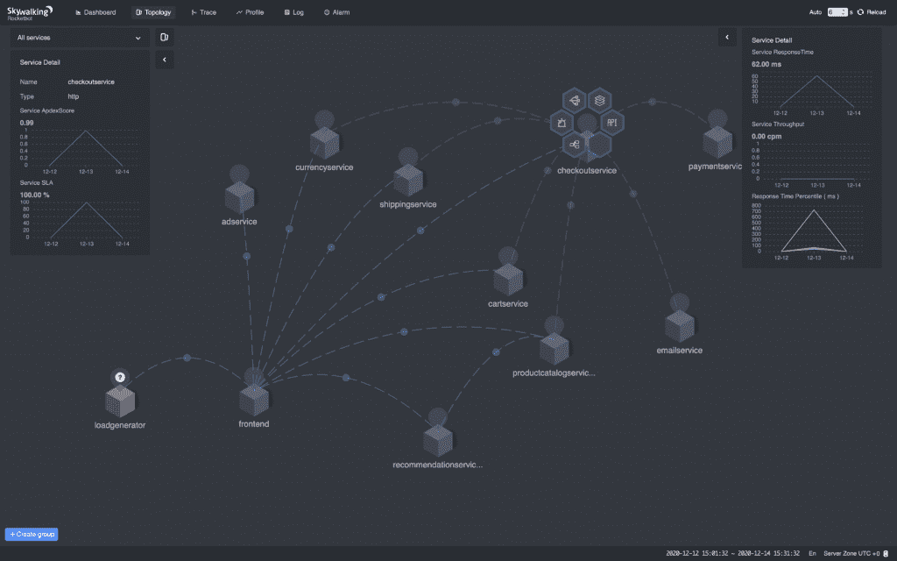
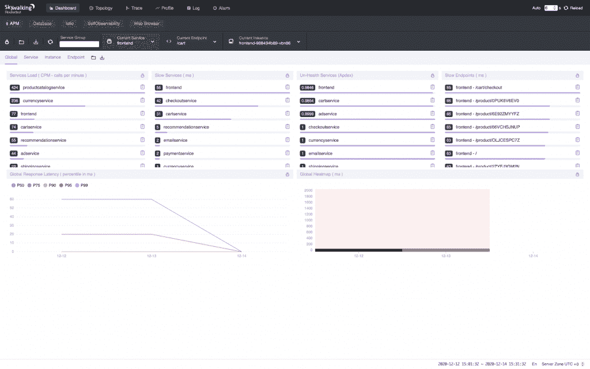
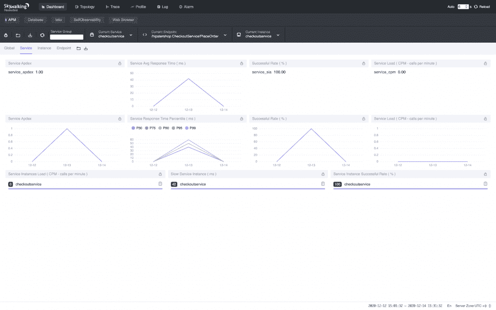
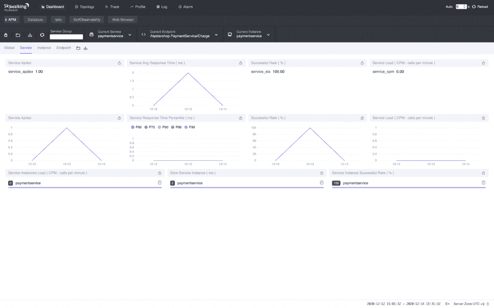

# 观察虚拟机服务与 Apache SkyWalking 和 Envoy 访问日志服务的配合

> 原文：<https://thenewstack.io/observe-virtual-machine-service-meshes-with-apache-skywalking-and-the-envoy-access-log-service/>

Tetrate 赞助了这篇文章。

 [高鸿涛

陶虹是 Tetrate 工程师，前华为云专家。作为 Apache SkyWalking 的 PMC 成员之一，他参与了 Apache ShardingSphere 和 Elastic-Job 等流行的开源项目。](https://www.linkedin.com/in/gaohongtao0622/) 

想要观察延伸到虚拟机的服务网格吗？ [Apache SkyWalking](https://github.com/apache/skywalking) 中的新分析器——专门为微服务、云原生和基于容器的架构设计的应用程序监控(APM)系统——利用 Envoy 的元数据交换机制在 Kubernetes、VM 或混合环境中工作。

在[以前的一篇文章](https://www.tetrate.io/blog/observe-service-mesh-with-skywalking-and-envoy-access-log-service/)中，我们讨论了 Kubernetes 环境中服务网格的可观察性，并在实践中将其应用到 bookinfo 应用程序中。但是在这种情况下，为了将 IP 地址映射到服务，SkyWalking 需要从 Kubernetes 集群访问服务元数据，这对于部署在虚拟机中的服务是不可用的。在本教程中，我们将演示 SkyWalking 的新分析器如何让您更好地观察包含虚拟机的网格。

## 它是如何工作的

虚拟机与 Kubernetes 的不同之处在于，对于虚拟机服务来说，我们无法获取元数据来将 IP 地址映射到服务。

SkyWalking Analyzer 的机制与我们之前描述的相同，但是我们在本文中提出的基本思想是将元数据与 Envoy 的访问日志一起携带——这是 Envoy 中的元数据交换机制。([访问日志服务](https://www.envoyproxy.io/docs/envoy/latest/api-v2/service/accesslog/v2/als.proto)或 ALS 是一个 Envoy 扩展，它发出所有通过 Envoy 的请求的详细访问日志)。

当 Istio pilot-agent 启动一个 Envoy 代理作为服务的边站时，它从 Kubernetes 平台收集该服务的元数据——或者在部署该服务的 VM 上的文件——并将元数据注入到 Envoy 的引导配置中。当向天行者接收器发送访问日志时，Envoy 将透明地携带这些元数据。

 [徐震·柯

徐震是 Tetrate 工程师，也是阿帕奇天行者的 PMC 成员。他也是 Apache Dubbo 的委托人。](https://www.linkedin.com/in/kezhenxu94/) 

但是 Envoy 如何编写一个包含客户端和服务器端的完整访问日志呢？当一个请求从 Envoy 发出时，一个名为 metadata-exchange 的 istio-proxy 插件将元数据注入 HTTP 头(带有类似于`x-envoy-downstream-`的前缀),然后元数据被传播到服务器端。服务器端的 Envoy sidecar 接收请求，将报头解析为元数据，然后将元数据放入访问日志中——由`wasm.downstream_peer`进行键控。服务器端特使还将自己的元数据放入访问日志，由`wasm.upstream_peer`键入。因此，一个请求的两个方面都完成了。

通过元数据交换机制，我们可以直接使用这些元数据，而无需任何额外的查询。

## 例子

在下面的教程中，我们将使用另一个演示应用程序— [在线精品店](https://github.com/GoogleCloudPlatform/microservices-demo) —它由 10 多个服务组成，因此我们可以在虚拟机中部署其中一些服务，并使它们与部署在 Kubernetes 中的其他服务进行通信。

在线精品店的拓扑结构

为了覆盖尽可能多的情况，我们将在 VM 上部署`CheckoutService`和`PaymentService`，在 Kubernetes 上部署所有其他服务；这样我们就可以涵盖 Kubernetes → VM(例如`Frontend` → `CheckoutService`)、VM → Kubernetes(例如`CheckoutService` → `ShippingService`)和 VM → VM(例如`CheckoutService` → `PaymentService`)等情况。

**注意**:本教程中使用的所有命令都可以在 [GitHub](https://github.com/SkyAPMTest/sw-als-vm-demo-scripts) 上访问。

`git clone https://github.com/SkyAPMTest/sw-als-vm-demo-scripts`

`cd sw-als-vm-demo-scripts`

确保在继续之前正确初始化`gcloud` SDK。

将文件`env.sh`中的`GCP_PROJECT`修改为您自己的项目名称。如果保持不变，大多数其他变量应该是有效的。如果您想使用`ISTIO_VERSION` > /= 1.8.0，请确保[中包含此补丁](https://github.com/istio/istio/pull/28956)。

### 准备 Kubernetes 集群和虚拟机实例

[00-create-cluster-and-VMs . sh](https://github.com/SkyAPMTest/sw-als-vm-demo-scripts/blob/2179d04270c98b9f87cf3998f5af775870ed53a7/00-create-cluster-and-vms.sh)创建一个新的 GKE 集群和两个虚拟机实例，它们将在整个教程中使用，并设置一些必要的防火墙规则，以便它们相互通信。

### 安装 Istio 和天桥

[01a-install-istio.sh](https://github.com/SkyAPMTest/sw-als-vm-demo-scripts/blob/2179d04270c98b9f87cf3998f5af775870ed53a7/01a-install-istio.sh) 安装规格为`resources/vmintegration.yaml`的 istio 操作器。在 YAML 文件中，我们启用了在 mesh 中支持 VM 的`meshExpansion`。我们还启用了 Envoy 访问日志服务，并指定了 Envoy 发送访问日志的地址`skywalking-oap.istio-system.svc.cluster.local:11800`。

[01 b-install-SkyWalking . sh](https://github.com/SkyAPMTest/sw-als-vm-demo-scripts/blob/2179d04270c98b9f87cf3998f5af775870ed53a7/01b-install-skywalking.sh)安装 Apache SkyWalking 并将分析器设置为`mx-mesh`。

### 创建文件来初始化虚拟机

02-create-files-to-transfer-to-VM . sh 创建用于初始化虚拟机的必要文件。

[03-copy-work-files-to-VM . sh](https://github.com/SkyAPMTest/sw-als-vm-demo-scripts/blob/2179d04270c98b9f87cf3998f5af775870ed53a7/03-copy-work-files-to-vm.sh)使用`gcloud scp`命令将生成的文件安全传输到虚拟机。

现在用`./ssh.sh checkoutservice`和`./ssh.sh paymentservice`分别登录两个虚拟机，用`cd`登录`~/work`目录，在`checkoutservice`虚拟机实例上执行`./prep-checkoutservice.sh`，在`paymentservice`虚拟机实例上执行`./prep-paymentservice.sh`。Istio 边车应正确安装和启动。为了验证这一点，使用`tail -f /var/logs/istio/istio.log`检查 Istio 日志。输出应该类似于:

dnsmasq 配置`address=/.svc.cluster.local/{ISTIO_SERVICE_IP_STUB}`还将以`.svc.cluster.local`结尾的域名解析为 Istio 服务 IP，这样您就可以通过全限定域名(FQDN)如`httpbin.default.svc.cluster.local`访问虚拟机中的 Kubernetes 服务。

### 部署演示应用程序

因为我们想在虚拟机上手动部署`CheckoutService`和`PaymentService`，所以`resources/google-demo.yaml`从[原来的 YAML](https://github.com/GoogleCloudPlatform/microservices-demo/blob/master/release/kubernetes-manifests.yaml) 中移除了这两个服务。04a-deploy-demo-app.sh 在 Kubernetes 上部署其他服务。

然后登录 2 个虚拟机，分别运行`~/work/deploy-checkoutservice.sh`和`~/work/deploy-paymentservice.sh`部署`CheckoutService`和`PaymentService`。

### 将虚拟机注册到 Istio

虚拟机上的服务可以通过 FQDN 访问 Kubernetes 上的服务，但当 Kubernetes 服务想要与虚拟机服务对话时，情况就不一样了。网状网不知道向哪里转发诸如`checkoutservice.default.svc.cluster.local`的请求，因为`checkoutservice`在 VM 中是孤立的。因此，我们需要向网格注册服务。

[04 B- register-vm-with-istio . sh](https://github.com/SkyAPMTest/sw-als-vm-demo-scripts/blob/2179d04270c98b9f87cf3998f5af775870ed53a7/04b-register-vm-with-istio.sh)通过创建一个没有运行 pod 的“虚拟”服务和一个`WorkloadEntry`来将 VM 服务注册到网格，以桥接“虚拟”服务和 VM 服务。

搞定了。

这个演示应用程序包含一个负载生成器:一个重复执行请求的服务。我们只需要等待几秒钟，然后打开 SkyWalking web UI 查看结果。

`export POD_NAME=$(kubectl get pods --namespace istio-system -l "app=skywalking,release=skywalking,component=ui" -o jsonpath="{.items[0].metadata.name}")`

`echo "Visit http://127.0.0.1:8080 to use your application"`

`kubectl port-forward $POD_NAME 8080:8080 --namespace istio-system`

浏览浏览器至 [http://localhost:8080](http://localhost:8080) 。指标、拓扑应该在那里。

拓扑学

全球指标

签出服务度量。

支付服务指标

## 解决纷争

如果您在执行这些步骤时遇到任何麻烦，以下是一些常见问题和可能的解决方案:

### VM 服务无法访问 Kubernetes 服务？

很可能是虚拟机上的 DNS 没有正确解析完全限定的域名。尝试用`nslookup istiod.istio-system.svc.cluster.local`验证。如果它不能解析到 Kubernetes CIDR 地址，重新检查`prep-checkoutservice.sh`和`prep-paymentservice.sh`中的步骤。

如果 DNS 工作正常，尝试验证 Envoy 是否已经使用`curl`http://localhost:15000/clusters 从控制平面获取了上游集群。如果不包含目标服务，重新检查`prep-checkoutservice.sh`。

### 服务正常但在天巡 WebUI 上什么都没有？

通过`kubectl -n istio-system logs -f $(kubectl get pod -A -l "app=skywalking,release=skywalking,component=oap" -o name)`检查 SkyWalking OAP 日志，通过`kubectl -n istio-system logs -f $(kubectl get pod -A -l "app=skywalking,release=skywalking,component=ui" -o name)`检查 WebUI 日志，查看是否有错误日志。另外，确保浏览器右下角的时区设置为`UTC +0`。

## 额外资源

[观察带有特使 ALS 的服务网](https://www.tetrate.io/blog/observe-service-mesh-with-skywalking-and-envoy-access-log-service/)。

从 Tetrate 获得一本关于空中漫步的免费电子书[；在他们的博客](https://www.tetrate.io/apache-skywalking-ebook-tetrate/)[上阅读更多关于太空行走的内容](https://www.tetrate.io/blog/category/open-source/apache-skywalking/)和[注册](https://www.tetrate.io/contact-us/)来听更多关于可观测性的内容。

在[官方网站](https://skywalking.apache.org)和通过 [Twitter](https://twitter.com/ASFSkyWalking) 获得更多天行者更新。

问题和反馈可发送至 [learn@tetrate.io](mailto:learn@tetrate.io) 。

通过 Pixabay 的特征图像。

<svg xmlns:xlink="http://www.w3.org/1999/xlink" viewBox="0 0 68 31" version="1.1"><title>Group</title> <desc>Created with Sketch.</desc></svg>