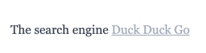

# 黑曜石和使用更多降价的情况

> 原文：<https://thenewstack.io/obsidian-and-the-case-for-using-more-markdown/>

像记笔记这样简单的事情有着令人惊讶的复杂历史。在台式电脑的全盛时期，拥有一个记事本应用程序，或者甚至是记事本，似乎是显而易见的。人们写了笔记。有时他们会发邮件给他们。就这样。

但是随着屏幕变得更大更清晰，文本需要改变字体，不同的表格，斜体，粗体，甚至颜色。随着个人计算机的发展，以专有方式存储这些信息变得越来越愚蠢。即使在伟大的文字处理帝国出现后，人们仍然想做简短的便携式笔记。

“标记”文本以暗示强调的概念一直存在。想到的不经意:

…用来指清嗓子，或开始敬酒。

还是最近的迷因:

…我们被要求想象说话者正在翻动一些文件，试图找到之前写的东西。在这两种情况下，普通读者都知道星号不是信息的一部分，而是信息表达方式的一部分。

由约翰·格鲁伯和艾伦·施瓦茨于 2004 年发明的 Markdown(T5)旨在创造一种人类可读的开放格式，这种格式可以转换成好看的类似 HTML 的文本。所以，是的，降价是一种加价形式。

> 学习 Markdown 的两个主要原因是平台独立性和速度。而且学起来很快。

自然，添加标记的目的是让应用程序能够正确地使用它，或者至少导入它，然后转换成应用程序的本机格式。像[概念](http://notion.io)这样的流行应用程序将会推出降价功能，有助于提高便携性。

过去，我们用富文本格式(RTF)保存笔记，因为这是微软写字板使用的格式。RTF 在今天是完全可读的。但是没有人会认真考虑像这样用 RTF:
手工标记文本

```
par }pard nowidctlparwidctlparadjustright {fs24
par }{f6fs24 Here is a brief Courier text.
par }{f11fs24 Here is a brief MS Sans - Serif text.
par }{f10fs24 Here is a brief MS Serif text.
par }{fs24 Here is a brief Times New Roman text.

```

现在，Markdown 在表情符号时代确实有批评者，因为那些生来就有 iPhones 的人喜欢自己标记东西，对 X 世代告诉他们如何做没有兴趣。不管怎样，Markdown 已经实现了它的目标，成为一种能够灵巧地捕捉标记的可读格式。随着 **[黑曜石](http://obsidian.md)，**声称是“一个强大的知识库，位于一个纯文本 Markdown 文件的本地文件夹之上”，我认为它已经有了自己的地位。

## 首先，基础知识

首先，让我们看看一些基本的降价。像所有好的标准一样，没有两个权威完全同意所有更高级的东西，但是下面的语法总是被支持的。

以下是一些标题:

```
# This is a main heading 1
## This is a sub heading 2
### This is a sub heading 3

```

有替代品。大多数减价商品都有替代品；这样，它就可以很好地处理已经使用相同标记的其他格式。例如:

```
# This is a main heading # 
This is a main heading 
======================

```

斜体和粗体:

```
# Examples 
*This text will be italic* 
_*This will also be italic_ 
**This text will be bold** 
__This will also be bold__ 
_You **can** combine them_*

```

如果我们将上述内容用作在线格式化程序 [dillinger.io](http://dillinger.io) 的输入，我们会得到:


要创建块引用，请添加“>”作为该行的第一个字符。这从邮件中应该已经感觉很熟悉了。

```
> Dorothy followed her through many of the beautiful rooms in her castle.

```

而列表只需要一个破折号(或者加号，或者星号)和一个空格。对于有序列表，只是一个数字后跟一个点和一个空格。添加四个空格或一个制表符，你会得到一个缩进。应用程序通常会处理枚举:

```
- Start of an unordered list 
+ Another unordered list element 
    - indented addition 
1\. Now let's start a nice list 
1\. Another element

```

这应该呈现为:


如何表明您不希望某个部分被格式化？例如，因为您正在使用代码片段？使用一个**代码块**，通过键入四个空格或一个制表符来指示。

现在，当涉及到连续格式时——比如列表和代码块——您有点受渲染器实现的支配。建议明智地在前后使用空行，以表明您想要开始或中断该格式样式。这是最容易让粗心的人惊恐的地方。

举个例子，这个:

```
*Let me emphasize* 
* This is a list element 
*This is in emphasis* (But it is still level with the list) 
    * This is imbedded 

    * This is a code block (needed two blank lines)

```

…一旦出现两个空行，就会正确呈现(在 dillinger.io 中)。请注意，代码块中的星号实际上被忽略了:


最简单的链接形式可以表示为:

```
The search engine [Duck Duck Go](https://duckduckgo.com)

```

正如您所料，这显示为:



有大量的语法规则处理更复杂的对象，如表格，所有这些你都可以在这里看到。

## 黑曜石及其降价知识库

这很好，但是我们也可以在不同的 Markdown 文档文件之间工作。创建一组链接文档的能力支持创建一个**知识库**。有了黑曜石和类似的工具，这些很容易创建，很容易分享，并可能保持可用。如果你曾经管理过维基，你可能还记得它们使用起来有多麻烦——另外，导出数据也是不可能的。

Obsidian 既是 Markdown 的编辑器，也是格式化程序。它还提供了许多额外的工具和插件。然而，它的主要好处是它对内部链接的支持程度:

```
I've written about ducks [[ducknote|here.]]

```

双括号表示指向名为“ducknote.md”的文档的链接。在管道之后，可以为链接添加可选的显示文本。您还可以链接到文档中的一个段落。

如果你看过任何维基粉丝网站(例如[wookiepedia](http://starwars.wikia.com))，你就会知道什么是知识库或知识网络。它只是意味着一组不断增长的文档，这些文档以一种结构化但非正式的方式相互链接。这是迄今为止最好的方式来写一套相对有组织的笔记，按照你希望的任何顺序，当你想链接的时候。

这应该让你对黑曜石是如何描述自己的做好准备:“黑曜石是一个强大的知识库，建立在一个纯文本降价文件的本地文件夹之上。”

## 创建一个小熊维尼知识库

因此，让我们快速测试一下黑曜石，因为我开始了我的欠考虑的小熊维尼知识库。

首先我们创建一个新的**金库**；这只是降价文件的目录。


黑曜石有自己的云选项，但如果你只是想在笔记本电脑和台式机之间，或者在几个团队成员之间共享笔记，那么在 Google Drive 或类似工具中共享 vault 就非常好。

我们创建了第一个文档文件(“Pooh Bear.md”)。我已经关闭了实时预览，这样您就可以看到降价:


在读取模式下，这会呈现:


当然，便便最好的朋友是小猪，而不是小袋鼠。在制作完小猪的页面后，我只需打开两个方括号，就可以立即创建一个返回维尼的链接。注意提示:


…我有机会根据我对“百亩森林”的引用创建一个新的注释，将它放在双方括号中:


在阅读模式下将鼠标悬停在链接上表示该链接是否有效。

最后，您可以看到我的 vault 的内容只是一个包含两个 Markdown 文件和一个元目录的目录。


我希望这能鼓励你使用 Markdown，以及不会永远困在专有格式中的表单链接文档。

<svg xmlns:xlink="http://www.w3.org/1999/xlink" viewBox="0 0 68 31" version="1.1"><title>Group</title> <desc>Created with Sketch.</desc></svg>