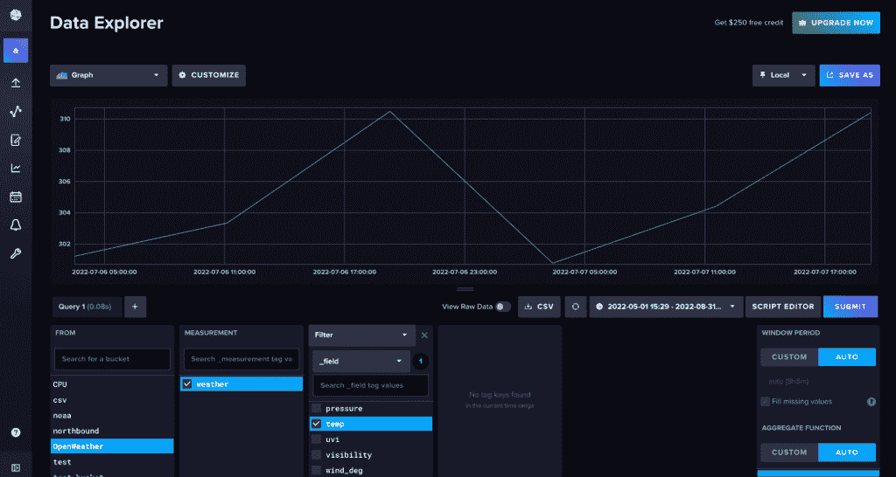
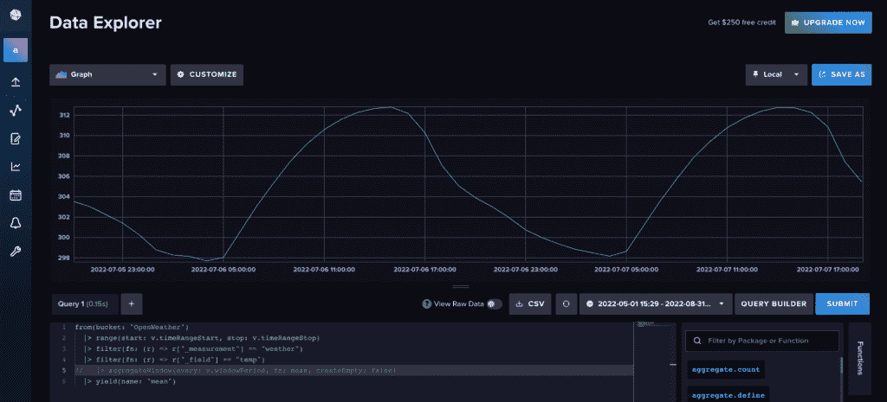

# 用 Python 获取和存储时序数据

> 原文：<https://thenewstack.io/obtaining-and-storing-time-series-data-with-python/>

在本教程中，我们将学习如何使用 Python 从 [OpenWeatherMap API](https://openweathermap.org/api) 获取时间序列数据，并将其转换为[熊猫数据帧](https://pandas.pydata.org/docs/index.html)。接下来，我们将使用 [InfluxDB Python 客户端](https://github.com/influxdata/influxdb-client-python)将数据写入 [InfluxDB](https://www.influxdata.com/influxcloud-trial/?utm_source=vendor&utm_medium=referral&utm_campaign=2022-07_spnsr-ctn_obtaining-storing-ts-pything_tns) ，一个时间序列数据平台。我们将把来自 API 调用的 JSON 响应转换成 Pandas 数据帧，因为我发现这是向 InfluxDB 写入数据的最简单的方法。我们正在向 InfluxDB 写信，因为它是一个[专门构建的数据库](https://www.influxdata.com/time-series-database/?utm_source=vendor&utm_medium=referral&utm_campaign=2022-07_spnsr-ctn_obtaining-storing-ts-pything_tns)，旨在处理高摄取需求和[时序数据](https://www.influxdata.com/what-is-time-series-data/?utm_source=vendor&utm_medium=referral&utm_campaign=2022-07_spnsr-ctn_obtaining-storing-ts-pything_tns)。

## 要求

本教程在 macOS 系统上执行，通过自制软件安装了 [Python 3。我建议设置额外的工具，如](https://docs.brew.sh/Homebrew-and-Python) [virtualenv](https://pypi.python.org/pypi/virtualenv) 、 [pyenv](https://github.com/pyenv/pyenv) 或 [conda-env](https://github.com/conda/conda-env) 来简化 Python 和客户端的安装。否则完整要求在这里:

```
txt
influxdb-client=1.30.0
pandas=1.4.3
requests>=2.27.1

```

本教程还假设您已经创建了一个[自由层 InfluxDB Cloud](https://cloud2.influxdata.com/signup/?utm_source=vendor&utm_medium=referral&utm_campaign=2022-07_spnsr-ctn_obtaining-storing-ts-pything_tns) 帐户或者正在使用 [InfluxDB OSS](https://portal.influxdata.com/downloads/?utm_source=vendor&utm_medium=referral&utm_campaign=2022-07_spnsr-ctn_obtaining-storing-ts-pything_tns) 。它还假设您具有:

最后，本教程要求您已经用 OpenWeatherMap 创建了一个帐户，并且已经用[创建了一个令牌](https://home.openweathermap.org/api_keys)。

## 请求天气数据

首先，我们需要请求我们的数据。我们将使用请求库通过 OpenWeatherMap API 从指定的经度和纬度返回每小时的天气数据。

```
python
# Get time series data from OpenWeatherMap API
params  =  {'lat':openWeatherMap_lat,  'lon':openWeatherMap_lon,  'exclude':  "minutely,daily",  'appid':openWeatherMap_token}
r  =  requests.get(openWeather_url,  params  =  params).json()
hourly  =  r['hourly']

```

## 将数据转换为熊猫数据框架

接下来，将 JSON 数据转换成 Pandas 数据帧。我们还将时间戳从具有秒精度的 Unix 时间戳转换为 datetime 对象。进行此转换是因为 InfluxDB 写入方法要求时间戳采用 datetime 对象格式。接下来我们将使用这个方法将数据写入 InfluxDB。我们还删除不想写入 InfluxDB 的列。

```
python  
# Convert data to Pandas DataFrame and convert timestamp to datetime object
df  =  pd.json_normalize(hourly)
df  =  df.drop(columns=['weather',  'pop'])
df['dt']  =  pd.to_datetime(df['dt'],  unit='s')
print(df.head)

```

## 将熊猫数据帧写入 InfluxDB

 [阿纳伊斯·多蒂斯-乔治乌

Anais 是 InfluxData 的开发者倡导者，热衷于通过使用数据分析、人工智能和机器学习来美化数据。她收集数据，进行综合研究、探索和工程设计，将数据转化为功能、价值和美感。](https://www.linkedin.com/in/anais-dotis-029623113/) 

现在实例化 InfluxDB Python 客户端库，并将数据帧写入 InfluxDB。我们指定一个测量名称。度量包含一个时段内的数据。您可以将其视为 InfluxDB 中仅次于 bucket 的第二高层次的数据组织。

您还可以使用`data_frame__tag_columns`参数指定将哪些列转换为标签。

因为我们还没有指定任何列作为标记，所以我们所有的列都将被转换成 InfluxDB 中的字段。标签用于写入有关时间序列数据的元数据，并可用于更有效地一起查询数据子集。字段是您在 InfluxDB 中存储实际时间序列数据的地方。[本文档](https://docs.influxdata.com/influxdb/cloud/reference/key-concepts/?utm_source=vendor&utm_medium=referral&utm_campaign=2022-07_spnsr-ctn_obtaining-storing-ts-pything_tns)更详细地介绍了 InfluxDB 中的这些数据概念。

```
python
# Write data to InfluxDB
with InfluxDBClient(url=url,  token=token,  org=org)  as client:
 df  =  df
 client.write_api(write_options=SYNCHRONOUS).write(bucket=bucket,record=df,
 data_frame_measurement_name="weather",
 data_frame_timestamp_column="dt")

```

## 完整脚本

为了复习，让我们一起来看看完整的脚本。我们遵循以下步骤:

1.  导入库
2.  收集以下信息:
    *   InfluxDB 桶
    *   InfluxDB 组织
    *   InfluxDB 令牌
    *   InfluxDB URL
    *   OpenWeatherMap URL
    *   OpenWeatherMap 令牌
3.  构建您的请求。
4.  将 JSON 响应转换为 Pandas 数据帧。
5.  删除任何不想写入 InfluxDB 的列。
6.  将时间戳列从 unix 时间转换为 Pandas datetime 对象。
7.  实例化 InfluxDB Python 客户端库。
8.  写入数据帧并指定测量名称和时间戳列。

```
python
import requests
import influxdb_client
import pandas as pd
from influxdb_client import InfluxDBClient
from influxdb_client.client.write_api import SYNCHRONOUS

bucket  =  "OpenWeather"
org  =  "<my_InfluxDB_org>"  # or email you used to create your Free Tier InfluxDB Cloud account
token  =  "<my_InfluxDB_token"
url  =  "<my_InfluxDB_url>"  # for example, https://us-west-2-1.aws.cloud2.influxdata.com/
openWeatherMap_token  =  "<my_OpenWeatherMap_token>"
openWeatherMap_lat  =  "33.44"
openWeatherMap_lon  =  "-94.04"
openWeather_url  =  "https://api.openweathermap.org/data/2.5/onecall"

# Get time series data from OpenWeatherMap API
params  =  {'lat':openWeatherMap_lat,  'lon':openWeatherMap_lon,  'exclude':  "minutely,daily",  'appid':openWeatherMap_token}
r  =  requests.get(openWeather_url,  params  =  params).json()
hourly  =  r['hourly']

# Convert data to Pandas DataFrame and convert timestamp to datetime object
df  =  pd.json_normalize(hourly)
df  =  df.drop(columns=['weather',  'pop'])
df['dt']  =  pd.to_datetime(df['dt'],  unit='s')
print(df.head)

# Write data to InfluxDB
with InfluxDBClient(url=url,  token=token,  org=org)  as client:
 df  =  df
 client.write_api(write_options=SYNCHRONOUS).write(bucket=bucket,record=df,
 data_frame_measurement_name="weather",
 data_frame_timestamp_column="dt")

```

## 查询数据

现在我们已经将数据写入了 InfluxDB，我们可以使用 InfluxDB UI 来查询我们的数据。导航到数据浏览器(从左侧导航栏)。使用**查询生成器**选择您想要可视化的数据和您想要[可视化](https://www.influxdata.com/how-to-visualize-time-series-data/?utm_source=vendor&utm_medium=referral&utm_campaign=2022-07_spnsr-ctn_obtaining-storing-ts-pything_tns)的范围，然后点击**提交**。

[](https://cdn.thenewstack.io/media/2022/07/45534164-image2.png)

天气数据的默认物化视图。InfluxDB 自动聚合时间序列数据，这样新用户就不会意外查询太多数据而超时。

**Pro 提示:**当您使用**查询构建器**查询数据时，InfluxDB 会自动缩减数据采样。要查询您的原始数据，导航到**脚本编辑器**查看底层 Flux 查询。 [Flux](https://docs.influxdata.com/flux/v0.x/?utm_source=vendor&utm_medium=referral&utm_campaign=2022-07_spnsr-ctn_obtaining-storing-ts-pything_tns) 是 InfluxDB 的原生查询和脚本语言，可用于[分析](https://www.influxdata.com/time-series-analysis-methods/?utm_source=vendor&utm_medium=referral&utm_campaign=2022-07_spnsr-ctn_obtaining-storing-ts-pything_tns)和[用您的时间序列数据创建预测](https://www.influxdata.com/time-series-forecasting-methods/?utm_source=vendor&utm_medium=referral&utm_campaign=2022-07_spnsr-ctn_obtaining-storing-ts-pything_tns)。使用 [aggregateWindow()](https://docs.influxdata.com/flux/v0.x/stdlib/universe/aggregatewindow/?utm_source=vendor&utm_medium=referral&utm_campaign=2022-07_spnsr-ctn_obtaining-storing-ts-pything_tns) 函数取消注释或删除该行，以查看原始数据。

[](https://cdn.thenewstack.io/media/2022/07/45534164-image2.png)

导航到**脚本编辑器**并取消注释或删除 aggregateWindow()函数以查看原始天气数据。

## 结论

我希望这篇博文能够启发您利用 InfluxDB Python 客户端库来获取时间序列数据并将其存储在 InfluxDB 中。如果您想了解更多关于使用 Python 客户端库从 InfluxDB 查询数据的信息，我鼓励您看一看[这篇文章](https://thenewstack.io/getting-started-with-python-and-influxdb/)。还值得注意的是，您可以使用 Flux 从 OpenWeatherMap API 获取数据，并将其与 InfluxDB 一起存储在一个任务中。如果您使用 InfluxDB Cloud，这意味着这个 Flux 脚本将被定期托管和执行，因此您可以在实例中获得可靠的天气数据流。要了解更多关于如何根据用户定义的时间表获取天气数据，请阅读[这篇文章](https://www.influxdata.com/blog/tldr-influxdb-tech-tips-handling-json-objects-mapping-arrays/?utm_source=vendor&utm_medium=referral&utm_campaign=2022-07_spnsr-ctn_obtaining-storing-ts-pything_tns)。

<svg xmlns:xlink="http://www.w3.org/1999/xlink" viewBox="0 0 68 31" version="1.1"><title>Group</title> <desc>Created with Sketch.</desc></svg>