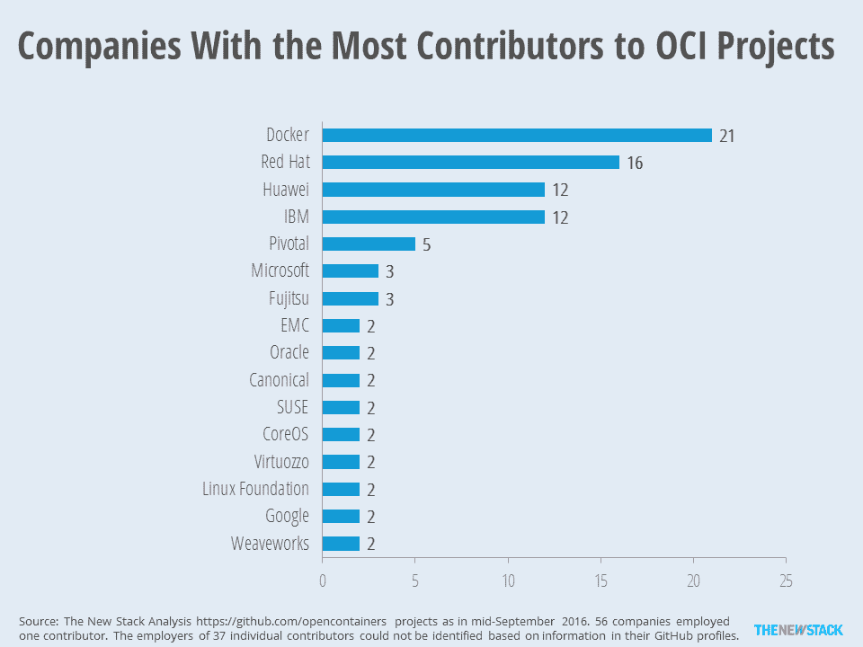

# 一个有争议的不用 Docker 运行容器的项目改名了

> 原文：<https://thenewstack.io/oci-distances-ocid-container-project-now-named-cri-o/>

为了与 OCID 拉开距离，[开放容器倡议组织](https://www.opencontainers.org/)强烈宣称这个构建基于 Kubernetes 的容器运行时的项目事实上不是 OCI 官方的努力。

红帽领导的 OCID 项目，是“OCI 守护进程”的简称，已经被[更名为 CRI-O](https://github.com/kubernetes-incubator/cri-o) ，它的第一部分显然是指 Kubernetes 的容器运行时接口。

来自 OCI 的声明是 Linux 基金会的一个项目，部分内容如下:

*“开放容器倡议(OCI)致力于为容器运行时和图像格式创建正式规范，因为这些领域的标准化将促进其他创新。任何额外的项目目前都不在 OCI 的范围内；然而，我们鼓励我们的成员继续迭代运行时规范和图像格式，因为这对整个行业都有好处。创新在实现层面发生得很快，我们的目标是将任何相关的进步反馈到规范中。我们的目标是支持容器技术和整个开源社区的有效发展和健康。”*

在不告诫项目本身或削弱其目标的情况下，OCI 显然正在采取措施，消除任何直接参与该项目的迹象，这本身就是一个由开源资源组成的库伯内特孵化器的高潮。一个专门针对 [CoreOS](https://coreos.com/) ' **rkt** ，[称为 **rktlet**](https://github.com/kubernetes-incubator/rktlet) 的 CRI 实现，是孵化器支持的另一个项目。

由于对 Docker 推进其容器和容器运行时技术的速度明显越来越不满，这个以前被称为 OCID 的项目吸引了很多关注。包括 Red Hat 在内的许多依赖 Docker 提供产品和服务的公司都呼吁建立一个更稳定的 Docker 库，并提出了派生 Docker 代码库的可能性。尽管 CRI-O 的维护者坚持认为他们的项目不是 Docker fork，但他们的软件会减少在基于 Kubernetes 的系统中运行 Docker 容器的需求。

GitHub 上 CRI-O 页面的最新版本更清楚地表明，该项目不是一个容器创建系统。它现在还非常清楚地指出，CRI-O 现在省略了用于“构建、签名和将图像推送到各种图像存储”的工具——大概是存储库和注册中心。

在上周与 Red Hat 项目贡献者的[采访](https://thenewstack.io/oci-building-way-kubernetes-run-containers-without-docker/)中，咨询工程师 [Dan Walsh](https://people.redhat.com/dwalsh/) 描述当时的项目由几个支柱组成，其中之一是[**sko peo**](https://github.com/projectatomic/skopeo)——Red Hat[项目 Atomic](https://thenewstack.io/five-things-going-red-hats-project-atomic/) 的一部分——最初是为管理注册中心中的容器而开发的。那个项目发展成了**容器/图像**，它仍然被列为 CRI-O 的一部分。

## 仅仅因为它是开放的并不意味着它没有注册商标

正如 OCID 最初向公众展示和描述的那样——例如，作为“基于开放容器倡议的 Kubernetes 容器运行时接口的实现”——很容易认为该项目至少得到了开放容器倡议的支持。OCI 周二的声明非常有效地否定了这种假设。

OCI 的声明继续说，它预计将在“未来几个月内”完成其容器格式规范的 1.0 版本届时，该组织的商标委员会将为包括 OCI 运行时( **runc** )和遵循 OCI 容器格式的项目启动一个认证计划。

在去年 7 月的 OCI 网络直播中，Linux 基金会战略项目副总裁 Mike Dolan 解释了商标委员会在 OCI 的作用。

“就 OCI 项目本身而言，这方面的管理是相当轻量级的，”多兰说。“就工作内容和工作人员而言，这是一个相当简化的流程。围绕商标、预算和认证有一些商业问题需要解决，为此，我们有一个商标委员会。我们已经尽可能地使其具有包容性，因此任何成员都可以加入商标委员会。

“这实际上是关于如何在成员之间分配增加的预算——这是商标委员会的重点，”他继续说道。“这完全独立于任何正在进行的技术工作，所有的技术工作和关于开源代码库或容器规范的合作都是在技术开发社区中进行的。”他接着说，后一个群体对任何愿意参与的团体完全开放，而不仅仅是集装箱化或基础设施方面的知名组织。

## 技术监督

我们询问了 OCI 的执行董事克里斯·阿尼斯奇克(Chris Aniszczyk)和前 T4 云计算基金会临时董事克里斯·阿尼斯奇克(Chris Aniszczyk)，从现在开始，关于这个社区对 OCI 技术的贡献，OCI 的政策将会是什么——特别是当他们是同一家公司，通常是同一批人，与其他目标不在 OCI 范围内的项目有关联的时候。

Aniszczyk 回应道:“和任何开源项目一样，我们鼓励并期待超出我们项目范围的创新。”。“这只是开源开发的本质。也欢迎任何 OCI 成员向[技术监督委员会](https://github.com/opencontainers/tob)提出新的项目提案以供审查，就像最近新的 OCI 模具项目一样。虽然我们希望 OCI 成员考虑将相关进展反馈到规范中，但这并不是必须的。”

这是否意味着 OCI 不能认可，甚至非正式地支持这些项目？Aniszczyk 写道:“独立于 OCI 开发的项目不需要被贡献给 OCI，以被视为符合相关的 OCI 规范，但我们将有一个正式的认证过程。目前，OCI 还不能认证这些项目，但是随着我们越来越接近 1.0 版本，认证过程和商标指南正在积极地进行中。在 1.0 版发布后，我们期待根据 OCI 会员开发的认证计划认证合格的解决方案。”

红帽公司负责 [OpenShift](https://www.openshift.com/) 产品管理的乔·费尔南德斯告诉《新堆栈》杂志，更名是他的公司和谷歌与 OCI 协商后做出的决定。他引用了[最近的一篇公司博客文章](https://www.redhat.com/en/about/blog/running-production-applications-containers-introducing-ocid)，继续将该项目描述为“基于 OCI 的 Kubernetes 容器运行时接口的实现”正如 OCI 的 Aniszczyk 所指出的，一个项目被允许自称为“基于 OCI 的”,而无需该组织的许可或直接参与。

费尔南德斯告诉我们:“在 OCI 商标政策制定期间，红帽和谷歌咨询了 OCI，并同意将 Kubernetes 孵化器内的回购名称从 OCID 改为 CRI-O，以避免任何混淆。”“这不会改变 Red Hat 对该项目或推动容器创新和标准的承诺。

“该项目反映了 Red Hat 致力于推动新的容器创新，扩展容器在生产环境中的使用，”他继续说道，“还反映了我们致力于通过开放容器倡议推动容器运行时和格式的行业标准。”

## 表现

虽然 CRI-O 不是 OCI 的项目，但红帽和谷歌确实为 OCI 做出了贡献，Docker 公司也是如此。

在 OCI 会员中，有四家公司是 OCI 项目的最大出资者。

本月早些时候，新的堆栈收集了关于对 OCI 的贡献及其背后的人的数据。根据来自 GitHub 的数据，Docker，Inc .继续雇佣数量最多的 OCI 贡献者，有 21 人。Red Hat 以 16 名排名第二，但在一项关于网络在集装箱化中的重要作用的指标中，华为与 IBM 并列第三，有 12 名贡献者。上图的其余部分显示了有一个以上贡献者的已知公司。

新堆栈的劳伦斯·赫克特对这份报告做出了贡献。

科洛斯[、](https://coreos.com/) [CNCF](https://www.cncf.io/) 、[码头工人](https://www.mirantis.com/software/docker/kubernetes/)和[红帽](https://www.openshift.com/)是新堆栈的赞助商。

特征图片:[Flickr 的 Brian Norwood 的 river boat“Creole Queen”](https://www.flickr.com/photos/62285085@N00/4511571083)，在 [Creative Commons 2.0 许可下发布](https://creativecommons.org/licenses/by/2.0/)。

<svg xmlns:xlink="http://www.w3.org/1999/xlink" viewBox="0 0 68 31" version="1.1"><title>Group</title> <desc>Created with Sketch.</desc></svg>