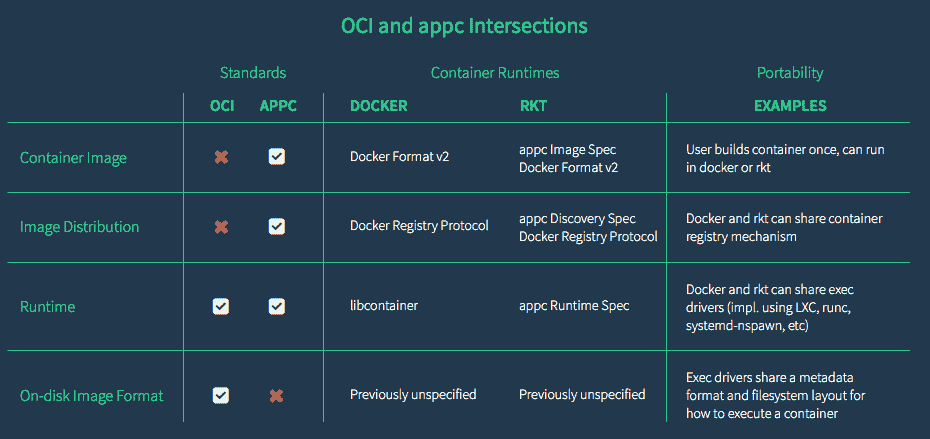

# OCI 在焦点争论中揭示治理结构

> 原文：<https://thenewstack.io/oci-reveals-governance-structure-amid-debate-focus/>

去年夏天 Docker CTO Solomon Hykes 和 CoreOS CEO Alex Polvi 在 DockerCon 的象征性握手并不一定意味着容器格式领域的和平。

[开放容器倡议](https://www.opencontainers.org/) (OCI)，现在是一个 Linux 基金会的合作项目，旨在为基于容器的系统建立一个厂商中立的、可移植的和开放的规范和运行时，周二宣布了它的管理结构。

与此同时，Polvi 在[的博客文章](https://coreos.com/blog/)中指责该项目过于狭隘。

“虽然我们很高兴业界团结起来支持 OCI 运行时，但 CoreOS 认为容器标准最关键的方面是可分发的容器映像:这部分赋予最终用户可移植性。他写道:“OCI 目前还没有解决这个问题，这就是为什么继续我们在[[其规范]appc](https://thenewstack.io/coalition-for-app-container-spec-shows-docker-is-not-the-standard-for-everyone/)方面的工作非常重要。”。

## **项目治理**

OCI 周二宣布，它现在有 38 家成员公司:亚马逊网络服务，Apcera，Apprenda，美国电话电报公司，ClusterHQ，思科，CoreOS，Datera，戴尔，Docker，EMC，富士通有限公司，高盛，谷歌，惠普企业，华为，IBM，Infoblox，英特尔，Joyent，Kismatic，Kyup，Mesosphere，微软，Midokura，Nutanix，Oracle，Pivotal，Polyverse，Portworx，Rancher Labs，Red Hat，Resin.io，Scalock，Sysdig，SUSE，Twistlock，Twitter

它宣布了该项目的技术路线图，以及一个技术开发人员社区(TDC)，其中包括独立的维护人员以及来自 Docker、CoreOS、Google 和华为等创始成员的维护人员。

OCI 和贸发局的成员将任命一个技术监督委员会，以确保跨项目的一致性和工作流程，并在出现争议时充当上诉委员会。管理模式还包括一个商标委员会，负责监督 OCI 商标和认证的开发和使用。

根据公告，该组织的重点将是创建一个可组合、可移植、安全、分散、开放、极简和向后兼容的标准。

Docker 的 Patrick Chanezon 告诉新堆栈，最初 libcontainer 项目的维护人员——Michael Crosby、Rohit Jnagal、Victor 马尔莫尔、Mrunal Patel、亚历山大·巴甫洛夫莫罗佐夫、Daniel Minh 和 Tianon Gravi 以及 appc 维护人员 CoreOS CTO Brandon Philips 和 Vincent Batts——没有浪费时间开始工作，自 6 月以来创建了两个版本的[规范](https://github.com/opencontainers/specs/releases)和六个版本的 [runc](https://github.com/opencontainers/runc/releases) 实现。

Cloud Foundry 已经将 runc 作为其[花园项目](https://www.cloudfoundry.org/garden-and-runc/)的一部分。

## **用 runc 运行**

Docker 最初[将 runc](https://blog.docker.com/2015/06/runc/) 描述为“基本上是在底层系统上运行容器所需要的一切，除此之外别无其他”，目的是使容器用来访问系统服务的代码可供外部通信使用。

它通过使其成为 OCI 项目的基础而在项目中取得了成功，而 CoreOS 则倡导并试图围绕其 appc 规范建立一个联盟。

“从一开始就很清楚，我们希望这个项目有一个强大的参考实现。因此，作为其章程的一部分，该项目将 runc 或 libcontainer 项目作为参考实现，”Chanezon 说。“有一些关于它是否应该是 runc 或其他全新的东西的讨论，但由于 libcontainer 已经使用 Docker 来运行今天运行的所有容器，[很明显] runc 将是最好的选择。”

## **分叉路径**

今年早些时候，Hykes 和 Polvi 不同意统一他们的格式。这两家公司继续在集装箱安全方面采取不同的道路——这就是去年 12 月 Polvi 争论背后的问题，他在争论中称 Docker 的安全模式“存在根本缺陷”

CoreOS 最近发布了一款名为 Clair 的软件，该软件将一个容器中的内容与许多特定于 Linux 发行版的漏洞数据库进行比较。 [Docker 宣布了安全增强](https://thenewstack.io/3-new-security-features-docker/)，包括容器图像的硬件签名，通过图像扫描和漏洞检测进行内容审计，以及扩展用户名称空间的访问控制策略。

“虽然今天的公告有助于进一步澄清 OCI 的范围，但我们相信，要完成容器规范并实现真正的互操作性，还有更多工作要做，”Polvi 在他的博客帖子中写道。

“OCI 背后的想法是从 Docker 获得广泛部署的运行时和图像格式实现，并本着 appc 的精神建立一个开放标准。我们欣然接受了这一前景，因为拥有一个共享的标准是一个独特的机会，可以促进容器的广泛扩散和采用，以及竞争性实现的健康生态系统。

“虽然最初看起来 OCI 和 appc 之间有一些重叠，但 OCI 只专注于运行时，这比我们对项目的预期更加狭隘。我们引入 appc 的容器图像和图像分发的努力还没有被整合，但我们仍然相信这些是容器标准的重要部分。”

他说，CoreOS 将把它已经建立的开源项目，“对进一步采用这种类型的基础设施至关重要的项目”带到另一个 Linux 基金会合作项目[云本地计算基金会](https://cncf.io/) (CNCF)。这些项目包括:

*   etcd 是一个分布式的、可靠的键值存储，用于存储分布式系统中最关键的数据。
*   法兰绒，集装箱的虚拟网络面料。
*   OCI 没有涵盖的 appc 组件，如图像格式和发现。

正如 Switch 云执行副总裁兼 CNCF 成员 Jason Mendenhall 所描述的两个项目之间的差异:

“OCI 非常关注集装箱。容器运行的标准是什么？”他说。“你可以下载一些软件，你的笔记本电脑可以成为你在基于容器的系统中开发的环境。但当你开始谈论管理大型应用程序框架，让你的集成团队将其放在云上或构建自己的云时，无论你如何做，这都是事情真正开始破裂的地方——这是向上堆栈的想法，”他说。

“因为我们可以用它做这么多事情，复杂性将成为问题。随着云计算原生计算基础向更大规模的生产环境转移，我们正在尝试建立一个平台，参考体系结构可以通过该平台共存并获得认证，这是使这种环境能够工作的一系列工具。”

Polvi 补充说:“当然，将软件放入一个基础中总是有风险的，它实际上产生了相反的效果，减慢了项目的速度。我们相信 CNCF 正在采取的方法是正确的，但随着我们向前发展，我们将谨慎地做最有利于提高 etcd 和云原生基础架构采用率的事情。”

CoreOS 和 Docker 是新堆栈的赞助商。

专题图片:[tile hos Efthimiadis](https://www.flickr.com/photos/telemax/)的《孤独之路》，获得 **CC BY-SA 2.0** 授权。

<svg xmlns:xlink="http://www.w3.org/1999/xlink" viewBox="0 0 68 31" version="1.1"><title>Group</title> <desc>Created with Sketch.</desc></svg>