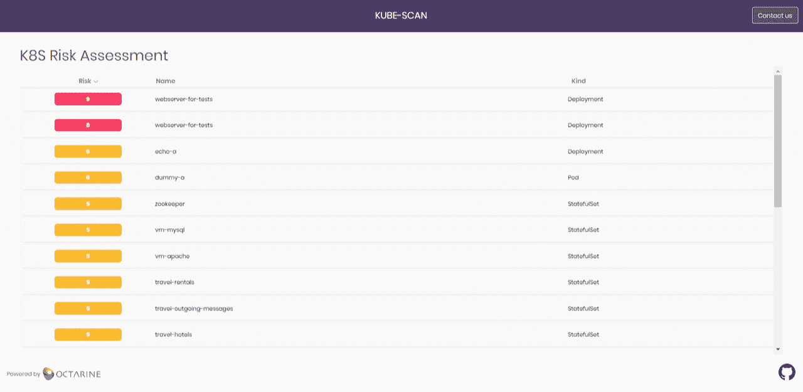

# Octarine 开源了一个用于检查配置安全错误的 Kubernetes 工具

> 原文：<https://thenewstack.io/octarine-open-sources-a-kubernetes-tool-to-check-for-configuration-security-errors/>

Kubernetes 安全初创公司 [Octarine](https://www.octarinesec.com/) 开源发布了一套工具，可以帮助 Kubernetes 用户识别其 K8s 部署中可能无意中留下安全漏洞的配置设置。

Octarine 最新发布的 Kubernetes 通用配置评分系统( [KCCSS](https://www.octarinesec.com/solution-item/kccss/) )是一个对与未正确配置 Kubernetes 相关的安全风险进行评级的框架。Octarine 的关联公司 [kube-scan](https://www.octarinesec.com/solution-item/kube-scan/) 使用它，该公司也是开源的，是一个扫描 Kubernetes 配置和设置的运行时工具，可以识别和排列运行部署中的潜在漏洞。

虽然很多注意力已经放在通过诸如图像扫描之类的技术来保护云原生设置中的容器内的运行时漏洞上，但是较少关注软件本身的不良配置设置可能导致的潜在损害。然而，错误的配置会为攻击者提供一种途径，让他们使用出口和入口点，通过权限提升和其他方法进入系统。

一个例子可能是集装箱化的工作负载，它可以访问也连接到互联网的物理主机。攻击者可以使用错误的设置从互联网访问容器，然后攻击群集本身。

Kubernetes 有 30 多种安全设置，包括 pod 安全策略、pod 定义和清单文件。Octarine 认为，现在管理 Kubernetes 部署的许多管理员可能不了解他们选择的设置的全部安全含义。

KCCSS 类似于常见的漏洞评分系统( [CVSS](https://www.first.org/cvss/) )，但它的设计目的不是捕捉漏洞，而是捕捉配置错误和不正确的安全设置。它为每个风险分配了一个从 1 到 10 的独立分数(10 是最严重的)，允许用户计算他们在生产运行时环境中的设置的风险。

kube-scan 工具可识别与特定工作负载相关的风险，突出显示潜在后果，并对可能的补救方法进行优先排序。它将用户的当前工作负载配置映射到设置。

这两个项目都基于互联网安全中心针对 Docker 和 Kubernetes 的合规性基准,并将随着 CIS 对这些软件包新版本的建议发布而更新。

KCCSS 是在麻省理工学院的许可下授权的。KCCCS 可以在 [Github](https://github.com/octarinesec/kccss) 上下载，同样的还有 [kube-scan](https://github.com/octarinesec/kube-scan) 。这两个工具也可以作为该公司商业支持的 [Guardrails](https://www.octarinesec.com/) 云原生安全平台的一部分。

来自 Pixabay 的 David Mark 的特写图片。

<svg xmlns:xlink="http://www.w3.org/1999/xlink" viewBox="0 0 68 31" version="1.1"><title>Group</title> <desc>Created with Sketch.</desc></svg>