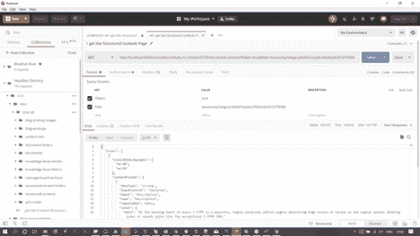

# OData 还是 GraphQL？开发一个 API 的最好技术不是两者都是！

> 原文：<https://thenewstack.io/odata-or-graphql-the-best-tech-for-developing-an-api-is-neither-or-both/>

[](https://www.liferay.com)

 [克里斯·佩特菲尔德

克里斯·佩特菲尔德是 Liferay 公司的高级销售工程师。Kris 拥有 Java、C#、数据库和 Web 开发方面的背景，他与客户合作，了解他们的业务要求和技术需求，以提供创新的 IT 解决方案。他拥有布拉德福德大学荣誉理学士学位。](https://www.liferay.com) [](https://www.liferay.com)

纵观历史，部落导致了人类历史上一些最荒谬的决定。从法国大革命最血腥的日子到现在的英国英国退出欧盟僵局。作为一个来自英格兰北部的工人阶级后裔，在伦敦西部自由主义的温床上为一家美国软件公司工作，我是比大多数人更多的部落的成员。我从多年的商业和软件开发中学到的是，部落主义和对几乎任何事情的严格信仰是导致灾难的原因。一个人对泰勒·斯威夫特的爱不会被另一个人对喷火战机乐队的爱所压倒。两者都是可以接受的音乐品味，对他们的目标观众或部落来说都是正确和恰当的。不是更好，不是高贵，不是更有价值，只是以不同顺序排列的音符和旋律的集合。

推而广之，作为一个负责开发一个用于互操作性和集成的 API 的软件开发人员，不要考虑什么是“最好的”就像泰勒·斯威夫特的音乐一样，“最好”是一个主观原则。在开发一个 API 的时候，最好考虑一下谁消费你的 API，他们会如何消费，而不是单纯的考虑某个特定技术的特性和好处。考虑一下您开发的平台或语言，以及构建一个呈现符合任一标准的数据的 API 有多困难。了解你的受众，理解你的技术的局限性和你正在开发的产品的成熟度。这将允许您为您的 API 选择最合适的技术。

当然，知识就是力量，我们需要客观地看待 OData 和 GraphQL 的能力，并考虑您的受众更喜欢使用哪种 API 协议。

## 奥达塔

OData(开放数据协议)是一个 [OASIS 标准](https://www.oasis-open.org/committees/tc_home.php?wg_abbrev=odata)，它定义了构建和使用 RESTful APIs 的最佳实践。OData 提供了一种丰富的查询语言，能够排序、过滤、查询和减少 API 输出中的字段。它是严格 RESTful 的，并期望与最佳 REST 实践一起交付。不要进入另一个“部落”讨论，但什么是休息，什么不是休息是一个备受争议的话题。可以说，OData 期望您的 API 将高度以 URI 为中心，并支持标准的 REST 操作，如 GET、PUT、POST 和 DELETE。由于其 REST 焦点、成熟的规范、缓存、无状态特性和广泛的语言支持，基于 OData 标准构建的服务应该可以高效地伸缩。

为了透明，我工作的公司 Liferay 使用 OData 和 OpenAPI 标准来支持我们的无头 CMS API，称为[无头交付 API v1.0](https://app.swaggerhub.com/apis/liferayinc/headless-delivery/v1.0) 。事实上，我们也使用该技术来支持其他 API。具体来说，我们使用 [Apache Olingo 库](https://www.odata.org/libraries/)将我们的实体映射到 OData 实体，并将 OData 查询转换成我们的 Java OSGi 服务调用。在很多方面，Liferay 的无头 API 都是 OpenAPI OData 的混合体。



邮递员中的 Liferay OpenAPI 调用，带有类别 ID 的 OData 过滤器

### OData 的能力和优势

1.  可以用大多数编程语言实现的服务器端实现，有大量的[公共可用库](https://www.odata.org/libraries/)。
2.  一个严格的标准，有很好的文档记录，实施起来清晰明了。
3.  良好的性能，无状态，遵循 REST 原则。易于水平扩展。
4.  大多数程序员都熟悉 REST，因此，使用基于 REST 的框架对他们来说更容易。
5.  允许使用文档化的 OData 语法发送带有特殊条件和过滤器的查询字符串。
6.  支持 Delta Feeds，这是一种提供特定于客户端(或接近特定于客户端，但没有状态)的链接的标准方法，如果被调用，它将只提供数组中的新条目。
7.  可通过元数据 URI 发现。
8.  使用 [HATEOAS](https://restfulapi.net/hateoas/) ，有可能解决一个经常被引用的关于 OData 的抱怨:它不支持版本控制。OData 不支持版本控制或字段弃用的论点是没有实际意义的，因为围绕这个问题进行开发是极其容易的。
9.  数据连接和关系受“关系”概念的支持，尽管关系通常需要多次调用，因为关系是在响应内的 URI 中定义的。
10.  实体被定义为 URI 的一部分，这在技术上导致对 API 的多次调用/往返，这对开发人员来说是更多的工作，但这可能是设计使然，因为静态 URI 更容易缓存，因此更容易扩展。

当您知道您的 API 的消费者将来自不同技术的广大开发者群体，并且通常具有企业倾向时，OData API 是一个很好的选择。与 GraphQL 相比，OData 是一个更简单的概念，并且具有更简单的查询定义，graph QL 功能强大，足以满足大多数用例。将标准的 REST 参数与 OData 结合起来相对简单，可以支持开发人员处理不同级别的查询复杂性，从简单地调用 URI 到复杂的选择。如果作为一个组织，我想控制 API 产生的数据，但出于性能原因不想进行无限制的数据查询，OData 作为一个强大的 RESTful 标准和一个高级特性集提供了一个有吸引力的选择。

## GraphQL

脸书在 GraphQL 中创造了一个美丽的东西，一个 URI 映射到一个 web 服务，允许你拥有一个 API，能够满足你的客户要求的最复杂的数据需求。如果您可以扩展它，并且有时间实现您的客户希望查询的内容，我认为您没有理由不实现 GraphQL API。它肯定不是宁静的，但这真的重要吗？

### GraphQL 的功能和优势

*   像 OData 一样，有大量的[库](https://graphql.org/code/)用于实现、发现和查询 GraphQL。
*   单个端点对 GraphQL 来说是一个很大的有利因素，因为对于消费型开发人员来说，定义它再简单不过了。开发人员只需要两样东西:URI 和 API 遵循 GraphQL 标准的知识。
*   支持排序、连接、关系、选择、简化数据、版本控制、弃用、分页以及来自单个请求/响应往返行程的更多内容。
*   支持“[订阅](https://www.apollographql.com/docs/react/advanced/subscriptions/)，类似于 OData 中的 Delta Feeds，但功能更强大。
*   支持函数，参数，变异，别名，片段，指令，联合，接口和所有静态类型的语言。本质上，GraphQL 是一种自包含的查询和实现语言，可以说它比 OData 更强大。

```
type  Query  {

   allPersons(last:  Int):  [Person!]!

}

type  Mutation  {

   createPerson(name:  String!,  age:  Int!):  Person!

}

type  Subscription  {

   newPerson:  Person!

}

type  Person  {

   name:  String!

   age:  Int!

   posts:  [Post!]!

}

type  Post  {

   title:  String!

   author:  Person!

}

Example definition of types using SDL for schema definition

```

已经认可了 GraphQL 的好处，我会为我的客户实现一个 GraphQL API 吗？这取决于几个因素:

*   我的 API 是我的组织的全部吗？我的 API 的丰富性直接影响业务的成功吗？这个问题让我可以确定所需的预算；我的预算越大，我就越有可能开发一个 GraphAPI，因为它是查询能力方面的黄金标准。
*   信不信由你，我的 API 消费者的人口统计也可能影响我的判断。如果我想设计一个包罗万象的 API 来适应各种各样的消费者，无论他们的年龄、技能和技术偏好如何，我可能会选择更简单的 OpenAPI 或 OData，或者甚至是两者的组合。然而，如果我的受众更年轻，以 JavaScript 为导向，并且可能是其他 GraphQL APIs(如脸书 Graph API)的消费者，那么我可能会迎合这个市场并使用 GraphQL 进行开发。
*   我用来实现 API 的技术也将发挥巨大的作用，因为 GraphQL 的语法在实现和查询上都更接近于 JavaScript 和 Node，而不是其他语言。例如，有轶事证据表明，GraphQL 不能很好地与 Java 中现有的 ORM 引擎配合使用。我需要确信我的开发团队拥有必要的数据结构和算法技能，能够以可伸缩的方式最好地交付 GraphQL 所承诺的东西。我将再次审视我的项目有多新，尤其是在一个以 Java 为中心的组织中。在其他条件相同的情况下，为了迎合精通 GraphQL 的年轻 API 消费者，我可能会冒险使用该标准进行开发。

总之，GraphQL 具有时代精神，并且在大多数情况下是更强大的查询语言，但是它实现起来很昂贵，并且不是 RESTful 的。也许你不在乎它是否宁静，这没关系。OData 是非常 RESTful 的，对于不知道查询语法的 API 消费者来说，学习曲线更低。然而，最重要的是你的消费者是谁，你能以什么最快、最划算的方式取悦消费者。OData 和 GraphQL 都有能力和简单性来取悦你的目标群体。最后，在有些情况下，实现任何一种技术都类似于用大锤砸坚果。在坚持自己制定的 RESTful 标准的同时，只要走 OpenAPI 路线或滚动任何您喜欢的东西，就可以实现很多。有很多方法可以让你的部落开心。

<svg xmlns:xlink="http://www.w3.org/1999/xlink" viewBox="0 0 68 31" version="1.1"><title>Group</title> <desc>Created with Sketch.</desc></svg>