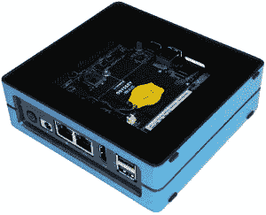
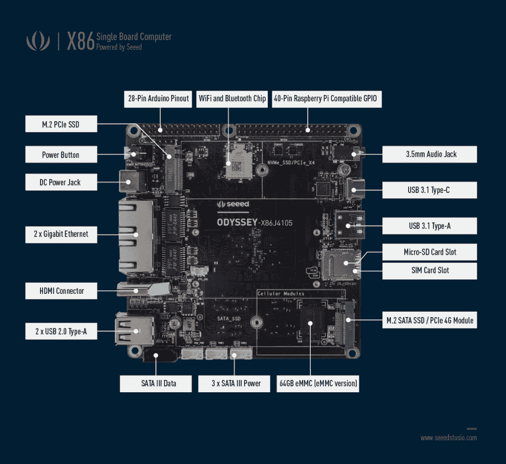
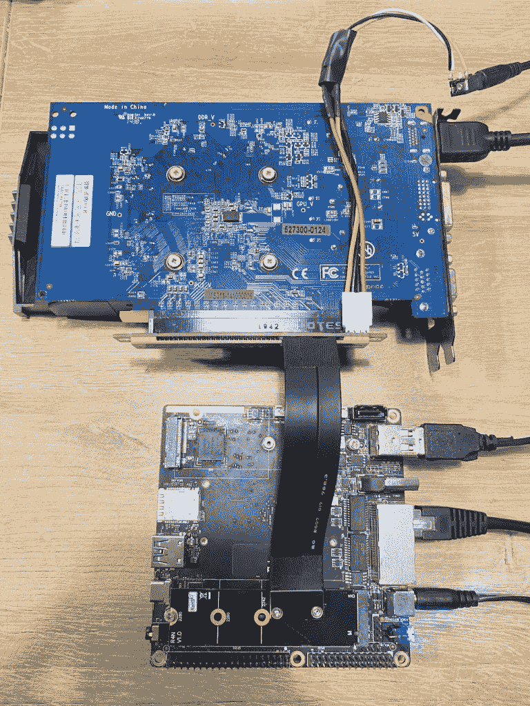
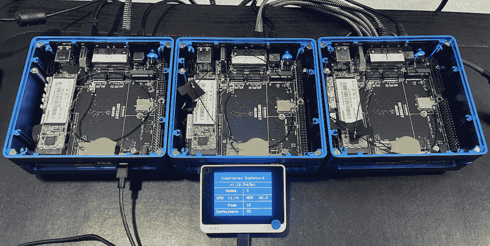

# Odyssey Blue J4105 迷你 PC:面向边缘计算项目的 x86 设备

> 原文：<https://thenewstack.io/odyssey-blue-j4105-mini-pc-an-x86-device-for-edge-computing-projects/>

虽然有很多基于 ARM 的单板计算机(SBC)——[Raspberry Pi 4](https://www.raspberrypi.org/products/raspberry-pi-4-model-b/)、 [BeagleBone Black](https://beagleboard.org/black) 、[od roid HC4](https://www.hardkernel.com/shop/odroid-hc4/)——但对于基于 X86 的设备来说，选择是有限的。一个选择是 Seeed Studio 的 [Odyssey Blue J4105 迷你 PC](https://www.seeedstudio.com/Odyssey-Blue-J4105-128GB-p-4668.html) ，这是构建物联网、边缘和人工智能项目的可靠选择。比 Raspberry Pi 稍大，它是一个包含许多功能的发电站。

基于[英特尔赛扬 J4105](https://ark.intel.com/content/www/us/en/ark/products/128989/intel-celeron-j4105-processor-4m-cache-up-to-2-50-ghz.html) ，该设备拥有一个四核 1.5GHz CPU，可突发高达 2.5GHz。该 CPU 具有四个内核和 4MB 高速缓存，可为部署在边缘的应用程序提供充足的功率。在内存和存储方面，奥德赛蓝色 J4105 配备了 8GB LPDDR4 RAM，可选的 64GB eMMC 存储和 128GB 的 SSD 存储。如果你想连接额外的存储设备，内置的 SATA 连接器就派上用场了。

使 Odyssey Blue J4105 Mini PC 区别于其竞争对手的是协处理器。有一个板载 ATSAMD21 内核，这是一个与 Arduino 兼容的 ARM Cortex-M0+ MCU。您可以将数百个传感器和致动器连接到迷你 PC，并通过迷你 PC 主机上运行的 Arduino IDE 对它们进行无缝编程。Raspberry Pi 兼容 40 引脚为市场上的大多数 Pi 帽子提供硬件兼容性。GPIO 引脚的方向可以通过 BIOS 单独设置。这些引脚支持主流协议，包括 I2C、SPI 和 UART。

凭借板载 WiFi/蓝牙低能耗(BLE)、双千兆以太网端口、一个 USB Type-C、一个 USB 3.1 Type-A 和 2 个 USB 2.0 Type-A 端口，连接选项丰富多样。双千兆以太网端口提供冗余网络连接，确保应用程序的高可用性。如果您需要蜂窝连接，该设备甚至支持 LTE SIM 卡。USB Type-C 兼作显示端口，可以输出 60Hz 的 4K。

我最喜欢迷你电脑的一点是 GPIO 引脚和端口的可访问性。机箱带有一个透明的可拆卸板，便于将传感器和其他外围设备连接到设备。散热器下面有一个风扇，偶尔会启动，但不会发出太多噪音。对于 239 美元的价格因素来说，该设备的适合度和光洁度是非常好的。

如果你想安装其他操作系统，可以选择未激活版本的 Windows 10 企业激活版本。我安装了 Ubuntu 20.10，运行完美。

运行深度学习模型的边缘设备需要 AI 加速。有两种机制可以将这种能力带到迷你 PC 上——插入一个 USB 3 加速器，如英特尔神经计算棒 2 或谷歌珊瑚 USB，或者通过 M.2 PCIe x4 到 PCIe x16 适配器连接一个成熟的 GPU。前者是一种在设备上运行人工智能的紧凑方法，而后者需要一点黑客技术。但是，两者都提供了运行人工智能模型进行推理所需的优化。

我买了三台迷你 PC 设备来运行基于 K3s 1.19 的高可用性 Kubernetes 集群。借助两个千兆以太网端口，我计划分离控制平面和数据平面流量。一个端口将用于节点到节点的通信，而另一个端口将用于向外界公开工作负载。

Odyssey Blue J4105 Mini PC 是我在边缘运行云原生应用的测试平台。我计划将这个集群用于评估一些轻量级的 Kubernetes 发行版，比如 K3s、MicroK8s 和 K0s。通过连接英特尔 NCS2 和谷歌 Coral Mini PCIe 等人工智能加速器，迷你 PC 硬件和 Kubernetes 的结合为边缘提供了云原生人工智能堆栈。

我已经基于 [Wio Terminal](https://thenewstack.io/10-reasons-why-the-wio-terminal-is-the-last-diy-iot-device-you-need/) 和 Odyssey Blue J4105 Mini PC 构建了一个迷你 Kubernetes 仪表盘，我计划在周日运行的下一个教程中介绍它。

贾纳奇拉姆·MSV 的网络研讨会系列“机器智能和现代基础设施(MI2)”提供了涵盖前沿技术的信息丰富、见解深刻的会议。在 [http://mi2.live](http://mi2.live) 注册即将到来的 MI2 网络研讨会。

<svg xmlns:xlink="http://www.w3.org/1999/xlink" viewBox="0 0 68 31" version="1.1"><title>Group</title> <desc>Created with Sketch.</desc></svg>