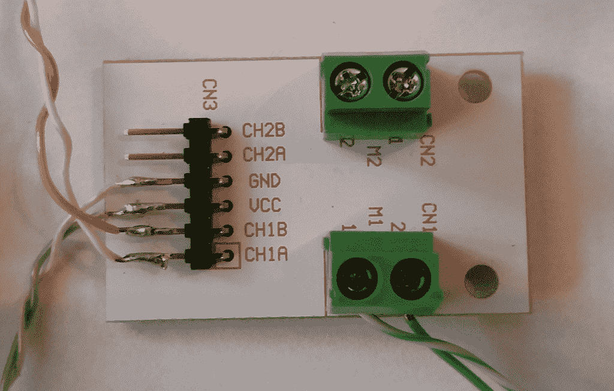

# 现成的黑客:添加运动到您的项目

> 原文：<https://thenewstack.io/off-shelf-hacker-add-motion-project/>

在这个[现成黑客](/tag/off-the-shelf-hacker/)专栏中，我想开始讨论的物理计算领域之一是自动化和机器人技术。自动化是在计算机的控制下，使用马达、致动器、螺线管等等来移动物体。机器人增加了移动性、人类(或其他)交互和机载决策能力(或“自主”)。

自动化的一个例子可能是通过使用在设备的 Raspberry Pi 上运行的 Python 脚本，将我的[蒸汽朋克演示机](https://thenewstack.io/hacking-hardware-the-never-ending-saga-of-steampunk-name-badge-development/)相机臂从折叠位置“转换”到正确的操作方向。机器人可能是一个由电动机驱动的小型两轮机器，它可以沿着一条线滚动，每次转弯时都会发出嘟嘟声。

我认为将物理计算堆栈应用到移动我的相机臂或设计机器人这样的工作中有相当多的好处。这些概念很容易扩展到更大的设备。只需使用更大的电机、更强大的微控制器/单板计算机和更复杂的程序。

本周我们将看一个简单的自动化例子，它使用微控制器、电机控制器、电机和一些其他器件。下周我们将介绍控件，看看它们是如何工作的，并浏览代码。

## 零件

该项目的微控制器是一个标准的老式 [Arduino Duemilanove](https://www.arduino.cc/en/Main/ArduinoBoardDuemilanove) ，因为这是我手头上这种类型的最新板。它有 14 个数字 I/O 引脚(其中 6 个提供 PWM 输出)和 6 个模拟引脚。我们将使用两个 PMW 引脚向小型通用电机控制板发送信号。

我用的是 Radio Shack 的双 H 桥电机控制器。当我买了一些他们“倒闭”的股票时，看起来大概花了 4 美元。这是另一家公司的[的类似产品。这些板有 6 个控制引脚和 2 组螺丝端子。控制引脚的布局很简单。这里，他们从顶部开始。](http://www.miniinthebox.com/hg7881-two-channel-motor-driver-board-2-5-12v_p4027907.html?pos=ultimately_buy_12&prm=2.3.5.0)

CH2B–通道 2 PWM 输入
CH2A–通道 2 PWM 输入
GND–地
VCC –+电压(6 伏)
CH1B–通道 1 PWM 输入
CH1A–通道 1 PWM 输入

Radio Shack 电机驱动板

每个通道都有一个 A 和 B 端子，用于控制电机的一个方向或另一个方向。这些由 Arduino 上的 PWM 引脚驱动。我们不会太担心哪个控制哪个方向，因为操作很容易在代码中调整。这个特殊的板处理每个电机大约 1 安培的电流。

该电机是一个标准的 6 伏爱好模型，附有塑料变速箱。这些在爱好商店和[网上](http://www.robotshop.com/en/solarbotics-gm9-gear-motor-9.html)都有。它有相当大的扭矩，通常用于小型轮式机器人。当然，电机的尺寸应该适合提升的负载量。

实现这一切所需的最后一个组件是外部电池。我试着仅使用 USB 电缆的电源运行微型电机和电机驱动器，结果令人失望。马达功率很小，方向/速度控制也不稳定。即使对于这样一个小电机，一个像样的电源肯定是持续运行所必需的。

我用了一个塑料 4 节 AA 电池电池组，提供 6 伏电压。方向变化和速度与这种设置一致。除了电池，我还将 Arduino 插入了标准的 USB 连接器。

项目将在编程后以独立模式运行。下周我们将讨论 Arduino 代码。

为了让它在独立模式下运行，我将 6 伏电源线直接连接到电机驱动板上的 VCC 和 GND 端子。为了给 Arduino 供电，我将一根跳线从电池的负极连接到电路板上的一个 GND 引脚。同样，我在电池正极端子和 Arduino 的桶形电源连接器的正极引脚之间进行了跨接。Duemilanove 规格表说明，电压下限为 6 伏，建议输入电压为 7 伏至 12 伏。Arduino 在这种配置下工作可靠，在 6 伏电压下没有问题。

## 下一步是什么

下一次，我们将讨论关于电机驱动项目的项目概况的一些细节。例如，假设您正在伸展一只手臂，到达其行程的终点，然后想要将其收回到其原始位置。你可以用马达转动手臂，然后突然反转。这将导致电机方向和所有连杆的瞬间改变。这种行为会导致马达、关节、支架和任何连接到手臂上的负载出现不必要的峰值。这是一种非常草率的工作方式。

一个好得多的方法是将马达的速度提升以延伸手臂，当它到达所需的行程末端时，将速度降低到 0，然后反转方向。相反方向的速度会增加，从而将手臂拉回。逐渐加速/减速是电机驱动项目中平稳、可控负载和可靠运行的关键。

下周，我们还将学习使用一些输入控件来启动动作序列，并讨论代码布局。

<svg xmlns:xlink="http://www.w3.org/1999/xlink" viewBox="0 0 68 31" version="1.1"><title>Group</title> <desc>Created with Sketch.</desc></svg>