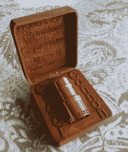
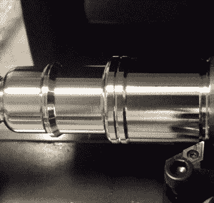
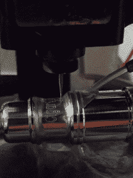
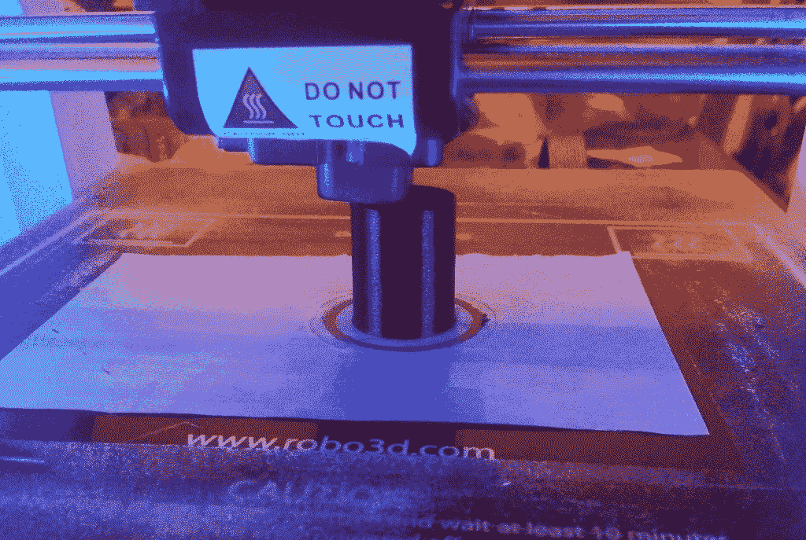

# 现成的黑客:美国制造业因制造商的独创性而得到提升

> 原文：<https://thenewstack.io/off-shelf-hacker-american-manufacturing-thrive-bit-maker-ingenuity/>

这是一个经典的场景，两个家伙傍晚坐在门廊上，讨论世界事务。罗布·康塞普西翁点燃他的雪茄，喝了一大口咖啡。

就在 7 月 4 日周末之后，这似乎是一个与康塞普西翁(Concepcion)交谈的完美时机，康塞普西翁是一位长期的家庭朋友，谈论他的爱情劳动，用现成的计算机数控(CNC)机器、软件和对美国制造业未来的敏锐愿景制造的[雪茄炮](http://cigarcannon.com)。

话题转到他最喜欢的品牌之一， [JC 纽曼钻石皇冠](http://www.jcnewmanonline.com/)，并哀叹这家位于坦帕的公司是佛罗里达州最后一家雪茄制造商。

1900 年，随着数百家蓬勃发展的当地公司雇用了数千名工人，坦帕的 Ybor 市成为了众所周知的“世界雪茄之都”。大萧条、20 世纪 60 年代初的古巴禁运以及今天政府的最新规定，几乎扼杀了该州的烟草业，尽管 JC Newman 仍在坚持。

然而，对优质雪茄的需求持续增长，因此罗布的高科技产品的市场也在增长。

## **什么是雪茄炮？**

当谈到享受他们最喜爱的烟草卷时，烟草爱好者总是面临一些基本的挑战。

首先，当雪茄燃烧时，它摸起来会变热，在中途点后最明显。康塞普西翁在节日里看到所有被丢弃的、吸了一半的雪茄，认为一定有更好的办法。人们扔掉了一半珍贵的棍子，其中一些价值几十甚至几百美元。

另一件事是外包装上的唾液导致雪茄燃烧时变苦。当雪茄末端不可避免地变湿时，它还会引起嘴唇上的不良感觉。

大约在 20 世纪初，木制的支架偶尔被用来装雪茄。虽然这个概念是合理的，但受欢迎程度很低，主要是因为它们只有一种尺寸。

经过两年的 R&D，Rob 想出了一个不浪费任何东西的雪茄烟嘴设计。你只需夹住雪茄，轻轻把它拧进雪茄管，就能实现气密密封。阶梯式内部设计可容纳最大的 64/64 选择。

由铝制成，雪茄炮保持凉爽，人们可以根据需要抽多抽少。很容易简单地剪掉燃烧的一端，留着以后使用。由于雪茄炮的内部被打磨得非常光滑，雪茄的外包装不会撕裂，即使在取出剩余部分进行存储时也是如此。最后，顾客可以放心，最后一次抽的味道会和第一次一样好，没有苦味，因为嘴唇不会碰到包装纸。

## **制造雪茄炮**

制造雪茄炮是对尖端[现成](/tag/off-the-shelf-hacker/)技术和流程的研究。

一家名为[的美国公司 Sherline](http://sherline.com/) 提供数控车床和铣床。Rob 使用高端的#4410 轧机和#2010 车床，它们都是公制型号。他发现用公制测量小零件和他的定制工具夹具更容易。Sherline 产品的共同主轴功能也允许零件在机器之间移动，无需拆卸螺栓，从而改善了工作流程。

在数控车床上车削零件

Rob 位于新奥尔良的店里目前有两台数控铣床和三台数控车床。

他从实心的 16 英尺长的 6061 铝圆坯开始，将它切割成每个雪茄炮的工作长度。内部设计和制造的定制工件夹具可定位待加工的零件。

雪茄炮的外部在数控车床上车削，遵循使用被认为是 2D 计算机辅助设计(CAD)的 [OneCNC 程序](http://www.onecnc.com/)创建的轮廓。因为在车床上车削零件时只有 X-Y 刀具运动，所以没有必要在 3D 中建模零件。

在车削外部和镗削内部之后，零件在车床上用手高速抛光。在整个构建周期中会执行几个抛光步骤。

然后，零件被转移到 CNC 工厂，用于雕刻公司标志和序列号。每个雪茄加农炮都有一个独特的序列号，由该公司跟踪，可以用来将任性的雪茄加农炮归还给它的主人。Rob 使用 [Vectric 软件](http://www.vectric.com/)进行雕刻。他说这是一个非常好的产品，你可以很容易地在几乎任何表面上进行雕刻，包括雪茄炮的圆柱形周围。

数控铣床雕刻零件

当零件仍在轧机上时，进行大端横向钻孔。交叉钻孔的 g 代码，即指导数控铣床的指令，是内部开发的。

[MACH3 软件](http://www.machsupport.com/software/mach3/)解释每台机器的 g 代码。

雪茄炮的制造过程并不是完全自动化的，因为需要手工抛光、手工倒角以及在机器之间手动移动零件。整个过程都戴着丁腈手套，以确保高质量，并确保顾客是第一个触摸全新雪茄加农炮的人。

所有加工完成后，雪茄炮进行阳极氧化，然后固化至少 48 小时。正如你所料，金色是最受欢迎的颜色。其他选择包括银色、青铜色、深蓝色、铜色和棕色。

## **建造木制储物盒**

所有雪茄炮都配有一个雕刻的 3D 打印木质储物盒。没错，3D 打印。

设计从在 [Rhino 软件](http://gomeasure3d.com/rhino/)中创建的 3D CAD 模型开始。铰链盒的下半部分有一个模制凹槽，用于存放产品。

Rob 使用 [Simplyfy3D 软件](https://www.simplify3d.com/)和 [Robo3D 打印机](http://robo3d.com/)将模型切片，然后用一种特殊的木质细丝打印出来。尖端的细丝 80%是松木，20%是粘合剂，所以这些盒子是真正的木制产品。雪茄加农炮标志浮雕在盒子的底部，一个新奥尔良的象征“鸢尾花”镶嵌装饰在顶部。盖子内侧也有一些“雕刻”。

3D 打印机雕刻只是某种程度上不为字母铺设细丝，而不是通过路由(移除)材料的传统雕刻。这就是所谓的添加(或在这种情况下不添加)制造。打印底座和盖子各需要两个小时。多意志打印机允许规模更大的数量。

由于 3D 打印是一个无废物的制造过程，盒子只需要轻轻的手工打磨，然后用抹布手工染色。盒子的所有表面都用丙烯酸涂层密封。

顾客还可以得到一个护口套，防止在用牙齿咬紧雪茄嘴时发生意外。该套筒使用 Rhino 软件建模，并使用有机弹性体细丝在 Robo3D 打印机上打印。

在 Robo3D 打印机上打印护齿套

将 3D 打印机用于盒子和套筒是在当今快速发展的制造环境中竞争所需的灵活思维的一个例子。

## **美国制造业的未来**

康塞普西翁将他的产品视为传家宝，将持续很长时间，可以代代相传。他自豪地说，这是 100%美国制造，在新奥尔良。

在更大的意义上，他认为美国公司与中国和世界其他地方的巨大批量制造商竞争的关键战略优势在于使用美国劳动力小批量制造超高质量的产品。让产品的质量说话，而不是数量。他确信，提供有保证的质量的小型精品模型是美国制造业的未来。

“虽然大多数企业家害怕技术，但只有数控机床和 3D 打印等技术才能帮助普通美国发明家在这个由大公司主导的世界中取得成功。”他说，结束了这个宁静的夏夜。

通过 Pixabay 的特征图像。

<svg xmlns:xlink="http://www.w3.org/1999/xlink" viewBox="0 0 68 31" version="1.1"><title>Group</title> <desc>Created with Sketch.</desc></svg>