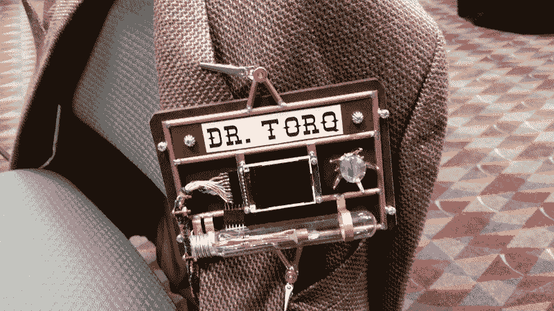

# 现成的黑客:自动化你的黑客

> 原文：<https://thenewstack.io/off-shelf-hacker-automating-start/>

给 Arduino 微控制器加电，它将立即运行加载到其闪存中的任何专用程序，称为固件。

该程序可以读取连接到通用输入/输出引脚(GPIO)之一的按钮，并点亮连接到另一个 GPIO 引脚的 LED。只要有电，它就会在程序中循环。这是一个单一任务的过程，这就是它所做的一切。关闭电源，过程停止。插上电源，程序就会自动启动，一遍又一遍地做同样的事情，就像以前一样。

Raspberry Pi、Pine64、CHIP 和 Artik 等微控制器的工作方式与 Arduino 不同。他们引导进入一个多用户、多任务的操作系统，通常是 Linux。程序驻留在闪存或可移动介质上，如微型 SD 卡。有了 Linux，我们可以随时下载、创建、删除、修改和运行程序。

有了这些微控制器，在我们执行程序之前，Linux 必须启动并运行。虽然我们可以使用 Python 这样的通用编程语言编写一个“读取 Raspberry Pi 按钮 GPIO 引脚并点亮 LED”的程序，但它不会像 Arduino 那样在给 Pi 加电时自动运行。

今天，我们将学习一些有用的方法，让程序在 Linux 引导序列完成后自动运行。

## 编辑/etc/rc.local

当你将显示器、键盘和鼠标插入主板时，Pi(和大多数其他 nano-Linux 设备)通常会引导到标准的 [X Windows](https://www.x.org/wiki/) 桌面。

但是我用一个[无头](https://en.wikipedia.org/wiki/Headless_software)(没有显示器、键盘或鼠标)树莓派给我的[蒸汽朋克会议个性识别仪](https://thenewstack.io/hacking-hardware-the-never-ending-saga-of-steampunk-name-badge-development/)供电。大多数人都知道它是一个会议徽章:

[](https://thenewstack.io/hacking-hardware-the-never-ending-saga-of-steampunk-name-badge-development/)

该徽章在正面集成了一个[微型 1.8 英寸彩色 TFT LCD 显示屏](https://www.adafruit.com/product/358)，没有普通的显示器、键盘或鼠标。它可以在小屏幕上自动播放宣传视频。LCD 由一个面向内存的进程控制，称为帧缓冲区。

你不需要 X Windows 桌面(比如 [LXDE](https://en.wikipedia.org/wiki/LXDE) )来运行带有帧缓冲区的视频。 [MPlayer viewer](http://www.mplayerhq.hu/design7/news.html) 支持使用帧缓冲区播放视频，所以这是我在蒸汽朋克徽章启动时自动启动的。

好的部分来了。通电后运行 MPlayer 只不过是在/etc/rc.local 文件中添加一行。

/etc/rc.local 在 Linux 成功引导到多用户模式后运行程序。只需将您的程序或脚本添加到文件的底部，保存它，下次重新启动时，您的程序将会执行。rc.local 归 root 所有，所以您需要作为普通用户(例如 pi)使用 sudo 编辑它。

```
  pi-drtorq%  sudo vi  /etc/rc.local

```

这里有一个来自树莓派的蒸汽朋克会议徽章的例子:

```
#!/bin/sh -e
#
# rc.local
#
# This script is executed at the end of each multi-user run-level.
# Make sure that the script will "exit 0" on success or any other
# value on error.
#
# In order to enable or disable this script just change the execution
# bits.
#
# By default this script does nothing.

mplayer  -loop  0  -vo fbdev2:/dev/fb1  -x  160  -y  128  -zoom  -flip  -vf rotate  1  /home/pi/badge-promo.mp4  &amp;

exit  0

```

在这种情况下，MPlayer 从循环选项开始，因此视频连续运行。注意-vo 选项指向帧缓冲设备。-x 160 -y 128 设置屏幕尺寸以匹配 1.8 英寸 LCD 显示器的分辨率。您还需要在结尾处使用“&”，以便 MPlayer 在后台运行。

如果我们使用 nano-Linux 微控制器作为笔记本电脑会怎么样？

## 使用 X-Windows 自动启动

如果我们想在 Pi 引导到标准 LXDE 桌面屏幕后自动启动一个程序呢？也许我们不是作为一个会议徽章来运行，而是将 Pi 连接到一个显示器(或者一个很酷的 7 英寸彩色 LCD 显示器)、一个键盘和一个鼠标。

更多好消息。

让一个程序在标准的 X-Windows 桌面下自动运行也很简单。假设您以 pi 的身份登录，最简单的方法是编辑/home/pi/。配置/lxsession/LXDE-pi/autostart 文件。

Autostart 是 LXDE 桌面的标准会话管理器 [LXSession](https://wiki.lxde.org/en/LXSession) 的一部分。

将您想要运行的程序或脚本添加到自动启动文件中，以“@”开头。这里有一个例子。

```
@lxpanel  --profile LXDE-pi
@pcmanfm  --desktop  --profile LXDE-pi
@xscreensaver  -no-splash
@point-rpi
@/usr/bin/mplayer  -loop  0  -fs  drtorq-promo.mp4

```

一旦 Pi 引导进入 LXDE 桌面，MPlayer 就会自动弹出并运行。“-loop 0”选项会永远循环播放视频。“-fs”选项打开全屏模式。点击“ESC ”,然后点击窗口顶部的“X”框，让视频消失。

## 后续步骤

我们已经看到了一些在 nano-Linux 设备上自动启动程序的有用方法。我使用我的会议徽章上的能力来让事情进行下去。

这个概念很容易扩展。

Pi 的自动停止就是一个很好的例子。每个人都知道你应该使用“关机”来正确地关闭你的 Pi。如果你只是拔掉电源插头，你就有损坏 micro-SD 卡上数据的风险。在极少数情况下，如果卡损坏，Pi 可能无法启动。不太好。

为什么不写一个小 Python 脚本，在按下 GPIO 连接的按钮时运行操作系统(OS)对“shutdown”命令的调用。启动后，脚本可能会启动并永远循环下去。

你可能会说这将是“自动化到底”

特征图片: [Gnome 屏保](https://www.liberiangeek.net/2012/04/add-enable-screensavers-in-ubuntu-12-04-precise-pangolin/)。

<svg xmlns:xlink="http://www.w3.org/1999/xlink" viewBox="0 0 68 31" version="1.1"><title>Group</title> <desc>Created with Sketch.</desc></svg>