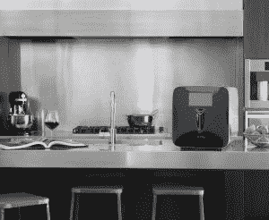

# 现成的黑客:自动化遇到葡萄酒爱好者

> 原文：<https://thenewstack.io/off-shelf-hacker-automation-meets-wine-devotee/>

作为新堆栈的常驻硬件黑客，寻找有趣的微控制器驱动的小工具是我工作的一大部分。上个月在嵌入式 Linux 大会上闲逛时，我遇到了[迈克·杜蒙](https://www.linkedin.com/in/michael-dumont-aab5154/)，他是[李子](http://www.plum.wine)公司的软件工程师，这家公司生产一种超自动化的葡萄酒配送设备。即将上市的零售产品利用了大量的物理计算堆栈，正如在[现成黑客](/tag/off-the-shelf-hacker/)上讨论的那样。杜蒙和他的工程助理安杰洛·迪纳迪(Angelo DiNardi)在随后的电话中向我提供了李子的细节。

## 不要把好酒倒进下水道

当他和他的客人没有一口气喝完一瓶酒时，Plum 的创始人 David Koretz 不得不把昂贵的酒倒进下水道，这让他很烦恼。当葡萄酒暴露在氧气中时，它的质量会下降，重新安装塞子根本无法停止这一过程。

Koretz 观察到，随着自动咖啡机的出现，在家制作咖啡变得从困难到容易。为什么不把同样的原则应用于在合适的温度下一次倒一两杯酒，然后不用担心浪费瓶子里剩下的酒呢？因此，他开始在家里开发一种机器，为鉴赏家和日常饮酒者提供更好的体验。

由此产生的设备可以容纳两个单独的 750 毫升瓶你最喜欢的葡萄酒。你只需打开设备，将瓶子以 55 度角向下放入其中。该机器使用摄像头读取标签，然后查询云以获取您的选择信息，将瓶子冷却到合适的温度，并熟练地敲击瓶子。使用专利的“针中针”设计，没有氧气进入瓶子，你当然也不必用开瓶器或任何类似的东西。然后，机器使用惰性氩气将葡萄酒保持在最佳状态长达 90 天。氩气瓶可重复灌装，最多可保存 200 瓶葡萄酒。

看看机器运转的动画。这款李子的预购价格为 1499 美元。这是零售，来自一个真实的公司，而不仅仅是一个 Kickstarter 项目。客户发货宣传为 2017 年春季。

## 在后台

Dumont 和 DiNardi 解释说，Plum 在 Raspberry Pi 3 微控制器上使用了 [Yocto Linux](https://www.yoctoproject.org/) 。该机器是 WiFi 启用，可以理解的是，有一个很好的自定义硬件来驱动螺线管，阀门和瓶子处理机械。该公司花费了数百个小时来制造内部构件，并不惜代价来实现最高质量的建设。流量计和其他传感器保持标签分配，并精确控制瓶子的条件。由于葡萄酒爱好者，顾名思义，要求高品质，李子也反映了其产品的承诺。

【T2

使用高清摄像头扫描标签，使机器能够知道每瓶酒的类型、品种、配药参数甚至酒厂。了解一瓶葡萄酒的一些模糊信息会增加乐趣，也是成为葡萄酒爱好者的重要组成部分。提供关于单个瓶子的丰富内容会在设备周围创建一个虚拟的品酒室。这就是物理计算“酷用户体验”的一面。你能在你的项目中利用这一新兴趋势吗？

我们没有深入到软件开发方面，尽管 Dumont 承认 Linux 和[容器技术](https://www.producthunt.com/posts/the-new-stack-s-docker-container-ebook-series)被广泛使用。他还说，使用模拟硬件进行了广泛的测试，从螺线管、开关和微控制器一直到全尺寸样机。

是的，对一定数量的葡萄酒进行了取样。我想这都是打着质量测试的旗号。

当然，你肯定知道我会问关于入侵设备的事。Dumont 说，Plum 不支持 mods，理由是使用压缩气体等固有的危险。我的观点是，读者可以从 Plum 深思熟虑的设计中获得灵感，或许可以将其中的一些概念应用到自己的项目中。看到像 Plum 这样的实际物理计算堆栈示例，会让现成的黑客保持动力，并使创造性思维过程全速进行。

## 下一步是什么？

显然，李子并不适合所有人。如果我经常买 300 美元的葡萄酒，我可能会得到一瓶。在过去的几年里，葡萄酒收藏量明显上升。这个“爱好”似乎越来越大。谁不喜欢度过一个愉快的下午，参观酿酒厂，品尝一杯精致的葡萄酒呢？

该公司的网站还提到，他们的目标市场之一是酒店业。这是一种嵌入式物联网设备，可以轻松集成到酒店客房促销和计费模型中。这种横向市场思维方式虽然微妙，但却是当今物理计算堆栈的主要驱动力。

<svg xmlns:xlink="http://www.w3.org/1999/xlink" viewBox="0 0 68 31" version="1.1"><title>Group</title> <desc>Created with Sketch.</desc></svg>