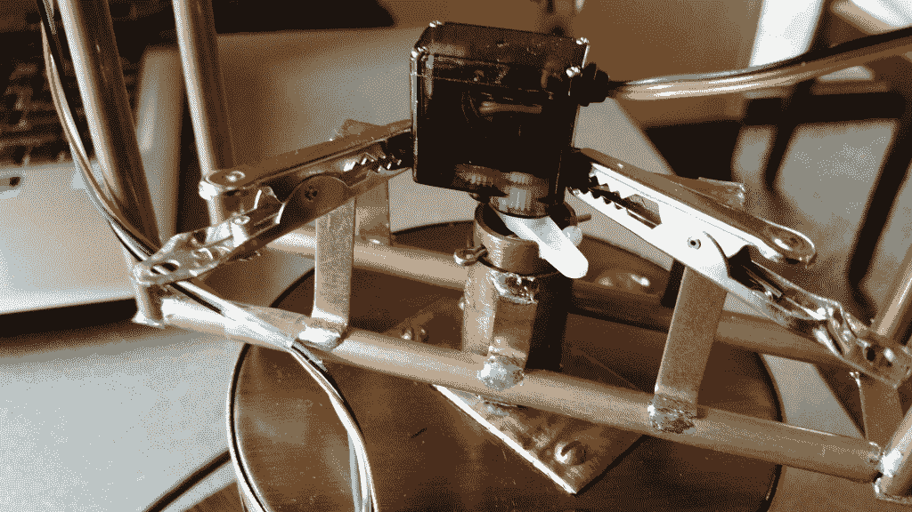
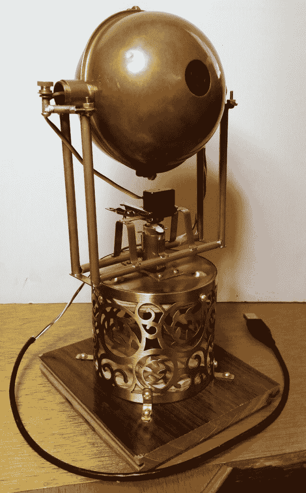

# 看哪！蒸汽朋克眼球完成了

> 原文：<https://thenewstack.io/off-shelf-hacker-behold-steampunk-eyeball-complete-part-5/>

打造一个蒸汽朋克眼球([第一部](https://thenewstack.io/off-shelf-hacker-make-steampunk-eyeball/) [第一部](https://thenewstack.io/off-shelf-hacker-make-steampunk-eyeball/)[第二部](https://thenewstack.io/off-shelf-hacker-make-steampunk-eye-ball-part-2/)[第三部](https://thenewstack.io/off-shelf-hacker-now-start-building-steampunk-eyeball/)[第四部](https://thenewstack.io/off-shelf-hacker-steampunk-eyeball-frame-servos-software-part-4/))一直很好玩。我学到了很多，希望读者也一样。

在这一期，我们将总结过去一周的制作，分析项目的结果，总结挑战和解决方案，然后看看未来蒸汽朋克眼球增强可能会发生什么。

但首先，让我们花一点时间来欣赏完成的眼球在其完成的荣耀:

[https://www.youtube.com/embed/Q6BBI3yKTgg?feature=oembed](https://www.youtube.com/embed/Q6BBI3yKTgg?feature=oembed)

视频

## **完成 1.0 版的 Fab**

### 建造基地

蒸汽朋克眼球平移/倾斜机制是相当没有价值的，没有一个有趣的方式来展示它并让它做些什么。当然，某种类型的固体基地是必要的。我在[旧时代陶器](http://oldtimepottery.com/)找到了一个装饰性的金属烛台，它成了一个很好的基础。我原本以为它会作为眼球部分本身。然后，我有了一个好主意，用一个铜避雷针球。令人高兴的是，烛台正好适合潘枢轴管安装，并有明显的蒸汽朋克外观，所以它被压入服务。

烛台被倒置安装在一对 1/2 英寸厚的胶合板圆盘上，这些圆盘安装在顶部和底部。我用了一个 5/8 英寸直径的铲形钻头，在钻床上为铜盘枢轴管打孔。四个 4-40 x 1 英寸的圆头黄铜机器螺钉将枢轴管支架固定在烛台的顶部及其 1/2 英寸厚的圆盘上。烛台的开口端(现在是底部)有一个匹配的 1/2 英寸厚的木制圆盘和 5/8 英寸的孔，用于枢轴管的底部。烛台的底部用支架固定在一块废弃的层压木地板上，形成底座。层压地板是完美的，因为它有致密的泡沫橡胶作为防滑底部，允许在各种表面上保持稳定。它还有那种古色古香的黑木蒸汽朋克风格。当眼球不在储存盒中时，它可能会放在桌子或讲台上。

### 测试

本周我也做了相当多的测试和调整。令人惊讶的是，用一个接近完成的设备来测试是多么的容易(和有趣)。完成底座和稳定眼球后，我可以专注于探索它如何与世界互动，以及需要做哪些调整才能获得最佳性能。我将在 Linux 机器上使用 PixyMon 应用程序来获得更多关于眼球行为的经验，因为它与周围环境相互作用。不难想象使用来自 Pixy 的数据进行各种场景分析和视觉传感器命令单元功能。当然，这些数据可以与尚未确定的 Raspberry Pi 或 Arduino 物理计算任务进行交互。

每当你创建复杂的小工具，尤其是物理计算设备时，都需要花一点时间来理解你的新生儿的所有怪癖和能力。并且，不要忘记 1.0 版本是第一个完全可操作的原型。在使用 1.0 版的实际“座位时间”之前，您不可能知道后续版本的发展方向。

记得享受成就，继续学习。

### **眼球构建结果分析**

最大的问题是:“它跟着我吗？”。

是啊！当我穿着一件普通的蓝色 t 恤衫时，眼球忠实地跟着我在大约 120 度的范围内移动大约 10 英尺。许多变量会影响跟踪，例如环境照明强度、光色温度以及 t 恤上是否有文字或图片。有时，我会看到眼睛朝一个疯狂的随机方向移动，却意识到我已经离开了它的视野，它已经开始跟踪其他一些蓝色物体。我可能会打包几件不同颜色的衬衫，然后在到达一个场地时适当调整颜色。

每个看到这个装置的人都印象深刻。是的,“哇”的因素要求肯定是符合的。

“它喜欢玛格丽特，”我女儿的一个朋友在参加了一次即兴演示后评论道。效果是眼睛偶尔会看到玛格丽特衬衫上的蓝色斑点，然后沿着枢轴上的粘性点，使它看起来像有个性。确保在你的项目中注意并利用这些“社会无形资产”。虽然听起来很疯狂，但这些线索有助于向你的观众推销真实性和可信度。

当我把这个设备带到外面的世界时，我意识到安全地携带这个设备可能是一个问题。因此，一个明确的增强将是一个手提箱。我在想，一个配有皮革铰链和黄铜装饰的短木箱，会在我去参加科技讲座时增加一点神秘感和档次。我想知道当我在机场办理登机手续时，美国运输安全管理局会如何看待这个设备。

## **发现挑战/解决方案**

### 花了太长时间

蒸汽朋克眼球花的时间比我想象的要长，尽管它总共只有大约 50 个小时(超过 5 周的系列)。这是相当合理的，考虑到我想要的东西，通过多次技术会谈，可以在实际使用中存活下来。

由于我对细节的关注和工程上的吹毛求疵，我偶尔会被指责为“德国人”。我想这是可以理解的，因为我的祖父理查德·沃格特是圣母大学的化学教授，他的远亲霍华德是别克的发明家兼工程师。我的父亲安迪·赖利，作为一名工程师，对“冲刺导弹”做了压力分析……尽管他显然是爱尔兰人。

### 平稳运行的机制

伺服机制相当健壮，尽管它们需要相当多的调整，才能很好地工作。对于超平滑操作，滚珠轴承安装可能是更好的选择。它们会增加一些重量，并且需要设计合适的支架和轴。

把倾斜伺服系统放在眼睛里是正确的决定。我最终决定，我想要更干净的铜球内的伺服外观。设计传动轴不在最初的计划中。幸运的是，它在 tilt pivot 框架的末尾添加了一个有趣的视觉蒸汽朋克细节。

焊接沉重的铜部件是有问题的。我的 100/140 Weller 焊枪，只是没有放出足够的热量来将 1/2 英寸的铜管连接到小黄铜支架或巨大的铜球体表面积上。解决方案:使用更大的烙铁、更薄、散热更少的材料，或者实施不同的枢轴设计。

## **零零碎碎**

这里有一个简短的清单，需要把所有东西绑在一起。

*   *   我在平底锅枢轴管里放了一个开口销，所以如果有人试图拿起它，眼球不会从枢轴上掉下来。
    *   我仍然需要将摇摄伺服系统牢固地连接到它的安装支架上，这样我就可以移除固定它的临时鳄鱼夹。

开口销和伺服安装临时鳄鱼夹

*   你可以使用热胶来“吸收”伺服臂枢轴槽中的一点点松弛。
*   我计划用一些彩色的外部帕拉科德编织带覆盖 USB 线，让它看起来像古董。我对蒸汽朋克会议徽章线使用了相同的技术，该线将粗锉 Pi 连接到显示单元。细多颜色的 USB 线，在眼睛上，不是很蒸汽朋克。这种改变需要切断电线，缠绕在编织物上，然后将电线重新焊接在一起，因为每一端都有一个连接器。

## **2.0 及以上版本**

我想补充的几件事是额外的位置传感器，这将有助于记录眼球指向的数据。虽然 Pixy 可以根据它在物体周围生成的盒子的大小进行粗略的距离测量，但添加超声波传感器可以提供更高的精度。

X-Y 位置(在 Pixy 的视野中)和到目标的距离(你真的在我的蓝色 t 恤中)数据，将使开发用于摄像机和灯光的无线从属机器人设备成为可能，当我在舞台上走动时，这些设备将自动跟踪我。

自然，从眼球获取数据将由高性能的 ESP8266 WiFi 微控制器处理。使用 8266 还可以带来远程伺服控制，并可能对 Pixy 相机配置进行空中调整。

我希望你喜欢蒸汽朋克眼球构建项目，并受到启发来开发自己的物理计算项目。

<svg xmlns:xlink="http://www.w3.org/1999/xlink" viewBox="0 0 68 31" version="1.1"><title>Group</title> <desc>Created with Sketch.</desc></svg>