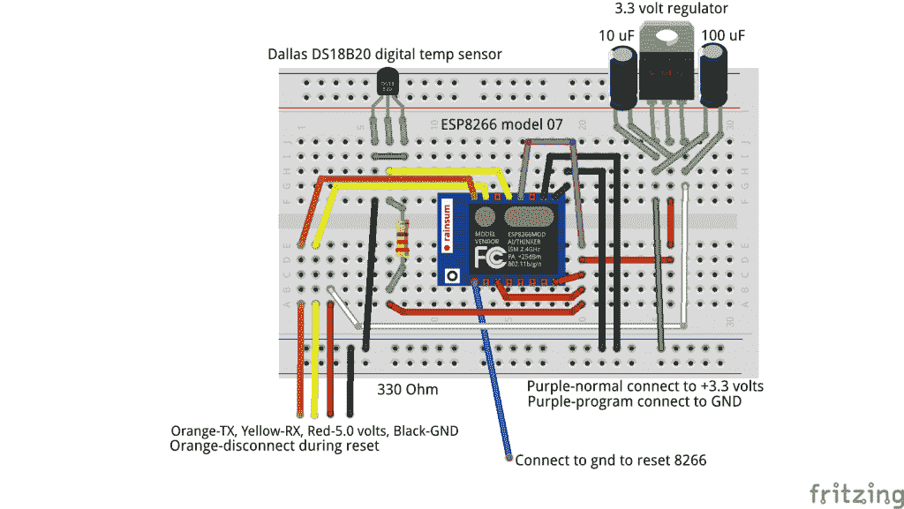
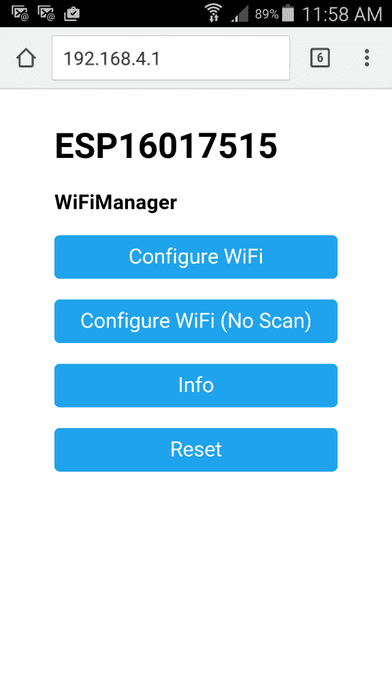

# 现成黑客:使用 ESP8266 构建网络温度传感器

> 原文：<https://thenewstack.io/off-shelf-hacker-build-networked-temperature-sensor-esp8266/>

上周在[现成的黑客](/tag/off-the-shelf-hacker/)中，我和[谈论了我的一些关于 ESP8266 WiFi 微控制器的项目](https://thenewstack.io/off-shelf-hacker-new-obsession-esp8266/)。让我们来看看把一些东西放在一起有多容易。

回到 2012 年，我在 T4 OSCON 做了一个演讲，“用 Arduino、Xbee 收音机和 Linux 组装一个基本的远程传感器。”黑客使用了一个 Arduino 连接到达拉斯 DS18B20 数字温度计，再耦合到 Xbee 无线电。无线连接的另一端是另一台 Xbee 收音机，它连接到我的 Linux 笔记本上。Arduino 读取 Dallas 传感器，通过 Xbee 链接发送温度数据，并在笔记本电脑的终端上显示结果。Xbee 无线电是 60 兆瓦的型号，带有外部天线，范围约为 5000 英尺。是的，我在一个湖里测试过。

今天我们在这里。但是这一次，我用一个 ESP8266 代替 Arduino 和一个 Xbee 无线电。我们还消除了其他 Xbee 无线电，可以简单地通过局域网连接访问数据。

## **连接并上传固件**

你需要这些零件:

*   [ESP8266 07 型](http://www.banggood.com/ESP8266-ESP-07-Remote-Serial-Port-WIFI-Transceiver-Wireless-Module-p-961247.html?cur_warehouse=CN) — WiFi 微控制器(07 版)
*   [DS18B20](http://www.banggood.com/DS18B20-Temperature-Sensor-DALLAS-18B20-TO-92-Encapsulation-p-91798.html?cur_warehouse=CN) —达拉斯数字温度传感器
*   试验板
*   4.7K 电阻
*   3.3 调节器
*   (1) 10 uF 电容器
*   (1) 100 微法电容器
*   Linux 笔记本

我在 bang good[的运气相当好，而且(从中国)的周转时间大约是十天。一定要寻找“包含运费”的交易。你也可以从](http://www.banggood.com) [Adafruit](http://adafruit.com) 、 [Sparkfun](http://sparkfun.com) 和其他现成的黑客硬件供应商那里获得你需要的东西。

这是实验板的照片。



ESP8266 WiFi 微控制器，在试验板上集成 18B20 温度传感器

3.3 稳压器和两个滤波电容是非常标准的。该配置从 USB/串行线获取 5.0 伏电压，并将其转换为 ESP8266 所需的 3.3 伏电压。大多数人在编程后会移除 USB/串行连接，并简单地向 3.3 伏调节器上的电源输入引脚提供 3.3 至 9 伏电压以进行正常操作。

读者还会注意到，DS18B20 数字温度传感器在“寄生”模式下工作，这意味着 VCC (+电压)和地相连。这使您可以只使用数据引脚和地，而不必运行额外的电线到 VCC 引脚(正常模式)。网络上的其他黑客说，你将获得更可靠的温度读数，特别是当传感器在正常模式下连接时使用长电缆。我一直使用寄生模式，基本双线(22 号)总线电缆最长约 50 英尺，没有问题。

Arduino IDE 正迅速成为 Arduino、ESP8266 和其他一些基于固件的设备的编程标准。构建工作程序的一个快速方法是从示例中取出代码段，并以有用的方式将它们链接在一起。示例和库中详细介绍了让 ESP8266s 做事情的大部分繁重工作。我为 Steampunk 无线点击器盗版了我的 WiFi-slide-scroll 程序的很大一部分，并侵入了代码以读取和打印 DS18B20 传感器的数据。

有几件事需要注意。

在 ESP8266 07 型号上，请注意一些芯片标记错误。GPIO 4 引脚与 GPIO 5 引脚相反。我只是在代码中做了调整。如果你没有意识到这一点，你会追逐你的尾巴一会儿，想知道为什么你永远不会得到一个有效的读数。这可能是你有一个错误标记的芯片。

您肯定想利用的一个很酷的 ESP8266 功能是 WiFi 配置例程。通过此功能，8266 以接入点(AP)模式启动。它还启动一个小的网络服务器，然后搜索该区域中可用的接入点。接下来，它会列出这些 AP 并让您选择一个。如果 AP 使用加密，您将被要求输入密码。输入正确的密码后，8266 连接到选定的网络，并开始向联网的客户端提供温度数据。要进入网络配置屏幕，您只需在笔记本电脑或智能手机上连接 8266 接入点，然后将浏览器指向 192.168.4.1。

多方便啊？

这里是代码

```
#include &lt;OneWire.h&gt;
#include &lt;DallasTemperature.h&gt;

#include &lt;ESP8266WiFi.h&gt;
#include &lt;DNSServer.h&gt;
#include &lt;ESP8266WebServer.h&gt;
#include &lt;WiFiManager.h&gt;

void configModeCallback  (WiFiManager *myWiFiManager)  {
Serial.println("Entered config mode");
Serial.println(WiFi.softAPIP());
//if you used auto generated SSID, print it
Serial.println(myWiFiManager-&gt;getConfigPortalSSID());
}

// Data wire is plugged into port 2 on the Arduino
#define ONE_WIRE_BUS 4

// Setup a oneWire instance to communicate with any OneWire devices (not just Maxim/Dallas temperature ICs)
OneWire oneWire(ONE_WIRE_BUS);

// Pass our oneWire reference to Dallas Temperature. 
DallasTemperature sensors(&amp;oneWire);

/*
 * The setup function. We only start the sensors here
 */
WiFiServer server(1337);

void printWiFiStatus();

void setup(void)
{
  // start serial port
  Serial.begin(9600);
  Serial.println("Dallas Temperature IC Control Library Demo");

  WiFiManager wifiManager;

  // Comment out the reset line, to keep SSIDs and log into APs automatically after configuration
  wifiManager.resetSettings();
  wifiManager.setAPCallback(configModeCallback);

  if(!wifiManager.autoConnect())  {
    Serial.println("failed to connect and hit timeout");
    ESP.reset();
    delay(1000);
  }  

  // Start up the library
  sensors.begin();

  // Start TCP server.
  server.begin();
}

/*
 * Main function, get and show the temperature
 */
void loop(void)
{

  // Check if module is still connected to WiFi.
  if  (WiFi.status()  !=  WL_CONNECTED)  {
    Serial.println("WiFi connected inside void loop");
    while  (WiFi.status()  !=  WL_CONNECTED)  {
      Serial.println("WiFi.status connected loop");
      delay(500);
    }
    // Print the new IP to Serial.
    printWiFiStatus();
  }

  WiFiClient client  =  server.available();

  if  (client)  {
    Serial.println("Client connected.");

    while  (client.connected())  {

    // call sensors.requestTemperatures() to issue a global temperature 
    // request to all devices on the bus
    sensors.requestTemperatures();  // Send the command to get temperatures

    // After we got the temperatures, we can print them here.
    // We use the function ByIndex, and as an example get the temperature from the first sensor only.

    Serial.println(sensors.getTempFByIndex(0));
    client.print(sensors.getTempFByIndex(0));
    client.write("\n");  
    delay(1000);  
    }

    Serial.println("Client disconnected.");
    client.stop();
  }  
}

void printWiFiStatus()  {
  Serial.println("");
  Serial.print("Connected to ");
  // Serial.println(ssid);
  Serial.print("IP address: ");
  Serial.println(WiFi.localIP());
}

```

我的正常编程程序如下。

*   将 USB/串行电缆插入我的 Linux 笔记本电脑。
*   启动 Arduino IDE。
*   打开 8266-ds18b20-temp-sensor 文件(包含上述代码)。
*   从 3.3 伏断开 GPIO 0 线(紫色)，并将其接地。
*   暂时断开 TX 线。
*   将复位引脚线(蓝色)短接到地，然后断开。
*   重新连接 TX 线。

完成这些步骤后，您可以在 Arduino IDE 中点击“upload ”,将固件从 Linux 笔记本发送到 ESP8266 模块。上传固件时，8266 上的蓝色无线 LED 应该会闪烁。当它停止闪烁时，8266 应该复位。否则，只需将 reset 引脚短接至地并断开。

对于正常操作，将 GPIO 0 线(地)从地返回到 3.3 伏。如果您愿意，可以在编程/测试时将其接地。

重置后，在 Arduino IDE 中启动串行终端，并将波特率更改为 9600。

接下来，在智能手机或笔记本上，扫描本地接入点。连接到名称中带有“8266”或“ESP”的设备。启动浏览器并转到 http://192.168.4.1。您应该会看到 8266 WiFi 配置屏幕。这是它在我的三星 Galaxy 5 Active 超级手机上的样子。



我的 Galaxy 5 Active 超级手机上的 ESP8266 WiFi 配置网页。

选择“配置 WiFi”按钮。找到并选择您的本地无线网络，并根据需要输入密码。按“保存”重启 8266。它应该连接到您的本地 WiFi，并启动小 TCP 服务器通过端口 1337 传输数据。在你的 Linux 笔记本上使用 [**nmap**](https://nmap.org/) 或者在 Android 上使用 [**FING**](https://play.google.com/store/apps/details?id=com.overlook.android.fing&hl=en) 来找到 8266 的 IP 地址。

要在 8266 上保留本地接入点，请务必注释掉“wifi manager . reset settings()；”行代码，最后上传固件。否则，8266 将在每次通电后清除其与接入点的连接历史。

只要通过 USB/串行线连接将设备连接到 Arduino IDE，就可以通过激活串行窗口来查看 8266 的消息和温度读数。

## **抓取笔记本端的数据**

一旦 8266 连接到您的本地网络，您就可以在 Linux 笔记本上捕捉温度读数。

确保您的 Linux 笔记本与您的 8266 设备连接到同一个局域网。打开终端，运行 [**netcat**](http://nc110.sourceforge.net/) 查看您的 8266 温度数据。下面是我用的命令行，108 地址是 8266 模块。

```
rob%  netcat  192.168.1.108  1337

```

您应该看到温度读数，大约每秒一次，每行一个。如果您想记录一段时间内的一系列读数，也可以将数据传输到一个文件中。

```
rob%  netcat  192.168.1.108  1337  &gt;  temp.txt

```

我将让读者为数据流添加某种时间戳。只需使用 Arduino 时间/日期函数，并将输出添加到每个温度读数的文本流中。请注意，由于硬件通信限制，DS18B20 可以每 750 ms 输出一次有效温度读数。因此，每秒钟读取一次数据可以确保数据的可靠性。

## **我们已经走了多远**

8266 温度传感器是一个看似简单的项目。就在几年前，一台 Arduino 和几台 XBee 收音机才能与一台甚至不支持网络的笔记本电脑建立基本的无线连接。

今天，你只需要一个芯片。它还可以通过临时接入点和使用网页的 WiFi 进行配置。8266 上实际上运行着一个小小的 Web 服务器！在初始配置之后，它将简单地连接到本地局域网，并通过一个小的 TCP 服务器传输数据。连接一个合适的客户端，你就有了一个基本的数据记录系统。这是一个非常小的封装中的大量物联网马力。

想想即将发生的事情。

现在去做些有趣的事情吧。

<svg xmlns:xlink="http://www.w3.org/1999/xlink" viewBox="0 0 68 31" version="1.1"><title>Group</title> <desc>Created with Sketch.</desc></svg>