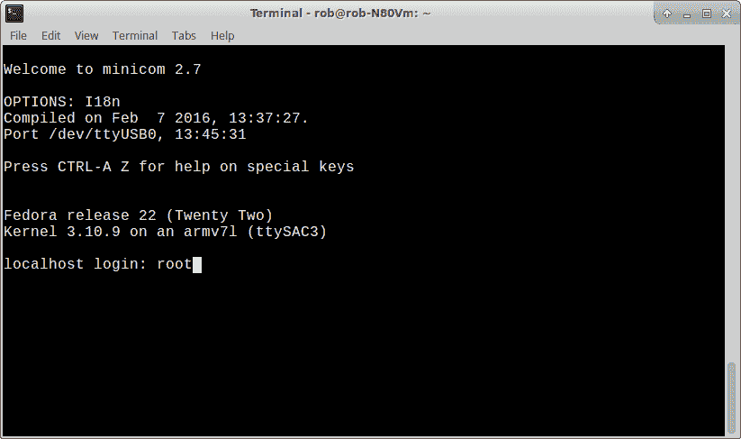
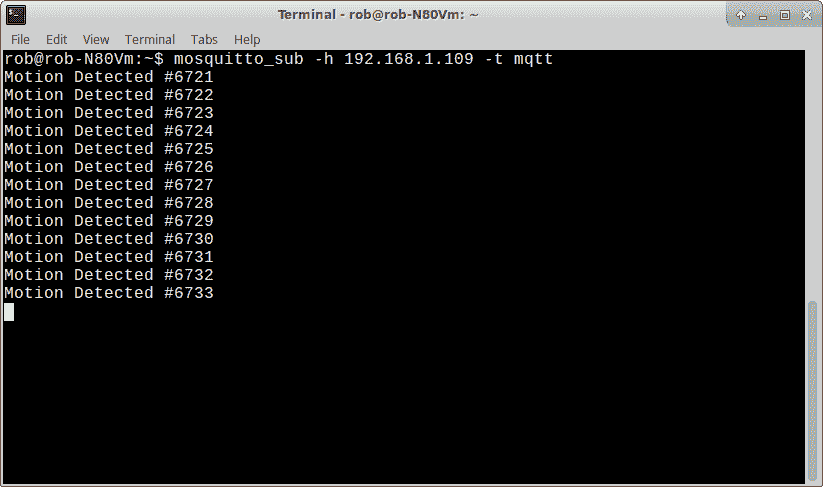

# 现成的黑客:用 Artik 构建一个可移植的 MQTT 代理

> 原文：<https://thenewstack.io/off-shelf-hacker-building-portable-mqtt-broker-artik/>

长久以来，我一直想建立一个无线数据控制“中枢”我设想一个电池供电的 Linux 设备，能够同时连接许多传感器。它必须足够坚固，能够在野外或建筑物顶部工作。

找到一种方法来同时管理来自多个传感器的数据对我来说是一个障碍。例如，为 ESP8266 设备编写一个[小客户端程序非常容易，它可以将简单的文本数据发送到连接到我的局域网的 Linux 机器。但是这种方法一次只支持一个客户端连接到服务器。](https://thenewstack.io/off-shelf-hacker-build-networked-temperature-sensor-esp8266/)

## Artik 上的 MQTT 怎么样？

还记得我们去年评测的三星 Artik [吗](https://thenewstack.io/off-shelf-hacker-hands-artik-micro-controller/)？我们做了基本的 Python 眨眼引导练习。整理 WiFi 时遇到了问题，所以后来我把 Artik 束之高阁，开始做其他项目，因为我知道故障排除的灵感最终会回到我的 AO(观察区域)中。

Artik 10 是三星面向物联网(IoT)应用的旗舰级片上系统(SoC)。它拥有 8 个内核、WiFi、Zigbee、2GB 内存、8GB 闪存和 Fedora Linux。我有开发套件，它有一个插座和支持 Artik 10 芯片的电子设备。

对我来说，在闪存中运行 Linux 是基于操作系统的物联网模块的未来，比如 Artik。该设备启动速度快，运行凉爽，你不必在 micro-SD 卡的末端贴上一片胶带来防止它从插槽中弹出时丢失。

在过去的几天里，我已经解决了 Artik 上的 WiFi 问题。

MQTT 是一个轻量级的发布/订阅(称为发布/订阅)服务器/客户端协议，不久前出现在我的视野中，它显然可以毫不费力地每秒处理几千条消息。MQTT 运行在各种 Linux 系统和硬件平台上。

因此，运行在支持 WiFi 的 Artik 上的 MQTT 似乎非常适合便携式无线数据控制中心。让我们看看如何在 Artik 上安装和运行 WiFi 和 MQTT，好吗？

## 在 Artik 上修复 WiFi

就像上次一样，我在我的华硕 Linux 笔记本和 Artik 之间连接了一根 USB 线。您可以将标准手机数据线插入 Artik 板上的微型 USB 端口(靠近以太网端口)，另一端连接到您的笔记本电脑。

接下来，我启动了 **[minicom](https://linux.die.net/man/1/minicom)** 串行应用程序，并使用 root 作为用户名和密码登录到 Artik。



通过 USB 端口使用 minicom 登录 Artik

对于这个项目，我需要我的笔记本电脑上的 USB 端口的 root 权限，所以使用 [**sudo**](https://www.sudo.ws/) 对于 minicom 工作来说是必要的:

```
drtorq-notebook$  sudo minicom

```

接下来是更新 Artik 软件。因为 Artik 使用的是 Red Hat Enterprise Linux，所以你不需要像在 Debian 或 Ubuntu 系统上一样，只需要做一个 **apt-get** 就可以更新东西。红帽使用不同的软件包管理器，叫做。

经过一番折腾并询问是否要加载模块后，更新将完成并返回到命令提示符。

此时，我将一根以太网电缆插入 Artik 开发板上的端口，然后尝试从我的 Linux 笔记本上使用 **ssh** 登录。不去。

通过 USB 串行连接使用 [**ifconfig**](https://linux.die.net/man/8/ifconfig) 快速检查显示，我的路由器的 DHCP 服务器为有线连接分配了一个 IP 地址(192.168.1.108)。

虽然我可以从我的 Linux 笔记本上 ping Artik，但我仍然无法通过网络用 ssh 连接到它。

也许是在我收到板之前宋承宪出了什么事，需要审查？凭直觉，我试着重新安装了 **ssh** 。

```
artik#  dnf reinstall openssh-server

```

嘭，我在笔记本上再次尝试了一下 **ssh** ，现在可以使用有线以太网连接登录 Artik 了。工作完成后，我关闭了迷你电脑并断开了 USB 线。

在 WiFi 在任何系统上工作之前，您需要将您的无线路由器信息添加到配置文件中，以便它可以连接到您的网络。

首先转到/etc/wpa_supplicant 目录:

```
artik#  cd /etc/wpa_supplicant

```

接下来，执行以下命令来构建 wpa_supplicant.conf 文件，用网络中的 SSID 和密码替换它们。

```
artik#  wpa_passphrase “SSID” “PASSWORD” &gt;&gt; wpa_supplicant.conf

```

您可能还需要在 wpa_supplicant.conf 文件的开头添加以下行。

```
ctrl_interface=/var/run/wpa_supplicant
  ctrl_interface_group=wheel

```

我用 **vi** 编辑文件，添加了台词。

您的文件将如下所示，带有一个扩展的 psk 行。

```
ctrl_interface=/var/run/wpa_supplicant
ctrl_interface_group=wheel
network={
  ssid="robnet3"
  psk=6b……..b48754fc1
}

```

你可能还会有一句#psk 台词。不需要，去掉就好了。

现在，重新启动 Artik。

Artik 重启后，再次通过有线连接登录。

事实证明，根据三星 Artik 10 用户文档，WiFi 的 DHCP 客户端必须手动启动。这将是伟大的工作自动启动。

快速检查 ifconfig 显示了 wlan0 设备的新 IP 地址(192.168.1.109)。

这样，我就可以使用新的终端窗口和 192.168.1.109 地址从我的 Linux 笔记本通过 WiFi 登录 Artik。我还注销了有线连接，并从 Artik 的端口上拔下了 CAT 5 电缆。

```
drtorq-notebook%  ssh root@192.168.1.109

```

## 将 Artik 转变为 MQTT 代理

接下来的工作是将 Artik 设置为 MQTT 代理。当通过 WiFi 登录时，我使用 Red Hat 应用程序管理器安装了一个广受好评的 MQTT 代理和客户端 [mosquitto](https://mosquitto.org/) 。

```
artik#  dnf install mosquitto

```

完成后，mosquitto 在后台启动。

还记得以前的 [ESP8266/PIR 码传感器项目](https://thenewstack.io/off-shelf-hacker-lightweight-inter-device-messaging-mqtt/)吗？由于纯粹的因果报应，我已经将 IP 地址硬编码到固件中，所以每当设备启动时，它都会尝试连接到 MQTT 代理，它的地址是 192.168.1.109。

mosquitto 一出现，院子传感器就从 192.168.1.103 开始连接。

我在我的 Linux 笔记本终端上开始订阅 mosquitto。

```
drtorq-notebook%  mosquitto_sub  -h  192.168.1.109  -t  mqtt

```

当我在院子传感器前移动我的手时，一股数据流成功地在终端屏幕上流出。



终端中的 MQTT 订阅数据

**下一步是什么**

我已经和 mosquitto MQTT 代理一起运行 Artik 几天了，它看起来稳定可靠。我在我的 Android 超级手机上连接、断开、重启，甚至尝试使用 MQTT 客户端观看消息。一切进展顺利。

为了使钻机真正便携，我需要设置一个 5 伏，5 安培的电源，让 DHCP 在启动时自动出现在 wlan0 上，并为 Artik 开发板和芯片找出某种情况。

将一些传感器或执行器连接到 Artik 的通用输入/输出引脚可能会很有趣。我们可以使用 Python 脚本来跟踪当地的温度、环境光和其他环境因素。我们可以通过 mosquitto _ pub 调用将数据提供给其他设备。

将 Artik 作为 WiFi 接入点运行，让该区域的所有传感器设备都能自动连接到它，这难道不是很有用吗？这将是一个便携式无线数据控制中心。

我肯定得在那一个上工作。

通过 Pixabay 的特征图像。

<svg xmlns:xlink="http://www.w3.org/1999/xlink" viewBox="0 0 68 31" version="1.1"><title>Group</title> <desc>Created with Sketch.</desc></svg>