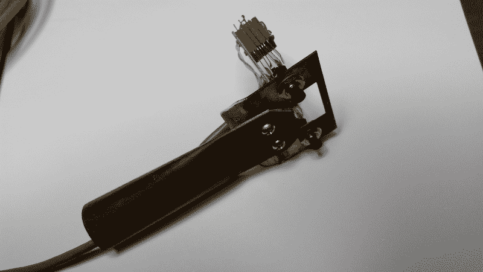

# 现成的黑客:用处理语言按下按钮

> 原文：<https://thenewstack.io/off-shelf-hacker-button-pressing-processing/>

在[“现成黑客:运行 Raspberry Pi 的幻灯片”文章](https://thenewstack.io/off-shelf-hacker-push-button-slides-pi/)中，几周前，我谈到了使用 Python 脚本的按钮来改变我的 Raspberry Pi 驱动的“会议演示和操作设备”上的幻灯片

今天，我们将看看如何使用输入按钮来改变屏幕上一个方框的颜色，这次是用[处理语言](https://en.wikipedia.org/wiki/Processing_(programming_language))。应用可能包括将开关连接到机器上和构建工业过程仪表板。或者，一个你可以从安乐椅上观看的带有门开关输入的家庭安全系统怎么样？Pi 和处理提供了许多有趣的可能性。

[处理](http://www.processing.org)语言是为那些想要在没有陡峭的学习曲线或大麻烦的情况下完成视觉项目的艺术家和创意人员准备的。该代码与您在编写 Arduino 时编写的代码相同。可以预见，库和特定函数略有不同，而代码是相同的。我认为使用像 Processing 和 Arduino IDE 这样的标准工具，作为一个现成的黑客可以很容易地完成工作。

## **获取硬件**

硬件包括一个 Raspberry Pi 2，上次的 40 针连接器和电缆，以及我为我的 Fossetcon 演讲制作的“点击器”。当然，您还需要一个大屏幕显示器、键盘/鼠标垫和网络连接，因为该示例将在 Raspbian Linux 桌面上运行。

[](https://thenewstack.io/wp-content/uploads/2015/12/wired-clicker.png)

图形 1–蒸汽朋克“点击器”

图 1 显示了点击器的细节。我从当地一家历史悠久的剩余电子产品商店 [Skycraft](http://www.skycraftsurplus.com/) 购买了几个工业外观的按钮组件。每件付一美元。

我用现有的螺丝孔，将按钮固定在一个旧的黄铜色门撞板上，那是在我的“垃圾箱”里。当你有一个库存充足的垃圾箱时，你可以节省很多时间，并利用大量的创意许可，设计蒸汽朋克主题的小工具。

几个#6-32 x 1/2”机器螺钉和螺母将一根扁平的 4 英寸长、直径为 1”的铜管固定到门撞针/按钮板上，并用作把手。一根 10 英尺长的 CAT 5 电缆穿过手柄，并使用两对导线将按钮连接到 40 针 Pi 连接器。

我喜欢尽可能地深入硬件细节，因为我认为这对新手来说很重要，不仅要了解物理计算的软件和计算机方面，还要了解机械和电子方面。

## **用点击器改变盒子颜色**

像大多数其他物理计算程序一样，我们想读取一些输入，也许做一些计算并设置一些输出。

在这种情况下，我们将有一个循环，它不断地读取两个点击按钮的状态，当它检测到一个按压时，改变屏幕上一个正方形的颜色。

参考最近的[“现成的黑客:用一个处理速写本丰富你的项目”](https://thenewstack.io/off-shelf-hacker-expand-projects-processing-sketchbook/)来获得在你的 Raspberry Pi 上安装处理的帮助。你会想要下载 Linux ARMv6hf (Raspberry Pi)版本，而不是我在 Linux 笔记本上使用的 Linux 64 位(Intel architecture)版本。两个平台上的安装过程是相同的。

出于某种原因，我仍然不得不使用 sudo 运行处理集成开发环境(IDE)。Processing 3 应该允许您访问 GPIO 引脚，而无需考虑权限问题，所以我必须调查它为什么不能正常工作。

切换到 Processing 3 目录并执行应用程序。

```
<em>pi%  cd processing3  </em>  
<em>pi%  sudo  ./processing  </em>

```

下面是我用“点击器”检测按钮按压的代码。

```
import processing.io.*;

void setup()  {
  GPIO.pinMode(20,GPIO.INPUT);
  GPIO.pinMode(21,GPIO.INPUT);  

  // On the Raspberry Pi, GPIO 4 is pin 7 on the pin header,
  // located on the fourth row, above one of the ground pins
  // For this particular board one could also write:
  // GPIO.pinMode(RPI.PIN7, GPIO.INPUT);

  // frameRate(0.1);
  }  

void draw()  {
  // sense the input pin
  if  (GPIO.digitalRead(21)  ==  GPIO.HIGH)  {
  //println("right button pressed");
  fill(100);
  // delay(200);
  }
  if  (GPIO.digitalRead(20)  ==  GPIO.HIGH)  {
  // println("left button pressed");
  fill(0);
  // delay(200);
  }

  rect(30,  20,  55,  55);
  fill(200);

```

这个程序并不复杂。基本上，GPIO 引脚被初始化，然后一对 if 语句检查引脚何时变为高电平(按下)。我注释掉了 print 和 delay 语句，因为它们主要用于故障排除。

点击 play 按钮(编辑器左上角的箭头)运行应用程序，过一会儿，屏幕上会出现一个带方框的新窗口。按下每个按钮，盒子的颜色应该会改变。

反应非常好，没有滞后或问题。网上有人说 Pi 上的处理 3 又慢又笨拙。我发现这个程序足够快，可以在你按下按钮时检测到开关的弹跳。取消对 println 语句的注释将为您提供三或四行文本。取消对 delay()语句的注释，并可能将其增加到 250 ms 以消除重复行。

此外，不要忘记 Processing 有一个庞大的用户社区，他们已经生成了一些非常棒的库。特别是 ControlP5 ，它有一组丰富的屏幕标尺、按钮、滑块等等，非常适合构建跟踪输入的桌面仪表盘。

您可能还想研究如何从命令行运行草图。看看这篇 [Adafruit 文章](https://learn.adafruit.com/downloads/pdf/processing-on-the-raspberry-pi-and-pitft.pdf)。看一下第 9 页。

## **总结**

用 Raspberry Pi 检测开/关输入非常简单。我们已经看到了如何在 Python 和处理中完成这项工作。您的项目可能会使用按钮、磁簧开关、光学传感器或其他开/关传感器。能够在屏幕上显示一个变化使您能够构建桌面仪表板。看看 Processing.org 的网站，了解更多的想法。

<svg xmlns:xlink="http://www.w3.org/1999/xlink" viewBox="0 0 68 31" version="1.1"><title>Group</title> <desc>Created with Sketch.</desc></svg>