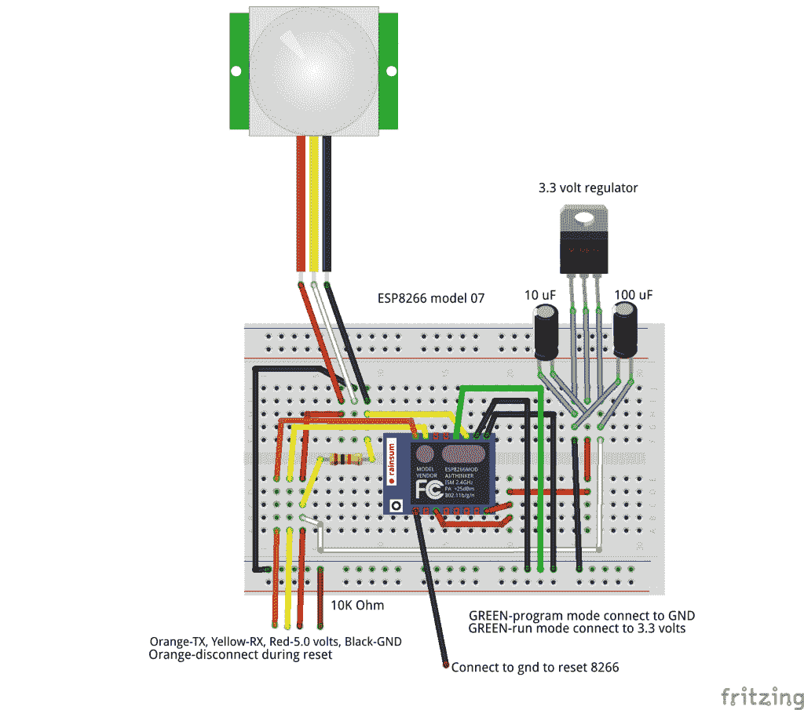

# 现成的黑客:创建一个早期预警探测器与被动红外传感器

> 原文：<https://thenewstack.io/off-shelf-hacker-create-early-warning-detector-passive-infrared-sensors/>

多年来，我一直想在我的院子里建立一个由被动红外传感器(PIR)组成的星座，给我入侵者的早期预警，并根据需要激活适当的力场。当有人试图闯入你的房子时，警报系统是很棒的。当地滑稽农场的疯子、偶尔狂吠的疯狗或者甚至僵尸呢？额外的 10-15 秒钟的通知可能是生活和…嗯，你知道的。

既然僵尸已经死了，而且可能不会发射任何红外能量，那么 PIR 传感器还能探测到僵尸吗？我们无法知道答案，除非我们造出一个装置并进行试验。按照真正的[现成黑客](/tag/off-the-shelf-hacker/)的方式，让我们黑一个原型。

## PIR 101

被动红外传感器是检测热量的数字设备。哺乳动物散发出微量的红外线热量，这是因为它们是活着的。电子设备监控设备内部传感器芯片的两个部分，当它们之间没有差异时，信号会相互抵消，否则将指示红外光落在芯片上。如果一半人感觉到不同程度的红外光，PIR 传感器会向输出引脚发送一个脉冲，指示运动。传感器前面有一个透镜系统，有助于将红外能量聚焦在芯片本身上。

有两种类型的 PIR 传感器，输出引脚会变高或变低以指示物体。该项目中使用的器件被称为“开路集电极”，这意味着输出通过一个上拉电阻保持高电平，直到物体从检测器前面经过。然后输出被拉低，从而发出检测信号。开集信号方法使得在同一三线式总线上以菊花链形式连接多个传感器变得容易。

我从 Sparkfun 购买了我的 [PIR 传感器，它是集电极开路的。检测到时，输出引脚变为低电平。arduino market place](https://www.sparkfun.com/products/13285)[Adafruit](https://www.adafruit.com/category/17?gclid=CLj-yoGoyc8CFQaOaQodAwkNcg)出售一种更新、更可调的传感器。其输出通常为低电平，检测到时变为高电平。因此，如果您从互联网上盗版代码，请确保您寻找适当的高或低输出。当您读取微控制器输入引脚以正确解释您的检测事件时，只需反转“低”和“高”值即可。

## 装上电线

微控制器的一个很酷的特点是，你可以用基本的电路，只需切换输入设备，就可以得到不同的行为。例如，为了构建这个项目，我从 OTSH 项目的[中重新设计了无线温度传感器，并将 DS18B20 数字温度计换成了 PIR 传感器。两个传感器都是数字式的，在代码中很容易对不同的设备进行调整。](https://thenewstack.io/off-shelf-hacker-build-networked-temperature-sensor-esp8266/)

看一看试验板:



ESP8266-PIR 试验板

注意从 PIR 传感器到试验板的电线颜色。我的设备有红色、白色和黑色电线。红色代表 VCC(阳性)。这种特殊传感器的额定电压为 5 到 12 伏。奇怪的是，白线接地(负极)。最后，输出黑线。PIR 传感器的输出连接到 ESP8266 微控制器上的通用数字输入/输出(GPIO)引脚 2。你可能会认为黑色是研磨过的，白色是输出。没有。别担心，我已经把我的接错了，没有不良影响。

[Adafruit 有一个稍微先进一点的 PIR 传感器](https://www.adafruit.com/products/189)，带一个小标题，可调节延迟和灵敏度。接头的接地引脚在左边，输出在中间，VCC 在右边，所以电线颜色是你的选择。 [Banggood 传感器](http://www.banggood.com/Wholesale-Mini-IR-Pyroelectric-Infrared-PIR-Motion-Human-Body-Sensor-Detector-Module-New-p-49018.html)看起来与 Adafruit 产品相同。

其他传感器可能使用不同的引脚配置或电线颜色。不要忘记，如果你买了一个 Adafruit 设备，你需要交换你的逻辑来响应检测到的高输出，而不是低输出。

我的 PIR 传感器对输入电压也有点敏感。我用 USB 接口提供的 5 伏电压运行它，它给出了很多假阳性。将(PIR 传感器的)电压提高到 9 伏，操作非常可靠。在那个电压下，我可以探测到 8 英尺以内的物体。

记住，模块检测传感器两半之间的差异，因此物体必须移动，输出才会改变。您可以将 9 伏电池的正极连接到 PIR 传感器的正极引线，同时移除+5 伏的连接。将电池的负极连接到公共地。将传感器的负极引线也连接到公共接地。

## 弯曲代码

我使用的大部分代码来自之前的 ESP8266 温度传感器项目。如前所述，您可以使用智能手机，通过板载接入点和网络配置页面将 ESP8266-PIR 传感器连接到本地局域网。

另外，请注意，我使用内置的标准“pin 13”LED 来告知 PIR 传感器何时触发。引脚 13 通常连接到 Arduino 项目上的 LED，用于基本操作和测试。

在代码的下面，我还添加了一个小计数器，它输出到串行监视器，显示 PIR 传感器 ping 输入 pin 的次数。它将在重启时重置为零。我用序列号进行测试和诊断。

```
#include &lt;ESP8266WiFi.h&gt;
#include &lt;DNSServer.h&gt;
#include &lt;ESP8266WebServer.h&gt;
#include &lt;WiFiManager.h&gt;

void configModeCallback  (WiFiManager *myWiFiManager)  {
Serial.println("Entered config mode");
Serial.println(WiFi.softAPIP());
//if you used auto generated SSID, print it
Serial.println(myWiFiManager-&gt;getConfigPortalSSID());
}

/*
 * The setup function. We only start the sensors here
 */
WiFiServer server(1337);

void printWiFiStatus();

int calibrationTime  =  20;

int pirPin  =  2;    //the digital pin connected to the PIR sensor's output
int ledPin  =  13;
int tr  =  1;

void setup(void)
{
  // start serial port
  Serial.begin(9600);
  Serial.println("ESP8266 Passive Infrared Detector Demo");
  pinMode(pirPin,  INPUT_PULLUP);
  pinMode(ledPin,  OUTPUT);
  digitalWrite(pirPin,  LOW);

  WiFiManager wifiManager;
  // wifiManager.resetSettings();
  wifiManager.setAPCallback(configModeCallback);

  if(!wifiManager.autoConnect())  {
    Serial.println("failed to connect and hit timeout");
    ESP.reset();
    delay(1000);
  }  

  // Start TCP server.
  server.begin();

  // Calibrate sensor
  Serial.print("calibrating sensor ");
    for(int  i  =  0;  i  &lt;  calibrationTime;  i++){
      Serial.print(".");
      delay(1000);
      }
    Serial.println(" done");
    Serial.println("SENSOR ACTIVE");
    delay(50);
  }

/*
 * Main function, get and show the temperature
 */
void loop(void)
{

  // Check if module is still connected to WiFi.
  if  (WiFi.status()  !=  WL_CONNECTED)  {
    Serial.println("WiFi connected inside void loop");
    while  (WiFi.status()  !=  WL_CONNECTED)  {
      Serial.println("WiFi.status connected loop");
      delay(500);
    }
    // Print the new IP to Serial.
    printWiFiStatus();
  }

  WiFiClient client  =  server.available();

  if  (client)  {
    Serial.println("Client connected.");

    while  (client.connected())  {

    // Serial.println("PIR sensor working");
    // PIR detection function  

    int proximity  =  digitalRead(pirPin);

    if  (proximity  ==  LOW)  // If the sensor's output goes low, motion is detected
 {
 digitalWrite(ledPin,  HIGH);
 // Serial.println("Motion detected!");
 client.write("motion");
 client.write("\n");
 tr  =  tr  +  1;
 Serial.println(tr);
 delay(200);
 }
    else
 {
 digitalWrite(ledPin,  LOW);
 //Serial.println("Nothing");
 // client.write("nothing");
 // client.write("\n");
 delay(200);
    }  
  }

}
    Serial.println("Client disconnected.");
    tr  =  0;
    client.stop();
  }  

void printWiFiStatus()  {
  Serial.println("");
  Serial.print("Connected to ");
  // Serial.println(ssid);
  Serial.print("IP address: ");
  Serial.println(WiFi.localIP());
}

```

PIR 传感器需要一段时间才能与 ESP8266 配合工作，这说明了入侵物理计算设备的挑战之一。

虽然基于固件的微控制器，如 Arduino 和 ESP8266，被认为非常快，但它们有其局限性，您需要在构建项目时考虑这些因素。添加一个 WiFi 堆栈，就像在 ESP8266 的情况下一样，您的实时操作可能必须做出一些妥协。

我想获取传感器前面的所有运动，并向局域网上的另一台计算机发送消息，以便记录和报警。监控机器可以是 Linux 笔记本电脑、Raspberry Pi 或者甚至是另一个 ESP8266 设备。

因此，当 8266 在主循环中观察 PIR 传感器引脚的状态变化时，您必须允许 WiFi 堆栈偶尔进行控制，否则，内置的[看门狗定时器(WDT)](https://en.wikipedia.org/wiki/Watchdog_timer) 将会触发并导致微控制器复位。这是一个安全功能，可以防止无限循环和其他类似的问题。

原来，我不得不添加一些延迟，让 WiFi 无线电有时间在传感器读数之间进行通信。PIR 读数之间 200 ms 的延迟效果很好。在这么短的时间内，PIR 探测器几乎不可能错过移动物体。当一个物体在传感器前面移动时，你通常会快速连续地获得多个状态变化。

加上延迟，将 PIR 电源电压提高到至少 9 伏，传感器就会变得坚如磐石。

在我的 Linux 笔记本上，网络连接的另一端是 **netcat** 命令，每当 PIR 传感器触发时，它就监听并打印出“运动”文本。正如在另一篇文章中所阐述的，通过管道将 netcat 的输出(我们毕竟使用的是 Linux)传输到一个文件中，并使用 [AWK](https://en.wikipedia.org/wiki/AWK) 添加时间/日期信息，这样您就可以记录数据，而不必在 8266 上实现时间/日期例程。保持简单，便于故障排除和维护。

## 后续步骤

我用了一个 [ESP8266 模型 07](http://www.gearbest.com/transmitters-receivers-module/pp_227657.html?currency=USD&gclid=CjwKEAjwydK_BRDK34GenvLB61YSJACZ8da3M5_QBSMqyztLMOp2b4i7rzPPvHP1o3dJL6NYqWqJLxoCTbTw_wcB) 为这个项目。07 有 9 个 GPIO 引脚。这个传感器只需要一个引脚。为什么不看看我们能否用[esp 8266 01](http://www.gearbest.com/transmitters-receivers-module/pp_338585.html?wid=21)型获得同样的功能？

在以后的 OTSH 文章中，我将探讨如何从“过度杀伤”的 07 模型转移到基本的 01 设备。

与此同时，我会去围捕测试僵尸。

<svg xmlns:xlink="http://www.w3.org/1999/xlink" viewBox="0 0 68 31" version="1.1"><title>Group</title> <desc>Created with Sketch.</desc></svg>