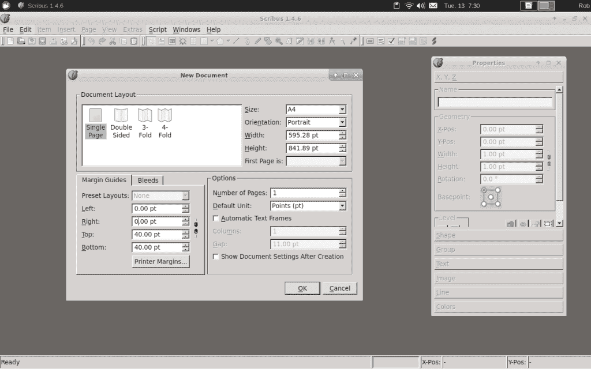
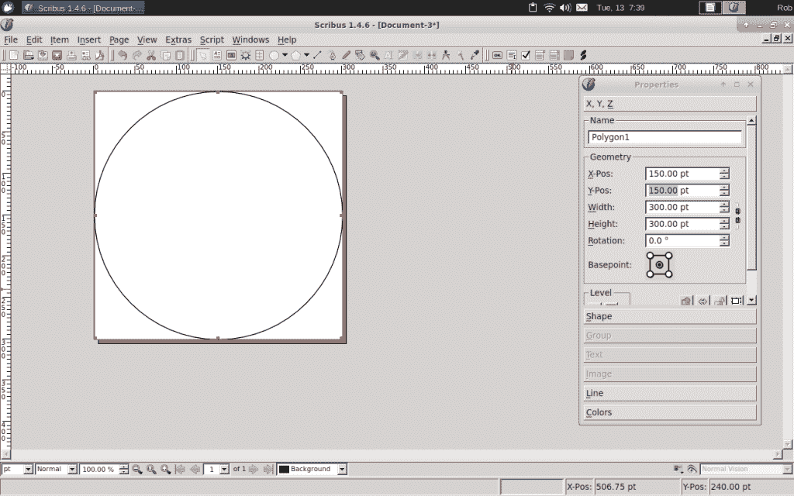
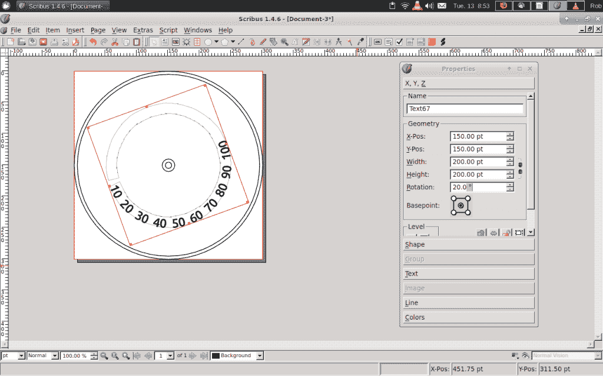

# 现成的黑客:用图形程序绘制模拟仪表

> 原文：<https://thenewstack.io/off-shelf-hacker-draw-analog-gauges-graphics-program/>

不久前，我用一张照片介绍了[构建屏幕模拟仪表](https://thenewstack.io/off-shelf-hacker-give-screen-gauges-new-face/)。我们还看了一个又快又脏的手绘版。用图形程序生成仪表面怎么样？这就是我们今天的话题。

## 位图还是矢量？

两种通用类型的编辑器通常用于创建图形。

位图编辑器如 [Gimp](https://www.gimp.org/) 处理像素。一个点可能是一个像素。一条线是一串像素。圆形、正方形和填充的空间只是改变画出的像素数量和它们的方向来形成形状。把像素想象成颜料或墨水。

关于位图图像，需要记住的重要一点是，就位置或长度而言，像素之间没有任何关系。一行像素在视觉上只是一条线，当你画它的时候。一旦你画好了这条线，你就不能再回头编辑这条线了。您可以擦除或更改线条中单个像素的颜色，但不能抓住线条的一端将其拉长。

要拉伸线条、改变圆圈大小或修改形状，你需要一个矢量编辑器。

像 [Scribus](https://www.scribus.net/) 这样的矢量编辑器处理图形元素:线条、圆圈、方框、文本等等。

想让一条线变长？突出显示该线，抓住一端并将其移动到新位置。很快，队伍变长了。你可以用一个圆做同样的事情。选择圆，抓取一个参考点(在圆上)并移动它，使圆变大或变小。释放鼠标按钮，圆将采用新的大小。

我用一个位图编辑器对照片进行润色、旋转和调整大小。它可以很好地为. jpeg 图片添加一行文本，然后将图片导出为另一种格式，如. png。GIMP 是我 Galaxy 8 手机上现成的黑客图形的位图编辑器。

## 矢量编辑器用于可重复使用的工作

Vector 无疑是图形的一种方式，它将包含您想要修改的“元素”。Scribus 可以在大多数 Linux 系统上工作，包括 Raspberry Pi，并且很容易用 apt-get 安装。

```
pi%  apt-get install scribus

```

从命令行启动 Scribus。

你还需要[处理](https://processing.org)，一种面向艺术家和非技术人员的类 C 语言，特别关注图形特性的易用性。它的集成开发环境(IDE)与 Arduino IDE 完全相同，并共享许多相同的结构和功能。支持可视化界面和与通用输入输出(GPIO)引脚交互的库使 Processing 成为 Raspberry Pi 项目的理想语言。如果你知道 Arduino 环境，你可以使用处理。

要画基本的标准圆，你需要在 Scribus 上画一块画布。单击“文件”->“新建”开始绘制新图形。绘图的大小应该与您的处理脚本图形窗口大小相匹配。在我的例子中，我使用 300 x 300 像素(点)，因为这个尺寸的窗口非常适合我的会议徽章的 3.5 英寸彩色液晶显示器。



Scribus 创建新的绘图屏幕。

将四个边距值从默认值 40.0 更改为 0。另外，将宽度和高度更改为 300。按回车键创建新的画布。

### 画圆

我们需要几个同心圆作为我们的量规。

使用主下拉菜单上的插入->插入形状->默认形状->圆形，然后单击并拖动鼠标指针在画布上生成一个圆形。右键单击圆圈，打开属性菜单。将基点图标从左上角更改为中心。这将设置用于形状的参考点。我喜欢用圆心做参照物。

接下来，将 X-pos 和 Y-pos 值更改为 150，这将使圆在画布上居中。将高度和宽度更改为 300，以反映圆的大小。现在应该有一个以画布为中心的完美的 300 点圆。

再画三个圆，这次宽度和高度分别是 290，200 和 10。通过复制和粘贴，然后修改大小和位置值，你可以很容易地创建新的圆。这也更快，因为复制的圆的原点与原始圆的原点相同。只需改变尺寸参数。

使用属性菜单上的线条下拉菜单更改线条的粗细和类型。粗线和/或虚线非常适合仪表的外带。



创建圆圈

请记住，刻度盘指针将围绕仪表的枢轴点旋转，因此最好从中心点引用所有内容。现在是时候弯曲圆圈周围的仪表值，并开始使绘图看起来像一个真正的仪表。

### 圆形路径上的文本

使用 Insert -> Insert Text Frame 在画布上指向并拖动一个框。在框内双击并输入 10 到 100，以 10 为增量，中间用两个空格隔开。如果文本在框内换行，不用担心。

单击文本框，在按住 Shift 键的同时，单击大小为 200 的圆。转到项目下拉菜单，选择将文本附加到路径。文本应该环绕圆圈。如果文本上下颠倒，使用水平翻转或垂直翻转(浅蓝色图标)将其置于正确的方向。



将文本环绕一个圆圈

如果仪表编号不在正确的位置，请更改旋转值以围绕中心旋转编号。您可能必须调整仪表值和旋转角度之间的间距，以使一切看起来都很好。

但是等等。如果我想让数字变大或者使用某种杀手字体呢？

只需右击文本，然后选择编辑文本菜单项，打开文本编辑器窗口。在这里你可以修改各种各样的东西，比如字体、文本大小、文本间距、阴影等等。

这位编辑的一个疯狂的怪癖是坚持修改。假设您想要更改字体大小。突出显示要更改的字体。然后，向右上方突出显示/更改尺寸值。按 return 键在编辑器中设置值。最后，单击绿色复选标记将文本更新为新的大小。编辑器窗口将关闭，文本将立即跳转到新的大小。如果你不利用这个过程来改变，你会揪着自己的头发想知道为什么它从来没有正确地工作过。

您可以调整文本大小、数值间距、翻转、旋转和字体，让文本看起来像您喜欢的样子。

您也可以添加线条作为刻度线，改变其长度和旋转方向，使其环绕表盘。

完成所有工作后，将文件导出为. png 文件，并复制它以用于您的处理脚本。

### 下一步是什么

Scribus 有点古怪。通过实践，它成为一个伟大的矢量图形编辑器。我在构建“模板”图形时使用它。一旦你有了一个基本的标尺，就很容易复制和改变图形元素，它们的值或位置来构建有趣的主题变化。这当然也有助于工作流程。

<svg xmlns:xlink="http://www.w3.org/1999/xlink" viewBox="0 0 68 31" version="1.1"><title>Group</title> <desc>Created with Sketch.</desc></svg>