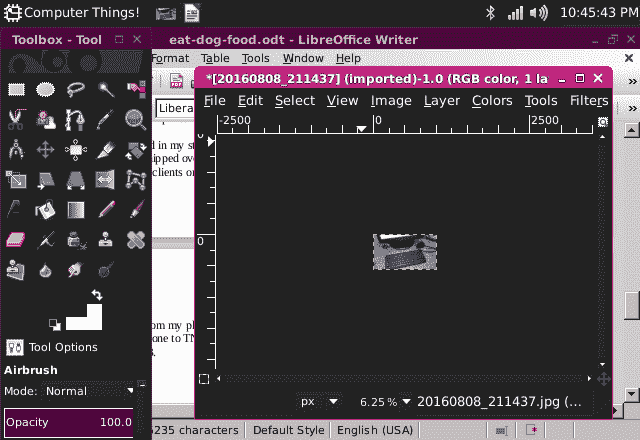

# 现成的黑客:这个故事是在一台 9 美元的 Linux 计算机上编写的

> 原文：<https://thenewstack.io/off-shelf-hacker-eat-dog-food/>

我们都听说过这句话“[吃自己的狗粮](http://www.investopedia.com/terms/e/eatyourowndogfood.asp)”

这句话背后的意思是，你实际上在使用你所创造的产品和服务。这对硬件、软件和商务人士来说都是很好的建议。

这也适用于像我这样的老科技专栏作家。我应该生活在我所写的技术、小工具和软件中。

几周前，我们回顾了[芯片计算机](https://getchip.com/)。这一次，我们将经历在一台芯片计算机上写一个 TNS [现成黑客](/tag/off-the-shelf-hacker/)故事的过程。

我就说说我喜欢的，指出粗糙的地方。请记住，这是一台 9 美元的基于 Linux 的电脑。虽然你不应该把芯片误认为玩具，但它的功能肯定是有限的。你现在正在阅读校样，因为所有的拷贝、上传到 TNS 内容管理器的过程以及图形编辑都是在芯片上完成的。只比平时多花了一点时间。随着技术的成熟，我肯定会考虑使用 nano-Linux 主板，构建一个电池供电的笔记本电脑。

关键是，在 Linux 和物理计算世界中，完整的亚信用卡大小的计算机主板是一个巨大的、积极的趋势。而且，情况越来越好。

我说过我上辈子是只狗吗？

让我们大吃一顿吧。

## 饲料碗里有什么？

本周的装置包括以下内容:

*   芯片计算机板
*   罗技 K400r 无线键盘/鼠标垫
*   5 伏 2 安培壁式电源插座
*   5 年前的 19 英寸 LG 液晶电视
*   三星 Galaxy S5 有源超级电话

有一条小小的音频-视频电缆，用于将芯片连接到电视上的复合视频输入，包含在芯片盒中。

对于这个项目，我只是让芯片通过电缆挂在电视的背面。机器启动后不久，您可以点击 WiFi 图标连接到您的局域网。记住，芯片内置了 WiFi 和蓝牙。

从最新版本的软件开始总是一个好主意，所以我一打开芯片盒就确保一切都是最新的。回想一下这两个命令:

```
chip%  sudo apt-get update
chip%  sudo apt-get upgrade

```

下载并安装所有应用程序需要几分钟时间。我喜欢芯片的一点是它没有微型 SD 卡。Linux 存在于板上的闪存中。太棒了。

芯片桌面上捆绑了一个 Abiword ，如果你愿意，你可以用它来写故事。我更喜欢使用 [LibreOffice](https://www.libreoffice.org/download/libreoffice-fresh/) ，所以用 **apt-get** 添加它是一个简单的任务。

```
chip%  sudo apt-get install libreoffice

```

安装这个程序只需要几分钟，然后它就会出现在主菜单中。

像许多网站一样，TNS 使用 WordPress 作为它的内容管理器，所以需要一个网络浏览器来访问。冰鼬很好地完成了这项任务。

## 舔食食物

启动 LibreOffice Writer 只需要大约 20 秒。我们只有 512 兆的内存。真的不算太坏。

我喜欢在 Writer 中创作故事的一个重要原因是撤销功能，以及即使我没有连接到互联网也能继续写作的能力。如果需要的话，Writer 可以让我撤销很多修改。在线编辑器的撤销功能通常要有限得多。

我通常在 Writer 中离线撰写一整篇文章，然后使用浏览器将文本复制并粘贴到内容管理器屏幕上。文字调整、最终编辑、链接、插入图片和手动添加的专业 HTML 代码都是在 WordPress 中完成的，就在我提交文章发布之前。

这个故事就是根据那个公式，从我的局域网连接芯片上传的。

使用 Writer 和 Iceweasel 浏览器有点笨拙。复合视频模式以大约 480 x 320 的分辨率运行。菜单和状态行占据了屏幕的大部分，因此只有几十行可用于编写文本，这取决于缩放设置和字体大小。如果你打算将芯片用于生产工作，耐心和实践是关键词。

冰鼬比作家更古怪一点。浏览器的屏幕分辨率使浏览现代网站变得“有趣”。就拿[苦力报告](http://drudgereport.com/)来说吧。它的页面上有大量带链接的广告，尽管主要内容大多只是文本和链接。许多链接是动画的，这意味着大量数据流入和流出我的浏览器。页面的某些部分几乎是持续更新的。一个不好的影响是，当你向下滚动页面时，它有时会刷新一些东西，你会被推回到顶部。

这个故事的寓意是，你在芯片上浏览网页的里程数可能会让你的耐心受到一点考验。尽管如此，它的工作和它相当稳定。

WordPress 在 Iceweasel 浏览器上并不太差，尽管分辨率肯定比在我的 14 英寸 1280 x 800 分辨率的华硕笔记本屏幕上编辑故事更麻烦。

## 出去追汽车

我的故事中使用的图形是用我的三星 Galaxy S5 拍摄的。然后我用电子邮件把照片传到我的华硕笔记本上。我基本上是给自己发照片，因为我在安卓手机和笔记本上都有邮件客户端。

我不打算在芯片上运行邮件客户端，所以从我的手机上获取照片是一次真正的冒险。

在我看来，在 Linux 机器上传输文件最简单的方法是在终端中使用 **scp** 命令。接下来，最好的解决方案是设置一个 FTP 客户端。

在安卓手机上，这两种方案都既复杂又乏味。大拇指在可怕的长文件名，包括所有荒谬的 Android 目录，只是平原发臭。我在桌子上敲了一会儿头，试图在休息和重组之前让它在网络上工作。

然后，100 瓦的 LED 灯在我头顶上亮起，把我的毛都点着了。

使用蓝牙。

我点击了桌面右上角的蓝牙图标，迅速将芯片与 Galaxy 配对。然后，在大约 60 秒内，很容易将键盘、显示器和主板的 6.0 MB 文件从手机发送到芯片。是的，蓝牙相当慢。事实证明，这是一种方便简单的移动文件的方法。我很高兴 [Next Thing Company](https://en.m.wikipedia.org/wiki/Next_Thing_Co.) 在芯片上捆绑了 WiFi 和蓝牙。

一旦文件被安全转移，我就用 [GIMP](https://www.gimp.org/) 编辑照片。

```
chip%  sudo apt-get install gimp

```

通常，我所要做的就是将图形的大小调整到合理的 1024 x 576，或者将其导出为. png 文件。我总是使用 9 倍的压缩率，这样文件大约 1.2 MB，更容易管理。这个尺寸提供了很好的分辨率，上传到 WordPress 不需要很长时间。



运行在芯片上的 GIMP 和 LibreOffice Writer。

## **埋骨**

现在，您已经非常简要地了解了如何将现成的黑客故事放到新的堆栈中。

这种芯片非常便宜，每包 9 美元。你在宠物店是买不到的。许多功能，如你所见，可以作为生产机器。虽然它不是狼群中跑得最快的小狗，但它确实需要尊重。

我很想看看 Fido，Spike 或 Tater 板是什么样子的。

<svg xmlns:xlink="http://www.w3.org/1999/xlink" viewBox="0 0 68 31" version="1.1"><title>Group</title> <desc>Created with Sketch.</desc></svg>