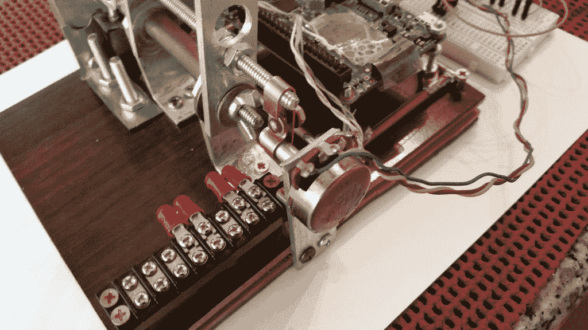
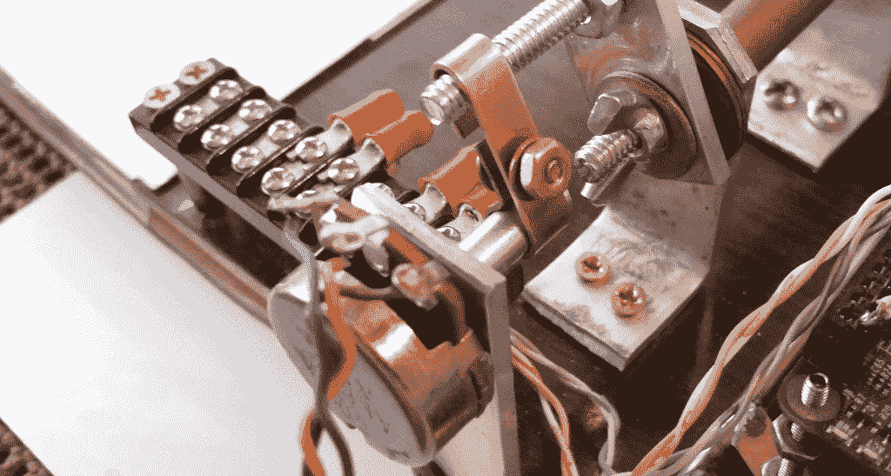

# 现成的黑客:利用位置反馈增强电机控制

> 原文：<https://thenewstack.io/off-shelf-hacker-enhance-motor-control-potentiometers/>

本周，我们将通过讨论使用电位计的基本位置反馈来结束我们关于为您的项目添加运动的系列。我们还将了解开始按钮和紧急停止等控件。最后，我们将讨论在项目中使用电机/驱动器设置还可以做些什么。

为了回顾(见[第 1 部分](https://thenewstack.io/off-shelf-hacker-add-motion-project/)和[第 2 部分](https://thenewstack.io/off-the-shelf-hacker-what-it-takes-to-lift-a-robotic-arm/)，我在我的[蒸汽朋克演示机](https://thenewstack.io/hacking-hardware-the-never-ending-saga-of-steampunk-name-badge-development/)上用螺栓将一个小马达/变速箱固定到相机臂上。该臂只是一组铝制连杆，在底部旋转，允许定位被黑掉的罗技网络摄像头，以便我可以在投影仪屏幕上显示小部分。在树莓 Pi 上运行的 [guvcview 程序](http://guvcview.sourceforge.net/)被用作连接到摄像机的视频程序。

我只是简单地将电源连接到电机驱动器，并将 Arduino 插入 USB 端口，以使电机移动。我编了一个基于时间的程序来来回回循环马达。

首先，让我们讨论如何确定手臂的位置。我们需要知道我们从哪里开始，对吗？

## 位置反馈

我选择使用连接到手臂的电位计来捕捉手臂的位置，如图所示:



用黄铜链连接到臂上的电位计

当臂摆动时，它旋转电位计，该值可以用模拟引脚读取:



连接到手臂的电位计特写

实现这个魔术的代码在 void()循环的底部:

```
int CH1A  =  5; // CH1A, CH1B, CH2A, and CH2B 
int CH1B  =  6; // must be one of 3, 5, 6, 9, 10, or 11 for PWM

int sensorPin  =  A0;
int sensorValue  =  0;

void motorA_forward(int sp)
{
  analogWrite(CH1A,sp);  
  analogWrite(CH1B,0);
}
void motorA_backward(int sp)
{
  analogWrite(CH1A,0);
  analogWrite(CH1B,sp);
}

void setup()
{

  Serial.begin(9600);
  while  (!Serial)  {
    ;  // wait for serial port to connect. Needed for native USB port only
  }
}

void loop()
{
 sensorValue  =  analogRead(sensorPin);
 Serial.println(sensorValue);

 if  (sensorValue  below  250");
      motorA_forward(250);    
 }
}

```

我们所做的只是在电位计连接的输入引脚(A0)上使用一个模拟读数，并将该值分配给一个变量(传感器值)。然后，我们检查变量值，当输入低于设定值时，使电机向前运行。如果输入超过该值，电机停止。10 位输入引脚将在 0 到 5 伏之间从 0 映射到 1023。

我的特殊电位计是 10K 欧姆模型，线性锥形。它的质量有点低，因为你可以把它转大约 20 度，然后它就变成零了。旋转的另一端也是一样。它在到达停止点之前记录 1023 在 10 和 20 度之间。这些是构建硬件时需要考虑的实际问题。

而且，在您构建、测试和分析您的设计之前，没有办法确定这些事情。记住，如果需要，快速失败并重新路由。

这是一个简单的例子，只是为了展示位置跟踪和反馈的一般概念。

自然，这种位置控制方法存在挑战。惯性是一个问题。一旦臂开始移动，需要很短的时间才能完全停止，尤其是在有变速箱的情况下。达到规定值后，电位计可能会继续改变其值。例如，我们可以使用 250 作为停止点，但当手臂实际上停止移动时，该值可能会继续变化，直到 257。如果你想移动马达到特定的位置，你必须设计一些代码来解释“超限值”。

另一件要考虑的事情是，当你检查模拟值时，你也在用 motorA_forward 和 motorA_backward 函数命令电机移动。可能有些情况下，这个过程不够快，你必须使用一个中断程序，以获得电位计的精确值和移动电机。

你也可以考虑用编码器代替电位计，来测量手臂的角度并提供位置反馈。

你可能已经注意到没有电源，停止或启动按钮。嗯，这是一个绝对最低可行的项目。让我们来讨论一下。

## 所有人停下来，启动电源，开始

习惯和安全的做法是，给设备加电，然后让它呆在那里，直到你准备好让它移动。

所有东西最终都有一个电源按钮。电源按钮通常将电源的正极连接到设备中的电机、led、微控制器和其他部件。没有力量，没有运动或行动。

很多时候，机器人有一个所谓的紧急停止按钮。这可能是一个硬连线电源开关，在给机器人供电之前，您可以“启动”(将其拉至向上位置)。我们都在加油站和工厂机器上看到过那些红色的工业用“停止”按钮。点击它，电源被切断，立即停止机器。

紧急制动也用在机器人上。这是一种实用的方法，可以保护人们免受意外机器人运动的影响，或者防止事情失控。我记得工厂车间里的一个大型辛辛那提 Milicron 机器人将 30 磅重的炮弹装载到一个工具架上。这东西有 10 英尺高，移动速度非常快。你肯定不想妨碍那个怪物。它有几个关键位置的紧急停止按钮和一个大的金属围栏。

所以要小心停止和电源按钮。开始按钮稍微复杂一点。

你需要在数字输入引脚和地之间连接一个电阻(大约 10K 欧姆)。数字引脚还将连接按钮的一侧，按钮的另一侧连接到+5 伏。这是阅读按钮的标准排列。

然后，在代码中，您只需观察按钮的值从低到高的变化。当这种情况发生时，按下按钮，你就可以开始执行你的电机控制代码。

限位开关用于阻止机械装置撞击其物理挡块。有了臂，你可以将一个限位开关放在向前的物理行程极限附近，将另一个放在向后的行程极限附近。然后你可以使用按钮检测代码来停止电机运动，如果手臂曾经远到触发限位开关。我有几个磁簧开关和一个磁铁，可以让我检测车库门行程的上限和下限。你可以用按钮、微动开关、簧片开关等等。

## 增强功能和可能性

我们刚刚触及了机器人和微控制器自动化的一些基础知识。

我在想，也许可以在我的蒸汽朋克演示机相机臂的上部关节上增加第二个马达，以便能够将相机精确地定位在展示平台上的一个物体上。电机可以连接到现有电机控制器上的第二个通道，我必须添加另一个电位计，以跟踪第二个机械臂的位置。

我的另一个想法是把演示机器放在一个有趣的蒸汽朋克主题的盒子里。当我打开盖子时，它会触动一个开关，使钻机上升并转换到“展示”位置。限位开关会在正确的高度停止电机。然后，我可能会用一个按钮来命令机器缩回盒子里，并关闭整个装置。

你会建议哪些改进？

<svg xmlns:xlink="http://www.w3.org/1999/xlink" viewBox="0 0 68 31" version="1.1"><title>Group</title> <desc>Created with Sketch.</desc></svg>