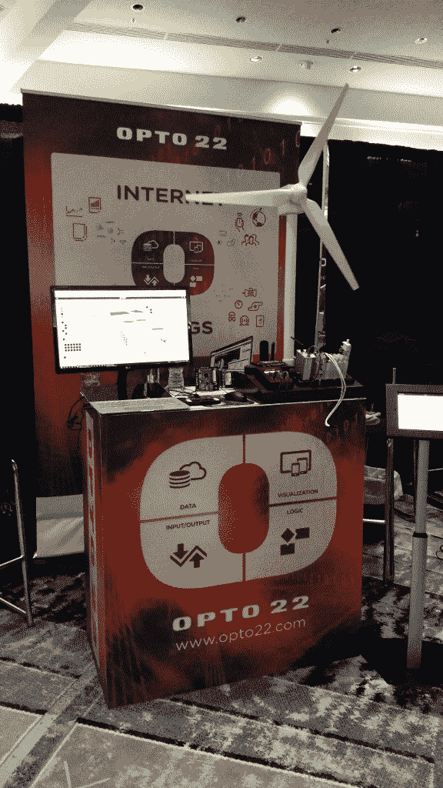

# 现成的黑客:探索波特兰嵌入式 Linux 会议

> 原文：<https://thenewstack.io/off-shelf-hacker-exploring-embedded-linux-portland/>

波特兰最大的好处之一就是从机场去参加会议非常方便。只需在机场跳上红线轻轨，在先锋广场下车，费用为 2.50 美元，行程时间约 30 分钟。

我了解到这一点是因为本周早些时候，你的真命天子参加了在波特兰希尔顿市中心举行的嵌入式 Linux 会议。该活动吸引了大约 800 名与会者，他们一起接受了几天的教育、启发和合作。大约有 24 家厂商有展位，包括英特尔、Yocto Project、Linaro、微软、SuSE 等。

会议由 [Linux 基金会](https://www.linuxfoundation.org/)主办。他们还赞助了负责监督 Linux 内核开发的 [Linux Torvalds](https://en.wikipedia.org/wiki/Linus_Torvalds) 的工作。Linux 基金会支付了我这次旅行的旅费和住宿费。

对我来说，与其他与会者互动总是一种享受，这是硬件、软件和各种开发人员的完美结合。有几个人提到他们读了我的“[现成黑客](/tag/off-the-shelf-hacker/)”专栏，很棒。人们似乎很喜欢我把芯片或 ESP8266 模块交给他们的可靠技术，以打破对话的僵局*(编者注:如果你碰巧遇到 Torq 博士，请他演示这一策略)。*

## 主题演讲亮点

在周二的头条主题演讲中，Torvalds 接受了 VMware 首席开源官 Dirk Hohndel 的采访。

托沃兹似乎对 Linux 的现状很满意。我收到的主要信息是，Linux 内核将继续留在一个可预测的，“通用”操作系统的道路上。内核开发和发布已经成熟到平稳运行，没有了早年疯狂的消防演习。新功能必须能够安全地集成到系统中，而不会对外围区域造成重大破坏。这仍然是一项巨大的工作。

周三上午，康奈尔大学的长期机器人专家盖伊·霍夫曼(Guy Hoffmann)发表了一篇关于社交机器人伴侣的新兴智能家居界面的演讲。这些机器人使用动作和手势来挖掘人类自然的日常情感。他开发了能够解读人类肢体语言或行为的机器人，并能即时调整其反应。

霍夫曼说，在即将到来的智能家居环境中，肢体语言将成为机器人体验的关键部分，有助于避免情绪平衡的破坏。

## 在后台

我和汽车技术 Linux 基金会经理 Dan Cauchy 谈了他的项目[汽车级 Linux](https://www.automotivelinux.org/) (AGL)。

AGL 专注于为汽车应用程序定制 Linux，因此汽车制造商不必从头开始构建汽车操作系统。目前，它专注于车载 Linux 系统的娱乐和导航功能。柯西计划在未来某个时候进军自动驾驶等其他领域。

AGL 将使 80%的制造商拥有一个标准化和强大的操作系统。然后，他们可以编写自己的代码或使用第三方供应商来填充他们的产品和服务系列。目前共有 91 家公司加入了 AGL 联盟，包括丰田、本田、日产、福特、奔驰等行业巨头。

使用 AGL 可以帮助公司降低开发和产品成本。例如，今天的仪表组有自己的微控制器来捕获来自传感器或其他车载计算机的数据，AGL 可能会将所有数据纳入一个漂亮的 GUI，并通过 HDMI 将仪表显示输出到彩色 LCD。触摸屏也将使用 AGL 的标准接口。这样就不需要为组合仪表配备单独的微控制器。

## 说什么？

在会议的其他地方，[工程服务公司 PTR Group 的首席技术官兼首席科学家 Mike Anderson](https://www.linkedin.com/in/mikeandersonptr/) ，给出了一个在 Linux 下运行[亚马逊 Alexa](https://developer.amazon.com/alexa) 的有趣概述。安德森规划了步骤，类似于我最近写的一个故事。他用了一个小喙骨而不是树莓酱。他指出，让这项服务在一台小型单板计算机上运行需要很多步骤，尽管一旦设置好就相当可靠。

另一个有趣的分组会议由图形数据库公司 [Neo4j](https://neo4j.com/) 的开发者关系工程师 [Will Lyon](https://twitter.com/lyonwj) 主持，主题是图形数据库。Lyon 根本没有深入研究嵌入式硬件。相反，他指出，你需要能够从大量数据中提取价值，这些数据不仅来自边缘物联网设备，还来自云中的大数据。这是图形数据库的工作。使用众所周知的匹配和查询技术，图形数据库可以用来找到解释行为的模式，并创建有趣的 mashups，人们可以用它来调整系统、更改操作和优化流程。你可能会说这是物联网遇到大数据的地方。

## 在展示厅

从现成黑客的角度来看，我对展厅中的一家供应商 [Opto22](http://www.opto22.com/) 特别感兴趣。

2017 年嵌入式 Linux 大会上的 Opto22 展台

Opto22 销售工业控制模块。其长期运行的产品之一是控制器总线板，您可以在其中插入各种输入和输出模块。它们是标准模块，类似于旧的[艾伦-布拉德利](http://ab.rockwellautomation.com/)可编程逻辑控制器中提供的模块，用于需要打开小型电机或某种输出设备或使用继电器模块的工作。

一个 Opto22 模块可能价值 10 美元，只需插入总线板即可。Opto22 还有一个工业加固的控制器，与总线板和模块配套。

该公司已经将数百万个这样的输入/输出点(模块)放到了现场。这些模块控制着世界各地的部分电网、水坝、制造过程和一次性工业控制工作。棒球内幕(提示，提示):许多模块都可以在易贝上获得和使用。

这些模块很酷的一点是，它们有一个 Raspberry Pi 分线板，可以与总线板和输入/输出模块一起工作。

现在，当然，Pi 并不完全是你所说的真正的工业力量，只要能够把它放在生产制造车间就行。车间控制器必须能够承受强大的电场和磁场、物理振动和冲击，更不用说极端的温度、湿度和其他环境因素。

因此，这个分线板是为那些想要使用普通的基于 Linux 的工具来探索 Linux 单板计算机是否能满足他们的控制要求的客户准备的。总线板被设置为 Pi 上 GPIO 引脚的扩展。例如，程序可以用 C 或 Python 编写。如果你想走可视化编程的道路，Octo22 也有一个红色的节点实现。看看它的[树莓派套装](http://info.opto22.com/raspberry-pi-io)。

我还想提一下， [warpx.io](http://warpx.io/) 。该公司出售一种可穿戴/物联网嵌入式平台，大小约为一根口香糖。它运行 1GHz ARM 芯片，512MB 内存，4GB 闪存，WiFi 和蓝牙。它还支持 Yocto 嵌入式 Linux 发行版。

warpx.io 的一名代表说，它使用类似手机的制造技术，将这种处理能力放入这样一个小封装中。当然，通过开发人员适配器板或定制子板，可以访问通用输入/输出引脚、UART、SPI 和 I2C 连接。

我正在为一个现成的黑客[审查而努力得到这些坏小子中的一个。](/tag/off-the-shelf-hacker/)

## 包裹

所以，这是我在嵌入式 Linux 会议上看到的一些事情的一个快速快照。与会者和演讲者都很有才华。小贩们知识渊博，也很有趣。而且，场地也很棒。幻灯片、bios 和概述可在[网站](http://events.linuxfoundation.org/events/embedded-linux-conference)上获得。对于未来的 OTSH 文章，我计划扩展一些会议衍生的主题，并根据供应商的反应做一些回顾。

我肯定会把这个会议放在明年的名单上。

<svg xmlns:xlink="http://www.w3.org/1999/xlink" viewBox="0 0 68 31" version="1.1"><title>Group</title> <desc>Created with Sketch.</desc></svg>