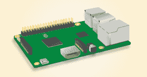

# 现成的黑客:未来如此光明，你将需要一个焊接头盔

> 原文：<https://thenewstack.io/off-shelf-hacker-futures-bright-youll-need-welding-helmet/>

今年，硬件、服务和正能量的完美结合带给了由制造商和自己动手者组成的现成黑客社区。

【T2

随着[树莓 Pi model 3](https://www.raspberrypi.org/products/raspberry-pi-3-model-b/) 和芯片电脑的推出，我们已经看到 WiFi 最终成为主流连接模式。这两个模块都在板上集成了 WiFi 802.11n 和蓝牙无线电。这些模块很小，很容易集成到电池供电的小尺寸可穿戴项目中。两者都运行 Linux，所以在您寻求物理计算世界的统治地位时，有大量的语言和应用程序可供选择。

“Arduino 符合 WiFi”设备，如 ESP8266 也在 2016 年进入了自己的领域。只需连接你的传感器，刻录固件，你的项目就可以连接到你的局域网了。对于这种功能，每个部件 3 到 4 美元，很难抱怨成本。我是否提到过您可以从 Arduino IDE 对 8266 进行编程，并且可以充当它们自己的接入点(AP)？你会建造什么？

即使是 [BeagleBone Black](https://beagleboard.org/black-wireless) 也加入了无线淘金热，尽管 69 美元的价格标签明显比其他微控制器板贵得多。请记住，Bone 上还有两个可编程实时单元(pru ),它们本质上是高速输入/输出设备，通过共享内存与主处理器(运行 Linux)集成在一起。非常适合机器人应用。

物理计算创新不仅限于硬件。服务已经准备好让现成的黑客大展拳脚。

## 2017 年值得关注的现成黑客趋势

### 蜂窝物联网

我考虑将蜂窝连接用于物联网项目已经有一段时间了。几年前，我甚至花了大约 100 美元买了一个蜂窝调制解调器。那时候买不到 SIM 卡，只是为了数据。2016 年早些时候，美国电话电报公司给我发了一些卡，这些卡适用于低费率/低流量数据计划。我和他们玩了一会儿，尽管将调制解调器集成到一个项目中被证明是一个挑战，因为电源和我不断变化的项目重点，或者说缺乏。最后也没怎么用。

然而，运营商意识到 DIY 用户和开发者需要“数据”账户的事实令人鼓舞。为什么您要支付零售或长期计划价格来连接小型、可能是一次性的设备，这些设备一次发送/接收几千字节甚至几兆字节的数据？

好悲伤，我的家庭手机计划每月提供 18GB 的数据。是的，令人难以置信的是，我们通常会碰到数据限制。这与几年前的有线互联网数据量相当。

有趣的是，供应商也开始参与进来。[粒子](http://www.particle.io)提供了一种支持蜂窝的微控制器，称为[电子](http://www.particle.io/products/hardware/electron-cellular-dev-kit)，可能会满足你的需求。该公司甚至有自己的[数据计划](http://www.particle.io/pricing)。

随着蜂窝调制解调器的价格不断下降，我预计“纯数据”计划以及适用于小型无处不在的计算系统的硬件将会增加，这些系统使用蜂窝网络连接到互联网。

## 即将到来的语音识别革命

今年，很多人似乎都在使用谷歌主页(130 美元)和亚马逊回声(180 美元)。这些东西监听关键词，然后根据你说的话采取行动。它可以是一个问题，比如“旧金山的天气如何？”或者一个命令，比如“关掉厨房的灯”这些单词被数字化，然后在相应的云中进行分析，然后返回答案(以令人愉快的声音)或执行请求的操作。这一切都发生在眨眼之间。一位长期的同事，Steven J. Vaughan-Nichols 在 ZDNet 上有一篇很好的对比文章，解释了他使用这两种设备的经历。

我认为我们看到的是语音识别革命的开始。将应用程序接口(API)应用到这些服务需要一段时间。不要忘记，谷歌和亚马逊是直接的竞争对手，在这个特定的领域一决雌雄。对于物理计算项目的后端连接，行业标准化可能还很遥远。

不管怎样，语音识别仓库的门是开着的，所有的虚拟马力都在外面游荡。TNS 出版商提出了通过 Echo 或 Dot 使用 Alexa(亚马逊的个人助理)来控制一些现成的黑客项目的想法，因此我们可能会在不远的将来调查这一趋势。

永远在线的内部语音识别系统会成为我们的虚拟仆人，耐心地等待我们的每一个召唤吗？现成的黑客还需要多长时间才能轻松进入这种新模式？我认为我们将在 2017 年看到重大变化。

### 不断扩大的供应商领域

需要零件吗？打开你的浏览器，找到一个供应商，下订单，几天后，零件就会出现在你的邮箱里。对我来说，2016 年最大的趋势是容易获得的现成组件的扩展。你可以不费吹灰之力得到你能想象到的任何东西。

例如，我需要一个小型低压传感器用于我的遥测工作。邦古德花了不到 4 美元买了三个。而且，运输是免费的。一两年前，你不容易做到这一点。

昨天，我在看负荷传感器。亚马逊有一个[重达 110 磅。售价 23 美元](https://www.amazon.com/dp/B00XBNS26C?psc=1)。它需要一个放大器来连接传感器和你的 Arduino 或 Raspberry Pi，尽管它们两个售价 9 美元。通过一套合适的杠杆，我们可以直接测量数千磅的力，或者用这个装置测量轴上的扭矩。也许是时候订购零件，开始研制那台发动机[测功机](http://www.setra.com/blog/test-and-measurement-dynamometer)了，这是我过去 20 年来一直在思考的事情。

你可能需要的任何现成零件，现在都可以买到。我预计库存会增加，成本会下降，供应商会为你的订单提供更好的交易。MCM 每隔一天给我发一封电子邮件“传单”，里面有各种很酷的小工具、设备和零件。

## 这是最美好的一天

对于现成的黑客来说，这是历史上最伟大的时代。

2017 年将会变得更加美好。确保访问所有正常的黑客渠道，如[黑客新闻](https://news.ycombinator.com/news)、[黑客日](http://hackaday.com)、[指导](http://www.instructables.com/)和 [Adafruit](https://www.adafruit.com/) 来获得新的项目创意。

拥抱原力，从过去中学习，大胆进军光明的物理计算未来。

通过 Pixabay 的特征图像。

<svg xmlns:xlink="http://www.w3.org/1999/xlink" viewBox="0 0 68 31" version="1.1"><title>Group</title> <desc>Created with Sketch.</desc></svg>