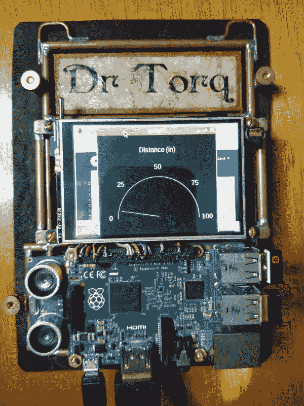
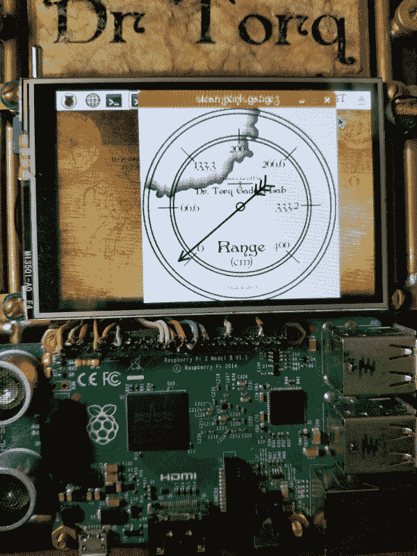
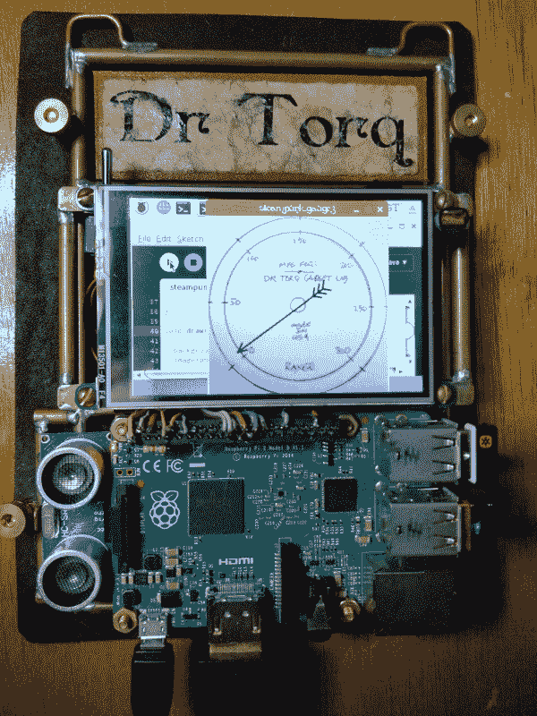

# 现成的黑客:给你的屏幕仪表一个新的面貌

> 原文：<https://thenewstack.io/off-shelf-hacker-give-screen-gauges-new-face/>

有时候灵感就像一道闪电，突如其来。

过去一周，当我思考我为上一个项目《蒸汽朋克会议徽章》制作的屏幕标尺的美学时，情况就是如此。你可能还记得我制作的[相当粗糙的表盘和指针](https://thenewstack.io/off-shelf-hacker-use-processing-build-screen-gauge/)，它从超声波测距仪接收输入，并在仪表上显示到一个物体的距离:



使用处理代码的早期屏幕仪表

很基础很朴素。不仅如此，那个仪表的外观也不太符合蒸汽朋克会议徽章的主题。我们可以做得更好，人们欣赏这种对细节的额外关注。

今天，我们将学习如何在屏幕仪表上放置您想要的任何刻度盘。这项技术适用于可佩戴的液晶显示器和全尺寸显示器。

## 抓住表盘

我没有编写代码来手动定位仪表周围的文本和刻度线，而是决定只显示表盘的图片和旋转指针的代码，这样会容易得多。开发是在我的“第五代”会议徽章上进行的，运行的是 Raspberry Pi 2、[处理 3.0](https://processing.org/) 编程语言和连接到 HDMI 输出的 19 英寸显示器。在 HDMI 监视器上查看代码时，我还使用了处理编程语言的处理 IDE。

我现在可以听到读者说，“哎呀博士，用一张图片来衡量是一个相当明显的废话！”我所能说的是，启蒙以多种形式出现，我的朋友和我都很感激老式的爱迪生白炽灯泡仍然偶尔会亮。

如果简单的话，一个五年级的学生都能做。

处理有几个功能，称为“PImage”、“loadImage”和“Image”，它们是专门为在屏幕上显示图片而设计的。它可以处理 GIF、JPEG 和 PNG 文件。这是 processing.org 参考手册中的一段代码。

```
PImage photo;

void setup()  {
  size(100,  100);
  photo  =  loadImage("laDefense.jpg");
}

void draw()  {
  image(photo,  0,  0);
}

```

屏幕上的“尺寸”线确定了视窗的尺寸。PImage 建立了一个合适的变量。然后“loadImage”函数使用“loadImage”命令指向您想要显示的文件。

最后，执行“image”函数，使用 photo 变量以及 x 和 y 坐标，放置图片。默认情况下，左上角为 0，0。

互联网上有大约一百万个很酷的蒸汽朋克计量器。在谷歌上输入“[蒸汽朋克脸](https://www.google.com/search?q=steampunk+gauge+face&rlz=1C1CHFX_enUS665US665&source=lnms&tbm=isch&sa=X&ved=0ahUKEwidi8HEot3YAhWNTN8KHaX9AzoQ_AUICygC&biw=1366&bih=588)”，点击“图片”标签，你就会找到它们。一定要尊重版权。

如果你有手机摄像头，你也可以抓拍一张真实仪表的照片，并将其整合到你的显示器中。用标尺尽可能多地填充画面，并尽量保持相机与标尺面平行，这样图像就不会失真。

一旦你有了一个合适的测量图，使用你最喜欢的图形编辑器来设置它，使之与你的代码一起工作。这是我用 [Inkscape](https://inkscape.org/en/) 和[GIMP](https://www.gimp.org/)做的一个简单的计量器。注意到咖啡渍了吗？这是一个可以在 GIMP 中应用的过滤器。



用 Inkscape 和 GIMP 制作的仪表

当您对仪表图形感到满意时，请确保裁剪照片以仅显示仪表的正面。然后，在处理代码中缩放图像以匹配窗口大小。仪表将以 300 x 300 像素的分辨率显示在徽章上。

代码如下:

```
/*
 * Steampunk Gauge 
*/

import processing.net.*;

PFont font;
PImage photo;
float  x,  y;
String angle  =  "0";              // angle in degrees
String ivalue  =  "0"; // input value
float gaugeaddangle  =  275.0; // gauge additional angle to max value 
float gaugestartangle  =  135.0; // gauge angle from 3:00 zero position 
float maxinputvalue  =  157.5; // max limit of measurement
float anglef  =  0.0;
float segLength  =  127; // pointer length from center to max point
BufferedReader reader;

void setup()  {

  size(300,  300);      // window size, works with existing pointer, labels
  photo  =  loadImage("/home/pi/hand-drawn-gauge2.png");

  strokeWeight(3); // line weight
  stroke(0,0,0); // line color (RGB)

  x  =  width *  0.5; // needle x origin in middle of window
  y  =  height *  0.5;    // needle y origin in middle of window

  reader  =  createReader("/dev/ttyAMA0");
 // if no gauge, execute stty command in shell first

}

void draw()  {

  background(255); // make background white (255)
  image(photo,0,0);

  try  {
    ivalue  =  reader.readLine();
  }  catch  (IOException  e)  {
    e.printStackTrace();
    ivalue  =  null;
  }
  if  (ivalue  ==  null)  {
    // Stop reading because of an error or file is empty
    noLoop();  
  }

  if  (ivalue  !=  null)  {
    print(ivalue);
    print("\n");
    // anglef = radians(135) + radians(270);
    anglef  =  (radians(gaugestartangle)  +  (float(ivalue)  *  radians(gaugeaddangle/maxinputvalue)));
  }

  pushMatrix();
  segment(x,  y,  anglef);  
  popMatrix();

}

void segment(float  x,  float  y,  float  a)  {
  translate(x,  y);
  rotate(a);
  line(0,  0,  segLength,  0);
  line(segLength-15,  7,  segLength,  0);
  line(segLength-15,  -7,  segLength,  0);
  line(0,  0,  -50,  0);
  line(-30,  0,  -40,  -10);
  line(-30,  0,  -40,  10);
  line(-40,  0,  -50,  -10);
  line(-40,  0,  -50,  10);
  line(-50,  0,  -60,  -10);
  line(-50,  0,  -60,  10);
}

```

注意，我在“photo”函数中使用了文件的完整路径名。图形编辑是在我的 Linux 笔记本上完成的，我使用 rcp 将文件复制到会议徽章上的 Pi 2。您可以将您的拨号文件存储在任何地方，只是将它们复制到 pi 用户的主目录更容易。

你可能还想手绘一个表盘，或者让一位艺术家制作一个非常别致的表盘模型。过程是一样的。用手机拍摄一张好照片，将其发送到您的笔记本，编辑图形，裁剪到仪表轮廓，缩放图像以匹配处理代码窗口大小，将图形导出到. png 文件，并将其作为图形文件发送到 Pi。我通常使用。几乎所有东西的 png 图形文件，包括我放在现成的 Hacker 上的内容。



手绘仪表面

如果你看一下代码，你还会看到我如何转换距离值，从 Arduino/超声波传感器 USB 馈送到仪表指针的角度。在底部的 segment 函数中，您将看到如何为指针的短端构建 fletching。这就是所有的行语句。可能有一种方法可以重写代码，这样整个指针对象就可以通过使用一个指针长度变量来缩放。

请注意，处理以弧度为单位指定角度。我使用 radians()函数将我的起点和角度转换为弧度。此外，输入仅仅是具有从 0 到 157 英寸的值的文本流，这对应于超声波传感器的 0 到 400 厘米的范围。

## 别那些针

尽管有很多步骤，但在我们的屏幕上显示一张冷静的脸并不困难。一旦你这样做了几次，工作流程就简单了，你可以尝试各种有趣的变化。

把屏幕上仪表的概念再往前推一点，我认为让指针围绕仪表疯狂旋转会很有趣，第一次打开仪表时会有几次。这将增加启动程序的戏剧性。在初始旋转之后，仪表指针可以稳定下来，并在接收到输入值时跟踪它们。这可以很容易地用代码来完成。夸张和过分的行为是蒸汽朋克乐趣的一部分。

如果可以的话，在你的项目中添加一些额外的细节。这将使你的工作与众不同。

通过 Pixabay 的特征图像。

<svg xmlns:xlink="http://www.w3.org/1999/xlink" viewBox="0 0 68 31" version="1.1"><title>Group</title> <desc>Created with Sketch.</desc></svg>