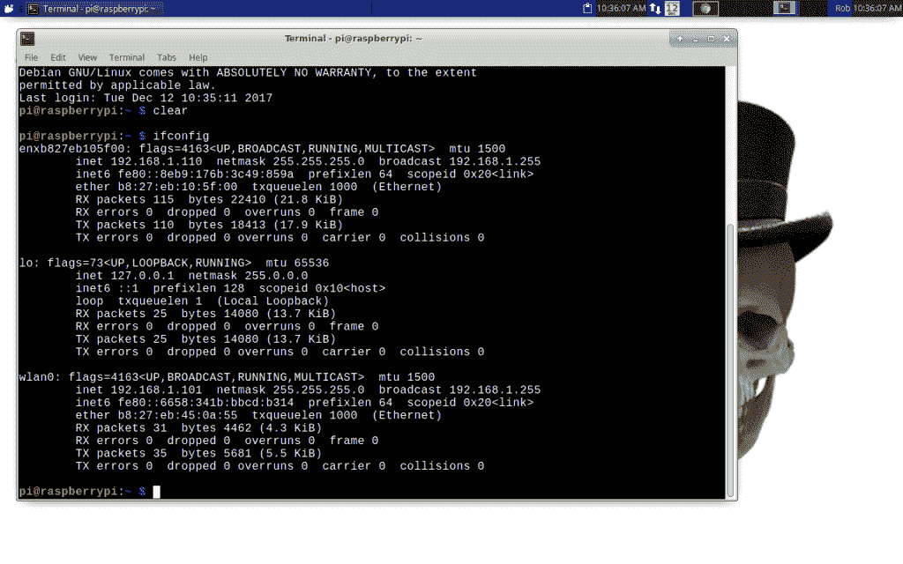
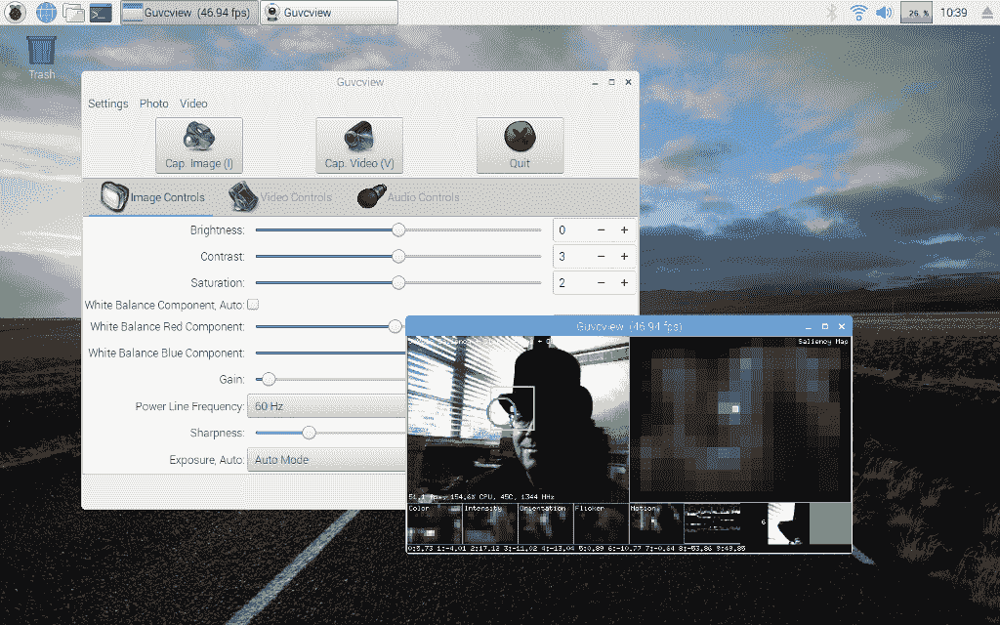
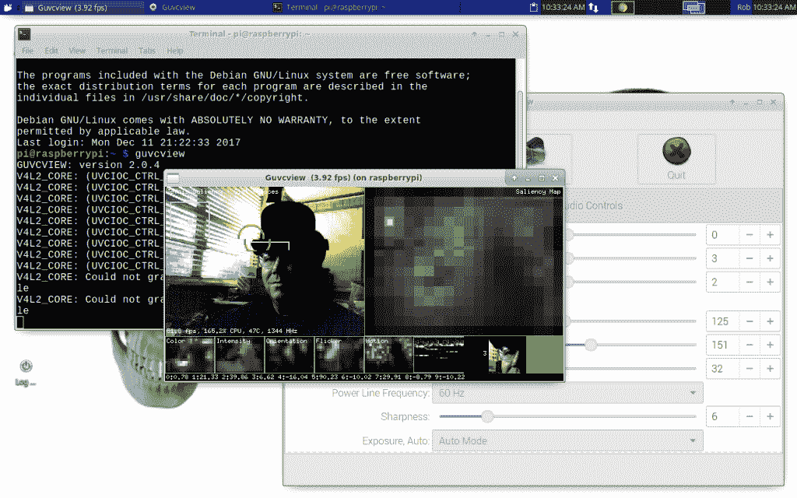

# 现成的黑客:为机器人头骨赫德利创造一个网真人格

> 原文：<https://thenewstack.io/off-shelf-hacker-growing-telepresence-personality-hedley-robotic-skull/>

作为[现成黑客](/tag/off-the-shelf-hacker/)专栏的作者，我的部分工作是尝试看似愚蠢的想法，并将经验传递给读者。这种体验式原型不仅有助于你避免陷入徒劳的兔子洞，还可能从不同的角度激发你的创造力。在发明新产品和服务的混乱世界中，源源不断的新想法和组合是必不可少的。

也就是说，对于我目前正在进行的项目，[机器人头骨](https://thenewstack.io/off-shelf-hacker-hedley-robotic-skull-notices-creator/)，我想探索机器人远程呈现的想法。

## 为什么是机器人头骨远程呈现？

对于普通的老师、路人或孩子来说，将一个树莓派板简单地连接到一个 [JeVois 机器视觉传感器](http://jevois.org/)和一个伺服系统并坐在桌子上会有多令人兴奋？也许不多。吼，哼…哼！

把那些现成的部分放入某种环境中，比如一个塑料万圣节头骨，它会对环境做出反应，人们实际上开始认为它有个性。一个朋友看到[蒸汽朋克眼球](https://thenewstack.io/off-shelf-hacker-behold-steampunk-eyeball-complete-part-5/)在房间里追着我女儿跑，兴奋地喊道:“它喜欢玛格丽特。”


所以，把赫德利和一个网络联系起来，他可能真的会变得有趣。

你可以命令你的机器人仆人在房间的另一边执行你的命令。他可以向其他物理计算设备提供数据。我们将在以后的文章中记住这一点。他还可能利用云中的信息，或者利用高性能人工智能服务器的服务(想想亚马逊 Alexa)。而且，如果赫德利没有连接到显示器上，你仍然可以通过网络远程执行命令。

换句话说，联网头骨为控制、娱乐、自动化…和个性打开了许多疯狂的可能性。

## 从基础开始

Linux 有一堆内置工具，让网络变得简单。Raspbian(在 Pi 3 上)和 Xubuntu(在我的老款华硕笔记本上)都默认支持有线和无线网络。点击小辐射符号，在工具托盘中，选择一个接入点，并输入无线密码连接到您的网络，在两台机器上。

我一直使用的一个命令是[ssh](https://www.ssh.com/ssh/)(secure shell 的简称)。这是一个 Linux 命令行程序，它建立了到远程 Linux 机器的安全加密连接。下面这一行来自我的 Linux 笔记本，是我用来登录 skull 的远程 Raspberry Pi 3 的典型 ssh 命令。

```
rob%  ssh  -X  pi@192.168.1.101

```

在这里，“pi”是本地网络 IP 地址为 192.168.1.101 的机器上的远程用户。在这种情况下，该地址对应于头骨中的 Raspberry Pi 3 板。显然，Pi 需要启动、运行并连接到网络。我们假设 Pi 3 中的 WiFi 无线电也链接到地址 192.168.1.101。您还可以将以太网电缆插入 Pi，将该接口链接到它自己的相关 IP 地址。一旦你从 Linux 笔记本远程登录到 Pi，你就可以使用 [ifconfig](https://www.tecmint.com/ifconfig-command-examples/) 来查找关于哪个网络接口连接到哪个 IP 地址的信息。我碰巧已经知道 WiFi 无线电链接到. 101 地址。



运行中的 ifconfig 命令，在 Linux 笔记本的终端上

列表中最顶端的条目通常是有线接口，其 IP 地址为 192.168.1.110。无线接口通常以“wlan”开头由于这个 Pi 3 上只有一个 WiFi 电台，所以接口名为 wlan0。它的地址是 192.168.1.101。可以看到，数据通过 RX 和 TX 数据包线路在这些接口上流动。

您可能还注意到了那个神秘的“-X”选项。

这部分真的很酷。X 选项允许您坐在笔记本上，实际查看在远程 Raspberry Pi 上运行的命令或应用程序的用户界面。

例如，一旦我从笔记本登录到 Pi，我就可以启动任何命令行程序，它会将任何结果文本输出到终端。这对于使用“无头”机器特别有用。无头仅仅意味着没有连接显示器。你可以用无头机器做很多事情。

使用-X 选项，几乎任何远程图形应用程序都会在您的本地机器上显示其界面。

虽然不太实用，但我可以在 Pi 上轻松运行 LibreOffice，同时坐在笔记本前观察用户界面。我还远程运行了 Arduino IDE，甚至可以在不靠近 Pi 的情况下对这些板进行编程。赫德利现在有一个 Pi 3，JeVois 传感器(ARM 处理器上的 Linux)和一个 Arduino。随着 skull 项目的进展，能够远程更改 Arduino 上的固件肯定会对过程开发有用。

## 回到网真

我远程运行的另一个程序是用于控制 JeVois 智能机器视觉传感器的 [guvcview](http://guvcview.sourceforge.net/) 程序。这个星期，我把赫德利放在我家前廊的桌子上，面对着我的前院。我想看看当我坐在办公室里时，那些犹太人看到了什么。

启动它相当于启动头骨上的系统，然后从笔记本电脑登录到 Pi。在命令行输入“guvcview”会在笔记本上显示各种窗口。过了一会儿，JeVois 摄像机的视频也出现了。

现在我必须警告你，远程使用 guvcview 绝对不会创造任何速度记录。由于通过网络发送的视频数据量很大，图像中存在相当大的延迟和滞后。

你可以很容易地获得每秒 60 帧的实际视频帧速率，用连接到头骨上的 Pi 3 的监视器，你只能获得每秒 5 帧甚至不到一帧，这取决于 ssh 上的视频分辨率和网络带宽。看看这个 guvcview 在连接到监视器的 Pi 3 上运行的截图。我们每秒处理将近 47 帧。



guvcview 从连接的监视器在 Pi 上运行–几乎每秒 47 帧

相比之下，这里的 guvcview 是在 Linux 笔记本上远程运行的(通过带-X 选项的 ssh)。注意，我在两台机器上都使用了有线以太网连接。达到了令人惊叹的每秒 3+帧的速度。



guvcview 在 Pi 上运行，通过 ssh 远程传输到 Linux 笔记本电脑——大约每秒 3+帧

它有点笨重，虽然它确实工作。请记住，JeVois 仍然以每秒 60 或 100 帧的速度运行。当通过 ssh -X 连接使用 guvcview 时，只是“显示”非常慢。

在我开发头骨的过程中，整个练习的重点是需要能够验证 JeVois 正在分析和识别的事物的种类。在这种特殊情况下，它是一种开发/诊断功能，不一定是实时的人机界面工作。还会有这样的时候，头骨将没有监视器或投影仪，我需要从我的笔记本电脑甚至 Pi 供电的蒸汽朋克会议徽章上进行完全控制。

对于一些令人费解的，愚蠢的想法怎么样？我称之为发展。

## 赫德利的网真人格有用吗？

好吧，在头骨上远程运行 guvcview 有点意思。这种探索的价值可能不是显而易见的。这是物理计算技术的开创性时代。技术人员正在努力为所有这些很酷的现成技术解决方案找到实际问题。顾问们正凝视着他们的水晶球，并宣称物联网、人工智能、神经网络等的未来令人敬畏。一些勇敢的公司正在努力生产有趣甚至实用的新设备。还没有人真正了解这一切。

这是可以的，因为读者可以选择享受乐趣，创造自己的未来。它相当便宜，只需要专心学习，一点勇气去探索未知，并坚持探索疯狂的想法。谁知道会走向何方。

所以，现在我要去看看使用 [VLC](https://www.videolan.org/vlc/index.html) 是否会稍微加快视频速度，当从 JeVois 传感器通过 Pi 3，通过网络，到我的远程 Linux 笔记本电脑的流输出时。

那有用吗？有可能。随着赫德利的网真和个性的发展，我们会找到答案的。

<svg xmlns:xlink="http://www.w3.org/1999/xlink" viewBox="0 0 68 31" version="1.1"><title>Group</title> <desc>Created with Sketch.</desc></svg>