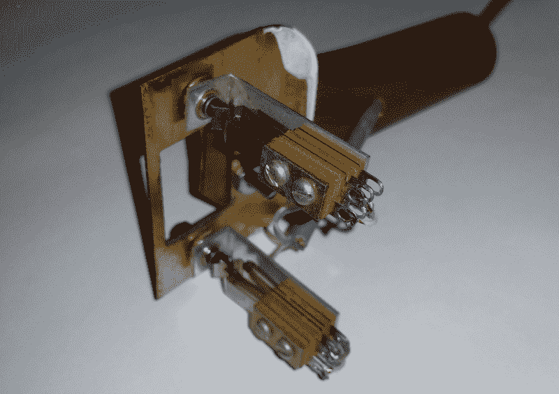
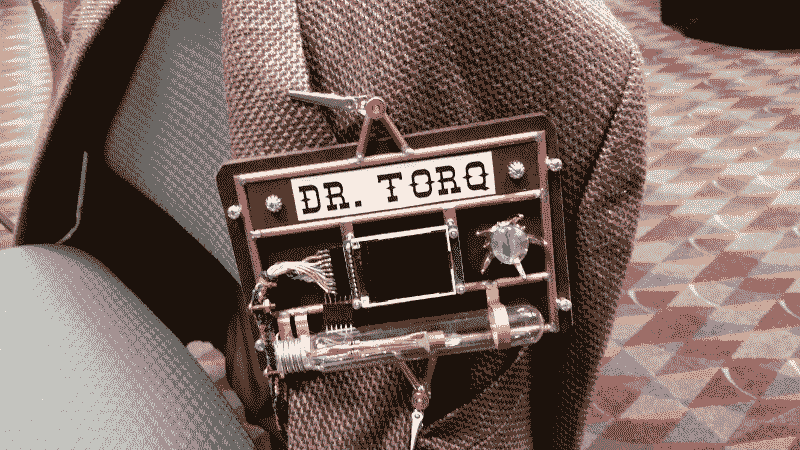

# 现成的黑客:黑掉你自己的技术演讲

> 原文：<https://thenewstack.io/off-shelf-hacker-hack-tech-talks/>

每个现成的黑客都应该努力掌握技术演讲的艺术和科学。成功往往取决于有效推销你的想法、推广你的项目和推销你的想法的能力。

上周末，我花了 20 分钟向奥兰多机器人俱乐部解释我的蒸汽朋克演示机。早在一月份，当我在[未来教育技术会议](http://fetc.org/)上发布 45 分钟版本时，观众从未真正对该材料产生兴趣。这一次，我参与了更多的互动。

观众的参与度和热情大大提高了。

今天，我们将检查我所做的更改，以获得更积极的演示结果。使用不同的演讲技巧，观众的反应会有显著的变化。

换句话说，不要害怕攻击你自己的演讲。

## 反思和观察

我在 FETC 的经历中有几件事很突出:

*   观众包括教师、学校管理人员和一些物理计算爱好者。
*   几个观众显然是新手，有树莓派和 DIY 项目。
*   在开始正式谈话之前，我设置了演示机器。
*   在会议上走来走去，带着演示机，戴着蒸汽朋克徽章，吸引了大量的注意力。

同样，奥兰多机器人俱乐部会议的观察结果包括:

*   观众由黑客、工程师、艺术家、学者和非常好奇的外行组成。
*   一位与会者承认，他对 Linux 或树莓派毫无经验。
*   由于会议时间很短，在演讲的第一部分，我带领观众安装了演示机器。
*   俱乐部成员知道我会带一次性的 DIY 项目来参加会议。

## 分析会话

这两种观众截然不同。尽管两个小组都有在各自领域非常博学的人，但很明显机器人俱乐部小组对演示机器如何运作的“细节”更感兴趣。当我回答问题和演示功能时，机器人人在座位上前倾。

令人惊讶的是，在 FETC 会议之后，与会者对演示机器的点击器最感兴趣。它只不过是几个工业强度的按钮，安装在一个普通的日常门锁板上(因为形状是正确的，开关适合孔)，并附有铜管把手。它还有一根 CAT 5 电缆，将开关连接到 Raspberry Pi 上的 GPIO 引脚。使用 Python 程序和 LibreOffice，clicker 允许我在幻灯片中向前或向后移动。

蒸汽朋克点击器

观众中的新人是教育和赢得观众喜爱的黄金机会。让我解释一下:

无论我们在现成的黑客连续体中处于什么位置，个人永远不可能知道所有的事情，我们也不想以这种方式出现。我们一开始都不太了解电子、制造技术、传感器或树莓派。不要居高临下地说话，让任何人尴尬或觉得自己很愚蠢。注意措辞和用词，因为很容易给人留下这样的印象，即使是偶然的。最好只是耐心和友好，同时分享你来之不易的知识。

FETC 和机器人俱乐部会议都有一个健康的新手应急。一个机器人俱乐部的参加者公开承认他对树莓派几乎一无所知，更不用说 Linux 了。

很自然，我抓住机会直接与与会者交谈。我们就主流替代操作系统 Linux 如何在 Raspberry Pi 上运行进行了简短的交流，我解释说它实际上是一台信用卡大小的纳米计算机。这个人似乎很感激我花时间帮助他理解为什么我选择了树莓派和 T2 的 Linux 作为演示机器。

当然，与这位好奇的新手交谈吸引了其他有见识的观众的评论。我们都进行了一次愉快、愉快和富有成效的信息交流。

毕竟，这就是谈话的意义所在…对吗？

## 会前设备设置

一位 FETC 的评论者在他们的演讲者调查中写道，“当我看到演讲者启动一个树莓派时，我知道我来对了地方。”

哇，那是令人敬畏的反馈。

我通常在长篇大论中做的是让一切运转起来，然后开始我的幻灯片。可悲的是，在 FETC 会议期间，我很难让有线点击器工作，所以我不得不使用无线键盘/鼠标垫，作为我的换幻灯片设备。

在为机器人俱乐部会议做准备时，我最终发现，为了让 clicker 可靠地工作，在单击幻灯片放映按钮之前，必须将光标放在 LibreOffice 的幻灯片窗格上。否则，读取 Pi 上按钮的 Python 程序会将向上或向下箭头字符发送到 Impress 屏幕的其他部分。你将改变幻灯片格式或类似的东西，而不是上下移动幻灯片堆栈。很简单，一旦你想通了。

我认真考虑了 FETC 的评论，认为如果一名观众喜欢看我准备硬件，机器人俱乐部可能会欣赏我在演讲中融入实际的设置活动。

以下是我在演讲的前 10 分钟所涉及的步骤列表。

*   启动 Raspi 演示机器
*   启动图书馆办公室
*   将幻灯片加载到 Impress
*   开始幻灯片按钮-按 Python 程序
*   调出 guvcview
*   开始幻灯片
*   演示滑动按钮点击器
*   使用 guvcview 演示零件摄像头

我是对的！他们喜欢它，这是一个很好的机会来提前报道演示机器的操作。这些年来，我只见过另外两位演讲者使用演示谈话准备阶段的技巧，两次听众都很专注。这肯定不同于大多数演讲者开始演讲的方式。似乎相当有效和引人注目。

## 吸引注意力

几年前，在我开始专门为物理计算演讲设计硬件之前，我会随身携带一个 Arduino 或其他硬件设备，并把它交给我在一次会议上遇到的人，作为谈话的开始。

在[一个现在已经很久的 LinuxWorld 会议](http://www.linuxjournal.com/article/8985)期间，我正在[审查 OQO 掌上电脑](http://www.linuxplanet.com/linuxplanet/reviews/6231/1/)，碰巧遇到了 [Slashdot](https://en.wikipedia.org/wiki/Slashdot) 的负责人 Rob Malda。由于我们从未见过面，我只是把那个小机器递给他，告诉他我已经把 SuSE Linux 黑进了磁盘，甚至连 WiFi 都可以用了。他立即开始提问，我们就一些最新的技术进行了愉快的交谈。

快进到 2016 年 FETC 会议。这一次，我把我的小推车和展示机放在显眼的顶部，我的蒸汽朋克会议识别装置(名字徽章)夹在我夹克的翻领上。

谈注意力！

这两种设备的结合使得招募人们参加我的会议变得很容易。也许，我应该在会议徽章的液晶屏幕上放一个更好的广告视频。

演讲结束后，[观众对演讲机和会议徽章拍照](http://edviewport.com/tag/fetc-2016/)。我甚至被邀请去拍了几张自拍。如果运气好的话，老师们会在回家后与他们的班级分享这些照片。

gen 4–蒸汽朋克会议徽章展示装置

我强烈建议利用你项目中的“酷元素”来宣传你的演讲。在演讲之前、之中和之后，想办法展示你的成果。作为一名技术作家，我经常将我的想法原型化，发布一个故事，然后在它完成并运行后，出去找一个迎合对特定主题感兴趣的人的会议。

## 经验教训

像其他事情一样，你可以随时修改你的演讲，使之更好。

我喜欢研究观众，试图确定他们的兴趣和动机需求。参加你的会议也是支持和鼓励技术新手的好方式。演示设置演练适用于黑客和物理计算主题。为了进一步提高会议的出席率，一定要利用你的项目的物理“吸引注意力”的能力来促进你的演讲。

哦，最后一件事。总是摆出一副优雅的样子，同时乐于助人且谦逊。

<svg xmlns:xlink="http://www.w3.org/1999/xlink" viewBox="0 0 68 31" version="1.1"><title>Group</title> <desc>Created with Sketch.</desc></svg>