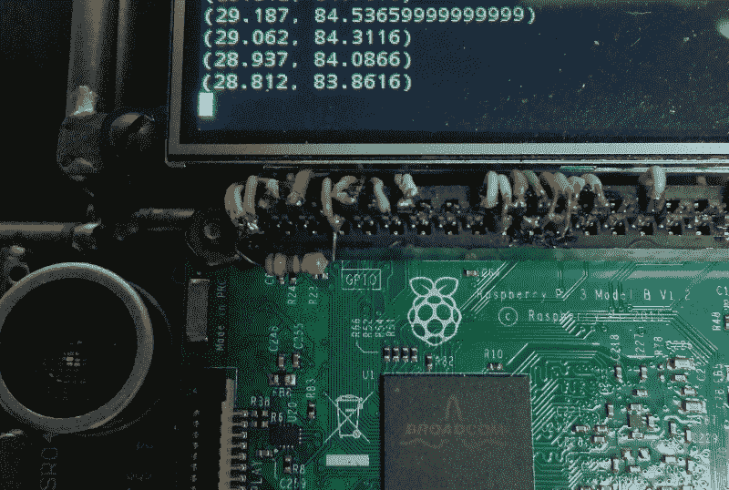

# 现成的黑客:工程决策的黑暗艺术

> 原文：<https://thenewstack.io/off-shelf-hacker-hardware-dark-art-engineering-decisions/>

构建正常运行的硬件很难。

这很难，因为随着项目的发展，您必须做出无数的设计决策和妥协。

以我最近的[第五代蒸汽朋克会议徽章](https://thenewstack.io/hacking-hardware-the-never-ending-saga-of-steampunk-name-badge-development/)为例。这是一个全新的设计，配有 WiFi 功能的 Raspberry Pi 3，3.5 英寸彩色 TFT 触摸屏显示器，辅助 Arduino Pro Mini，包裹在“Torq 博士”暴露的铜管和皮革蒸汽朋克美学中。

Arduino 是为模拟和近实时传感功能而添加的。读者会记得，Pi 有严格的数字通用输入/输出(GPIO)引脚。我的计划是使用 4 个光电池(ADI 公司)和几个 DS18B20 数字温度计作为物理输入设备。只要把手指放在传感器上就能检测到输入，为什么还要使用按钮呢？

虽然使用 Arduino 检测 4 个模拟光电池是显而易见的，但读取 DS18B20s 却是一个问题。后者需要大约 750 ms 的读取周期，这意味着 Arduino 将等待来自设备的温度数据，而此时它应该测量光电池并检测其他输入。等待 DS18B20 首先否定了使用 Arduino 的近实时能力。

尽管如此，我还是希望能够检测温度，可能包括一串温度，DS18B20 通过其标准总线架构允许这样做，同时不阻碍其他读数。

怎么办？

沙赞，古伯！在 Pi 上运行 [Raspbian](https://www.raspbian.org/) 操作系统是一个潜在的伟大解决方案。只需将 DS18B20 连接到 Pi 上的一个引脚，并使用内置的[单线总线](https://en.wikipedia.org/wiki/1-Wire)读取功能。然后，Arduino 可以以正常速度自由旋转其模拟光电池(和任何其他未来传感器)输入，而不必求助于使用中断或忍受长时间的延迟。我们可以将温度传感器与来自 Arduino 的模拟数据集成到我们在 Pi 上编写的应用中。

## 将 DS18B20 连接到 Pi

Dallas DS18B20 传感器有两种连接方式。传统方法是将 Vcc 引脚连接到 3.3 伏，将地线连接到地，将数据引脚连接到 Raspberry Pi 上的数字引脚。在数据引线和 3.3 伏电压之间有一个大约 5 到 10K 欧姆的小电阻。该电阻充当上拉电阻，确保稳定且可预测的数据线行为。在 Gen-5 徽章上，我将 DS18B20 数据引脚连接到 Pi 上的 GPIO04。在下图中，您可以看到 GPIO04 和 Pi 接头上的 3.3 伏引脚之间的电阻:



连接在 3.3 伏和 GPIO04 引脚之间的电阻。

本来想在“寄生”模式下使用 DS18B20。这种配置将芯片的 Vcc 引脚连接到接地引脚，然后将数据引脚连接到 Raspberry Pi GPIO 引脚，并在数据引脚和 3.3 伏之间跨接一个电阻。这样，你只需要两根总线导线，而不是传统的三根。

不幸的是，我没能让这种安排奏效。我只是在读取传感器时获得恒定的高值，就像设备没有连接到输入引脚一样。没关系，常规模式对我来说已经足够了。

连接传感器很简单。我使用 6 英寸长的 24 号软线将传感器连接到 Vcc、地和 Pi 上的 GPIO04。这根线是从一根旧的串行鼠标线偷来的。如果你需要的话，去一家慈善商店或旧货店花几块钱就能买到一把死去的野兽。这种导线对于微控制器设备的制造非常有价值，尤其是对于可穿戴设备。你也许可以在其他项目中使用鼠标内部剩余的编码器、传感器和其他部件。

硬件连接在一起后，我们所要做的就是读取传感器并打印出结果。

## 温度一行程序

一个名为 [w1thermsensor](https://github.com/timofurrer/w1thermsensor) 的包使得读取 DS18B20 传感器变得很简单。它还可以读取其他几个所谓的“单线”设备。该库可以与 Raspberry Pi 和 BeagleBone 微控制器一起工作。

我刚刚使用 ssh 从我的 Linux 笔记本远程登录了 Gen-5 badge，并使用 apt-get 安装了该软件。

```
pi@raspi%  sudo apt-get install python3-w1thermsensor

```

一旦安装在 Pi 上，您可以选择从 Python 程序或命令行读取温度传感器。我们现在只讨论命令行版本，并在未来的[现成黑客](/tag/off-the-shelf-hacker/)文章中讨论 Python 调用。

您可以使用下面一行获得已连接的 DS18B20 设备的列表。

```
pi@raspi%  w1thermsensor ls

```

打印输出将如下所示:

```
Found  1  sensors:
  1.  HWID:  0000018a5052  Type:  DS18B20

```

要读取传感器，使用“获取”选项。

```
pi@raspi%  w1thermsensor get  1

```

这是一个示例结果，“1”是总线上的第一个设备。

```
Sensor  0000018a5052  measured temperature:  29.312  Celsius

```

不出所料，在终端上显示温度值之前会有一点延迟。

请注意，设备号“0000018a5052”出现在两个命令中。其他传感器将有不同的设备编号。要区分哪个是哪个，你可以用手指抓住其中一个传感器，提高温度，然后重复使用“all”选项，在打印输出上观察哪个设备的温度。

```
pi@raspi%  w1thermsensor all  --type DS18B20

```

使用终端窗口中的向上箭头，然后按“enter”键，重复上一个命令。

当然，读取温度并将其集成到用户界面中，需要一种不同于简单命令行打印输出的方法。Linux 命令行是一个非常有用的工具，可以快速构建原型并证明您的硬件工作正常。

别忘了，通过 Raspberry Pi 上的引脚读取 DS18B20，我的小辅助 Arduino Pro Mini 可以全速运行其模拟(和数字)输入，然后通过串行端口无缝地将数据转发到 Pi。不仅如此，通过 Linux 的魔力，我们可以从终端窗口内访问 DS18B20 数据，通过 Python 程序和/或甚至作为后台作业提供一些脚本，将数据推送到云，如果我们愿意的话。

很酷的东西，对吧？

## 后续步骤

我的“构建正常运行的硬件很难”的观点是基于这样一个事实，即当前的物理计算堆栈项目是微控制器模块、固件(如 Arduino)、软件和 Linux，以及传感器、GPIO 引脚连接、网络等的混合。总有很多你需要考虑的事情，当你完成你的项目时，这可能是一座陡峭(也是巨大)的山。

工程，在实践中，总是涉及妥协和有根据的猜测。这就是有趣的地方。然后你原型，验证和提炼。偶尔，项目甚至可能转化为有利可图的产品。

这是史上最伟大的极客时代。

<svg xmlns:xlink="http://www.w3.org/1999/xlink" viewBox="0 0 68 31" version="1.1"><title>Group</title> <desc>Created with Sketch.</desc></svg>