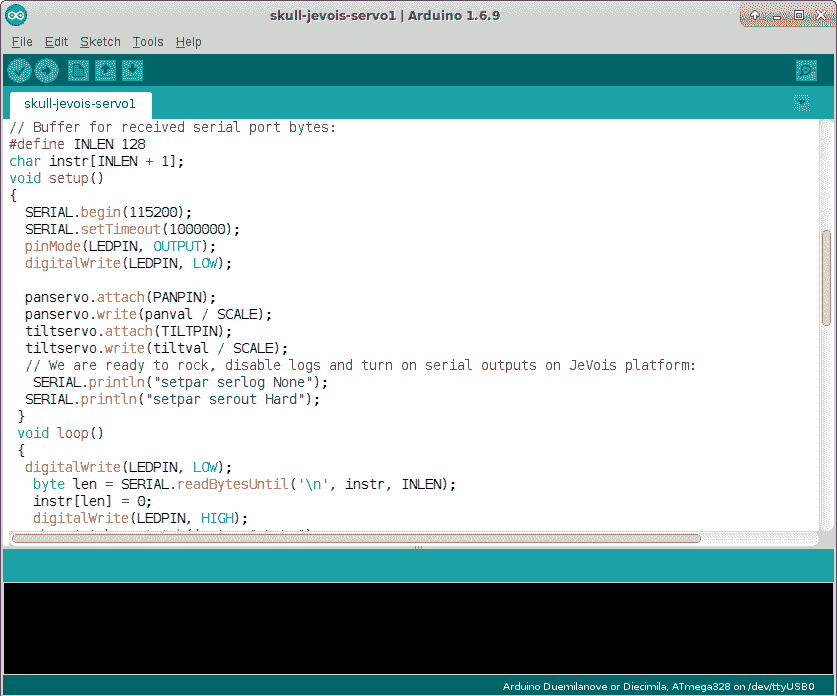
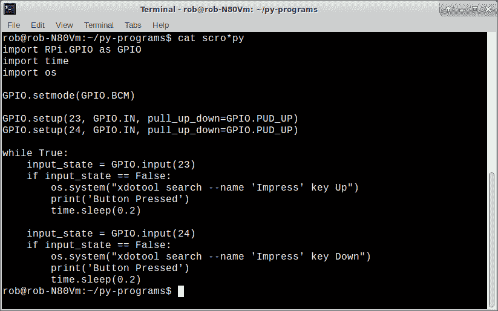

# 现成的黑客:从零开始的硬件黑客

> 原文：<https://thenewstack.io/off-shelf-hacker-hardware-hacking-scratch/>

如果你正在考虑制造机器人、物联网或物理计算设备，并且对这个领域完全陌生；如果您从未在项目中使用过微控制器板，就很难知道该做什么和从哪里开始。

关于微控制器、传感器、致动器、固件、软件、网络、数据(和数据库)、无线电、机械装置、电子设备等等的相互作用，还有很多东西需要学习。我们想让我们的装置实用且易于使用，所以设计用户界面、项目包装和美学也很重要。

一个好的起点是熟悉用于编程和配置物理计算项目的软件工具。显然，在你可以编程和使用这些设备之前，你需要购买一个 Arduino 和/或一个 Raspberry Pi。提到的软件可以在网上免费获得。我会发布相关资源的链接。

## 走向主流——使用 Linux

毫无疑问， [Linux](https://en.wikipedia.org/wiki/Linux) 是物理计算的首选操作系统，也是一个伟大的软件开发综合平台。

虽然您可以使用 Windows 进行大量的物理计算工作，但我强烈推荐 Linux。笔记本有几个[十几个不同的版本](https://distrowatch.com/)。我喜欢 Xubuntu。

Linux 几乎可以在任何计算机硬件上运行，从几千美元的高端台式机一直到埋藏在壁橱里被遗忘了十几年的旧笔记本电脑。如果你还不想取代 Windows，它甚至可以通过 u 盘操作。完成物理计算工作后，只需关闭机器，拔出 u 盘，你就可以回到 Windows 系统了。顺便说一下，我已经十年没有使用 Windows 了，所有的工作都是在一台 10 年前的华硕双核英特尔笔记本上完成的。

拥有操作系统的微控制器板，像[树莓 Pi](https://www.raspberrypi.org/) 、[猎兔犬骨](http://beagleboard.org/bone)和[芯片计算机](https://getchip.com/pages/chip)也几乎完全使用某种版本的 Linux。因为它是一个多用户、多任务的操作系统，你可以同时运行一堆程序。Linux 有内置的网络和各种各样的软件应用程序来满足各种可能的需求。命令行和各种各样的驱动程序使得使用外部硬件变得轻而易举。不管你用的是 Linux 笔记本、Raspberry Pi 还是 2”x3”芯片的电脑，Linux 的外观和操作都是一样的。

基于固件的微控制器板，如 [Arduino](https://www.arduino.cc/) 、 [ESP8266](https://www.espressif.com/en/products/hardware/esp8266ex/overview) 和[克隆版](https://en.wikipedia.org/wiki/List_of_Arduino_boards_and_compatible_systems)没有操作系统。固件控制着从主机上下载的特定功能。你可以从 Windows 或 Linux 笔记本电脑上对你的 Arduino 固件进行编程，使用一个我们马上会谈到的应用程序。我甚至用树莓 Pi 编写了 Arduino 固件。

是的，我强烈倾向于 Linux。这实际上是一个行业标准，所以为什么不使用刚刚工作的呢？

## 对设备编程

随着 Arduino 微控制器板的出现，物理计算革命开始了。这些设备读取输入，可能做一些计算，然后设置输出。他们每秒钟做数千次这样的运算。他们使用的程序，称为固件，只是一个大循环，一遍又一遍，非常快地执行。

对 Arduinos、ESP8266s 和其他基于固件的克隆进行编程的最常见方式是使用 [Arduino 集成开发环境](https://www.arduino.cc/en/Main/OldSoftwareReleases)，也称为 IDE。IDE 可以在 Windows 和 Linux 机器上运行。您可以通过在其内置的文本编辑器中输入您的程序代码来使用它，然后将程序编译成二进制代码(固件)，最后将其下载到 Arduino。成功将固件传输到 Arduino 后，主板将复位并立即开始运行程序。有大量的库可以用来为所有不同类型的传感器和输出设备编写代码。

Arduino IDE 和一些示例代码

为像 Raspberry Pi 这样的基于 Linux 的主板编写程序的一种常见方式是使用 [Python 语言](https://www.python.org/)。任何旧的 Linux 文本编辑器都可以用来编写程序。我有点传统主义，所以我用 [vi](https://en.wikipedia.org/wiki/Vi) 。由于 Pi 具有板载 HDMI，因此连接显示器和键盘/鼠标垫就可以在设备上进行编程。Python 被包含在典型的“Raspbian”版本的 Linux 中，正是因为它简单易学，而且是一种非常有能力的语言。在我的 Raspberry Pi 项目中，我使用 Python 程序来读取按钮和控制 led。

终端窗口中的示例 Python 代码

[Processing](https://processing.org/) 是一种很像 Arduino IDE 的语言。我用它在 Linux 笔记本或 Raspberry Pi 上构建图形界面。很多时候，我会从 Arduino 获取数据，并通过串行或 USB 连接将其推送到我的用户界面，就像一个[蒸汽朋克计量器](https://thenewstack.io/off-shelf-hacker-give-screen-gauges-new-face/)。我喜欢 Processing 的一点是，它可以轻松访问 Raspberry Pi 上的通用输入/输出(GPIO)引脚。虽然您可以将 Python 用于用户界面，但我发现这些库不如 Processing 中的库开发得好或完善。而且，如果你知道 Arduino IDE 和它的命令，你将会在处理中得心应手。

## 其他重要工具

我经常用来帮助我实现物理计算项目的另外两个工具是命令行和 Bash 脚本。它们在 Linux 下运行。

我经常在我所有的 Linux 机器上使用面向屏幕的命令行。启动一个终端，命令行就在那里准备好了。我将用它来运行 vi 和编辑文本。或者，执行 [apt-get](https://www.digitalocean.com/community/tutorials/how-to-manage-packages-in-ubuntu-and-debian-with-apt-get-apt-cache) 安装程序。一个特别有用的情况是当我使用 [ssh](https://www.ssh.com/ssh/) 从我的 Linux 笔记本远程登录到 Raspberry Pi 时。不需要键盘或显示器，在 Pi 上做一些事情。熟悉 Linux 命令行是一项非常有用的技能。

最后，还有 [Bash 脚本](https://ryanstutorials.net/bash-scripting-tutorial/bash-script.php)。这些文本文件只是执行命令行字符串。例如，我可以用 [stty](https://linux.die.net/man/1/stty) 命令初始化一个 USB 端口，然后用 [cd](https://www.computerhope.com/unix/ucd.htm) (更改目录)进入 Arduino-1.6.9 目录，然后用。/arduino。它们让你自动完成平凡的任务，让你不用一遍又一遍地输入复杂的命令。您甚至可以在启动后立即调用脚本，这样您的所有应用程序都可以自动启动并运行。

## 下一步是什么

今天，我们讨论了我通常用来构建物理计算项目的软件工具。Linux 是一个非常棒的开发环境，当然也值得考虑用于您的日常计算工作。其他工具需要一点时间来学习，但并不太难。这种应用程序的组合相当全面，可以让您涵盖您将遇到的任何编程情况。

通过 Pixabay 的特征图像。

<svg xmlns:xlink="http://www.w3.org/1999/xlink" viewBox="0 0 68 31" version="1.1"><title>Group</title> <desc>Created with Sketch.</desc></svg>