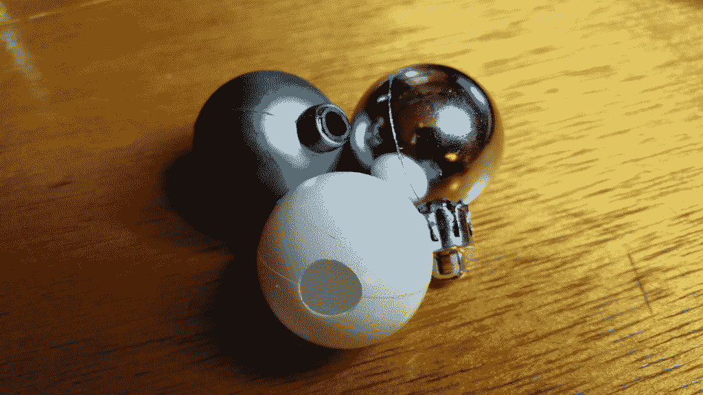
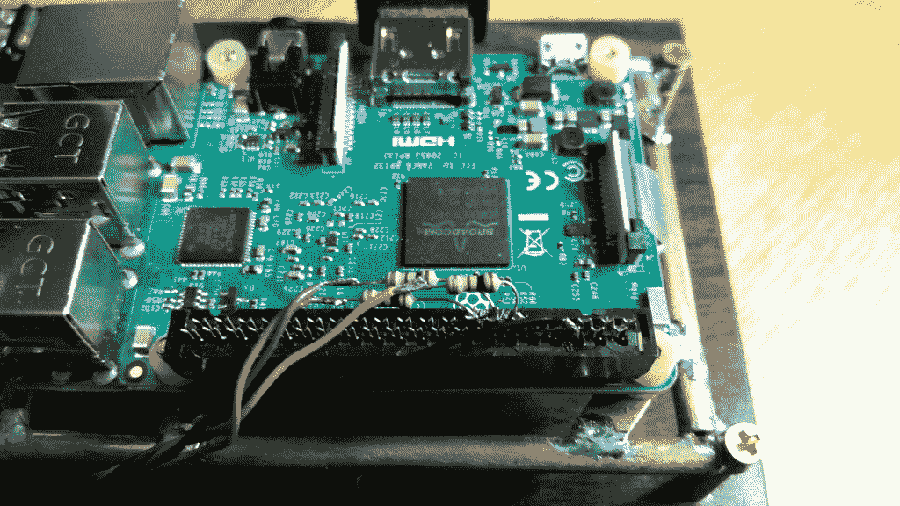
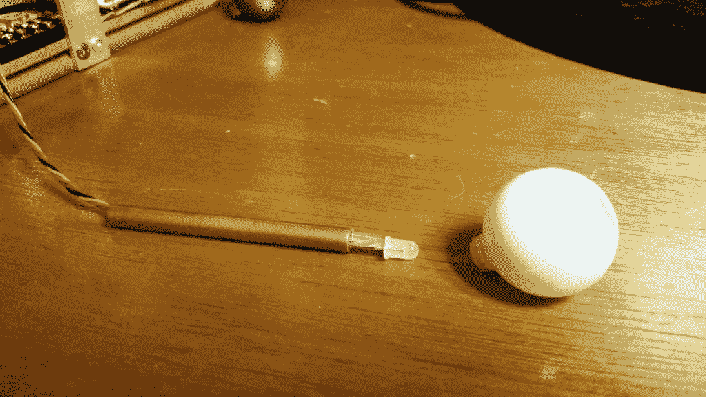

# 现成的黑客:赫德利机器人头骨，以前的“老独眼”

> 原文：<https://thenewstack.io/off-shelf-hacker-hedley-formerly-old-one-eye/>

谁想要一个独眼机器人头骨？

我们可以拥有[平移/倾斜眼球](http://www.monsterguts.com/store/product.php?productid=17785&cat=272&page=1)，就像通过 Arduino 或 Raspberry Pi 的命令移动的怪物内脏。不过，让我们实际一点。我最新的[现成黑客](/tag/off-the-shelf-hacker/)项目，赫德利，右眼窝里已经有了一个 [JeVois 相机](http://jevois.org/)。虽然商店里买的眼睛套装很棒，但它会花掉你 180 美元。也许我们可以在未来的文章中添加一个单独的平移/倾斜眼睛。

目前，我只是想要一个好看的固定眼球，可以有计划地发出不同的颜色，吸引注意力，而且价格便宜。

所以，他们开始寻找合适的物品作为眼球。

## 合适的眼球

我的顿悟，除了在右边的插座上使用 JeVois 智能机器摄像头之外，是以一个小塑料圣诞树装饰品的形式出现的。我女儿在装饰一棵小树，我用各种颜色装饰了几棵。它有一个小的装饰帽，顶部有一个槽，可以很容易地移除，露出一个圆形的，有缺口的圆形突起，非常适合固定 1/4 英寸的铜管。



各种颜色的圣诞装饰品

它完全符合头骨。

用钻头和小鼠尾锉将顶部的洞稍微扩大。塑料零件很容易手工加工，因为你几乎不需要动力来转动它们。我只是在手指间旋转钻头，打出大小合适的洞。不需要钻床。

我还在装饰物的前面(底部)手工钻了一个孔，形成虹膜。再一次，稍微修饰一下，这次用的是[螺旋切割钻头](https://www.dremel.com/en_US/products/-/show-product/accessories/561-multipurpose-cutting-bit)，几乎很快就把洞打得很圆了。小心这个特别的钻头，因为凹槽非常锋利。

## 可编程的幽灵般的辉光

我喜欢用三色发光二极管。它们相当便宜，只需几美元左右，而且通常非常明亮。[1.60 美元的 Banggood 有 10 个](https://www.banggood.com/10pcs-5mm-RGB-LED-Common-Anode-4-Pin-Tri-Color-Emitting-Diodes-F5-p-937446.html?rmmds=buy&cur_warehouse=CN)。

不久前，我们发表了一篇关于选择和使用两种不同 led 的讨论，共阴极和共阳极。在这种情况下，我使用公共阳极类型，因为 Pi 可以处理其输出引脚上的电源切换。公共阳极接地，每种颜色连接到相应的 GPIO 引脚。

这一次，我没有在 LED 附近安装 100 欧姆电阻，而是将它们放在 Raspberry Pi 40 引脚连接器上。1/4”管内没有足够的空间容纳所有三个电阻，所以我只是从引线开始布线，一直到 Pi。我使用了一些从旧的串行鼠标中回收的 24 号绞合线来连接 led 和 Pi。这种电线非常柔韧，非常容易使用。



连接到 40 针 Pi 连接器的 LED 电阻

我们只需要 100 欧姆的电阻，因为 Raspberry Pi 上的通用输入/输出(GPIO)引脚工作在 3.3 伏。你会发现很多使用三色 led 的 5 伏 Arduino 项目。由于电压较高，它们需要 270 欧姆的电阻。Pi GPIO 引脚始终使用 3.3 伏电压进行计算。

在将细线焊接到 LED 的引线上之后，我在每一根引线周围用了一些透明胶带来防止短路。它不漂亮，藏在安装管里。少量的热胶水将 LED 固定在管子的中心。



铜管眼球/LED 支架

黄铜安装管压入眼球。然后将眼球压入头骨左眼窝的匹配孔中。对于这一个，我确实用 Dremel 钻了一个导向孔，因为塑料相当厚。在那之后，我再次使用螺旋钻头手工加工孔到合适的尺寸。

目前，眼球仅通过压配合保持在眼窝中。我可能会在头骨内建立一个小支架，抓住安装管并牢牢抓住它。

## 保持简单，使用 Python

运行眼球的代码非常简单，类似于我在前面提到的基本 LED 视觉界面文章中使用的代码。

```
#!/usr/bin/env python2.7

import RPi.GPIO as GPIO  # always needed with RPi.GPIO  
from time import sleep  # pull in the sleep function from time module  

maxint  =  30  

GPIO.setmode(GPIO.BCM)  # choose BCM or BOARD numbering schemes. I use BCM  

GPIO.setup(22,  GPIO.OUT)# set GPIO 22 as output for red led  
GPIO.setup(17,  GPIO.OUT)# set GPIO 17 as output for blue led  
GPIO.setup(27,  GPIO.OUT)# set GPIO 27 as output for green led  

red  =  GPIO.PWM(22,  100)    # create object red for PWM on port 25 at 100 Hertz  
green  =  GPIO.PWM(17,  100)      # create object blue for PWM on port 24 at 100 Hertz  
blue  =  GPIO.PWM(27,  100)      # create object green for PWM on port 24 at 100 Hertz  

# red.start(1)              # start red led on 0 percent duty cycle (off)  
blue.start(0)              # start blue on (100%)  
# green.start(0)              # start green on (0%)  

# now the fun starts, we'll vary the duty cycle to 
# dim/brighten the leds, so one is bright while the other is dim  

pause_time  =  0.05 # you can change this to slow down/speed up  

try:  
    while True:  
        for  i  in range(1,maxint):      # 101 because it stops when it finishes 100  
            #red.ChangeDutyCycle(maxint - i)  
            blue.ChangeDutyCycle(maxint  -  i)  
            # green.ChangeDutyCycle(maxint - i)  
            sleep(pause_time)  

        for  i  in range(maxint,1,-1):      # 101 because it stops when it finishes 100  
            #red.ChangeDutyCycle(maxint- i)  
            blue.ChangeDutyCycle(maxint  -  i)  
            # green.ChangeDutyCycle(maxint - i)  
            sleep(pause_time)  

except KeyboardInterrupt:  
    red.stop()            # stop the red PWM output  
    blue.stop()              # stop the blue PWM output  
    green.stop()              # stop the green PWM output  
    GPIO.cleanup()          # clean up GPIO on CTRL+C exit

```

代码初始化了库和变量。然后设置哪些 Raspberry Pi 引脚连接到哪些 LED 颜色。之后，程序只是向上循环一个变量，然后向下改变蓝色 LED 的占空比。占空比是来自脉宽调制(PWM) Raspberry Pi GPIO 引脚的 ON 脉冲宽度。宽度越大，LED 越亮。

从很小的数字开始，LED 看起来很暗，然后逐渐变强。然后程序反其道而行之，让 LED 变得越来越暗。这给了一个很酷的脉冲效果。

还可以添加其他颜色或几何功能来定制您认为合适的眼球发光轮廓。

我在想，甚至有可能根据 JeVois 摄像机看到的东西来改变眼球的颜色。例如，也许当头骨意识到面前站着一个人时，眼睛会发出蓝光。当一只狗出现时，它会发出红光。

我们将不得不进一步探索头骨中的 LED 视觉界面。

## 包裹

给头骨增加特征和功能需要时间，我通常每周只能做一两个。啊，一个技术“如何”文章作者的生活。

总之，我会给你留下几个链接供你查看。

第一个是机器人头部项目的小目录。有些你可以买。有些非常复杂。有些……嗯。也许他们会给你的项目带来一些灵感。

另一个链接是到[怪物内脏网站](http://www.monsterguts.com/store/)。他们有相当多的道具和机器人部件可供选择，包括气动装置。我们甚至还没有在现成的黑客上讨论过这些。请务必观看他们的视频，寻找新的项目灵感。

这么多现成的技术，这么少的时间。为老一只眼睛干杯。

<svg xmlns:xlink="http://www.w3.org/1999/xlink" viewBox="0 0 68 31" version="1.1"><title>Group</title> <desc>Created with Sketch.</desc></svg>