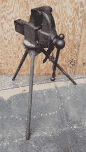
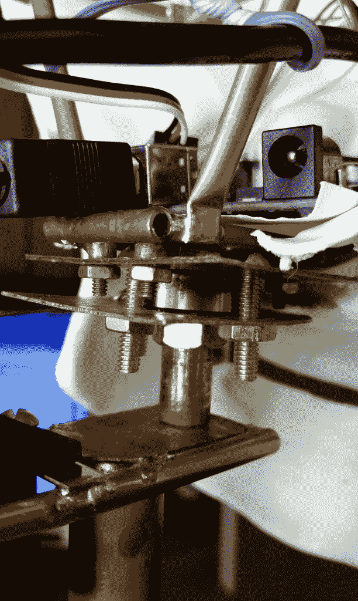
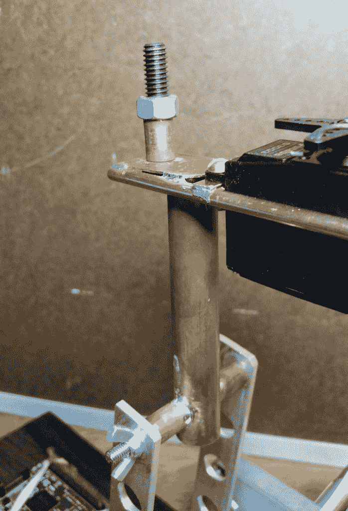
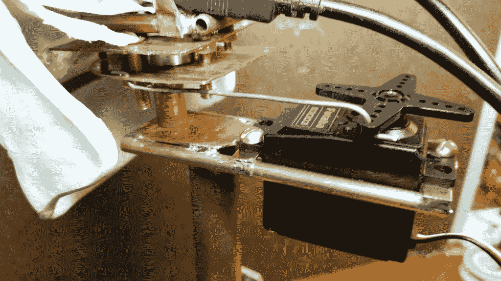

# 现成的黑客:机器人头骨赫德利注意到它的创造者

> 原文：<https://thenewstack.io/off-shelf-hacker-hedley-robotic-skull-notices-creator/>

在过去的几周里，我的当前项目——建造一个机器人头骨——发生了很多事情。当我在 JeVois 视觉传感器前移动时，头骨可以可靠地跟踪我。这之前的工作包括将头骨安装在云台上，安装云台伺服系统，并将 JeVois 传感器连接到 Arduino 上。传感器通过 Arduino 微控制器控制伺服系统，进行基本的跟踪操作。稍后，我们将把已经安装的 Raspberry Pi 与系统的其余部分集成起来。机器人技能项目的前几章出现在这里:[【1】](https://thenewstack.io/off-shelf-hacker-machine-vision-meets-robotic-skull/)[【2】](https://thenewstack.io/off-shelf-hacker-machine-vision-meets-robotic-skull2/)[【3】](https://thenewstack.io/machine-vision-camera-meets-robot-skull/)[【4】](https://thenewstack.io/off-shelf-hacker-picking-brain-hedley-robotic-skull/)。

## 设计平移枢轴

“巨型铁虎钳”

读者可能还记得[改装蒸汽朋克眼球项目](https://thenewstack.io/modding-steampunk-eyeball/)中升级的双轴承潘枢轴组件。两个轴承给了一个非常顺利，低摩擦摇摄行动，这是非常容易与一个标准的全尺寸爱好伺服移动。消除整个系统的摩擦是快速精确运动的关键。

这一次，我选择尝试使用单滚珠轴承，因为枢轴需要一个低姿态。我有一堆剩下的带小滚珠轴承的直排轮滑鞋，所以我就重新设计了其中一个。使用单个轴承简化了装配并提供了所需的移动便利性。

读者应该意识到，使用一个轴承的设计确实有一些松弛或“发挥”它相对于枢轴螺栓轻微晃动。它仍然是固体，有一个轻微痉挛的机器人头骨，有点摇晃，这是一个很酷的功能，而不是一个负债。用新的精密滚珠轴承替换旧的轮滑轴承可能会消除松弛。

轴承座由 3/4 英寸长的铜管纵向切割而成，然后在“巨型铁虎钳”中展平

滚珠轴承夹在两块铜板之间，并用四个#8-32 x 3/4 英寸黄铜圆头机器螺钉固定。在两块板上钻半英寸的孔，为中心 1/4 英寸直径的枢轴安装螺栓和螺母提供间隙。四个#4-40 x 1/2 英寸黄铜圆头螺钉将内部铜管头骨框架固定到顶部枢轴安装板上。整个组件在连接到机器人臂顶部支架的枢轴螺栓上摆动。

枢轴轴承特写

机器人臂顶部支架上的枢轴螺栓

头骨和内部框架从右向左旋转几乎不费力气。我钻了一个 1/16 英寸直径的孔在底部轴承板，以连接伺服驱动杆。现在我用 16 号不锈钢丝做驱动杆，就像你在遥控飞机上看到的一样。像轴承一样，有一点点松弛使用线和板钻孔，所以在某些时候，我会转换成一个[小直径钢筋混凝土汽车拉杆](https://www.aliexpress.com/popular/rc-tie-rods.html)，以收紧机制。

随着潘枢轴和轴承广场了，下一个列表中，是安装潘伺服。

## 头骨里面还是外面？

我权衡了好一会儿在哪里定位平移伺服。

将伺服系统安装在头骨内会使项目看起来更流畅。我还必须建立一个耦合器来驱动对顶部枢轴螺栓螺母伺服臂。为了防止粘结，组件必须居中并紧密装配在一起。我的蒸汽朋克眼球使用了这种方法，并得到顺利工作是一个真正的痛苦。商业和 3d 打印枢轴通常使用直接驱动，因此设计非常紧凑。

另一个考虑是如何使用伺服系统让赫德利的下巴移动。头骨内的空间有限，看起来枢轴和下颚伺服系统会停在同一个地方。没有办法定位头骨外的下颚伺服系统。怎么办？

这一次，我再次采取了不同的方法。保持简单意味着只需将全景伺服系统放在一个支架上，在头骨后面的后面和下面。伺服臂然后可以用驱动杆推/拉平移支架。

这是一个相当容易的只是焊接一对 4 英寸长，3/16 英寸直径的铜管，以机器人手臂支架，并使用 1/4 x 1/16 英寸平黄铜股票安装伺服，管之间。我用了两个“巨大的期待”#8-32 x 1/2 英寸黄铜螺钉连接伺服到支架。

枢轴轴承、支架和伺服系统的侧视图

当然，伺服有点悬在太空中，但是嘿，蒸汽朋克美学鼓励这样的事情，所以它对我来说很棒。

## **挂接 Arduino**

我用一个普通的旧 [Duemilanove Arduino](https://www.arduino.cc/en/Main/ArduinoBoardDuemilanove) 来移动头骨。很可能，我会用零件箱里一个没用过的 Arduino Pro Mini 来替换那块板。大 Arduino 有一个 USB 连接器，所以编程非常容易。Pro Mini 需要一根串行转 USB 电缆将其连接到 Linux 笔记本电脑，并且在头骨内占用的空间非常小。

值得一提的是，我不必编写程序来从 JeVois 智能视觉传感器获取数据，因为网站上已经有了用于平移/倾斜设置的代码。我只是将代码复制并粘贴到我的 Linux 笔记本上的 Arduino IDE 中，然后编译并上传固件到 Arduino。布线连接和说明非常全面，涵盖了与 JeVois 配合使用的平移/倾斜平台的所有内容。

现在，这就是你所谓的[现成的](/tag/off-the-shelf-hacker/)。

## 它还活着！

把所有的东西栓在一起，我把电缆插到 Linux 笔记本上给 JeVois 加电。Arduino 还通过 USB 连接到笔记本电脑。JeVois 和 Arduino 硬件串行引脚之间也有一条微型串行电缆。

我还打开了 Linux 笔记本上的 [guvcview](http://guvcview.sourceforge.net/) ，切换到 640×300 分辨率。这启动了“显著性”算法。把显著性想象成吸引人类注意力的事物。

立刻，头骨开始追踪突出的东西，也就是我。当我在传感器前移动时，看到头骨跟着我感觉很酷。

这就是本周的全部内容。下周我将讨论不同的算法以及它们是如何处理头骨的。我们有一个非常好的程序选择，超越了简单的颜色斑点识别，像素传感器，用于[蒸汽朋克眼球](https://thenewstack.io/off-shelf-hacker-behold-steampunk-eyeball-complete-part-5/)。

<svg xmlns:xlink="http://www.w3.org/1999/xlink" viewBox="0 0 68 31" version="1.1"><title>Group</title> <desc>Created with Sketch.</desc></svg>