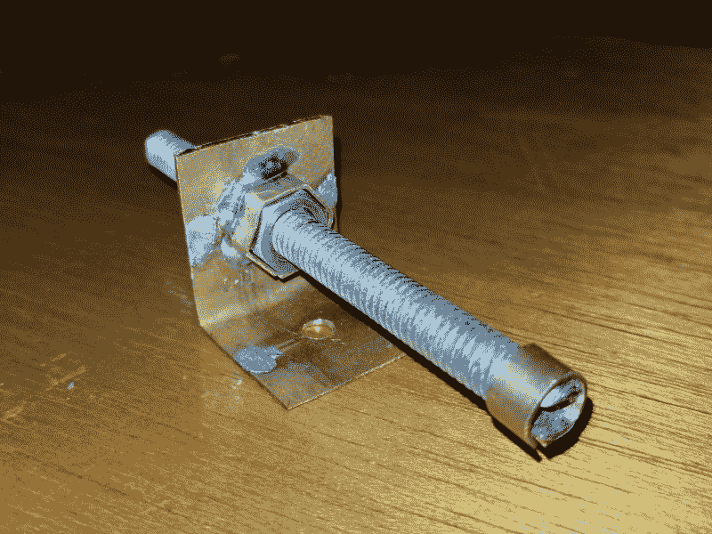

# 现成的黑客:帮助赫德利崛起

> 原文：<https://thenewstack.io/off-shelf-hacker-hedleys-challenge-rise-occasion/>

运送我的最新项目，[赫德利，蒸汽朋克智能机器人头骨，](https://thenewstack.io/off-shelf-hacker-machine-vision-meets-robotic-skull/)到一个活动是一个挑战。你怎样才能把他带到任何地方而不受到伤害？轻松、安全、放心地把我的小玩意带在路上已经成为一个新的优先事项。

就像其他的工程项目一样，开发变成了一种探索，一点点的尝试和错误，然后是权衡。在某个时候，我会为赫德利做一个旅行盒子。在这之前，所有的设计元素都应该处于稳定状态。这是一种由内而外的构建方法。

我考虑了很久的一个因素是在一场演出的开始，戏剧性地把赫德利从他的盒子里提了出来。自然，它将是机电驱动的。他在盒子里水平躺着可能是有道理的。我想象着打开盖子，赫德利会自动旋转到垂直位置。同样，当合上盖子时，赫德利应该缩回到盒子里。

今天，我们将看看这将如何工作的细节。

## 快速制作原型

赫德利安装在一个 8 1/2 英寸长的铝和铜臂的顶部，底部有一个枢轴。枢轴支架连接到一个基板上，该基板也支撑着树莓派。在过去，我使用一个相当坚固的齿轮马达直接从支点驱动手臂来提升手臂。它很重，所以我想我可以用一个重量更轻的塑料齿轮马达抬起头骨，你可以在小型两轮业余机器人中找到它。我在零件箱里有几个。

当然，塑料齿轮马达本身肯定无法将赫德利推上位置。它只是没有产生足够的扭矩。

我也一直在寻找机会，尝试使用 3/8 英寸的螺纹杆进行线性运动。家装商店里有 6 英尺长的，价格约为 6 美元。我想，如果我用一根带螺母的杆，我可以做一个基本的[电动螺丝(丝杠)](https://en.wikipedia.org/wiki/Leadscrew)机构，将头骨向上移动到位。动力螺丝提供了机械优势，很像齿轮系。塑料齿轮马达与动力螺杆的配合可以通过在杆的末端切割的槽来实现。

我首先切下一根 6 英寸长的杆，用锉刀将线的末端磨平。接下来，我用两个 3/8 英寸的螺母将杆垂直夹紧在大虎钳中，并用锯在杆的末端切割两个切口。切口间隔约 3/16 英寸，深度约 1/4 英寸。两个切口之间有一条金属线，所以我只是来回弯曲它，直到它断裂。然后，在 Dremel 中使用一个窄研磨盘来加宽槽以适合齿轮电机轴是一件简单的事情。我还用 1/16 英寸×1/4 英寸宽的黄铜扁材制作了一个环，以保持杆位于齿轮马达输出轴的中心。

DIY 动力螺丝特写

动力螺杆螺母用一个简单的 L 形支架固定在枢轴点上方 2 1/2 英寸的臂上，该支架由一根展平的 1/2 英寸铜管制成。是的，我知道，我用黄铜和铜做所有的东西。这符合我的蒸汽朋克小玩意主题。你也可以很容易地焊接铜和黄铜，所以这是用钢制造零件的另一个优势。

首先，切断动力螺旋机构

我测试了齿轮电机/动力螺杆组件，将齿轮电机与底座保持一定角度，并从 6 伏 700 毫安的壁式电源供电。

## 他上去了

我用一个小塑料齿轮马达把赫德利推上来的计划成功了。马达以每分钟 30 转的速度转动动力螺丝，赫德利花了大约 15 秒钟从水平移动到垂直。

虽然这听起来不错，但我应该指出，在测试过程中，电机非常紧张。另一个问题是开槽杆和齿轮电机轴之间的连接非常不稳定。

我们还需要考虑，我计划通过一个来自 Radio Shack 的小型电机控制器来驱动齿轮电机，该控制器也来自备件箱。双 H 桥控制器可以在 800 mA 下处理大约 6-12 伏的电压。它使用脉宽调制(PWM)技术，通过 Arduino 或 Raspberry Pi PWM 输出引脚实现电机正反向运动和速度控制。

根据过去的经验，我知道电机控制器会有一点点功率损耗。我没有时间在截止日期前一起测试电机控制器和齿轮电机。

我不认为这种组合能够将赫德利直立起来，特别是当我加入 JeVois 相机，头盖骨和背板以及下巴和云台左 LED 眼球的伺服系统的重量时。这甚至与动力螺丝。

别担心，我有个计划。

## 怎么办？

当吊桥升起的时候，你曾经在吊桥下吗？

这是一个非常酷的机制。道路从支点向外伸出，另一边是巨大的混凝土重量。整个装置非常平衡，有一个大的半月形齿轮，与一个非常小的电动马达相匹配。对于 50 英尺的跨度，如果马达超过 30 马力，我会感到惊讶。看看这段 YouTube 视频，看看中的[悬臂吊桥。](https://www.youtube.com/watch?v=4bWMpB2yf7w)

我计划对赫德利使用同样的想法，虽然我会用一个动力螺丝而不是一套齿轮来推动手臂。我想做的是将手臂枢轴点移动到当前位置上方大约 3 英寸，然后在与头骨相对的手臂末端悬挂一个重物，以平衡它。如果我得到了正确的平衡，使用这种机制上下移动头骨应该不需要太多的力量。

我甚至可以抛弃沉重的配重，这样赫德利仍然很容易携带。配重可以是一个很薄的容器，我一到场地就把它装满水。当然，它可以是装饰性的黄铜，并且可以拆卸以便于填充和清空。使用水还可以让我在给头骨增加/减少部件时调整配重。它仍然是一个功能原型，可以通过一些预先考虑来建立灵活性。

## 后续步骤

我将很快报告改变枢轴和重新配置齿轮电机，动力螺杆，电机控制器组合，以配合新的手臂设置。我要返工的权力，螺丝槽齿轮电机轴连接一点，太。

[像赫德利这样的物理计算栈项目](/tag/off-the-shelf-hacker/)，绝对具有挑战性，同时也充满乐趣。

随着人工智能(AI)取代工作中的人的所有谈论，我认为算法在有望取代创造项目的艺术性和工艺之前还有很长的路要走，这些项目包含机械装置、电机、传感器、微控制器、软件、固件、网络等。

机器人学会制造机器人还需要一段时间。

与此同时，我将带着赫德利在物理计算领域启发、教育和娱乐观众。AI 也不容易做到这一点。

<svg xmlns:xlink="http://www.w3.org/1999/xlink" viewBox="0 0 68 31" version="1.1"><title>Group</title> <desc>Created with Sketch.</desc></svg>