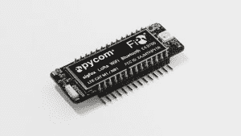
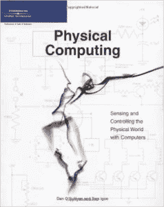

# 现成的黑客:硬件黑客的节日礼物创意

> 原文：<https://thenewstack.io/off-shelf-hacker-holiday-gifts-hardware-hacker/>

圣诞节和假日季节即将来临，为那个特别的[现成黑客](/tag/off-the-shelf-hacker/)挑选一份完美的礼物还为时不晚。嘿，也许也给你自己一点小礼物。去年我买了一台 [3.5 英寸彩色触摸屏 Pi-TFT 显示屏](https://www.adafruit.com/products/2050)。前年，一些[数码火花](http://digistump.com/products/1)出现在我的袜子里。极客，书呆子，工程师，黑客。是的，我相信读者会感同身受。

## 见见飞人

 你见过[新五网 FiPy 开发板](https://www.kickstarter.com/projects/1795343078/fipy-the-worlds-first-5-network-iot-dev-board?ref=thanks_tweet)吗？它非常适合物联网项目，其规格包括基于 ESP32 的主处理器以及 WiFi、BLE(蓝牙低能耗)、蜂窝 LTE-CAT M1/NB1、LoRa 和 SigFox。

网络处理器处理所有无线电和网络通信堆栈，让主处理器完全自由地用于用户应用。当设备处于深度睡眠模式时，还有一个额外的协处理器可以监控 GPIO 引脚、ADC 通道和大多数内部外设。硬件浮点加速可在两个内核上运行。多达 22 个 GPIO 可用，包括脉宽调制、12 位模拟通道、64 位定时器、I2C、SPI 等。一个内置的实时时钟完成了这个包。

谁会知道呢？我最近的[“收音机，无处不在的收音机”现成黑客](https://thenewstack.io/off-shelf-hacker-radios-radios-everywhere/)专栏讨论了 DIY/现成黑客可用的不同类型的收音机和网络。现在 FiPy 刚刚在 Kickstarter 上发布。我一定是灵媒！而且，不，我在公司没有任何财务或其他利益。

## 一本好书怎么样？

 也许一本物理计算书会有用。不妨弄一本由 Arduino 和纽约大学 Tisch 艺术学院的大师[汤姆·伊戈](https://tisch.nyu.edu/about/directory/itp/3558397)写的。如果你仔细观察 Arduino IDE 的示例程序，你会看到 Igoe 的一些注释混杂在代码中。

Igoe 的“[物理计算”](https://www.amazon.com/Physical-Computing-Sensing-Controlling-Computers/dp/159200346X/ref=sr_1_1?s=books&ie=UTF8&qid=1479826430&sr=1-1&keywords=physical+computing)是现成黑客的圣经。虽然几年前，文本带领读者通过基本的电子，硬件和物理计算代码策略。Igoe 还包括他构建的真实世界项目，从而阐明了他的主题。这个不会错的。

后续的“[让事情说话](https://www.amazon.com/Making-Things-Talk-Practical-Connecting/dp/0596510519/ref=sr_1_3?s=books&ie=UTF8&qid=1479826468&sr=1-3&keywords=making+things+talk)”将 Igoe 的讨论扩展到网络、通信和无线电。它还涵盖了比物理计算书籍中更多的最新硬件。我们以前在这里讨论过物理计算“堆栈”, Igoe 的书很好地向读者介绍了主要概念。

## 给他们一台适合你口袋的 Linux 电脑

[袖珍芯片](https://getchip.com/pages/pocketchip)是一个小小的 4.5”x 6.5”PCB(印刷电路板)掌上电脑，基于[9 美元芯片](https://getchip.com/pages/chip)。它有一个 4.5 英寸的触摸屏，彩色液晶显示器，一个 5 小时可充电的 LiPo 电池和一个非常灵活的薄膜键盘。它运行各种风格的 Linux，是一个很好的黑客、游戏和学习微控制器的小软件包。连接由板载 WiFi 和蓝牙处理。

不可否认，默认的用户桌面非常简单。运行 XFCE 很有挑战性，因为小屏幕相当狭窄。然而，大约 70 美元，你就可以在一个有趣的小设备中获得强大的计算能力。设备顶部甚至有焊盘，连接到芯片的大多数引脚。

https://www.youtube.com/watch?v=2vPpA5DI94I&feature=youtu.be

## Dashbot 怎么样？

[dash bot](https://www.kickstarter.com/projects/1598272670/dashbot-a-49-robot-for-your-dashboard)是一个声控仆人，坐在你汽车的仪表板上。Pocket CHIP 的母公司 Next Thing Company 正在 Kickstarter 上推销这款设备。广告称，该公司希望“把 Alexa 放到你的车里！”

这真的是一个很好的主意。

Dashbot 不是在你的手机上滚动播放列表或在旧的 Galaxy 5S 上敲打文本，而是通过两个专门的麦克风和一些数字信号处理魔法来拾取你的声音，使双手和眼睛自由操作变得无缝和简单。

方向和地图也是如此。你不用看手机就能工作。它不仅会给你音频响应，在 Dashbot 的前面还有一排 led 灯，为你指明正确的方向。

最后，该设备是基于 Next Thing 公司的芯片计算机。因此，有可能修改硬件、软件和固件。不过，我无法从网站上得知任何文档何时可用。

## 未来就在这里

现成的黑客技术在不断发展，我很高兴人们不断提出像 FiPy 和 Dashbot 这样疯狂的新想法。我很想知道 2017 年 11 月的圣诞清单是什么样的！

图片来自 Pixabay。

<svg xmlns:xlink="http://www.w3.org/1999/xlink" viewBox="0 0 68 31" version="1.1"><title>Group</title> <desc>Created with Sketch.</desc></svg>