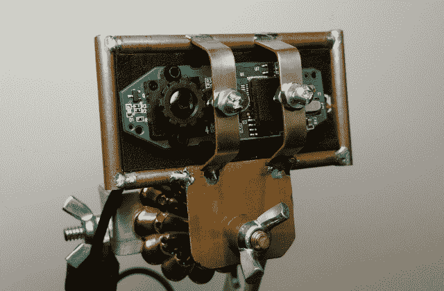

# 现成的黑客:学习焊接

> 原文：<https://thenewstack.io/off-shelf-hacker-learn-solder/>

本周的

**Off The Shelf Hacker**

专栏，作者是我们的常驻 IT 天才 mad

[Dr. Torq](http://drtorq.com/)

，涵盖了焊接非常重要的物理计算技能。只要稍加练习，你就能在你的 DIY/maker 运动项目中可靠地将各种电线、连接器、组件和零件连接在一起。

物理计算黑客需要焊接东西。这是一项必备技能。

电线需要固定在连接器上。你需要在印刷电路板上放置一个元件。我用这种细木工方法为我的会议徽章和蒸汽朋克主题的可穿戴设备制作黄铜和铜框架。

## 什么是焊接？

焊接是一种用低温导电填充材料连接两种金属的方法。待焊接的贱金属包括钢、铜(或镀铜)、镀锌件和黄铜，但不包括铝或塑料。填充合金的熔化温度(约 470 华氏度)低于基本金属，通常由锡和铅组成，比例通常为 60/40。钎焊与焊接的不同之处在于，基底金属没有被加热到熔点，而是刚好加热到填充合金容易流入接头的温度。助焊剂用于化学清洗金属表面，因此填料平滑地附着在基底金属上，形成牢固的结合。焊接也确保了牢固的电连接。

## 工具

典型的锡铅焊料的低熔点使得用手持式插入式烙铁进行连接变得切实可行。这些工具可以在电子商店、大盒子家装商店和互联网上买到。15 到 30 瓦的型号适合将电线焊接到小型连接器和印刷电路板上。焊枪对于较大的电气连接和需要更多热量的零件非常有用，比如我的黄铜蒸汽朋克项目框架。

蒸汽朋克主题的黑客网络摄像头

我用同一把韦勒枪已经有 30 年了，它们实际上是防弹的。没有必要在这些工具上花很多钱，所以只要得到基本的就可以了。

你还需要一些焊料。我喜欢 0.032 英寸，2.5 盎司，60/40，松香芯线轴，可从您当地的电子商店购买。这一小卷可以用你很长一段时间。避开酸性焊料，因为它用于连接铜管，对电子元件有腐蚀性。同样，也不需要银或高温合金。松香就在焊料中间，是一种非常有效的惰性助焊剂。保持简单，不要在这个领域变得异国情调。

手边有一个黄铜布里洛垫定期清洁烙铁头很有帮助。焊剂往往会腐蚀烙铁或枪尖，所以你也可以偶尔用锉刀将干净的铜片露出来，保持铜片没有弹坑。一些细砂纸也适合这项工作。锉削后，一定要用焊料重新涂抹尖端。

## 技术

一个好的焊接点是光滑的，并能很好地附着在基底金属上。冷接点看起来粘糊糊的，电气连接不良或不存在。过多的热量会熔化周围的零件，损坏精密的电子元件，尤其是晶体管、集成电路和印刷电路板上的铜迹线。最好是使用足够的热量来完成工作，不要过热。

关节准备也是建立良好连接的一个极其重要的部分。轻轻刮擦或打磨待连接的金属表面，尤其是如果有任何腐蚀或氧化。需要清除所有蜡、油和塑料涂层，以确保高质量的粘合。即使你手指上的油也会使你很难得到一个好的焊接点，所以要确保所有要焊接的东西都是明亮和无污染的。

我们终于到了焊接的实际阶段。

这很简单。假设您正在向一个小连接器添加一条电线。如果可行，清洁表面并将导线牢固地缠绕在连接器上。您也可以使用所谓的[助手或第三只手](https://en.wikipedia.org/wiki/Helping_hand_(tool))来将电线固定在连接器上。在焊接过程中，零件之间不应该有任何移动，否则你会得到一个坏的接头。

接下来，均匀加热两个部分，同时将焊料的末端抵住接头。随着填料的熔化，填料进入接缝，因此在母材周围形成了平滑的流动。液体填充物中不应有任何孔洞或空隙。一旦接缝被彻底涂覆，立即移除烙铁或喷枪。你可能需要移动烙铁来均匀地加热接头的两个部分，这样焊料才能顺畅地流动。尽量不要把熨斗留在接头上超过获得良好流动所需的时间，否则你可能会损坏其他部件。对于小型连接器，在将它们组合在一起形成一个接头之前，单独“预焊接”每个部分是有帮助的。然后，你只需要将零件放在一起，将熨斗“接触”到接头，以获得良好的流动。你也可以触摸焊料的末端，加入一点助焊剂。这有助于填料在零件周围流动。

接缝越大，需要的热量就越多。因此，焊锡丝接线片或 3/16 英寸铜管需要更大的烙铁或焊枪。我通常使用韦勒枪，在高(140 瓦)这样的工作。对于小型连接器或电路板上的微小元件，15 至 20 瓦的烙铁是安全有效的，不会产生过多的损坏元件的热量。

当我制作我的关节时，我总是在手边放一张稍微潮湿的纸巾来擦拭尖端。你会很快学会一种有效的技术，这样你就不会烧伤你的手指。

最后，你需要练习。一开始你可能会损坏一些组件。不要气馁。也许先在较大的零件上做一系列的试连接。自然地，我认为在真实的项目中工作是最好的学习方式，不熔化你的零件，当然是快速获得技能的激励。

## 包裹

焊接对于现成的物理计算黑客来说是一项关键技能。

记得清洁零件，使用正确的熨斗，不要移动接头，不要加热东西超过必要的时间。通过练习，你也会变得更好。

<svg xmlns:xlink="http://www.w3.org/1999/xlink" viewBox="0 0 68 31" version="1.1"><title>Group</title> <desc>Created with Sketch.</desc></svg>