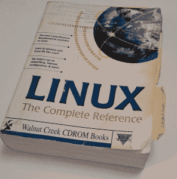

# 现成的黑客:廉价硬件的 Linux，过去和现在

> 原文：<https://thenewstack.io/off-shelf-hacker-linux-cheap-hardware-now/>

大多数人没有意识到 Linux 已经变得如此多产。距离[嵌入式 Linux 会议](http://events.linuxfoundation.org/events/embedded-linux-conference)只有一周了，我一直在思考 Linux 如何为我提供了一种计算“生命周期”的体验。20 年前，它为我的计算硬件提供了动力，今天依然如此。

## 开始的时候

早在 1986 年，我购买了我的第一台笔记本电脑，东芝 T1100-Plus 笔记本电脑。它有两个 720kB 的软盘，一个 7.16 MHz，80c86 CPU 和 640kB 的内存。屏幕是单色和无线的…嗯…还没有。这个可怕的怪物唯一可用的操作系统是 MS-DOS，它只有命令行。

[Minix](https://en.wikipedia.org/wiki/MINIX) 在野外，我在 T1100 上试过，效果一般。功能非常简单，在我的机器上使用起来很笨拙。Unix 相当成熟，我在工具设计部门管理的 Sun Microsystems 机器上有一个版本。

我想要更多。我想要更多。我想在家里安装 Unix。

当然，在旧的 T1100 上绝对不可能运行 Unix。

大约在 1997 年，我终于获得了一个属于自己的“类 Unix”系统。它变成了一个巨大的，看起来有 1000 万页的 Linux 手册和 CD 包，由[核桃溪](https://archive.org/details/walnutcreekcdrom&tab=collection)发行，并在当时最前沿的 CompUSA 商店购买。当时，该手册实际上只不过是看起来像是全部手册页的合订本，此外还有一些专家权威的采访。这些纸非常薄，有一种奇怪的“印刷油墨”的味道，我至今仍记忆犹新。

看似 1000 万页的“Linux:完整参考”

在我的办公室里，我有一台英特尔 486 台式电脑，它似乎是升级到 Linux 的完美选择。这个盒子有 640kB 的内存，一个 10MB(据我所知)的硬盘，一个 720kB 的软盘驱动器和一个早期的 CD 驱动器。

我花了好几个晚上在那台台式机上运行 CD 套装中的一个发行版 Slackware Linux。随着万维网的飞速发展，各地的技术人员都在建造自己的机器，Linux 逐渐成熟到“可供书呆子使用”的水平。在 2000 年末和 2010 年初，加载 Linux 对于主流 PC 用户来说仍然是完全不可能的。

从那时起，我已经在各种各样的惠普、联想、华硕笔记本电脑和白盒台式机上运行过 [Debian](https://www.debian.org/) 、 [SuSE](https://www.suse.com/) 、 [Red Hat](https://www.redhat.com/en) 和 [Ubuntu](https://www.ubuntu.com/) 的各种组合。

今天，主流 Linux 版本如 Ubuntu 和 [Mint](https://www.linuxmint.com/) 很受欢迎，几乎可以万无一失地安装在任何人的台式机或笔记本上。而且，如果你需要更多的选择， [DistroWatch](https://distrowatch.com/) 会跟踪几十个专门的 Linux 版本以供选择。

## Linux 将今天的硬件连接到过去

所以，我们到了 2017 年。

我家里所有的电脑，运行的都是 Linux。除了我女儿的 MacBook Pro。即使是这样，也是从 Linux 中派生出来的。

Linux 有非常广泛的硬件支持，特别是对现成的黑客[的支持。看看这个:](/tag/off-the-shelf-hacker/)

DIY/Maker 运动世界中支持 Linux 的旗舰微控制器是 Raspberry Pi 及其克隆产品。有各种版本的 [Raspbian](https://www.raspberrypi.org/downloads/raspbian/) 、 [Noobs](https://www.raspberrypi.org/downloads/noobs/) 、 [Ubuntu (Mate)](https://ubuntu-mate.org/raspberry-pi/) 和 [Red Hat (PiDora)](http://pidora.ca/) 都运行在 Pi 上。将图像文件下载到 PC 上，然后刻录到 micro-SD 卡上。将卡插入 Pi，连接显示器和键盘/鼠标垫，接通电源，您就可以开始运行了。

此外，还有可广泛安装的软件包，如运行在 Raspberry Pi 上的 Ubuntu Core、高通的 DragonBoard 410c、英特尔的 Joule 和三星的 Artik 主板。

大多数 Linux 版本都有一个桌面，包括基本的应用程序，如浏览器、文本编辑器、软件管理器和其他主流计算工具。

需要做一些老派的开发或系统管理工作？打开一个终端窗口，跳到功能强大的命令行上。您甚至不必使用显示器、键盘/鼠标和图形用户界面桌面。只需将您的主板配置为“无头”并使用 ssh 远程登录即可。Headless 和服务器是一体的，所以在这些纳米机器上安装 Linux，设置一个 [MQTT broker](https://thenewstack.io/off-shelf-hacker-lightweight-inter-device-messaging-mqtt/) (服务器)或 web 服务器是显而易见的。我[最近在一台无头的、配有 WiFi 的 9 美元芯片电脑上运行了 Mosquitto](https://thenewstack.io/off-shelf-hacker-mqtt-fun-network/)(MQTT 经纪人)。Linux 驻留在那块板上的闪存中。

然后你有异国情调的纳米 Linux 微控制器板，如 [BeagleBone 黑色无线](https://beagleboard.org/black-wireless)。这个小怪物在闪存中运行 Linux，512 MB 的 RAM，图形加速，HDMI，WiFi，蓝牙，一堆 GPIO 引脚和 2 个板载可编程实时单元(PRU)。这些 pru 将运行 Linux 的主处理器从处理低级硬件输入/输出任务中解放出来。这就像在树莓 Pi 中添加了几个高性能的 Arduinos，并将它们都放在同一个小小的独立电路板上。机器人和信号处理对骨骼来说是很棒的工作。

同样，您可以连接一个显示器/键盘组合，或者使用 ssh 和命令行无头(和无线)运行它，因为 Linux 的全部功能就在您的手边。

## Linux 继续前进

TechCrunch 最近[对新发布的](https://techcrunch.com/2017/01/06/next-thing-chip-pro/)[芯片 Pro](https://getchip.com/pages/chippro) 做了一个不错的评价，这是一个用于构建商业产品的可生产芯片计算机模块。什么样的日常问题可以用一个芯片 Pro、一些传感器、也许几个致动器、到网络的无线连接和巨大的 Linux 应用池来解决？令人难以置信。

你一定要去看看 LinuxGizmo 网站。它发现并报告运行 Linux 的绝对最新、最先进的主板。这些小机器包括从一次性专业模块到极限、多核、工业级单板计算机(SBC)的一切，拥有你能想象到的每一个铃声和哨声。可以理解的是，有些包括同样令人印象深刻的价格标签。

原型解决方案的高成本非常普遍。如果你正在解决一个有趣的问题，并对你的客户产生影响，那么成本通常会随着数量、更多的销售和产品/流程的成熟而下降。

我对 Linux 的使用始于相当低功率的计算硬件，在整个 PC 和笔记本时代逐渐增加，然后又回到连接到传感器和输出设备的中等功率单板计算机。随着时间的推移，今天的 nano-Linux 机器只会变得更加强大。我们还有多长时间才能拥有一台售价 1 美元、运行 Linux 的闪存单板机？那会很了不起，对吧？

我认为现在现成的黑客面临的最大挑战是识别有价值的问题，用所有这些很酷的工具、应用程序、硬件和 Linux 操作系统的力量来有效地解决这些问题。

<svg xmlns:xlink="http://www.w3.org/1999/xlink" viewBox="0 0 68 31" version="1.1"><title>Group</title> <desc>Created with Sketch.</desc></svg>