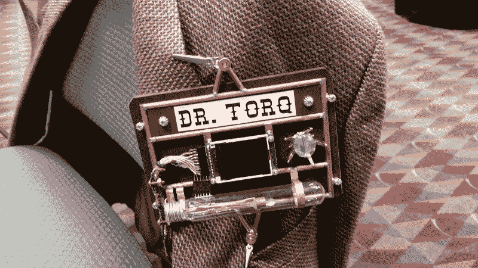

# 现成的黑客:Linux 如何驱动你的可穿戴项目

> 原文：<https://thenewstack.io/off-shelf-hacker-linux-power-wearables/>

我的老化的华硕双核笔记本、树莓派、Beaglebone Black、几个电视机顶盒和某些车载信息娱乐系统都有一些共同点:Linux。

没错，Linux 运行在一堆不同的硬件上。这对于现成的黑客来说是一个巨大的优势，因为不管你用什么平台，操作系统都是一样的。当然，你可能有不同风格的桌面、应用程序和命令行外壳。底层基础设施、文件系统和类似 Unix 的方法都是一样的。

很像你用来编程各代 Arduino 的 [Arduino IDE](https://thenewstack.io/off-shelf-hacker-tooling-around-arduino-ide/) ，以及 [ESP8266](https://thenewstack.io/off-shelf-hacker-split-personality-esp8266/) WiFi 芯片，Linux 提供了一个已经成为事实标准的开发和用户环境。

你听说过苹果的 iOS 运行在[树莓 Pi](https://thenewstack.io/off-shelf-hacker-first-look-raspberry-pi-3/) 上吗？不，我也不知道。码头上的窗户怎么样？等等，对了，树莓 Pi 还有一个版本，叫 [Windows 10 物联网核心](https://dev.windows.com/en-us/iot)。虽然它可以无头运行或带显示屏运行，但体验可能与笔记本电脑不太一样。在 Pi 上运行的各种版本的 Linux 能够同时运行大型应用程序和通用输入/输出任务，没有任何麻烦。

LibreOffice 是一个相当大的生产力套件，就像微软 Office 一样。它运行在 Pi 或 Linux 笔记本上。还有久经考验的开源图形编辑器 [GNU Gimp](https://www.gimp.org/) 。是的，Gimp 运行在 Linux 上，不管硬件平台是什么。

想要更多的证明 Linux 的强大和灵活性吗？

gen 4–蒸汽朋克会议徽章展示装置

以我的第 4 代[蒸汽朋克大会徽章，](https://thenewstack.io/hacking-hardware-the-never-ending-saga-of-steampunk-name-badge-development/)为例。这是一个树莓 Pi 2，有 1 GB 的内存，8 GB 的微型 SD 卡和 1.8 英寸的彩色 TFT 显示屏，运行在 [Raspbian Linux](https://www.raspbian.org/) 上。臭名昭著的“臭氧管”及其古色古香的玻璃灯泡和三色脉动 LED“晶体”通过通用输入/输出引脚运行。在这种配置中，它被认为是一台无头的 Linux 机器，因为您通过 SSH 在网络上与它进行交互。SSH 是一个加密的、安全的应用程序，用于远程登录 Linux 机器。通常我会坐在我的 Linux 驱动的华硕笔记本前，登录会议徽章，改变小 LCD 上播放的电影，调整“臭氧管”的颜色或编辑启动文件。

几乎所有我能在会议徽章上做的事情都可以在我的旧华硕笔记本上完成。他们都运行 Linux。

此外，当我调试系统和臭氧管 Python 代码时，通过 HDMI 端口和无线键盘将徽章连接到大屏幕液晶电视也没什么大不了的。

我一直在考虑的一个想法是从我的蒸汽朋克会议徽章运行我的幻灯片堆栈。走进我的一个技术会议，从翻领上取下我的徽章，然后把它插到投影仪上，这有多有趣？然后，我可以拿出一个无线罗技键盘/鼠标垫，开始进行我的技术演讲和现场展示，就在那里。

LibreOffice 在 Pi 2 上运行非常好，我用它来做演示(使用 LibreOffice Impress)、做电子表格(使用 LibreOffice Calc)和写我的技术文章(使用 LibreOffice Writer)。如果您想要闪电般快速的幻灯片切换，在 Impress 中，请确保在将图像插入幻灯片之前将其压缩到 250-500 KB 左右。在 Linux 笔记本或 Pi 2 上使用 Gimp 可以很容易地编辑和压缩图形。

我喜欢将会议徽章无缝转换成幻灯片演示机的想法，我认为它肯定会给我的技术演讲观众留下深刻印象。

开始思考如何将 Linux 的强大与“可穿戴设备”结合起来，看看你是否不会想出一些属于你自己的神奇组合。

<svg xmlns:xlink="http://www.w3.org/1999/xlink" viewBox="0 0 68 31" version="1.1"><title>Group</title> <desc>Created with Sketch.</desc></svg>