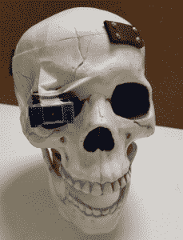

# 现成的黑客:机器视觉遇到机器人头骨

> 原文：<https://thenewstack.io/off-shelf-hacker-machine-vision-meets-robotic-skull/>

我想开始一个新项目，前几天在塔吉特百货偶然发现了一个塑料骷髅头。它大约 8 英寸高，6 英寸宽。下巴是活动的，里面是中空的。一个机器人头骨将非常适合我不断扩展的一次性蒸汽朋克物理计算原型项目。

建造一个机器人头骨也是开始使用新的 JeVois 机器视觉系统[的一个很好的借口，我们几周前总结了这个系统](https://thenewstack.io/off-shelf-hacker-feverish-new-pace-packaged-sensors/)。

今天，我将为这个头骨列出我的想法。可以说，我们可以利用两耳之间的空间做很多事情。当然，我们必须有有趣的动作，还必须有一些像脉冲 LED 照明这样的恐怖效果。我认为在即将到来的会议技术演讲中使用头骨会很有趣。更别说万圣节了。

## 进化到未来

读者可能还记得[那个蒸汽朋克眼球](https://thenewstack.io/off-shelf-hacker-behold-steampunk-eyeball-complete-part-5/)。它的目的是演示当前的现成技术，当我在它的视野中移动时跟踪我。虽然眼球的像素成像相机颜色斑点识别是革命性的，但几年前，它有严重的局限性。照明至关重要，这在日常会议中很难处理。而且，尽管我的一些机器人俱乐部的朋友有这种设备，但它从未在更大的行业社区中真正流行起来。这意味着没有太多的固件更新或新功能。

JeVois 设备会更好吗？我不知道。在我的工作中，我必须尝试一下。

好消息是，该相机支持一台专用于图像处理的四核 ARM nano-Linux 机器。我的初步测试表明，除了基本的颜色斑点识别，相机系统还能够识别物体、人、QR 码和 AR 标记。

例如，它确定我们的马耳他，亮片，作为一个玩具狮子狗。我认为这已经足够接近我们的目的了。

它还可以检测其视野中的运动，并通过串行端口输出相关信息，与 USB 流分开。数据流的组合将被其他处理器和设备用来做很酷的事情。

## 头骨应该做什么？

头骨将扮演与眼球相同的基本角色。即:

*   在现场表演中吸引人们的注意力并娱乐人们。
*   充当物理计算堆栈主题涵盖的真实世界演示。
*   激发观众想要构建他们自己的物理计算小工具。

其他可能性包括:

*   通过手势、动作、说话(移动它的下巴)等等与观众(和我)互动。
*   当我在房间里走动时可靠地跟踪我。
*   “倾听”命令并采取适当的行动。
*   上演自己的小秀，因为它“活了起来”
*   控制其他尚未定义的小工具，我可能会在演出中使用。

当然，正如各地的狂欢者所希望的:

这只是开始。现成的黑客知道，随着我们进入项目流程，新的用例和行为肯定会出现。这很棒，因为一旦你有了一个工作的硬件和软件平台，许多机器行为可以通过软件和固件模块来改变。

## 头脑风暴连接

我在项目早期做的一件事就是列清单。我只是把所有的想法和可能性都放到一个文本文档中，这样我就不会忘记东西了。

例如，根据我们在[现成黑客](/tag/off-the-shelf-hacker/)专栏中讨论过的几个主题，这里列出了我们可能会整合到 skull 中的可用技术:

*   带有伺服系统的头部平移(左右)。
*   头部倾斜(上下)与伺服。
*   带伺服机构的活动颚板。
*   使用电机/驱动板将头骨从箱子中提升出来。
*   LED 眼睛。
*   用伺服系统平移/倾斜眼球。
*   树莓派给大脑。
*   在 Pi 上使用 Python 进行语音合成。
*   使用 Pi 启用 Alexa。
*   Arduino 用于模拟输入和 PWM 输出。
*   通过内置 WiFi 或辅助 ESP8266 启用网络。
*   使用 Pi 使能 MQTT。

几天来，我带着 JeVois 相机和头骨到处走，我的妻子取笑我。这是我创作过程的一部分。用有效的方法让想法流动起来，建立联系，把想法写下来，然后去看看它是否有效。

## 机器人的一小步

我已经做好了头骨。

我们需要开始往里面放东西，所以我用 Dremel 切掉了头骨的顶部，然后在后面用铰链连接起来。我还用几根小皮带和一些黄铜螺丝将前缘固定回原位。

相机将安装在右眼窝中，使其易于调节和移动。

钳口需要某种枢轴，由伺服系统驱动。也许我会移植一个黄铜支架到颚骨的上部，连接到枢轴杆。那将是相当蒸汽朋克。

左右头骨平移的计划正在进行中。很可能滚珠轴承会在设计中找到自己的方式，就像在眼球中一样。

今天要做的是为 ESP8266 安装外部天线，并建造一个支架将摄像机安装在眼窝中。一旦我在头骨中或头骨上安装了一些硬件，项目的其他部分将开始到位。

想出你的想法，然后去店里做出来。剪切、修改、测试、冲洗和重复。

这就是我们现成黑客的工作。

<svg xmlns:xlink="http://www.w3.org/1999/xlink" viewBox="0 0 68 31" version="1.1"><title>Group</title> <desc>Created with Sketch.</desc></svg>