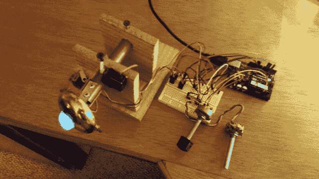

# 现成黑客:我怎么做蒸汽朋克眼球？

> 原文：<https://thenewstack.io/off-shelf-hacker-make-steampunk-eyeball/>

作为一名现成的黑客，我一直在不停地、永无止境地寻找新的项目创意。一个潜在的新项目总是从一些问题开始，即使我没有意识到这一点。

*   我在哪里可以找到项目创意？
*   我如何开始一个项目？
*   什么是“构建”过程？
*   什么样的事情阻碍了我，我如何克服完成项目的障碍？
*   我不用的想法怎么办？

在接下来的几篇[现成黑客](/tag/off-the-shelf-hacker/)专栏文章中，我们将探索做一个新项目的过程，并寻找所有这些有趣问题的答案。

## **注意当前的艺术**

前阵子，我碰到了 [Pixy 相机](http://charmedlabs.com/default/pixy-cmucam5/)。这是一款中等分辨率的设备，具有强大的内置板载视频处理引擎。它能够以每秒 50 帧的速度跟踪 7 种不同颜色的 100 个物体。我脑子里飞快地想着如何利用这样一只野兽。

很快，我的桌子上就有了一个。现在，我该怎么办？

像任何其他小工具一样，我立即连接上相机，测试它的速度。玩一个设备，一个新的应用程序或者一个新的流程是你下一个项目的必要组成部分。如果你不探索和跟上最新的艺术水平，你怎么可能知道，你能建造什么，特别是用最尖端的技术？

在进行探索和尽职调查的同时，最好能有一部分在你手中。有时，硬件还没有出售。没问题。互联网上充斥着各种零件和项目，这些零件和项目迫切需要组合成很酷的东西；你只是还不了解他们。利用互联网的魔力，定期花时间在“创意”网站上，如[黑客小工具](http://hackedgadgets.com/)、[每日黑客](http://hackaday.com/)、[指令工具](http://www.instructables.com/)、[奇点中心](http://singularityhub.com/)、 [GizMag](http://www.gizmag.com/) 和 [YCombinator](http://www.ycombinator.com/) 。

不要忘记跟上历史和旧技术。看看[lowtechmagazine.com](http://www.lowtechmagazine.com/)和最近的现成黑客故事，“[硬件黑客的过去和未来](https://thenewstack.io/off-shelf-hacker-past-future-hardware-hacking/)”

## 你想解决什么问题？

好了，我找到了一个像素相机，知道它的特点和工作原理。我如何把一块小小的电路板变成有用的东西？

我喜欢记下一张“想要”的清单。在企业界，这个列表被称为“需求”

作为一个技术作家，他也做了很多演讲，我有适合这两个领域的项目。我也是蒸汽朋克的粉丝，我发现读者和观众都喜欢我在故事和技术演讲中运用的美学。把这些东西放在一起，我得到了以下，没有特定的顺序:

*   使用像素相机
*   让它与众不同，这样它就能在会议上吸引注意力
*   让读者和观众觉得有趣
*   建造一些很酷的东西
*   让它动起来
*   给它一个强烈的蒸汽朋克的外观

当然，从一个“想要”的列表转移到一个实际工作的物理计算项目，需要一定的想象力。我认为，好的一面是，随着时间的推移，你可以发展你的想象力，并在这方面做得更好。像其他事情一样，想象力需要练习。

我想了很久如何使用小精灵。

一个周六，在奥兰多机器人和创客俱乐部，一位同事演示了他的机器人，它有可移动的乒乓球眼。我认为这很有趣，并开始试验伺服系统和我的设计。看看我早期的“门把手”版本。

早期的“门把手”伺服眼原型

它在 X-Y 方向移动，镜头后面有一个蓝色的 LED。在某一点上，我连接了 Pixy，可以跟踪物体，尽管它并没有很好地工作，因为我不明白 Pixy 伺服控制固件和伺服几何的细节。

后来，眼球的想法演变成足够大的东西，可以被看到并吸引观众的注意力，可以在我演讲时移动，被认为很酷，看起来像蒸汽朋克。

这是我目前的蒸汽朋克眼球项目。

这将是一个蒸汽朋克主题的桌面设备，当我在舞台上走来走去时，它会“看着”我。它将使用 Pixy 相机的颜色对象跟踪功能来激活伺服系统，使眼睛跟随我将穿在夹克或帽子上的颜色鲜艳的衬衫或标记(可能是红外线)。我们将进入零件的细节，并很快建立。

我的理由是，观众会受到这个装置的启发，可能会追求他们自己的项目，并希望开始一场对话。很自然，我在这里写这个项目，为了名声和财富。看，一切都解决了。

## **作业时间**

挑选一个你真正喜欢的设备，开始列出你的“想要”清单。把这个部件带在身边几天，定期看看它，记下你脑海中出现的想法。如果你愿意，可以用几个部分来做这件事。

探索设备的特性和功能。考虑如何利用这些特性和功能来做有用的事情。先不要担心实际问题，先把想法讨论一会儿。你可能会也可能不会考虑组合多个部分。尽量不要被所有伟大的可能性淹没。也许，这是一个开始一个你可以随身携带的小项目想法笔记本的好时机。

另一个建议是使用主题，以帮助你引导你的项目方向。我喜欢蒸汽朋克。

如果你把蒸汽朋克变成部分缩写，你会得到科学，技术，工程，艺术和数学或蒸汽。这是对我写作和谈论前沿创客型项目的兴趣的完美比喻。蒸汽朋克，写作和演讲对我来说是相辅相成的。我现在有无穷无尽的项目想法。

也许你喜欢太空。想想你的设备如何在以太空为主题的应用中工作。在模型火箭里放一个 Arduino 用于遥测。园艺主题怎么样？使用带有 USB 网络摄像头的树莓 Pi 来拍摄植物生长的延时照片。或者，也许是你项目的热门主题。使用一个 Pi、一些传感器和一个小的彩色 LCD 来显示引擎性能或在你的车里播放音乐。

你会找到窍门的。

## 下一步是什么？

下周，我们将讨论这些项目想法，并在接下来的几周内开始研究如何将其付诸实施。

第二栏到第四栏将涵盖项目开发和构建。然后第五个专栏将总结这个项目，涵盖我学到的经验教训，并讨论下一步/下一代的想法。

我会遮住我的蒸汽朋克眼球，你可以跟踪你自己的项目。大约一个月后，我们都有望完成工作项目。

<svg xmlns:xlink="http://www.w3.org/1999/xlink" viewBox="0 0 68 31" version="1.1"><title>Group</title> <desc>Created with Sketch.</desc></svg>