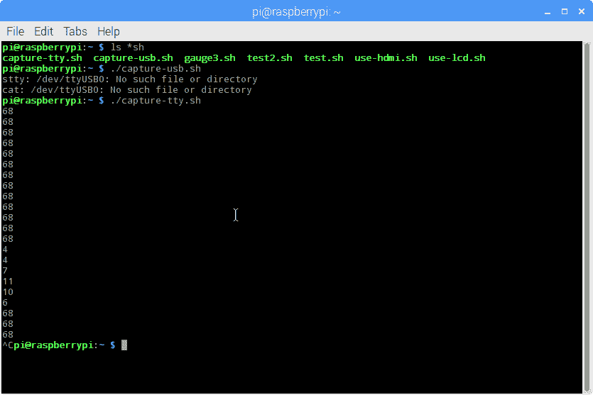
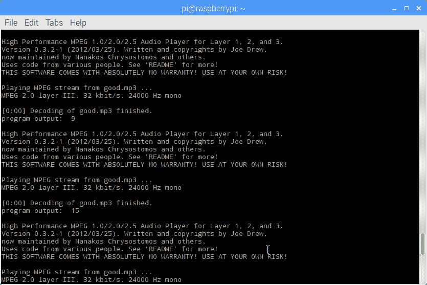

# 现成的黑客:让你的可穿戴设备与你对话

> 原文：<https://thenewstack.io/off-shelf-hacker-make-wearable-device-talk/>

构建可穿戴设备是探索“替代”界面的一个很好的方式。如果你的可穿戴设备可以做事情，然后告诉你结果，有点像亚马逊的 Alexa 语音助手，会怎么样？

早在一月份，我写了一篇专栏文章，讨论如何在树莓派上整合亚马逊 Alexa。不用手的工作可以通过耳机或小扬声器来呈现结果。今天，我们来看看如何让你的穿戴式对话。最棒的是，它运行得相当好，并且开始运行起来并不复杂。我们将从我自己的可穿戴设备开始，这是一款 Raspberry Pi 3，带有 Arduino Pro Mini 和连接到串行端口的超声波传感器。

## 保持简单，坚持使用 Python

经过一点研究，我发现在我的 PI 驱动的可穿戴设备上使用 Python 和[谷歌文本到语音](https://play.google.com/store/apps/details?id=com.google.android.tts&hl=en) (gTTS) API 似乎是一种合理的方式。Python 在每个 Raspberry Pi 上都是可用的，所以利用这一点对我们有利是有意义的。灵感来自 Python 编程语言网站上的[页面。我详细介绍了它的几个例子。](https://pythonprogramminglanguage.com/text-to-speech/)

第一件事就是安装 gTTS。我使用 Python 安装程序 [pip](https://en.wikipedia.org/wiki/Pip_(package_manager)) 来完成这个任务。

遗憾的是，安装没有成功，说是找库之类的有困难。

我在我的小工具上使用了 [Adafruit 3.5″ PiTFT 彩色触摸屏显示器](https://www.adafruit.com/product/2441)，并运行了它的一个稍微定制的 Linux 图像。在系统上运行升级往往会破坏 PiTFT 显示的设置，导致它变暗。在一次普通的“**sudo apt-get-upgrade**”尝试之后，我不得不重新刻录了几次图像，以使 TFT 屏幕再次工作。我的解决方案是尽量保持“库存”,并根据需要调整单个应用程序。难怪旧版本的支持程序可能会导致 pip 安装问题。

别担心。pip 中的“升级”选项成功了。

```
sudo pip install  --upgrade gTTS

```

安装了 gTTS 后，我只需要 MP3 播放器来“说出”输出。

mpg321 是一个轻量级的音频播放器，在树莓 Pi 上运行良好。这次我使用了**–升级选项**和 **apt-get** 。

```
sudo apt-get install  --upgrade mpg321

```

这是我借来的向耳机发送文本的代码。

```
from gtts import gTTS
import os
tts  =  gTTS(text='Its a beautiful day in the neighborhood',  lang='en')
tts.save("good.mp3")
os.system("mpg321 good.mp3")

```

执行如下:

注意，gTTS 获取文本并创建 mp3 音频文件，mpg321 通过系统调用播放该文件。

## 传感器对话

当你读取传感器数据，把它变成一个变量，并把它输入语音引擎，真正的乐趣就开始了。

在这种情况下，我使用超声波测距仪，连接到 Arduino Pro Mini，通过串行端口发送值。将这些值放入 Pi，gTTS 就可以通过耳机“告诉”我距离。

首先，我们需要将测距仪数据捕获到一个文件中。我使用了老的屡试不爽的" **cat /dev/ttyS0** "方法。

```
sudo stty  -icrnl  -F  /dev/ttyS0  115200
sudo cat  /dev/ttyS0  &gt;  rob.txt  &amp;

```

[](https://storage.googleapis.com/cdn.thenewstack.io/media/2017/10/15b5c5aa-screenshot-tty-data.png)

来自 Arduino Pro-Mini/超声波传感器串行线的距离数据。

当数据从 Arduino 到达时，它被复制到一个名为 rob.txt 的文件中。这个“&”使它在后台运行，并允许您使用同一个窗口来运行 Python 脚本。

下面是 Python 程序，它读入串行线路数据(来自文件 rob.txt)，用 gTTS 进行文本到语音的处理，然后在 Pi 上将结果音频输出到耳机。

```
from gtts import gTTS
import subprocess
while True:
 out  =  subprocess.check_output("tail -n 1 /home/pi/rob.txt",  shell=True)
 print  "program output: ",  out
 tts  =  gTTS(text=out,  lang='en')
 tts.save("good.mp3")
 subprocess.check_output("mpg321 -q good.mp3",  shell=True)

```

“while”循环从 rob.txt 文件中一次读取一行(tail-n-1)，输出每一遍的音频距离。整个过程中有足够的滞后，从测距仪每秒钟读取一次。

注意，我在第一个 Python 脚本中使用了一个 **os.system()** 调用，在第二个脚本中使用了**子 process.check_output** 。首选子流程方法，它有很多选项。还要注意，我使用了"-q" mpg321 选项来抑制通常发送到终端的标准报头和命令状态数据。

我用下面的代码运行了这个程序:

开始这个过程，然后在测距仪前握住我的手，给了我对应距离的源源不断的读数。

下面是一个没有-q 选项的屏幕截图，向您展示了打印到屏幕上的状态和信息:

[](https://storage.googleapis.com/cdn.thenewstack.io/media/2017/10/3b2d70f7-screenshot-audio-status.png)

mpg321 输出到终端，显示状态和信息(无 q 选项)。

你会注意到截图来自 HDMI 监视器上的全尺寸终端窗口。我承认，我用显示器开发了这个项目和这篇文章。当我戴着这款设备时，一切都是一样的，使用 3.5 英寸的 TFT 触摸屏，靠电池供电。

## 现成的石头

混合搭配树莓 Pi、gTTS、Arduino 和测距仪来获得音频距离对我来说非常有趣。不要忘记所有这些东西都是现成的。五年前，这相当困难。

你也不需要一开始就做出重大决策。使用当前现成的部件和 Linux 工具来构建 MVG(最小可行的小工具)，然后在学习的过程中添加特性和功能，这是一种有组织且有效的方法。

记住要有条不紊，记录下你的旅程，并记下哪些地方适合未来的项目。

谷歌是新堆栈的赞助商。

特征图像 [via](https://pxhere.com/en/photo/1369232) PXHere，版权 cc0。

<svg xmlns:xlink="http://www.w3.org/1999/xlink" viewBox="0 0 68 31" version="1.1"><title>Group</title> <desc>Created with Sketch.</desc></svg>