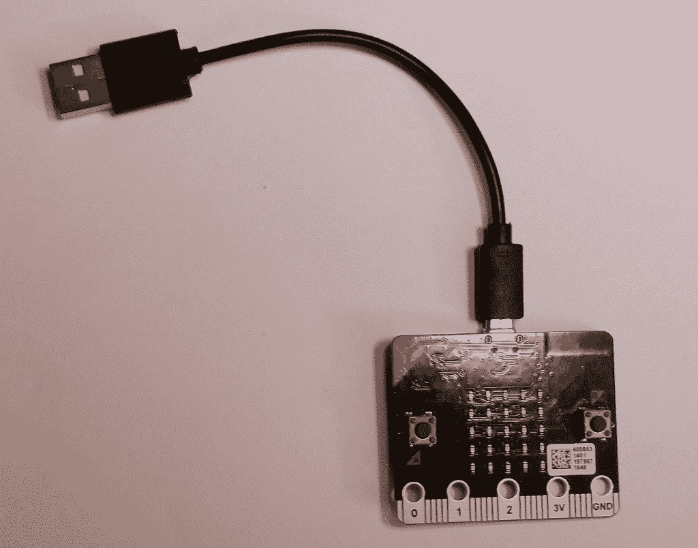

# 现成的黑客:满足微:位

> 原文：<https://thenewstack.io/off-shelf-hacker-meet-microbit/>

[micro:bit](http://www.microbit.org/) 是由 BBC 开发的小型 ARM 微控制器，与[和](http://www.microbit.org/team/)、[的一群科技巨头一起分发给英国的孩子们](https://arstechnica.co.uk/gadgets/2015/07/bbc-microbit-a-free-single-board-pc-for-every-year-7-kid-in-the-uk/)，帮助他们学习计算。该设备于 2016 年初向教师发布。

作为一名硬件黑客，我很好奇这款主板与 Arduino 或 Raspberry Pi 相比如何。和往常一样，我也想看看 micro:bit 如何在 Linux 笔记本上运行，以及它是否在现成的黑客工具箱中有一席之地。

这个设备很有趣，有一些很酷的功能。让我们来看看。

## 硬件概述

该板内置一个 16 MHz、32 位 Arm Cortex-MO 微控制器、256 KB 闪存和 16 KB 静态 RAM。它还有一个蓝牙低能耗无线电，用于与超级电话或其他配备蓝牙的设备进行本地联网。还有一个额外的 ARM 微控制器来处理 USB 连接和外部电源管理。作为内部集成电路(I2C)，它包括一个恩智浦/飞思卡尔 MMA8652 三轴[加速度计](https://www.dimensionengineering.com/info/accelerometers)和一个恩智浦/飞思卡尔 MAG3110 三轴[磁力计](http://www.gsmarena.com/glossary.php3?term=sensors)。前端用户界面是 25 个表面贴装 LED 阵列(排列成 5 X 5 矩阵)和两个按钮。主板背面有微型 USB 连接器、电源/上传状态 LED、复位按钮和外部 3.0 伏连接器。

微型钻头的前视图。

微型钻头的后视图。

还有一个 23 针边缘连接器和 5 环连接器。对于简单的项目，您可以将鳄鱼夹或香蕉插头连接到环形连接器。

两个右环连接器用于+3.0 伏和接地。引脚 0、1 和 2 用作模拟输入，而其余 23 个连接器用作 GPIO、模拟输入、电源和接地引脚。一些引脚与板载 LEDS 共享。各种引脚也支持 I2C 和 SPI 总线。

有一个[方便的帮助页面](https://www.microbit.co.uk/device/pins)更详细地描述了这些引脚。

## 软件怎么样？

回想一下，Raspberry Pi 是一个多用户、多任务系统。相比之下，micro:bit 类似于 Arduino 微控制器。它没有 Linux 操作系统或微型 SD 卡。也没有 WiFi 堆栈。不要因此而放弃，这是一款小巧精致的产品，拥有强大的功能。代码开发在笔记本上处理，并作为固件上传到 micro:bit。

micro:bit 使用[基于网络的应用](http://microbit.org/code/)来编辑和上传代码。当然，使用基于网络的工具意味着你的 Linux 笔记本需要 WiFi 或以太网连接。

没有 WiFi？没问题，用你的超级电话。下载 Android 应用程序，通过蓝牙将 micro:bit 与手机配对。基于网络的应用程序也可以通过手机运行。在接下来的一篇文章中，我们可能会介绍如何使用 Android 应用程序的 micro:bit。

几个编辑器是基于视觉的，“滑动部件在一起”应用程序非常适合和直观的儿童和初学者。它们包括:

*   [微软 PXT](https://www.pxt.io/) :支持基于块的编辑和 JavaScript。
*   [块编辑器](https://www.microbit.co.uk/blocks/editor):支持拖拽代码块。
*   Javascript: Code Kingdom 是 Javascript 的拖放编辑器。

我更喜欢传统的文本编辑器，所以幸运的是，也有一些这样的编辑器:

*   Python:基于文本的编辑器，有一组预构建的代码片段供您的项目使用
*   Microsoft Touch Develop:专为构建带触摸屏的移动应用程序而设计的编辑器

我对 Python 有些熟悉，所以这是我在这篇评论中使用的。这里有一个必需的“Hello，World”脚本的截屏，还有一些我从参考手册中找到的附加代码。

添加了我的代码的 Python 编辑器

MicroPython 文档易于使用，内容全面，充满了有用的代码片段。从[教程介绍页](http://microbit-micropython.readthedocs.io/en/latest/)开始。在屏幕的左侧有一个方便的索引，它会把你带到不同的主题。

代码完成后，我只需点击“下载”按钮，将所有内容编译成一个. HEX 文件。然后这个文件出现在我的 **/home/rob/Downloads** 目录中。我使用提供的 USB 线将 micro:bit 板连接到我的 Linux 笔记本上，并将文件复制到 **/media/rob/MICROBIT** 目录中。在 Linux 上使用 [Thunar 文件管理器应用程序](http://docs.xfce.org/xfce/thunar/start)使得处理文件变得轻而易举。

将文件复制(上传)到 **MICROBIT** 目录后，开发板将重启并运行脚本。如果有错误，一条消息将在 LED 阵列上滚动，指向代码中的违规行。

滑头！

## 更进一步

即使你习惯于在 Arduino IDE 生态系统中工作，我认为 micro:bit 作为一个易于编程的微控制器平台显示了很大的前景。Python 在纳米系统上越来越受欢迎。您可能已经将 Python 与 Raspberry Pi 一起使用过。

而且，我喜欢这个想法，你可以简单地编译程序，并使用一个简单的文件拷贝上传固件到板。这比标准的 Arduino 上传要容易得多，尤其是到 ESP8266 板。

虽然我们今天没有讨论通用输入/输出(GPIO)功能，但 micro:bit 是一个可靠的产品，我可能会在以后的文章中介绍其他细节和特性。

虽然 micro:bit 还没有在美国上市(虽然计划将它带到殖民地)，但它已经在英国和欧洲大部分地区上市，[通过经销商](http://www.microbit.org/about/)。

<svg xmlns:xlink="http://www.w3.org/1999/xlink" viewBox="0 0 68 31" version="1.1"><title>Group</title> <desc>Created with Sketch.</desc></svg>