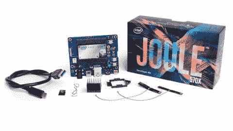

# 现成的黑客:微控制器革命才刚刚开始

> 原文：<https://thenewstack.io/off-shelf-hacker-microcontroller-revolution-just-getting-started/>

我们从上周的[“这个故事是在一台 9 美元的 Linux 计算机上创作的”专栏](https://thenewstack.io/off-shelf-hacker-eat-dog-food/)中得到了很好的回应，该专栏以低成本芯片板为特色。我在 PocketChip 上做的一些简介也在 HackerBoards 上运行，它也有相当多的页面浏览量。PocketChip 将芯片计算机放在一个塑料盒子里，里面有一个彩色触摸屏显示器，一个 clicky 印刷电路键盘和一个 Li-Po 电池装置。别担心，我不会用那个键盘写故事的。

本周，英特尔宣布了他们的[新焦耳模块](https://software.intel.com/en-us/iot/hardware/joule?cid=sem43700013210741191&intel_term=joule+intel&gclid=CO2Pw6aly84CFUFbhgod5hABuA&gclsrc=aw.ds)。它有一个运行在 1.7 GHz 的四核 64 位凌动处理器。还有 4 GB 的内存和 16 GB 的闪存。连接由集成的蓝牙和双频(2.4 和 5 GHz)无线电处理。MHF4 连接器可用于连接外部天线。Joule 还标配了 [Ostro Linux](https://ostroproject.org/) ，专注于物联网功能。其中一个 Joule 附加分线板将它变成了一台台式机。

## 令人敬畏的硬件，模糊的未来

这里我们有两个不同的 Linux 驱动的模块，涵盖了您可以购买的所有马力和价格范围。两者都有运行在闪存和大量内存中的 Linux，以及 WiFi 和蓝牙。两者都有通用数字输入/输出引脚，可以连接到各种传感器和输出。而且，它们都差不多有信用卡那么大。

现在怎么办？

我们正处于一个转折点。

这些低成本的设备已经克服了它们设计时所面临的一系列问题。这些主板是寻找解决问题的强大、廉价的解决方案。当你仔细想想，这确实是一个相当惊人的情况。

再加上我们从主流新闻中听到的乔布斯死亡的警告。电脑、云、人工智能和机器人将取代我们所有人，我们将无法谋生。据我所知，专栏作家已经被大型新闻媒体的散文式人工智能程序[所取代。呀！](http://nymag.com/daily/intelligencer/2014/07/why-robot-journalism-is-great-for-journalists.html)

这个信息对老博士来说是清楚的。

开始用微控制器、传感器、致动器、机制、固件和网络寻找要解决的问题，然后将它们构建成真实的东西。

## 重大的大脑转移

最后一个概念……网络……以及现在的模块连接是革命性的。

我们正处于这场革命的开端。而且，这是一个巨大的挑战，因为从传统的“闪烁几个 led 的观点”到“永远连接的心态”，对许多人来说绝对是一个巨大的进步。

想想看，过去的六个月已经让 WiFI 和蓝牙基本上饱和了主流微控制器。现在它在这里，我们可以制造各种各样的小玩意，不仅有按钮，伺服系统和全球定位系统，还可以连接到本地网络，几乎完全靠自己。

> 如果我们有五个微控制器，通过 WiFi 连接，在 100 英尺的范围内，我们可以解决什么问题？

这些设备可以随意相互通话。

虽然芯片和 Joule 有 WiFi 很好，但[、3 美元的类似 Arduino 的设备](http://www.gearbest.com/transmitters-receivers-module/pp_227650.html?currency=USD&gclid=CM2Drtujy84CFRY6gQodc0kIGA)也在获得这种能力。

你可能还记得我用 ESP8266 为 LibreOffice 设计的[滑动点击器](https://thenewstack.io/off-shelf-hacker-two-way-comms-esp8266/)。这个项目是一个简单的例子，读取一些按钮并与另一台机器上的另一个程序无线通信，在我的幻灯片堆栈中向前或向后移动。

那另一台机器，不一定是我的华硕旧笔记本。这将是一个 Pi，芯片或其他未知的支持 WiFi 的 nano-Linux 板，我将用它来管理我的会议技术演讲幻灯片。我已经几年没有用笔记本电脑做演示了。

## 100 英尺范围内的微控制器

如果我们有五个微控制器，通过 WiFi 连接，在 100 英尺的范围内，我们可以解决什么问题？

你可以测量土壤湿度，打开洒水器，让你的花园最大限度地生长。那是一个无聊的开始。想得更大。

在你 100 英尺院子周围的柱子上安装 led 怎么样，这些柱子发送编码信息(通过支持 WiFi 的微控制器)来告诉你的机器人割草机(也有 WiFi 微控制器和旋转 LED 光束检测器)在割草时的准确位置。如果割草机冒险离开周界，它也可以获得“停止”命令，因为 LED 灯杆也可以检测到割草机穿过虚拟围栏(使用 PIR 或超声波测距仪)。你快到了。

在更大的范围内，也许我们会有 10 辆重型推车，用来移动一座 100 吨的房子。房子必须保持水平，推车不能改变它们相对于彼此的位置。而且，他们必须一起转动，沿着街道移动房子。现在你在谈论一个项目！

当然，你可以让你的搬家工人手动控制每个推车。

你能建造一个像[房屋移动小车](http://www.telkamptransportsystems.com/#!our-products/c10my)一样的巨型机器的网络版本吗？这需要微控制器、传感器、机械和搬家业务方面的知识。我想会有认证和监管方面的考虑，执照和培训。我在网上快速搜索了一下，并没有找到太多关于“房屋移动推车或机器人”的内容。

将传感器、液压控制、千斤顶和车轮马达与配备 WiFi 的微控制器集成在一起，以处理所有需要在毫秒内发生的计算和调整，这肯定是有意义的，因此房子可以安全地从东榆树 27 号搬到北橡树街 54 号。

一个人可以通过网络控制盒“驾驶”房子。每个联网的小车可以测量负载，跟踪和控制车轮角度，进行调平计算，并调整机器以防止墙壁出现裂缝。所有的推车都需要彼此保持联系。而且，由于所有的推车都可以互相交谈，你也可以建立一系列人类安全功能。没有人想被 100 吨重的房子碾过，甚至被砸断脚趾。

这绝对是一个非常突出的例子，这正是问题所在。

谁会考虑那种问题？也许是几个搬家的人。

## 到处都是问题

现在你正在思考这个问题，并且真的处于一个转折点。

我要说的是，有了现在这些现成的、总是通信的微控制器，我们可以警惕那些疯狂的、绕着海王星转的问题，这些问题我们以前从未想到过。

就像建立一个移动房子的推车“网络”。

[英特尔](https://www.intel.com/content/www/us/en/it-management/intel-it/it-managers.html)是新堆栈的赞助商。

<svg xmlns:xlink="http://www.w3.org/1999/xlink" viewBox="0 0 68 31" version="1.1"><title>Group</title> <desc>Created with Sketch.</desc></svg>