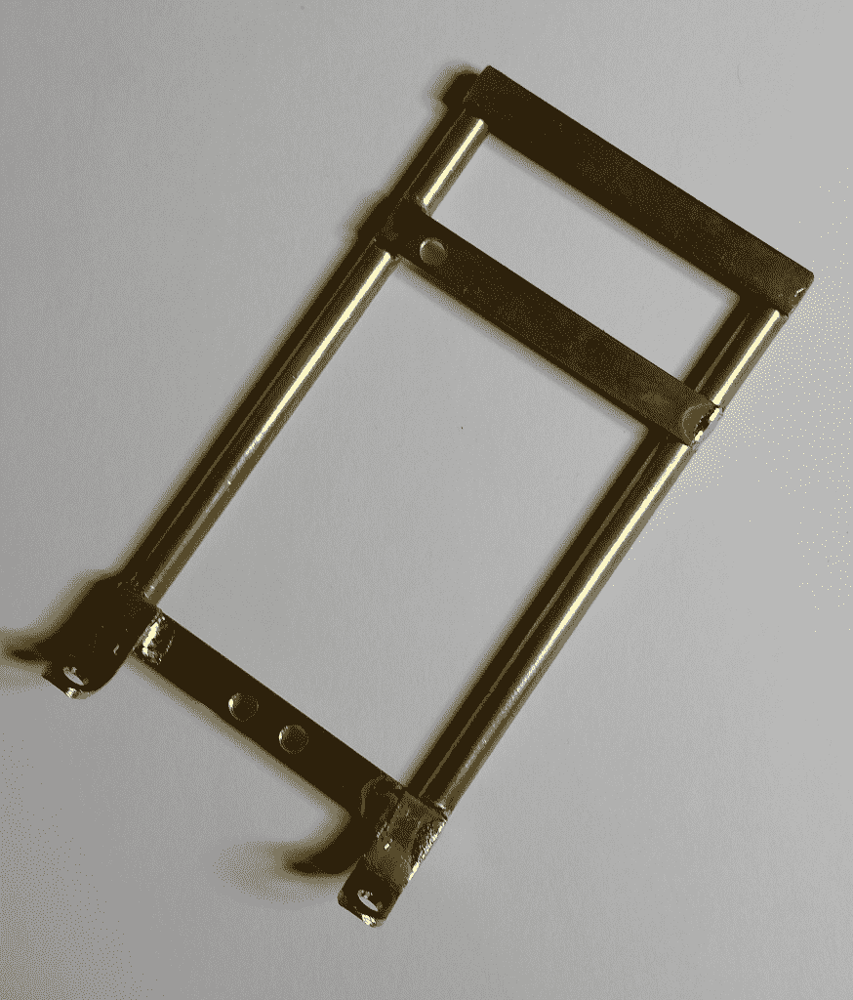
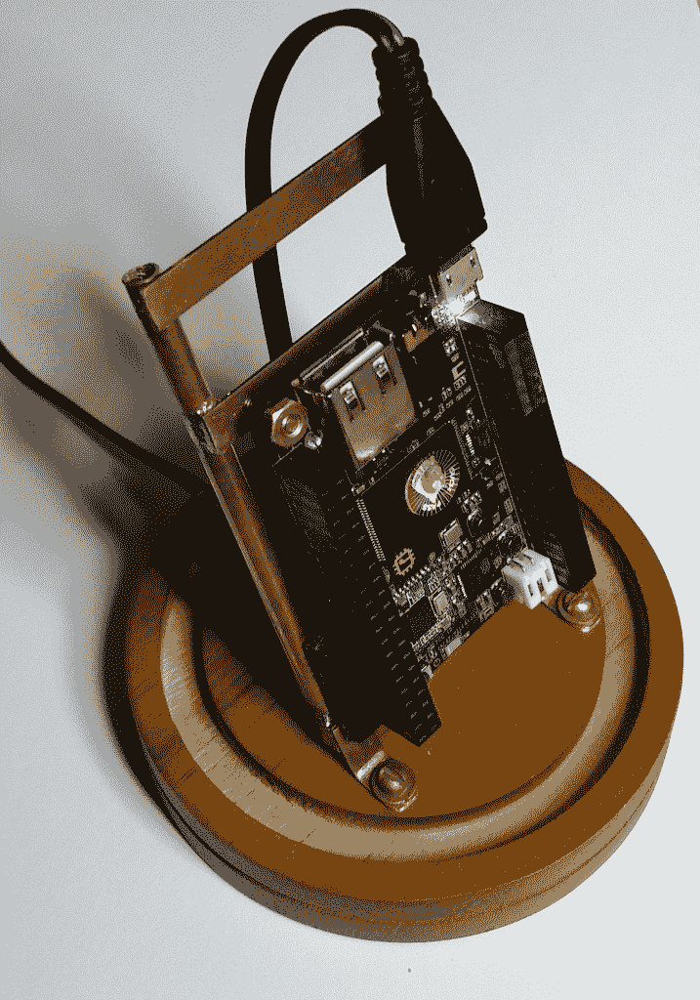
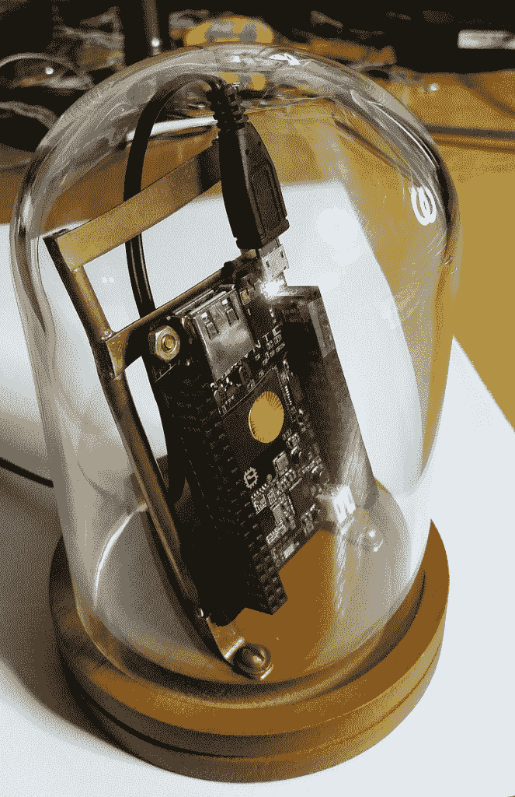

# 现成的黑客:玻璃下的蚊子

> 原文：<https://thenewstack.io/off-shelf-hacker-mosquitto-glass/>

基于芯片计算机的 MQTT 计划的工作仍在继续，最近[报道了](https://thenewstack.io/off-shelf-hacker-putting-mqtt-broker-work-chip-platform/)关于[现成的黑客](https://thenewstack.io/off-shelf-hacker-run-portable-mqtt-broker-chip-platform/)。我将使用 MQTT 代理作为各种“远程”项目的数据中心。

所谓远程，我指的是通过通用输入/输出引脚(GPIO)将消息无线发送到触发物理动作的设备。该设备也可能会发回一个响应，比如从传感器发送到发送者。双向和一对多或多对一消息传递是 MQTT 的基本功能。

MQTT (MQ 遥测传输)是一个成熟的客户端-服务器消息传递系统，它使用轻量级的[发布者/订阅者模型](https://msdn.microsoft.com/en-us/library/ff649664.aspx)，并在 TCP/IP 网络上运行。它是为远程位置的设备之间的连接而设计的，具有有限的带宽和可能的高延迟。为了实现 MQTT，我使用了一个开源消息代理[mosquito](https://mosquitto.org/)。

我已经为 MQTT/芯片数据中心考虑了一段时间了。因为我将在我的店里制作其他 MQTT 设备的原型，所以一个装饰性的桌面外壳看起来是个不错的选择。我可以把它放在我的桌子或书架上，插上电源，不用太担心它。

别忘了 Mosquitto/芯片是作为自己的 WiFi 接入点设置的，使其成为一个独立的数据中枢设备。只需将所有边缘设备连接到 AP，并开始来回发送消息。

它足够小，可以随身携带，在[新的煎饼早餐会](https://thenewstack.io/stackie-pancakebot-steampunk-pals-hit-silicon-valley/)上展示。我可以把它放在一个有衬垫的小盒子里运到会场。或者，在路上或野外使用时，可以将 mosquito/CHIP 数据集线器板从一个外壳中取出，放入另一个坚固的便携式外壳中。模块化和可互换性是[现成黑客](/tag/off-the-shelf-hacker/)工具箱中的重要概念。

今天的快速原型制作考察了项目的美学、来源和构建。

## 走进一家“观念”商店

我一直喜欢老式股票自动收报机的外观。为什么不把微型芯片计算机放在一个小玻璃圆顶下呢？你知道，玻璃穹顶在蒸汽朋克项目中很受欢迎。自然，我们也可以巧妙地把一个短语，称之为“玻璃下的蚊子”项目。

下一个问题是，“我在哪里可以找到一个小玻璃穹顶和底座？”

爱好大厅有四种不同的大小。我花了大约 8 美元买了一个 3×5 英寸的型号，另外花了 3 美元买了一个配套的底座。加上两张折扣券，总共是 6 美元左右。

听起来很疯狂，但我经常花相当多的时间在各种零售店闲逛，做我所谓的“可能性侦察项目”这是我小时候住在小城镇时养成的习惯，那时我的童年娱乐选择有限。作为一个极客也有帮助。年轻时，我会在旅途中花数小时检查螺栓、铰链、电器、新技术、钓鱼设备和各种各样的小玩意。

这种“习惯”，实际上是我对一切事物永不满足的好奇心，带我去了家装店、大盒子电子产品零售店、附近的五金店、旧货店和古董专卖店。当然，蒸汽朋克因来源的多样性而繁荣。

工匠了解他的材料。现成的黑客当然是工匠，尽管带有明显的 21 世纪的技术色彩。

所以一定要逛各种各样的店，随便逛逛。思考您的项目，以及如何组合您所发现的内容，以获得您所寻求的外观和功能。这需要练习，有了经验你会变得更好。

## 安装 mosquito/芯片

在最近的 Cloud Foundry 峰会的会场上，人们问我关于第五代蒸汽朋克会议徽章的计划。没有了。我做快速移动的、一次性的原型，然后在文章和技术讲座中介绍这些项目。用详细的制造图纸、大量的原理图、细致的材料清单等等来记录一个构建，并不是一件优先考虑的事情，因为它们是劳动密集型的，而且我目前并没有将这种努力货币化。如果人们有兴趣购买的话，也许我会提供一些计划或操作指南。

考虑到所有这些，大多数时候我只是“看”尺寸，然后根据需要切割和焊接零件。几个项目之后，你会发展出这种快速制作的诀窍。快速原型制作是一个具有挑战性的平衡行为，既要在不损失动力的情况下完成工作，又要让工作看起来不错。实践和大量的切割和焊接会让你达到目的。

对于 Mosquitto/CHIP 支架，我将几根 3/16 英寸的铜管切割成大约 3-1/2 英寸长。将两根管子沿着芯片板的长轴放置在芯片板旁边，然后将三根 3/8" X 1/16 "黄铜扁材交叉放置，以在底部支撑电路板，与单个安装孔(靠近 USB 连接器)处于同一水平，并位于框架顶部。

mosquito/CHIP 的裸黄铜框架图片

我选择在穹顶内部倾斜框架，使板子更容易被看到，而不仅仅是上下垂直的方向。框架还延伸到电路板上方约一英寸，以保护和稳定连接器(微型 USB、USB 和音频)。

夹在我的胶合板工作台上，零件被焊接在一起，经过仔细调整，以确保一切都是方形的，排列正确。你必须用大功率(140 瓦)的焊枪快速工作，这样你在一个区域的手工就不会松开已经焊接好的零件。同样，实践会产生积极的结果。

两块 3/8 英寸 X 1/16 英寸的黄铜扁材也用作安装脚，将框架固定在木制圆顶底座上。我只是把它们焊接在框架的底部。

无玻璃圆顶的 mosquito/CHIP 和框架图片

我还必须在木制底座的后部切一个槽，以便将电源线插入圆顶。在这个过程中，底座被夹在我的工作台上，用 Dremel 切割。我用了一个[“螺旋，侧切”钻头](https://www.dremel.com/en_US/products/-/show-product/accessories/561-multipurpose-cutting-bit)与 Dremel，设置在最低速度。切口延伸到圆顶环形槽的下方，以便电线可以从圆顶的边缘下方穿过。

## 后续步骤

我计划在一个小支架上添加一个三色 LED，将光线投射到芯片的正面。我认为当 mosquito-Under-Glass 运行时，点亮面板前面的组件会增加一个不错的蒸汽朋克效果。三色 LED 将需要一些限流电阻，并将连接到芯片的三个 GPIO 引脚。Python 程序将控制 LED。这几乎是我在第四代会议徽章“臭氧管”上使用的镜像。

希望我的例子有助于引发思考，并激发你运用你的创造力来构建你自己的酷的新物理计算项目。

<svg xmlns:xlink="http://www.w3.org/1999/xlink" viewBox="0 0 68 31" version="1.1"><title>Group</title> <desc>Created with Sketch.</desc></svg>