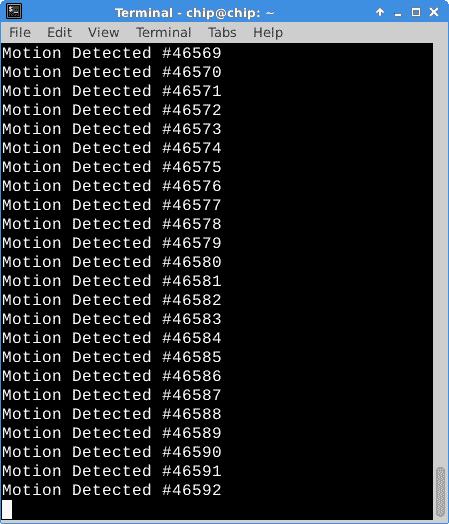

# 现成的黑客:网络上更多的 MQTT 乐趣

> 原文：<https://thenewstack.io/off-shelf-hacker-mqtt-fun-network/>

本周，我再次挖掘 [MQTT](http://mqtt.org/) 消息协议，以及如何将它与 ESP8266 模块、Raspberry Pi、芯片和我的 Linux 笔记本一起使用。在所有这些设备之间轻松发送双向消息的能力为有趣且可能有用的远程和自动化小工具开辟了许多可能性。

在一台芯片计算机上安装 [Mosquitto](https://mosquitto.org/) MQTT 代理是一件绝对简单的事情，正如上周的文章中所解释的那样。顺便说一下，如果它在启动时没有重新启动，你可能需要编辑 **/etc/rc.local** ，作为 root 并在底部添加一个引用程序，以及“&”(在后台运行)符号。然后它应该在下次启动时启动。

在芯片上运行 Mosquitto 也没有痛苦。我在厨房里有一个备用插座，所以我简单地将它插入一个 2 安培的壁式电源插座，并将电路板放在一个不碍事的架子上。在过去的几天里，它一直愉快地运行着，代理 MQTT 消息。我可以在我的局域网上的任何地方，使用 Linux 笔记本或我的 Android 超级手机，通过 ssh 和/或 **MQTT_subscribe** 进入芯片。

谷歌 Play 商店有许多 Android MQTT 客户端程序。只需在搜索栏中输入“ [MQTT client](https://play.google.com/store/search?q=MQTT%20client&hl=en) ”并选择一个。将它们用于测试或快速脏数据监控解决方案。一旦你的手机上有了客户端应用，只需输入你的芯片的 IP 地址和适当的主题，你通常就可以开始了。

接下来，我们来谈谈我们的数据生成器。

## 为 MQTT 修改 ESP8266 固件

基于 ESP8266 的传感器是很好的数据生成器。它们价格低廉，易于通过 Arduino IDE 进行编程，并且可以毫不费力地处理 MQTT 消息。选择您的传感器，将其连接到 GPIO 引脚，然后开始发送数据。从另一个方向来看，选择一个输出设备，观察特定的消息并激活连接到该设备的引脚。我们将在以后的文章中介绍如何观察消息(在 ESP8266 上)和激活 GPIO 引脚。

我使用 mqtt_esp8266 示例程序(在 Arduino IDE 中)作为 esp8266 上的基本 mqtt 客户端。添加 PIR 传感器代码(已在[“创建带有被动式红外传感器的早期预警探测器”](https://thenewstack.io/off-shelf-hacker-create-early-warning-detector-passive-infrared-sensors/)中介绍)可生成一个完全可用的数据生成程序。每当热物体移动到传感器前面时，它就向芯片代理发送 MQTT 消息。听着，妈，没有电线。

这是代码。

```
/*
 -----------------------------------------
 drtorq's Modded - Basic ESP8266 MQTT example
 filename: mqtt_esp8266_1
 -----------------------------------------
*/

#include 
#include 

// Update these with values suitable for your network.

const char*  ssid  =  "your AP name";
const char*  password  =  "your AP password";
const char*  mqtt_server  =  "192.168.1.111"; // IP address of the MQTT Broker

WiFiClient espClient;
PubSubClient client(espClient);
long lastMsg  =  0;
char msg[50];
int value  =  0;

int calibrationTime  =  20;
int pirPin  =  2;    //the digital pin connected to the PIR sensor's output
int ledPin  =  13;

void setup_wifi()  {

  delay(10);
  // We start by connecting to a WiFi network
  Serial.println();
  Serial.print("Connecting to ");
  Serial.println(ssid);

  WiFi.begin(ssid,  password);

  while  (WiFi.status()  !=  WL_CONNECTED)  {
    delay(500);
    Serial.print(".");
  }

  randomSeed(micros());

  Serial.println("");
  Serial.println("WiFi connected");
  Serial.println("IP address: ");
  Serial.println(WiFi.localIP());
}

void callback(char*  topic,  byte*  payload,  unsigned int length)  {
  Serial.print("Message arrived [");
  Serial.print(topic);
  Serial.print("] ");
  for  (int  i  =  0;  i  &lt;  length;  i++)  {
    Serial.print((char)payload[i]);
  }
  Serial.println();

  // Switch on the LED if an 1 was received as first character
  if  ((char)payload[0]  ==  '1')  {
    digitalWrite(BUILTIN_LED,  LOW); // Turn the LED on (Note that LOW is the voltage level
    // but actually the LED is on; this is because
    // it is acive low on the ESP-01)
  }  else  {
    digitalWrite(BUILTIN_LED,  HIGH);  // Turn the LED off by making the voltage HIGH
  }
}

void reconnect()  {
  // Loop until we're reconnected
  while  (!client.connected())  {
    Serial.print("Attempting MQTT connection...");
    // Create a random client ID
    String clientId  =  "ESP8266Client-";
    clientId  +=  String(random(0xffff),  HEX);
    // Attempt to connect
    if  (client.connect(clientId.c_str()))  {
      Serial.println("connected");
      // Once connected, publish an announcement...
      client.publish("mqtt",  "hello world");
      // ... and resubscribe
      client.subscribe("inTopic");
    }  else  {
      Serial.print("failed, rc=");
      Serial.print(client.state());
      Serial.println(" try again in 5 seconds");
      // Wait 5 seconds before retrying
      delay(5000);
    }
  }
}

void setup()  {
  pinMode(BUILTIN_LED,  OUTPUT); // Initialize the BUILTIN_LED pin as an output
  Serial.begin(115200);
  setup_wifi();
  client.setServer(mqtt_server,  1883);
  client.setCallback(callback);

 // Calibrate sensor
  Serial.print("calibrating sensor ");
    for(int  i  =  0;  i  &lt;  calibrationTime;  i++){
      Serial.print(".");
      delay(1000);
      }
    Serial.println(" done");
    Serial.println("SENSOR ACTIVE");
    delay(50);
}

void loop()  {

  if  (!client.connected())  {
    reconnect();
  }
  client.loop();

    // added PIR sensor code segment here

    int proximity  =  digitalRead(pirPin);

    if  (proximity  ==  LOW)  // If the sensor's output goes low, motion is detected
 {
 digitalWrite(ledPin,  HIGH);
 snprintf  (msg,  75,  "Motion Detected #%ld",  value);
 ++value;
 Serial.println("Motion detected!");
 client.publish("mqtt",  msg);
 delay(200);
 }
    else
 {
 digitalWrite(ledPin,  LOW);
 delay(200);
    }  
}

```

该设置已经静默运行了几天，每次我在办公桌前移动时都会被检测到。这里有一个在 Linux 笔记本窗口上的 **mosquitto_sub** 命令的屏幕截图，从网络上监控传感器。没错，超过 46，500 条“侦测到移动”信息。很管用。



Linux 笔记本上的 mosquitto_sub 结果

传感器能够在一秒钟内看到几次运动，因此在它最初启动后，更改代码以忽略一到三秒钟的检测，将减少流向代理的数据量。我认为在现实世界中，使用这种技术，我们不太可能漏掉入侵者。

基于 ESP8266 的设备不是唯一可以发送 MQTT 消息的设备。

## 也在 Raspberry Pi 上运行 MQTT 客户机

Raspberry Pi 也可以作为订阅者和发布者加入到您的 MQTT 世界中。

想象一下，有一个支持 ESP8266 的院子灯，它通过 MQTT 消息切换开/关。如果能够按下树莓派上的按钮并打开灯，这可能会很有用。

我不久前写了一个 Python 程序来检测树莓派上的按钮。因为它使用了 [xdotool](http://www.semicomplete.com/projects/xdotool) 和一个系统调用，所以有点像组装的。现成的黑客有时是一个[组装](http://www.urbandictionary.com/define.php?term=kludge)。就像我常说的，让原型工作，做你的演示，然后根据需要改进设计。此外，如果它工作得足够好，您可能总是“按原样”使用它

好的一面是，我所要做的就是将 mosquito 客户端添加到 Pi 中，并修改 Python 程序来调用**mosquito _ pub**命令，而不是 **xdotool** 。

启动 Pi 并使用 **apt-get** 安装 Mosquitto 客户端软件。

```
pi%  apt-get install mosquitto-clients

```

接下来，通过芯片 MQTT 代理(IP=192.168.1.111)订阅 PIR 传感器，试用 Mosquitto 客户端。

```
pi%  mosquitto_sub  -h  192.168.1.111  -t  “mqtt”

```

只要 PIR 传感器前面有移动，就会出现一条新消息。

使用**mosquito _ pub**命令测试发送信息也很容易。在 Raspberry Pi 上打开另一个终端，并输入以下命令行。

```
pi%  mosquitto_pub  -h  192.168.1.111  -t  “mqtt”  -m  “Button Pushed”

```

另一个 Raspberry Pi 窗口中会立即显示“按钮已按下”。如果您在 Linux 笔记本上监视“mqtt”主题，该消息也会出现在那里。

下面是 Python 代码，用 Pi:
上的**mosquito _ pub**行代替 xdotool

```
# filename: mqtt-button-push.py

import RPi.GPIO as GPIO
import time
import os

GPIO.setmode(GPIO.BCM)

GPIO.setup(17,  GPIO.IN,  pull_up_down=GPIO.PUD_UP)

osout  =  ''

while True:
    input_state  =  GPIO.input(17)
    if input_state  ==  False:

        print  'Long Button Pressed'

        # os.system("xdotool search --name 'Impress' key Down")
        # system call line for a button push to advance a LibreOffice Impress slide

        # building a new line with the mosquitto_pub system call
        osout  =  "mosquitto_pub -h '192.168.1.111' -t 'mqtt' -m 'Button Pushed'"
        print osout
        os.system(osout)

        time.sleep(0.2)

```

按钮连接到 Pi 上的 GPIO 引脚 17。

接下来，只需运行 Python 程序，让按钮向代理发送 MQTT 消息。

```
pi%  python mqtt-button-push.py

```

每次按下按钮，订阅“mqtt”主题的所有**mosquito _ sub**窗口中都会出现一条新消息。

请注意,“按钮已按下”消息无缝融入 PIR“检测到运动”消息中。

您可以让 ESP8266 连接的院子灯监视“按钮被按下”消息，以显示在“mqtt”主题中，然后每当它看到一个消息时就切换灯。我们还可以在收到“检测到运动”信息时打开灯。

Raspberry Pi 有几个 Python MQTT 库，所以您可以考虑使用它们来代替对 mosquitto_pub 的系统调用。

这有多简单？

## 将这些点连接起来

我得到的印象是，很多人认为 MQTT 很奇怪，很难使用，而且很复杂。正如我们所见，在 ESP8266、芯片、Raspberry Pi 和 Linux 笔记本上使用 Mosquitto 服务器(代理)和客户端非常简单。

显然，对于生产环境，安全性和设备管理是需要考虑的重要方面。最棒的是，在加密的无线网络上，在防火墙后面，有很多原型设计的想法，你现在就可以尝试。随着我们对技术的掌握，我们将在其他主题上展开讨论。

<svg xmlns:xlink="http://www.w3.org/1999/xlink" viewBox="0 0 68 31" version="1.1"><title>Group</title> <desc>Created with Sketch.</desc></svg>