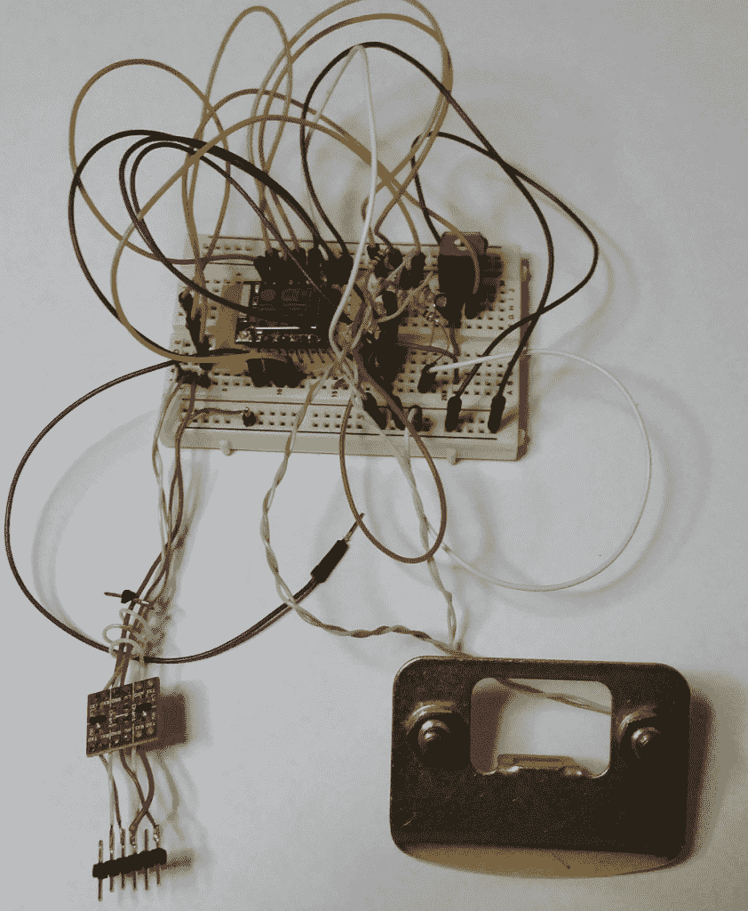

# 现成的黑客:我的新爱好，ESP8266

> 原文：<https://thenewstack.io/off-shelf-hacker-new-obsession-esp8266/>

让我们暂时抛开蒸汽朋克，谈谈我疯狂的新爱好。ESP8266 WiFi 模块。

该设备拥有 32 位处理器、丰富的程序空间、多达 16 个通用输入/输出引脚、集成 WiFi 和低廉的价格。它在世界各地的现成黑客[那里获得了一席之地。它于 2014 年从中国出现，没有可用的文件。在很短的时间内，硬件黑客开始翻译规格表并分享他们的知识。Arduino IDE 最近开始包含 8266 库，所以从事实上的行业标准环境中上传你自己的固件非常容易。](/tag/off-the-shelf-hacker/)

最大的问题是，你用它做什么？

这很简单。以下是我目前的几个项目。

## **WiFi 演示点击器**

你还记得我在演示机器上的[有线遥控器](https://thenewstack.io/off-shelf-hacker-push-button-slides-pi/)吗？

蒸汽朋克点击器

WiFi 版可以让我通过网络链接控制 LibreOffice Impress 演示文稿中的幻灯片。它使用一个 ESP8266 型号 07，几个按钮和一个电池。通电后，无线点击器连接到我的局域网，并启动一个简单的 TCP 服务器。在 LibreOffice Impress (Raspberry Pi 或 Linux notebook)端，一个 Python 客户端程序然后连接到 clicker。将无线点击器作为服务器运行似乎比其他方式更安全一些。按下遥控器上的按钮可以在演示文稿中向前或向后移动。

原型工作得很好，我很快就会在我的技术演讲中建立一个实际使用的手持外壳。

8266 无线点击器原型

计划要求在 AP 模式下启动无线点击器，然后连接 Pi 或 Linux 笔记本，根本不需要局域网。在会议上使用公共 WiFi 总会有恶作剧的风险。

不过，我认为这是一个有趣的项目，可以作为其他后续系统的概念验证。

## **入侵探测器**

我可能看了太多的科技动作片，因为我强烈需要在我的房子外面安装一个入侵检测传感器网络。

ESP8266 芯片非常适合这项工作。

我的计划是使用被动红外传感器来监视我院子周围的指定区域，然后使用超声波测距仪跟踪/记录移动，并将数据发送到我局域网上的服务器，用于威胁数据整合和分析。然后，软件会相应地通知我，可能是通过我智能手机上的短信，我桌面上的提醒，或者是通过敲响警钟。

红外“绊线”也可以在阻塞点周围使用，为数据流增加另一个维度。该传感器只是一个红外 LED 和光电池的组合，位于开口的一侧，另一侧是反射器。

使用 8266 芯片的好处是只需要电源就能工作，无论是由电线还是太阳能电池/电池组供电。所有的数据都通过我的网络无线传输。标准 Arduino 解决方案需要电源和数据连接。对于 8266 来说，范围也不是一个问题，尽管“07”型号在需要时有一个用于外部天线的连接器。无论如何，在我那富丽堂皇的庄园里，这应该不成问题。

服务器上的软件也将整理数据，所以我知道发展行为模式。例如，如果活动连续几天发生在凌晨 3:30，这可能表明有人正在寻找进入我家的方法。或者，是一只浣熊在翻垃圾桶。

坏人，或者动物，甚至不会知道我知道他们在那里。优势，托克医生。对入侵者来说是个坏消息。

## **本地温度传感器**

几年前，我用 Arduino 和 Dallas DS18B20 数字温度计制作了一个温度传感器。它运行良好，可以检测到大约 1/10 华氏度的温度变化。如果你看一下我家 24 小时内的温度图，空调循环非常明显。

我甚至把设备放在冰箱和冰柜里检查设置是否正确。顺便说一句，普通的铅酸电池在变冷时会失去很多能量。

我的新设计要求用 ESP8266 代替 Arduino。我可能只需要在最初的草图上添加几行与 WiFi 相关的代码，就可以让它正常工作了。根据应用，读数可以从每秒一次到每分钟一次之间选择。在读数之间，8266 可以进入深度睡眠模式，以尽量减少电力需求，如果它是运行在电池上。

使用 DS18B20 的一个很酷的地方是，你可以在一条双线总线上将几个器件连在一起。他们称之为单线器件，尽管最终你实际上只有一根线和一个地。在一根 30 英尺长的 22 号电缆上安装三个或四个温度传感器是显而易见的。每个传感器都有一个内置的唯一 ID 代码，该代码与数据相关，因此很容易在代码中整理出值。

与入侵传感器一样，可以在本地服务器上收集数据，并以各种方式进行分析。你可以称之为本地物联网。

## **前进建造**

需要多几个 ESP8266 项目思路？Hack-A-Day 有一个包含 333 个项目的[页面。Instructables 也有](https://hackaday.io/projects/tag/ESP8266)[一堆](http://www.instructables.com/id/ESP8266-Projects/)。

支持 WiFi 的微控制器正变得无处不在，进入门槛不断降低。这里有一款[“07”型号，售价 3.39 美元](http://www.banggood.com/ESP8266-ESP-100-Serial-WIFI-Module-Compatible-With-ESP-07-With-External-Antenna-p-1055445.html)，免费运送到美国。[五台设备仅 13.51 美元](http://www.banggood.com/ESP8266-ESP-07-Remote-Serial-Port-WIFI-Transceiver-Wireless-Module-p-968190.html)，含免费运费。

不过，要小心，建设 8266 项目可能会成为你新的困扰。

<svg xmlns:xlink="http://www.w3.org/1999/xlink" viewBox="0 0 68 31" version="1.1"><title>Group</title> <desc>Created with Sketch.</desc></svg>