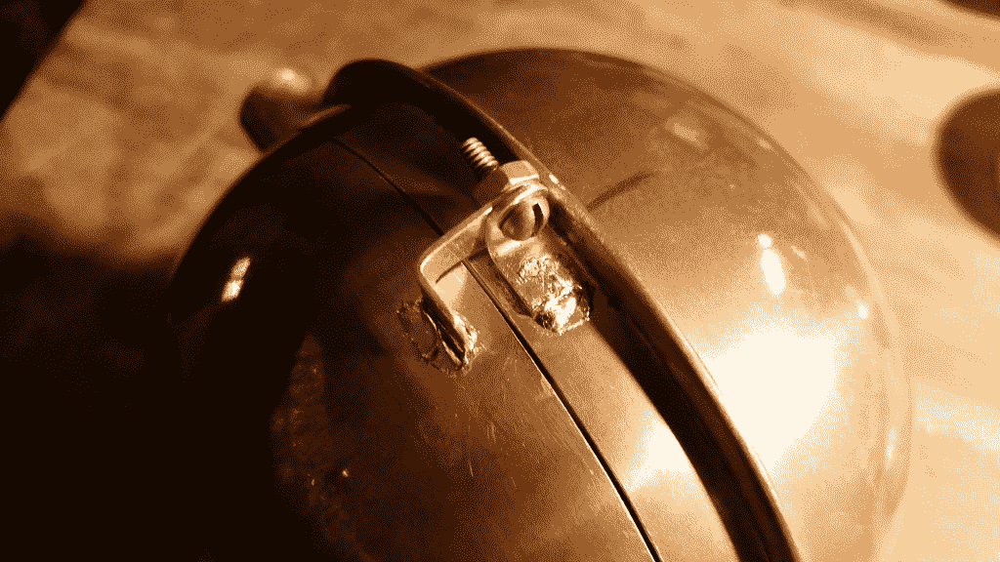

# 现成的黑客:现在我们建立蒸汽朋克眼球

> 原文：<https://thenewstack.io/off-shelf-hacker-now-start-building-steampunk-eyeball/>

上周，在[现成的黑客:蒸汽朋克眼球第二部分](https://thenewstack.io/off-shelf-hacker-make-steampunk-eye-ball-part-2/)中，我谈到了我对快速原型项目的“构建、破解、修改、重复”方法论。因此，我开始制造我们正在建造的蒸汽朋克之眼背面的铜球 Y 轴枢轴和铰链门。我们讨论了建筑的初步设计和细节。我还期待得到半箍，伺服和精灵安装。

好消息是我在前两个方面都做得很好。坏消息是其他三件事没有发生。

那么，是什么阻碍了事情的发展呢？

*   本周，家庭责任占据了我大部分的购物时间。
*   我不得不重新考虑一些外观和易于组装/操作的设计决策。
*   在构建过程中，问题区域减缓了我的进度。幸运的是，一旦你开始制造零件，把东西组装在一起，物理上，解决方案通常会神奇地实现…从…嗯，某个地方。

是的，我稍微落后于计划。没关系；每个人都会遇到挑战、截止日期和意想不到的情况。在适当的时候，一切都会水到渠成。

## **做了什么**

我可以为眼球后面的门做铰链，然后完成切割。回想一下，我沿着切口留下了三个短的实心部分，用于安装铰链和保持门对齐。

眼球在下铰链处打开

在焊接铰链时，我发现[我的久经考验的 140 瓦焊枪](https://thenewstack.io/off-shelf-hacker-learn-solder/)对于将铰链支架连接到铜球来说是勉强合格的。铜只是比我预期的更快地传导热量，导致一个“冷”或薄弱的连接。它工作了，但是它不像我希望的那样光滑和干净。

我考虑过用螺栓固定铰链，尽管这样会增加重量和工作量。使用氨基甲酸乙酯粘合剂可能有效。当然，这背离了精致工艺的蒸汽朋克美学。

也许，如果我得到一系列委托他们自己的蒸汽朋克眼球的客户，我可能会得到一个更大的烙铁。家得宝有一对看起来不错的:200 瓦，400 瓦。

球体、所有枢轴、衬套和铰链支架都被去毛刺并磨平。铜和黄铜的伤口需要一段时间来愈合，因为我会带着眼球到处走，所以尽早打掉所有锋利的边缘是有意义的。

Pixy 相机也测试安装到前面的洞。

测试适合–眼球内的像素相机

我不是 100%确定曲线是否足够浅，以便相机镜头与眼睛前方齐平。我可能已经测量了小精灵和球体，并在全尺寸的二维图中模拟了这两者。我没有选择那样做。也许下次吧。我将使用 1 英寸长的 4-40 螺钉、螺母和垫圈，使相机支架可调。我希望能够将它精确地定位在前眼孔的中间。

在 Ace Hardware 寻找薄壁铜管时，我遇到了一些铜接头。它们是枢轴衬套的完美选择。我为倾斜和平移枢轴管选择了 1/2”铜管。无论是接头还是管道都不是完美的圆形，所以我花了相当多的时间用砂纸和一个灵活的细粒度打磨块来打磨枢轴和衬套，以实现平稳操作。[参见倾斜轴枢轴图]

我还回收了第一代蒸汽朋克眼球框架作为支架，而我建立了半圈。

回收的第一代眼框——代表建筑半圈

第一代眼睛上的伺服系统无论如何都要被移除，以便与新的蒸汽朋克眼球一起使用。

## **“调整”设计**

几个设计领域需要一些调整。

我仍然悬而未决，我是否会把一个伺服倾斜轴的眼球内。上周，我决定倾斜伺服应该在眼睛外面，推杆将连接到球体背面的支架上。现在，我觉得这可能是更好地回到我原来的计划，把伺服眼睛，因为可能没有足够的伺服臂行程移动眼睛明显，与外部安排。有了内部伺服系统，我不会失去任何行程，因为我不会使用任何杠杆。

另一件事是，我想把平移伺服，在同一个位置(中心下方的眼睛中间连接到半环)作为倾斜伺服。将倾斜伺服系统放在球体内部解决了这个难题。

然后，还有半圈。我将用 1/4 英寸的薄壁铜管制作它。我打算用 3/16”，但是，我的两个当地来源完全出来了。一定是 RC 模型机身制造季节什么的。我仍然计划使用方形设计，因为制作非常简单，应该不会太难。我女儿最近给我买了另一个[“三手”钻机](https://www.adafruit.com/products/291?gclid=Cj0KEQjw6Ya5BRDdyOewyo_Z_64BEiQA-fVKe4_HNzB-HEsJZqpBQFEVWJF2r4trqt__TRAuITodJoIaApz08P8HAQ)，所以那会派上用场。

1/2“铜倾斜枢轴，必须安全地固定在球体上，这样我就可以移除中心部分。中间部分是在相机板连接器和内部倾斜伺服将去的地方。挑战是，我想保持枢轴线，在两侧，在一条直线上，所以没有与半环套管绑定。即使有轻微的卡滞，平移和倾斜动作也会卡住或不平稳。我还想保持低转向力，因为我使用的是微型伺服系统，它没有很大的转向力矩。有一个机会，我将不得不使用更大，更强大的伺服。我们马上就要过桥了。我允许眼球球体和半环之间有一点额外的间隙，以防我需要加大伺服系统的尺寸。倾斜枢轴的内部支撑可能最终会成为某种连接到枢轴和环绕球体背面的 3/8”凸缘的桁架结构。球铰链支架附在嘴唇上，如特写镜头所示。

背面唇和门铰链细节

## **下周即将到来**

这周的最后期限过后，我打算马上开始制作半个环。这个周末在 Torq 医生的房子里没有太多计划，所以我希望在星期一之前看到眼睛平移和倾斜。在第 4 部分，我将涵盖其余的机械方面，并开始对电力，数据和相机的细节。自然，会有一个部分是关于使用 Pixy 的颜色跟踪功能和软件。

物理计算和硬件黑客很难。就像我以前在洛克希德-马丁公司的主管曾经说过的，“如果有那么简单，一个五年级学生也能做到。”环顾四周。有很多 Raspberry Pi 和 Arduino 项目将所有东西都放在一个可爱的 3d 打印盒子里。3d 打印机很棒，生产率也很有前途，尤其是对于小批量的原型制作。还有很多“闪烁 LED”初学者教程。

开发物理计算技术并将其融入现实生活中的硬件，需要时间和精力。我认为蒸汽朋克美学增加了真实性，并在我的项目中引入了“好奇心”元素。你把你的主题应用到你的项目中了吗？

我喜欢物理计算和黑客硬件，因为我的努力最终得到了一些有形的东西，我的演讲和写作观众似乎很喜欢。这种感觉很好，也许有一天会非常有利可图。

<svg xmlns:xlink="http://www.w3.org/1999/xlink" viewBox="0 0 68 31" version="1.1"><title>Group</title> <desc>Created with Sketch.</desc></svg>