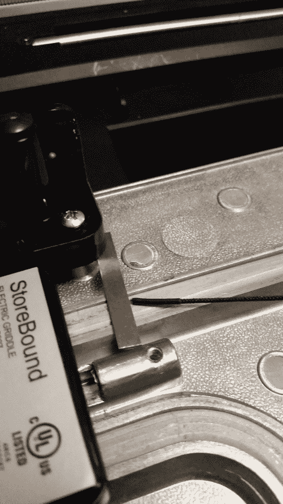
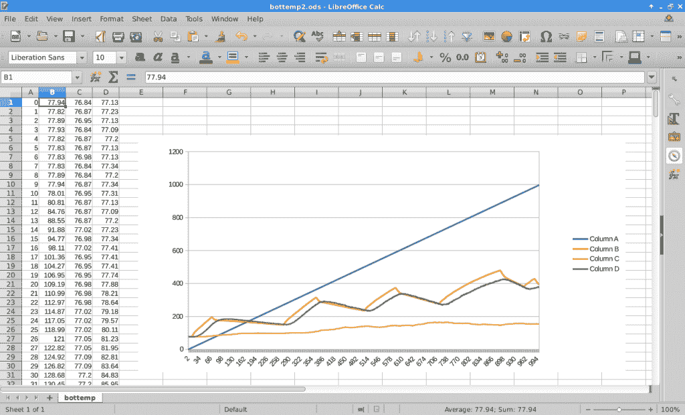

# 现成的黑客:PancakeBot 热板温度映射

> 原文：<https://thenewstack.io/off-shelf-hacker-pancakebot-hotplate-temperature-mapping/>

在过去的几篇专栏文章中，我一直在研究测量[煎饼机器人](http://www.pancakebot.com/)温度的想法，这是一种按照用户设计的图案打印煎饼的设备。我想知道是否有一种方法可以将元件和热板表面的实时温度与[煎饼机器人](https://thenewstack.io/hack-pancake-stack-whats-inside-pancakebot/)打印煎饼的方式联系起来。正如所有的原型制作和大量的分析一样，需要时间来弄清楚你需要做什么，然后实际付诸行动并得到一些结果。

本周，我们将探讨如何放置温度传感器，捕捉一些初步的基线数据，如何生成用于分析的基本指标，以及 PancakeBot 黑客攻击过程的下一步发展方向。完成这个初始测试设置需要做大量的工作，所以我们将在以后的文章中用一些真实的煎饼打印来同步温度数据。

## 安装热电偶

采集温度数据的第一步是找到安装热电偶的地方。我想把它放在加热元件旁边，以确保对温度变化的快速反应。我决定弯曲热电偶的尖端，轻轻地将它楔入一个 1.5 英寸长，1/4 英寸宽的黄铜扁材下面。黄铜导热性能良好，使用小支架不会大大降低响应速度。这个小支架安装在一个加热板底座安装螺丝下面。然后，我暂时将长热电偶引线绕在电热板脚上，以防止它碍事。然后，电线被敷设到放大器板上。这是热电偶和支架的特写:



安装在煎饼机底部加热元件上的热电偶

在几次温度测试中的一次，我注意到热电偶读数没有变化，尽管红外传感器记录的表面温度在上升。果然，经检查，热电偶尖端从黄铜带下滑出。在板条下的快速尖端重新定向再次使我改变了加热元件的数量。

楔形尖端、黄铜带安装方法可用于原理验证。由于 PancakeBot 手臂和伺服系统的振动肯定会使热端再次松动，因此它肯定需要进行长期温度监控。

## 用红外温度计读取热板表面

用红外温度计读取表面温度很简单。我将 Arduino、试验板和热电偶放大器板放在 PancakeBot 旁边的一个小塑料盒上。然后将红外温度计置于热板表面上方约四分之一英寸处。

请注意，随着传感器到地面的距离增加，传感器读数会下降。与四分之一英寸的读数相比，一英寸的读数可能变化 10 或 15 华氏度。这一次可能已经足够接近了，尽管这种行为可能会在您的项目中引起问题，这取决于您的需求。

在这个测试阶段，PancakeBot 的手臂还没有到位。显然，红外传感器将需要重新定位以进行实际打印，否则，当机械臂上下移动时，它将产生干扰。对于即将到来的煎饼印刷运行，我可能会将红外传感器移动到热板的一角。

在手臂上安装红外温度计来测量面糊分配器下的表面温度，就像煎饼印刷一样，这有意义吗？我们可以从这些数据中得到什么启示？把传感器放在手臂上会有多难？我们会从这项工作中得到什么好处？所有发人深省的问题，因为我们原型我们疯狂的黑客计划。

## 将事件同步到数据流

接下来，我想尝试将温度数据与实际煎饼印刷过程的各个阶段同步。当你打印埃菲尔铁塔或名人头像时，元素和表面的瞬时温度对线条、曲线或区域填充有什么影响？

我的计划是使用时间索引来协调温度数据和 PancakeBot 移动。

为此，我给来自 Arduino 的数据流添加了一个时间索引。它只不过是代码中的一个计数器，每行数据递增一次。对于数据收集间隔，每秒一行似乎是一个合理的起点，所以我就用了这个。

读者可能意识到，Arduino 代码中的时间延迟并不一定反映主程序循环的实际运行时间。通过串行线路发送文本数据、复杂的决策和函数间的往返，所有这些都导致了实际的“循环周期”持续时间。你必须考虑这些事情，以获得合理准确的时间计数。

我最初想每半秒(500 毫秒)获取一个数据样本。

使用秒表，我发现 500 毫秒的延迟设置在 USB 端口输出的每一行数据之间产生了大约 650 毫秒的延迟。

经过一些实验，并与实际秒表秒进行比较(使用我的 Galaxy 5S Active 超级手机上的一个应用程序)，750 毫秒的延迟给了我一个非常准确的一秒循环时间。

下面是代码:

```
#include &lt;SPI.h&gt;
#include &lt;Adafruit_MAX31856.h&gt;
#include &lt;Wire.h&gt;
#include &lt;Adafruit_MLX90614.h&gt;

Adafruit_MLX90614 mlx  =  Adafruit_MLX90614();

// use hardware SPI, just pass in the CS pin
Adafruit_MAX31856 max  =  Adafruit_MAX31856(10);

int tcount  =  0;

void setup()  {
  Serial.begin(115200);

  max.begin();

  max.setThermocoupleType(MAX31856_TCTYPE_K);

  switch  (  max.getThermocoupleType()  )  {
    case MAX31856_TCTYPE_B:  break;
    case MAX31856_TCTYPE_E:  break;
    case MAX31856_TCTYPE_J:  break;
    case MAX31856_TCTYPE_K:  break;
    case MAX31856_TCTYPE_N:  break;
    case MAX31856_TCTYPE_R:  break;
    case MAX31856_TCTYPE_S:  break;
    case MAX31856_TCTYPE_T:  break;
    case MAX31856_VMODE_G8:  break;
    case MAX31856_VMODE_G32:  break;
    default:  break;
  }

  mlx.begin();  

}

void loop()  {

  // 4 number data output with "," seperator
  // 1st number = time counter - use with sample duration
  // 2nd number = thermocouple temp measured by MAX amp board
  // 3rd number = ambient temp measured by MLX IR sensor
  // 4th number = object temp measured by MLX IR sensor

  // 1st number - time counter
  Serial.print(tcount);  Serial.print(",");
  tcount++;

  // 2nd number - thermocouple
  Serial.print(Celcius2Fahrenheit(max.readThermocoupleTemperature()));  Serial.print(",");

  uint8_t fault  =  max.readFault();
  if  (fault)  {
    if  (fault  &amp;  MAX31856_FAULT_CJRANGE)  Serial.println("Cold Junction Range Fault");
    if  (fault  &amp;  MAX31856_FAULT_TCRANGE)  Serial.println("Thermocouple Range Fault");
    if  (fault  &amp;  MAX31856_FAULT_CJHIGH)  Serial.println("Cold Junction High Fault");
    if  (fault  &amp;  MAX31856_FAULT_CJLOW) Serial.println("Cold Junction Low Fault");
    if  (fault  &amp;  MAX31856_FAULT_TCHIGH)  Serial.println("Thermocouple High Fault");
    if  (fault  &amp;  MAX31856_FAULT_TCLOW) Serial.println("Thermocouple Low Fault");
    if  (fault  &amp;  MAX31856_FAULT_OVUV)    Serial.println("Over/Under Voltage Fault");
    if  (fault  &amp;  MAX31856_FAULT_OPEN)    Serial.println("Thermocouple Open Fault");
  }

  // 3rd number - ambient
  Serial.print(mlx.readAmbientTempF());  Serial.print(",");

  // 4th number - object
  Serial.print(mlx.readObjectTempF());  

  Serial.println();
  delay(750);  //sample duration - adjusted - gives 1 second per sample with this code
}

double Celcius2Fahrenheit(double celsius)
{
  return  1.8  *  celsius  +  32;
}

```

我们还必须记住，当你改变热板旋钮上的设置时，加热元件和烹饪表面的温度会逐渐升高。我随意选择了四分钟来让温度稳定下来，我把温度从关，到暖，到中等，最后到高。在我们的数据文件中，这给出了 16 分钟的测试持续时间，相当于 960 秒。我用秒表记录了 16 分钟的温度变化，确保了时间的准确性。最后，秒表和捕捉到的时间指数只相差一秒。

接下来，让我们看看如何捕捉和绘制数据。

## 记录和绘制实时数据

在某个时候，我可能会编写一个可爱的小处理程序来读取 PancakeBot 的温度数据，并给出一个漂亮的图表。我传说中的快速周转方法指示我只需通过 Linux 笔记本上的串行端口从 Arduino 获取数据，并将其推入一个 [LibreOffice 电子表格](https://www.libreoffice.org/)。几下点击后，有一个漂亮的图表。该技术很容易适应大型或小型数据集，只需几分钟即可设置完毕。我一直重提 Linux，因为我坚信它是纳米计算的未来，并遵循 [Unix“许多小程序链接在一起做大事”的哲学](https://en.wikipedia.org/wiki/Unix_philosophy)。

当然，随着我们逐渐转向使用 Raspberry Pi 或芯片计算机进行 PancakeBot 数据收集和控制，数据处理有可能转移到 [MQTT 代理/客户端](https://thenewstack.io/off-shelf-hacker-lightweight-inter-device-messaging-mqtt/)消息传递模型。我们走着瞧。

将数据从 Arduino 捕获到 Linux 笔记本电脑时，正确设置 USB/串行端口的通信参数非常重要。例如，在 Arduino 代码中，我将速度从 9600 位/秒(bps)切换到 115200 bps。更改之后， **cat** 命令简单地返回，没有显示任何数据。原来，如果 Arduino(发送机器)和 Linux USB 端口(接收机器)之间的速度不匹配，您将什么也看不到。我使用了 **stty** 命令来修复这个问题:

```
rob%  stty  -icrnl  -F  /dev/ttyUSB0  115200

```

-ICR nl 开关将所有回车转换为换行符。否则，在将数据导入到绘图应用程序之前，您将在每行数据之间得到一个空行，然后必须使用一个过滤步骤来去除空行。F 选项指定 USB 端口，115200 是所需的端口速度，它与 Arduino 提供的速度相匹配。

这样就可以很容易地使用 Linux 命令行来获取数据。

```
rob%  cat  /dev/ttyUSB0  &gt;  bottemp.txt

```

我本能地使用。文本文件。将文件复制到. csv 扩展名并导入 LibreOffice Calc 是一件简单的事情。我也保留了一份，以防万一。

```
rob%  mv bottemp.txt bottemp.csv

```

使用文件→打开将文件拖入 LibreOffice，然后转到包含您的数据文件的目录。在那里，打开文件类型下拉菜单(靠近窗口底部)并选择“文本 Csv”文件格式。从列表中突出显示 bottemp.csv 文件，然后点击打开按钮。

在弹出的导入窗口中，选中“逗号”分隔符框并点击打开。我喜欢为这种类型的图表选择折线图，但是您可以以任何适合您的形式来可视化数据。

下面是数据和图表的截图。我没有换标签。蓝色是时间指数，橙色是热电偶数据，绿色是红外传感器读数，黄色是热电偶冷接点温度。



捕获的 PancakeBot 数据和图形

注意红外线(热板表面)温度如何滞后于热电偶(加热元件)温度。对于最初的 16 分钟基线，我大约每 4 分 20 秒调整一次热板温度旋钮。这与旋钮上的关、暖、中和高设置相对应。

## 下一步是什么？

既然我们已经有了捕捉、同步和显示实时 PancakeBot 温度读数的通用方法，下一步就是设置好一切，并通过打印几个不同设计的煎饼来运行，看看会产生什么样的数据。

有没有办法将温度读数与特定印刷品的 g 代码相协调？我不知道。这是一个我们可以探索的领域。尝试优化加热板上的温度设置，以在打印的煎饼上提供最佳分辨率，这难道不是很有趣吗？我们也会看看这类东西。

通过将“大数据”分析技术应用到现实世界的物理计算环境中，我们可能会发现什么其他启示？

在不久的将来，应用度量无疑是现成黑客的一套技能。

**往期《黑煎饼叠》栏目:**

[现成的黑客:为工作选择正确的数据总线](https://thenewstack.io/instrumenting-pancakebot-phase/)

[黑煎饼叠:PancakeBot 里面是什么？](https://thenewstack.io/hack-pancake-stack-whats-inside-pancakebot/)

[现成的黑客:避免用热电偶烧焦圣诞火鸡](https://thenewstack.io/avoid-burning-christmas-turkey-thermocouples/)

[破解 Pancake Stack:在 Xubuntu Linux 下运行 PancakeBot】](https://thenewstack.io/hack-robot-stack-pancakebot-running-xubuntu-linux/)

<svg xmlns:xlink="http://www.w3.org/1999/xlink" viewBox="0 0 68 31" version="1.1"><title>Group</title> <desc>Created with Sketch.</desc></svg>