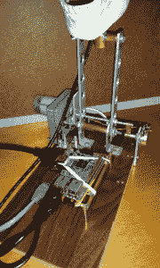
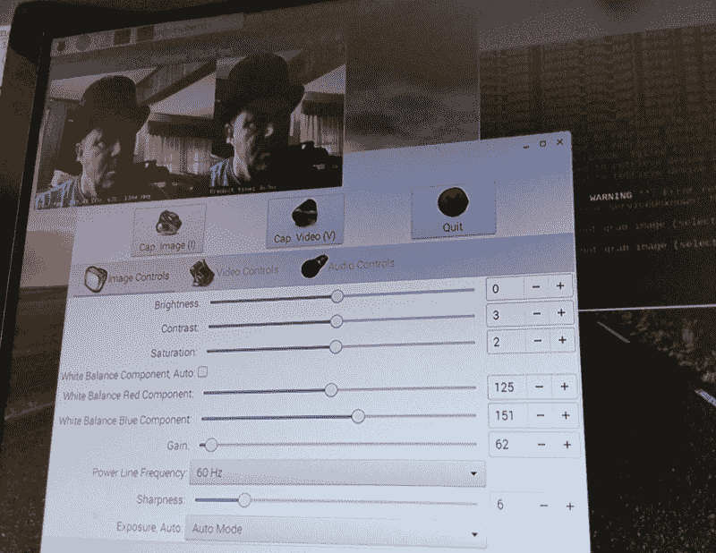

# 现成的黑客:为赫德利挑选一个大脑，机器人头骨

> 原文：<https://thenewstack.io/off-shelf-hacker-picking-brain-hedley-robotic-skull/>



在过去的几周里，我们一直在从头开始构建一个交互式机器人头骨(赶上零件[一个](https://thenewstack.io/off-shelf-hacker-machine-vision-meets-robotic-skull/)、[两个](https://thenewstack.io/off-shelf-hacker-machine-vision-meets-robotic-skull2/)和[三个](https://thenewstack.io/machine-vision-camera-meets-robot-skull/))。

[JeVois 机器视觉摄像机](http://jevois.org/)安装在[旧活动臂项目底座](https://thenewstack.io/off-shelf-hacker-enhance-motor-control-potentiometers/)上，就像头骨本身一样。物理计算包装的笨蛋将是我的现场会议技术演讲的焦点，应该会吸引与会者的相当大的注意力。我们当地的机器人俱乐部在最近的会议上很喜欢它。头部平移、人物跟踪(使用视觉传感器)和一系列其他疯狂的功能都在计划之中。

我有没有告诉过你，我把这个头骨命名为赫德利骨瓣？考虑到我最终计划的蒸汽主题，这看起来很聪明也很合适。

任何名字像赫德利的机器人都应该有一个正常的大脑。那么，我们用什么呢？

幸运的是，我有一堆尸体微控制器，是这些年来从过去的项目中收集来的。一个中空的头骨提供了足够的空间来放置库存中的任何类型的微控制器。当然，我们假设我们谈论的是 Arduino 和 Raspberry Pi 外形设备。像 Pine64 或传统的小型英特尔 PC 主板这样的较大主板，虽然可能有能力，但肯定不适合赫德利的颅骨尺寸。

让我们从构建中稍作休息，并深入研究为我们的弗兰肯斯坦创造挑选一块板。

这是一个很好的起点，通过问我们认为“大脑”应该能够做什么。

## 协调和接口

机器人头骨最前沿的核心技术之一是 JeVois 智能视觉传感器。读者会记得 JeVois 是一个小型视频传感器，连接到一个四核 ARM 处理器，并装有人工智能机器视觉算法。它运行 Linux，并通过 USB 和外部串行端口输出增强视频以及各种类型的视觉分析数据。

尽管 JeVois 运行的是 Linux，但我们不得不将其视为专用传感器。没有数字输入/输出引脚或连接。虽然从理论上讲，我们可以运行 C 程序或 Bash 脚本，但该设备的目的是作为一个专用传感器，将数据传递给另一个设备。在 JeVois 的行话中，另一台设备被称为主机。

记住所有这些，对“主机”的要求之一是它将接受和协调来自 JeVois 传感器的数据。我们要么在机器视觉算法提供的结果之上进行额外的处理，要么将数据传递给其他机器，也许是通过网络。我们还可以获取数据，并在本地使用它来驱动机器人头骨中的伺服系统、马达或其他致动器。来自传感器的数据才是最重要的。

JeVois 的另一个方面是，你可以在你的主机上观看来自传感器的经过处理的视频流。例如，如果你将相机连接到 Linux 笔记本电脑的 USB 端口，你会看到传感器识别的物体周围的增强框。这项功能非常适合开发原型，因为您可以直观地验证来自传感器的“数据”流(可能通过串行线路)是否是您真正想要的。

有一天，我坐在 Panera Bread 里，传感器指向大厅。当人们走过传感器的视野时，在他们周围看到一个叠加的盒子是很酷的。每个盒子上方都有一个标签，**对象:人**。该传感器可以同时识别和跟踪三个或四个人，没有任何麻烦。同时，像椅子(**对象:椅子**标签)和桌子这样的静态对象在场景中也很容易被标记。所谓“识别”，我的意思是传感器可以识别具有人类特征的物体，而不一定是有名字或任何东西的特定个人。

我使用的视频程序叫做 [guvcview](http://guvcview.sourceforge.net/) 。这只是一个简单的 GTK 视频观看程序。将网络摄像头或 JeVois 插入 USB 端口，启动 guvcview，以相当实时的方式观看世界。在华硕双核 Linux 笔记本电脑上，视频流畅且响应迅速，但在 Raspberry Pi 类型的设备上运行 guvcview 可能是一个挑战。



guvcview 的屏幕截图，带有 Pi 上 JeVois 传感器的视频。

## 为 Guvcview 选择设备

从低级的 Arduino Pro Mini 到最热门的多核 ARM Raspberry Pi 克隆，使用串行端口的数据对于任何物理计算设备来说都非常简单。因此，处理串行、甚至 I2C 或 SPI 器件间通信的能力，对我来说是显而易见的。所有现代微控制器和纳米 Linux 机器都处理这种东西。

头骨将用于会议演讲、演示和培训目的。因此，一个重要的功能是能够将头骨连接到监视器或投影仪上，并向观众展示相机传感器看到的内容。

我们需要能够在 skull 主机上运行 guvcview，以及一个可选的附带 Linux 笔记本。

几个设备马上跃入脑海。显然，有覆盆子 Pi 2 或 3。我也有一个[比格犬骨黑色](https://beagleboard.org/black)闲置不用。我也渴望使用 hotrod RoseApple Pi，四核，2 GB 内存设备。

BeagleBone 是一个非常合理的首选，它的片上 Linux 实现(不像 Pi 克隆版那样在 micro-SD 卡上)，大量的输入/输出引脚和 HDMI 视频。虽然这是一个很好的想法，但当我回忆 guvcview 在这个特定的板上的表现时，它退出了比赛。它要么非常慢，起伏不定，要么根本不跑。我似乎记得依赖关系的问题，而且似乎不值得去尝试解决这些问题。

下一个。RoseApple Pi 与 guvcview 配合得相当好，尽管有点慢。来自 JeVois 传感器的经过处理的视频的视频帧速率非常令人失望，每秒 1 到 4 帧。在演示或技术演讲中使用这种性能会很痛苦。像 Arduino 和处理 ide 这样的附加程序也可以用在 skull 主机上，它们在 RoseApple 上运行得相当好，没有问题。

不幸的是，我能为 RoseApple 找到的最新预建 Linux 映像是 2015 年的 Debian 8。我试着做了一个“**更新**”和“**升级**，把软件升级到最新版本。不去。未解决的依赖关系导致了各种各样的错误，我根本不准备花几个小时，或者几天的时间来解决这些问题。尽管有四核芯片、2GB 内存和 USB 3.0 端口，RoseApple 还是跌出了榜单。RoseApple Pi 网站上没有太多的活动，所以你可以据此得出自己的结论。

结论是，虽然硬件设备可能看起来很棒，但如果没有定期的供应商活动或强烈的行业/社区兴趣，很难看到它们的未来。

## 和普通的老 Pi 一起去

我最终选择了一个普通的老式 Raspberry Pi 2 型号 B，然后下载并刻录了最新的 [Raspbian Stretch](https://www.raspberrypi.org/downloads/raspbian/) 图像到一个 8GB 的微型 SD 卡上。通过通常的“**sudo****raspi-config**”设置练习，可以重置 Pi 用户名并将速度提升到“性能模式”。guvcview 程序通过 **apt-get** 安装。

过去，guvcview 在 Pi 2 上运行良好。性能没有 RoseApple 体验那么差，但仍然不算出色。使用当前的 Linux 内核和应用程序，RoseApple Pi 的速度可能会有所提高。

在拉斯比恩大道上运行 guvcview 让世界变得不同。来自 JeVois 传感器的视频平滑而快速，通常在每秒 15 到 30 帧之间。

一个警告是，伸展有一个 guvcview 和音频程序依赖的问题。仅仅运行“guvcview”就会因分段错误而崩溃。解决这个问题的方法是运行“-a none”选项以及视频类型和分辨率。

使 guvcview 正确运行的整个命令行如下:

```
pi%  guvcview  -a  none  -f  YUYV  -x  544x240

```

## 包裹

总的来说，Pi 是个不错的选择。它运行 guvcview 很好，有许多通用输入/输出，我们可以吸收数据，然后用各种应用程序处理它。不仅如此，Pi 很容易与 Arduino 和其他电路板进行通信，这些电路板可能最终会安装在头骨中。

顺便说一下，我选择将 Pi“大脑”安装在头骨底板上，而不是颅内。演示和蒸汽朋克都是关于暴露的小工具，把设备放在前面，每个人都可以看到它很有意义。

我们会在头骨里放一个 Arduino Pro 和一个 ESP8266。别担心，会解决的。

下周见。

专题图片:[布鲁克林街头艺术](http://joabj.com/Photos/2014/1411-SA-Bushwick-Steiner.html)由《秘密握手》的安德鲁·斯坦纳创作。

<svg xmlns:xlink="http://www.w3.org/1999/xlink" viewBox="0 0 68 31" version="1.1"><title>Group</title> <desc>Created with Sketch.</desc></svg>