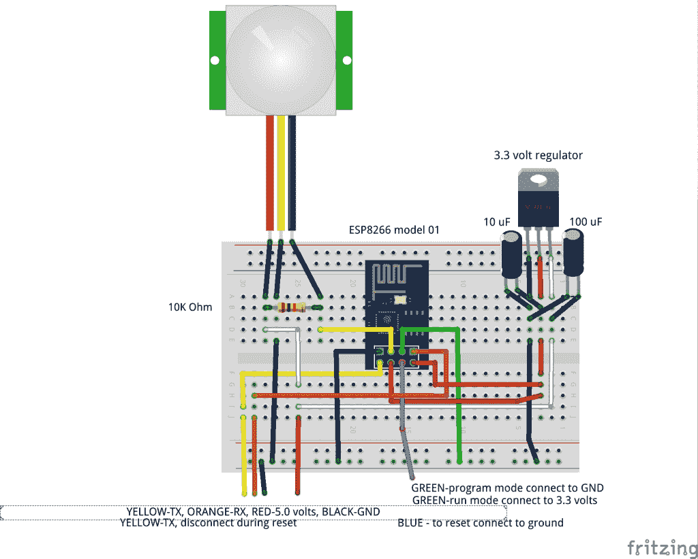
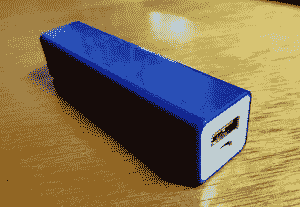
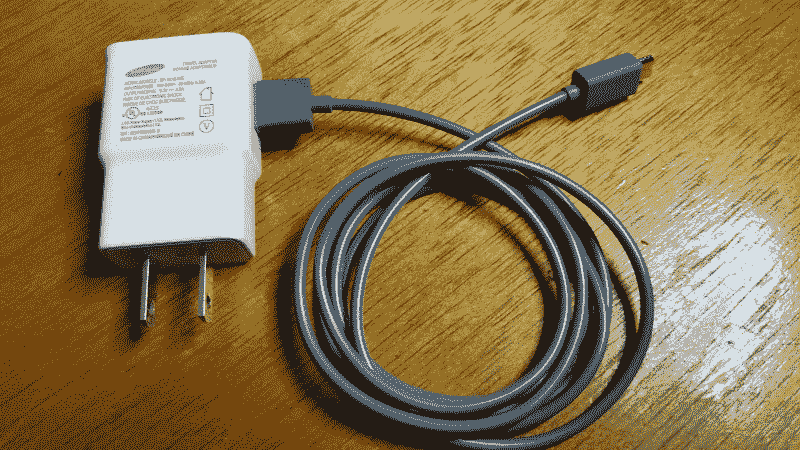
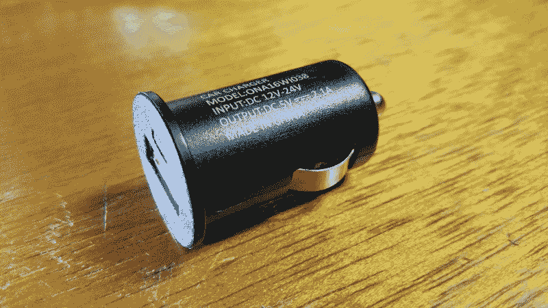

# 现成的黑客:为您的项目助力

> 原文：<https://thenewstack.io/off-shelf-hacker-power-projects/>

纳米 Linux 系统、可穿戴设备和便携式设备都需要电力来运行。

我使用的大多数设备，如 Raspberry Pi、芯片计算机、Arduino 和 ESP8266，都需要 3.3 或 5 伏的电压，最大电流约为 2 安培。许多电路板都有可焊接的接头，可以连接 5 到 20 伏的 DC，板载电压调节器会确保微控制器获得正确的电压。其他设备有标准的微型 USB-B 插座，可以处理电源和串行信号。

现代微控制器板的伟大之处在于，在如何为它们供电方面有许多选择。今天的讨论将涵盖其中一些选项。

## 电池

标准的 Arduino Pro-Mini 有用于所有连接的焊盘。它可以在其原始电压输入引脚上接受 5 到 12 伏的电压。所以，你可以把它连接到一个 6 伏的手提电池上，或者把几根导线接到汽车电池上。其他 Arduinos 和克隆产品的规格表会告诉你什么电压是可接受的。

我已经用四个 AA 或 D 电池电池组运行了我的一些 Pro-Mini 项目，总共提供 6 伏电压。自然，电池越大，设备运行的时间就越长。我的 AA 电池(约 500 毫安时容量)项目可能会运行半天，而 D 电池(约 8000 毫安时容量)可能会连续运行三到五天。请记住，由于您使用的传感器数量、电池大小、电池类型等原因，电池寿命会有很大差异。

假设你想运行一个 Raspberry Pi 3 或者一个芯片板，用同一个四芯电池组？

一个不错的方法是用一个 L7805 电压调节芯片和一根微型 USB 线给自己做一个 6 到 5 伏的电源。将一个 100 uF 的电容连接到 7805 的+电源线和地线。然后，在 5v 输出引脚和地之间连接一个 10 uF 电容。因此，6 伏电压流向+电源线，5 伏电压从输出引脚流向连接到微型 USB-B 连接器的正极导线。地线连接到微型 USB-B 连接器的地线(可能是黑色或绿色)。

7805 可提供高达约 1.5 安培的电流，并使用 6-18 伏的输入电压。如果使用的输入电压偏高，应考虑在 7805 上增加一个散热器，因为所有多余的电压都会以热量的形式耗散掉。

还有一个 3.3 伏版本，称为 [LD1117V33](https://www.sparkfun.com/products/526) 。它的连接方式和 7805 一样。这种型号适用于需要 3.3 伏电源电压的设备，如 ESP8266。

这里有一个 Fritzing 图显示旧的 ESP8266 红外传感器项目。注意右侧的 7803 和两个电容。

ESP8266-01–PIR 实验板

铅酸电池很丰富，可能适用于 3.3 伏或 5 伏的 Arduino 型(非微型 USB 设备)主板。

为 Raspberry Pi 和芯片计算机供电有一个更易于使用的解决方案。它被称为手机电源银行。

## 可充电电源组

外置手机电池组随处可见。它们通常是装在某种类型的外壳中的一组锂离子电池，可能带有充电电路，在面向计算机/墙壁的一侧有一个标准 USB-B，在 5 伏侧有一个微型 USB-A 连接器。

我在会议上拿过小的(2200 mAh 容量)，作为赠品。

你可以在任何地方的商场、便利店和大型电器商店买到它们。在线资源通常种类繁多。有些甚至有多个输出接口和一个 LED 手电筒。容量范围一直到 15，000 到 20，000 毫安的怪物。这些东西重约一磅，价格在 25 到 35 美元之间。一个这样规模的[电力银行](https://www.banggood.com/Original-Xiaomi-20000mAh-Polymer-Power-Bank-2-Dual-USB-Output-with-Quick-Charge-3_0-p-1114740.html?rmmds=search)可以轻松运行你的树莓 Pi 项目几天。

那么如何给一个电力银行充电呢？

你的 Galaxy Android superphone 附带的白色三星壁瘤充电器是一个很好的电力银行充电器。它在 2 安培下输出稳定的 5.3 伏电压。一个很酷的方面是，你可以用一个合适的适配器将它插入标准的 110 伏北美插座和 220 伏欧洲插座。

三星手机充电器和 USB 线

不管怎样，5 伏电压从另一端出来。不同充电器的输出电流可能有所不同，因此请查看外壳侧面的规格。

三星充电器需要一两个小时才能为一个小型(2200 mAh 容量)的电源组充电。大容量可能需要更长的充电时间，虽然你的里程会有所不同。

大多数充电器会为大多数电源组充电，即使它们来自不同的制造商。反正这是我的经验。

最重要的是将你的充电器和相关的标准 USB 线放在一起，并随身携带。这样，只要有交流电源插座，你就可以给手机和电池充电。

顺便说一句，充电器通常只需插入即可为你的树莓派或芯片供电。没错，你可以用充电器来代替电池或电源组。我的[蒸汽朋克会议徽章](https://thenewstack.io/wearable-computing-electro-matic-conference-personality-identification-device/)已经在我的 Galaxy 手机 wall wart 上完美运行了几天。确保使用至少 2 安培的电源，否则，由于电压下降，该设备可能会周期性地挂起或重启。

## 下一步是什么

现代微控制器将运行在许多不同的电源输入选项上。太阳能是另一种可能性，所以也许我们将来会[探索这个话题](/tag/off-the-shelf-hacker/)。别忘了，你还可以将微型 USB-B 端插入 Pi，然后将 USB-A 端插入运行中的笔记本，也是为了供电。

因此，接下来的大问题就变成了，Pi 能从插入式汽车充电器适配器上运行吗？

汽车充电器适配器

我将把答案留给读者去研究。

<svg xmlns:xlink="http://www.w3.org/1999/xlink" viewBox="0 0 68 31" version="1.1"><title>Group</title> <desc>Created with Sketch.</desc></svg>