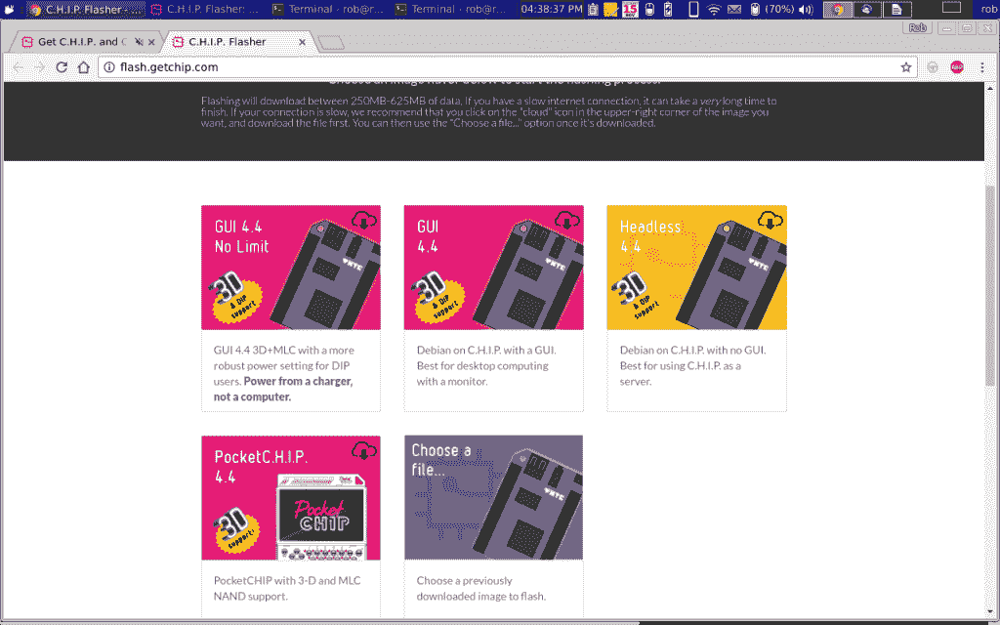
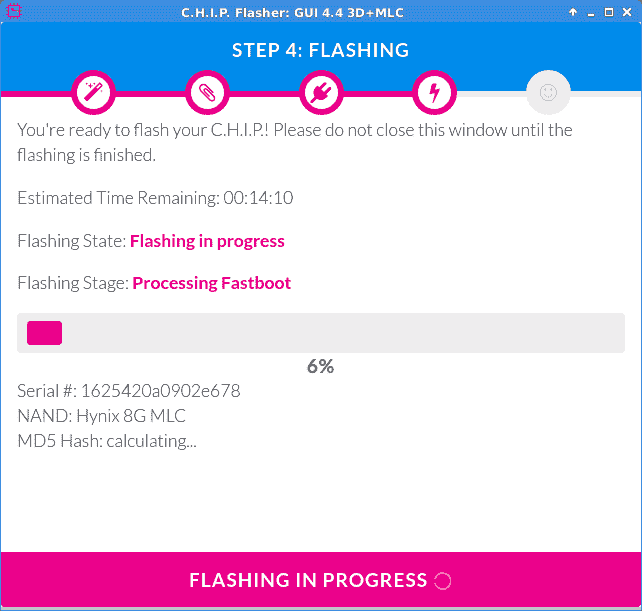
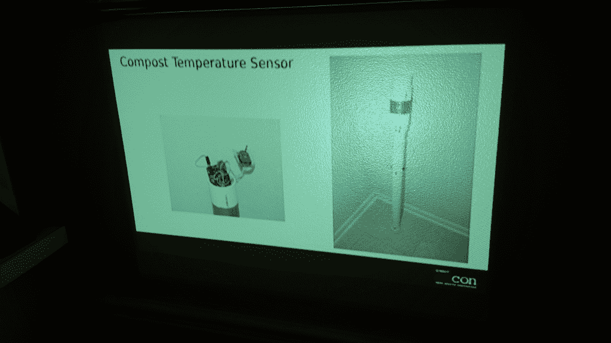

# 现成的黑客:在 9 美元的芯片电脑上展示你的技术演讲

> 原文：<https://thenewstack.io/off-shelf-hacker-present-tech-talk-9-chip-computer/>

我喜欢在会议上发言。很疯狂，对吧？分享一个尖端的硬件，与热情的观众互动，对我来说是一种乐趣。幸运的话，与会者被我的漫谈所打动，开始挑战自己，开始新的项目，创造令人敬畏的东西。

在摆弄 9 美元的芯片计算机时，我突然意识到，在这个平台上建造的演示机器可能会很有趣。在[的上一篇文章](https://thenewstack.io/off-shelf-hacker-eat-dog-food/)中，我写了一篇关于芯片的 TNS 故事，将芯片用作台式机(和 LibreOffice Write)。

我为什么要在数百名与会者面前用一台 9 美元的芯片电脑进行技术演讲呢？

*   我是一名黑客，喜欢分享我的项目，有时以戏剧化的方式。
*   每个人都喜欢亲自看到一次性的想法。
*   激发思考，激励与会者探索最新的技术。
*   因为我可以。

## 为演出准备好芯片

[下一件事](https://getchip.com/)通过一个易于使用的基于网络的在线固件闪光器，你可以在笔记本电脑上使用它来更新芯片。只需转到芯片闪光器页面，并按照指示。



当前芯片固件选择

使用高质量的 USB 电缆将芯片连接到笔记本电脑非常重要。如果固件刷新与一根 USB 电缆不兼容，请尝试另一根。如果不起作用，将芯片的电缆插入通电的 USB 集线器，然后将集线器插入运行 Chrome 浏览器的 Linux 笔记本电脑。不要忘记从 FEL 引脚到地的跳线。



芯片闪光屏

我为这个项目下载了最新的芯片 GUI 4.4 3D+MLC 版本。

固件刷新完成后，断开芯片与笔记本电脑的连接。使用音频/视频电缆将芯片连接到电视的复合输入。我使用无线罗技键盘/鼠标垫进行输入，并用 5 伏(2 安培)的壁式电源为芯片供电。

几分钟后，桌面出现了，我使用屏幕顶部的“网络连接”图标将芯片连接到我的家庭网络。随着无线工作，我然后使用[新立得应用程序管理器](http://www.nongnu.org/synaptic/)(主菜单→系统下拉菜单)将所有软件更新到最新版本并安装 [LibreOffice Impress](https://www.libreoffice.org/discover/impress/) 。

遵循这个过程。首先，点击“重新加载”按钮来更新所有的库。然后，“标记所有升级”，将所有要更新的文件排队。接下来，在搜索窗口中输入“LibreOffice Impress”并选中其复选框进行安装。最后，点击“应用”执行更新。完成此过程大约需要 5 分钟。

一旦新立得完成了它的安装工作，你就可以退出应用程序，再次进入桌面上的主芯片下拉菜单。LibreOffice 现在应该出现在 Office 菜单下了。

此时，您可以关闭芯片并将其连接到您的投影仪。启动投影仪，然后给芯片加电。在短时间内，您应该会看到熟悉的芯片徽标和桌面出现在投影仪屏幕上。

## 使用芯片展示机

我在 Raspberry Pi 桌面上编辑了几个幻灯片堆栈(也就是我的“蒸汽朋克会议演示操作设备”)，有点乏味。在旧的华硕 Xubuntu 笔记本上设计演示文稿要容易得多，然后只需将文件传输到芯片上。把芯片用在节目上。

确保单片机和你的笔记本在同一个网络上，然后用 [**rcp**](http://www.computerhope.com/unix/urcp.htm) 在机器之间移动文件。

```
rob-notebook%  rcp techtalk.odp chip@192.168.1.109:/home/chip/techtalk.odp

```

填写密码，按回车键将文件发送到芯片。

接下来，启动 LibreOffice Impress 并打开您的 tech talk 幻灯片文件。单击“幻灯片放映”,然后单击“从第一张幻灯片开始”,将第一张幻灯片放在屏幕上。用上下箭头键在幻灯片中来回移动。



芯片在我的餐厅墙上投影出一张幻灯片。

## 提示和技巧

对幻灯片使用 640 x 480 的复合视频分辨率是完全足够的，无论是在 37 英寸的大屏幕上还是在独立的投影仪上。颜色、文字和间距看起来都很好，开箱即用。当然，根据 LibreOffice 的版本、您的投影仪和其他因素，您的里程数可能会有所不同。我的系统在芯片上安装了 LibreOffice 版本的 4.3.3.2，在 Xubuntu 笔记本上安装了 4.4.0.3。

和 Raspberry Pi 一样，请确保图形尺寸不超过 1024 x 800。在插入幻灯片之前，尽可能地压缩文件。我已经成功地在我的幻灯片中使用了 PNG 和 JPG 文件。如果图片很大(比如我的三星 Galaxy 5s Active 超级手机上显示的 3.7 MB、5312 x 2988 像素的 jpg)，更换幻灯片可能需要一分钟或更长时间。压缩图形以获得合理的性能。

另一个想法是，你可以很容易地用一个紧凑的键盘/鼠标垫来代替我使用的全尺寸罗技设备。

虽然 Raspberry Pi 支持复合视频，但芯片默认支持复合视频。此外，该芯片售价 9 美元，相比之下，model 2 B+售价 30 美元，model 3 售价 40 美元。

当我在会议上发言时，我总是有“投影仪连接焦虑”，直到我能够在我指定的演示室中验证我的设备与投影仪正常工作。

我参加了一个相当著名的会议，发现他们没有任何支持 HDMI 的投影仪。那是主题演讲的场地！我不得不四处寻找，借了一个 HDMI-VGA 适配器，这样我就可以插入树莓 Pi 演示机。那些投影仪有复合视频，不可否认，我应该带一根复合视频线。因为我将在我的下一次演讲中使用芯片，这在未来将不是一个问题。

## 进一步推动

芯片计算机是一个非常有能力的纳米 Linux 机器。你当然可以运行 LibreOffice Writer 和 Impress，没有问题。我喜欢用一个非常小的设备来做我的演示幻灯片。我应该唤醒一些想象。

我正在考虑在 2.0 版及以后的版本中加入一些新特性。

*   我需要把芯片放在一个有趣的盒子里。也许我们会继续蒸汽朋克主题。
*   我已经在装有该芯片的 Galaxy 手机上成功使用了 [LibreOffice 远程应用](https://play.google.com/store/apps/details?id=org.libreoffice.impressremote&hl=en)。也许这可以成为未来文章的主题。
*   尝试使用锂电池进行一个小时的技术演讲有意义吗？我们得看看。
*   也许我应该在设备上添加一些向上/向下按钮(使用 GPIO 引脚和 Python 脚本)，将一根长的复合视频电缆连接到芯片上，插上电池，并将设备用作点击器。当我透露我一直把演示机拿在手里的时候，观众不会感到惊讶吗？

好奇吗？

你会用芯片电脑做什么？

<svg xmlns:xlink="http://www.w3.org/1999/xlink" viewBox="0 0 68 31" version="1.1"><title>Group</title> <desc>Created with Sketch.</desc></svg>