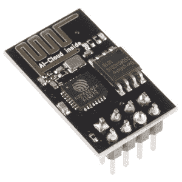
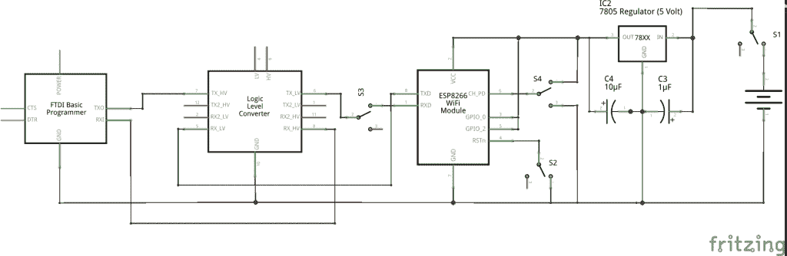

# 现成的黑客:使用 ESP8266 为您的 DIY 项目添加 WiFi 连接

> 原文：<https://thenewstack.io/off-shelf-hacker-programming-tips-tricks-esp8266-wifi-module/>

也许是因为该设备的巨大人气，在网上有一个关于 ESP8266 DIY WiFi 模块的相互矛盾的信息，导致许多沮丧和愤怒。

在[现成黑客](/tag/off-the-shelf-hacker/)的未来版本中，我们将研究如何使用 Node.js 或 Lua 来编写这种多功能的 WiFi 片上系统(SoC)。不过，首先，看看它的一些怪癖和细微差别是有意义的，特别是在让固件上传工作的时候。

“ESP8266 WiFi 模块是一个独立的 SOC，集成了 TCP/IP 协议栈，可以让任何微控制器访问您的 WiFi 网络，”制造商的[网站上写道](https://www.sparkfun.com/products/13678)。“ESP8266 既可以托管应用，也可以从另一个应用处理器卸载所有 Wi-Fi 网络功能。”



今天，我将介绍我发现的适用于 ESP8266-01 型号的可靠方法。这些是最常见的板，只有八个引脚。我们将在后面的文章中使用-07 模型(有更多的引脚和一个外部天线)。

还要记住，8266 是一个 3.3 伏的设备。虽然有些人说他们已经使用 5 伏连接，但我肯定会坚持 3.3 伏规格的电源，串行通信和 GPIO 引脚操作。我一次点三个..所以，你知道…只是为了安全起见。十块钱，没什么大不了。

## **FTDI 连接和电平转换**

8266 使用串行接口进行编程。我的 Linux 笔记本只有 USB 口。

怎么办？使用 FTDI 电缆。它将笔记本 USB 连接转换成 8266、Arduino、XBee 无线电模块或任何其他串行设备都可以理解的东西。

有两种常见的电缆版本可用， [5 伏](https://www.sparkfun.com/products/9718)和 [3.3 伏](https://www.sparkfun.com/products/9717)。在 Adafruit、Sparkfun 和其他供应商那里，每个售价约为 18 美元。如前所述，8266 模块工作电压为 3.3 伏，而不是 5.0 伏。如果你像我一样只有一根 5 伏的 FTDI 电缆，这是一个挑战。

我的零件箱中有一个实用的解决方案，就是使用一个[电平转换器](https://www.sparkfun.com/products/12009)。这种情况下我会准备一些。这是一个小电路板，位于 5 伏 FTDI 电缆末端和 8266 之间，将信号转换为所需的 3.3 伏电平。使用 3.3 伏的 FTDI 电缆会更简洁、更容易。我很贱。我能说什么呢？

下面是我的试验板上的 8266 原理图。

[](https://thenewstack.io/wp-content/uploads/2016/02/simple-8266-2_schem.png)

简单的 ESP8266 设置

你会注意到我包含了三个开关符号。当然，在物理上，它们代表着在进行固件上传时，将电线插入试验板或从试验板中拔出，这一点我们稍后会讨论。

另外，FTDI Basic 程序员代表我的 FTDI 电缆。从功能上讲，它们是可以互换的。FTDI 电缆，通过 USB 端口插入我的 Linux 笔记本。

既然你知道了 FTDI 电缆，我们需要一个程序来上传。

对 8266 进行编程的一个好方法是使用 Arduino IDE。在最新版本的应用程序中有大量的例子。我用的是 1.6.7 版本。在这个练习中，我加载了基本的“hello server”Web 页面演示程序，并对其进行了一点调整。要修改的重要部分是网络参数。我的网络路由器使用加密，所以需要包含密码，否则 8266 永远无法连接。在文件开头编辑您自己的接入点 ID 和密码行。

```
const char*  ssid  =  "your access point ID goes here";
  const char*  password  =  "your access point password goes here";

```

## **上传固件**

编辑完程序后，就可以将固件上传到 8266 模块了。

对于 5 伏 FTDI 电缆和电平转换器来说，这有点棘手，但如果您知道正确的步骤，它会工作得很好:

1.  从正常的 3.3 伏连接位置拔下 GPIO0。
2.  将 GPIO0 插入接地(蓄电池负极连接)。这将 8266 配置为上传模式。
3.  暂时拔下 TX1 连接并保持断开状态。
4.  暂时插入和拔出接地的复位线。ESP8266 重新启动时，蓝色 LED 应稳定闪烁一次。这是实际启动到上传模式所需要的。
5.  插回 TX1 连接。这将 FTDI/电平转换器重新连接到 8266。

现在点击 Arduino IDE 顶部的上传按钮。

IDE 将编译程序，并开始向 8266 上传固件。你会知道它在工作，因为会有一个上传信息和一系列的点在 Arduino 状态窗口上滚动。当圆点停止移动时，上传完成:

1.  将 GPIO0 连接从地移回正 3.3 伏位置。这将 8266 配置为运行模式。
2.  暂时拔掉 TX1 连接。
3.  暂时插入和拔出接地的复位线。当 8266 重新启动并从您的网络中获取 IP 地址时，蓝色 LED 应稳定闪烁一次。

几秒钟后，您可以在浏览器中输入 8266 的 IP 地址，并看到新实现的 Web 服务器中出现的文本行。

有几种方法可以找到 8266 的 IP 地址。在你的安卓手机上加载“Fing ”,扫描你的网络寻找 8266 模块。我的显示为“espressif”。

另一种确定 IP 的方法是复位 8266 并在 Arduino IDE 上观察串行控制台。遵循这些步骤。

1.  暂时拔下 TX1 连接并保持断开状态。
2.  暂时插入和拔出接地的复位线。
3.  立即插回 TX1 连接，并观察串行监视器。

当 8266 启动时，你会看到一些奇怪的字符，然后是几个字符串，其中一个是模块的 IP 地址。

请记住，TX1 连接是模块的电线(在试验板上)，而不是 USB 连接器。如果您从笔记本电脑上拔下 USB 连接器，Arduino IDE 将会变得混乱，不再想与 8266 模块通信。关闭并重新启动 Arduino IDE，让它再次运行。

## **开始为您的 8266 编程**

这就是了。在 ESP8266-01 上轻松上传固件。一旦编程完成，您甚至不再需要连接 FTDI/电平转换器。上电后，8266 应重启进入运行模式，无需将 reset 引脚接地。

请随意查看 Arduino IDE 中的其他 8266 示例。这是一个强大的小平台，有很大的潜力。而且，它们也很便宜。

<svg xmlns:xlink="http://www.w3.org/1999/xlink" viewBox="0 0 68 31" version="1.1"><title>Group</title> <desc>Created with Sketch.</desc></svg>