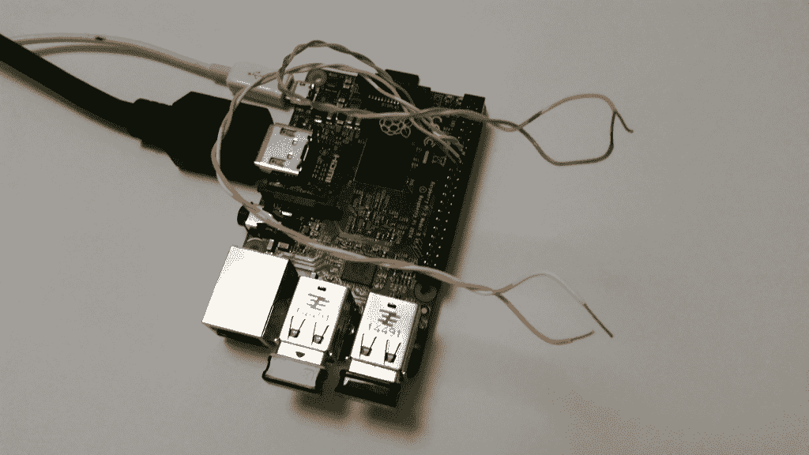
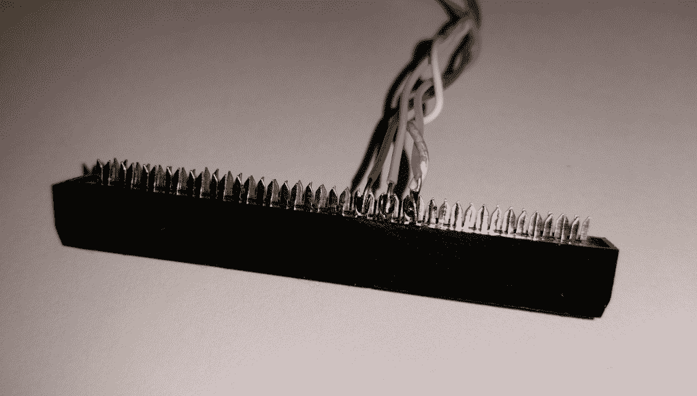

# 现成的黑客:从 Raspberry Pi 运行幻灯片

> 原文：<https://thenewstack.io/off-shelf-hacker-push-button-slides-pi/>

***Editor’s Note:** In this segment, TNS’s own resident mad IT genius [Dr. Torq](http://drtorq.com/), will take you through a basic application of physical computing using the Raspberry Pi, to help carry out one of the most routine aspects of being an IT professional: giving a presentation.*

我们可以直接进入典型的“将引脚 A 插入试验板连接器 B”的方法，帮助 TNS 读者熟悉微控制器、传感器、纳米 Linux 设备和创客运动。相反，我将介绍一个大多数技术人员都熟悉的小型现实应用程序:在技术会议上把幻灯片放到屏幕上。

[](https://thenewstack.io/wp-content/uploads/2015/11/pi-impress-buttons.png)

## **你喜欢说话？**

没错！我喜欢做技术演讲。

站在一群知识渊博的技术人员面前，分享我在工作中获得的尖端技巧是一件有趣的事情。最棒的部分是在问答过程中与好奇和热情的参与者互动。我演讲的投资回报率也很有吸引力。

正如你可能猜到的，我也是一个电子产品爱好者。

我把我的“蒸汽朋克演示操作和显示装置”设计成一次性的注意力抓取器，用于显示我的演示幻灯片和在硬件演示期间显示小部件。这个设备不使用笔记本，只需插入 HDMI 投影仪，我拿出一个无线键盘/鼠标垫，启动它就可以了。值得注意的特点是一个[树莓 Pi 2](https://www.raspberrypi.org/) 、 [LibreOffice Impress](https://www.libreoffice.org/discover/impress/) ，一个被黑掉的网络摄像头和几个前进/后退幻灯片的按钮。按钮是今天讨论的话题。

## **树莓派的 Arduino？**

很多人把 Arduino 和 Raspberry Pi 放在“微控制器”的标题下。虽然 Arduino 是一个很棒的设备，但它实际上在许多重要方面与 Raspberry Pi 有很大不同:

正如你可能已经观察到的，Arduino 和 Raspberry Pi 都能够识别并响应几个按钮的按下。但是，对于运行幻灯片演示或在大屏幕上查看小印刷电路板细节的工作来说，Arduino 完全不合适。

Arduino 的工作相当简单。简而言之，它读取一些输入，可能做一些计算，然后根据这些输入或计算设置一些输出。输入可以是按钮、光电池、开关、逻辑电平电压等等。计算可能是将两个输入相加，如果它们的总和超过某个值(在这种情况下可能=> 2)，则设置一个输出。一个输出可能是打开一个 LED，运行一个马达或者激活一个控制厨房电器的继电器。

相比之下，Raspberry Pi 能够在连接 HDMI 的投影仪或显示器上轻松显示整个桌面。使用普通的网络摄像头，Pi 还可以显示摄像头视野内的实时视频，包括印刷电路板的微小特写，甚至是 Arduino 模块本身。Pi 还可以使用 [LibreOffice Impress](https://www.libreoffice.org/discover/impress/) 轻松运行幻灯片，包括详细的图形和酷炫的幻灯片过渡。

信用卡大小的 Pi 就像一台 Linux 桌面机，增加了读取输入、进行一些计算和设置输出的能力，就像一心一意的 Arduino 一样。

所有这些基于 Pi 的表示和物理计算的优点都发生在我们超级可靠和稳定的计算伙伴 Linux 的监视之下。

## **阅读按钮，更换幻灯片**

让我们看看如何通过按一个按钮来改变幻灯片。

### 五金器具

Pi 的大多数接口连接都使用 40 针连接器。我发现连接设备最简单的方法是偷一根旧的 40 针电脑硬盘线，然后把连接器拆开。然后你可以[将从一些旧的 5 类电缆中提取的 24 号实芯电线焊接到引脚上，并将电线连接到按钮上。请参见图 1，查看连接器的特写。](http://www.instructables.com/id/How-to-solder/)

[](https://thenewstack.io/wp-content/uploads/2015/11/pi-impress-connector.png)

按钮#1(向上)的一侧连接到 GPIO 引脚 23(物理引脚#16)。同样，按钮#2 的一侧(向下)连接到 GPIO 引脚 24(物理引脚#18)。这里有一个树莓派引脚布局的链接。两个按钮的另一侧焊接到 GND 引脚(物理引脚#14)。不需要像 Arduino 那样使用分压器电路，因为 Pi 上的引脚内置了上拉/下拉电阻。

出于测试目的，我简单地将每一对电线短接在一起用于按钮按压，因为我还没有连接任何物理按钮。

一旦“按钮”准备就绪，就该把注意力转向检测按压和推进幻灯片了。

### 软件

如您所料，Pi 运行基于 X-Windows 的显示系统。LibreOffice 在 X-Windows 下运行良好。诀窍是检测两个按钮中的一个，并告诉 LibreOffice 在通过 X-Windows 系统时更改幻灯片。

我的解决方案是从按钮上读取输入，然后模拟向下箭头或向上箭头，让 LibreOffice 以为我按了键盘上的这些键。您可以在 Python 脚本中完成所有这些工作，Python 脚本是 Pi 上普遍接受的默认编程语言。

有一个鲜为人知的命令行程序 xdotool 可以完成这项工作。Python 脚本简单地运行一个循环，反复检查按钮的状态，当它检测到一个按钮时，通过一个系统调用执行 xdotool 命令。

下面是 [Python](https://www.codecademy.com/learn/python) 脚本。我把它命名为 **scrollslides.py** 。

```
import os
import RPi.GPIO as GPIO
import time

GPIO.setmode(GPIO.BCM)
GPIO.setup(23,  GPIO.IN,  pull_up_down=GPIO.PUD_UP)
GPIO.setup(24,  GPIO.IN,  pull_up_down=GPIO.PUD_UP)

while True:
      input_state  =  GPIO.input(23)
      if input_state  ==  False:
 os.system("xdotool search --name 'Impress' key Up")
 print('Up Button Pressed')

time.sleep(0.2)
input_state  =  GPIO.input(24)

if input_state  ==  False:
        os.system("xdotool search --name 'Impress' key Down")
        print('Down Button Pressed')

time.sleep(0.2)

```

这个程序很简单。使用“导入”行引用库。然后，用“GPIO”语句初始化通用输入/输出线。接下来，开始无限循环，读取每个输入状态。如果按钮被按下，状态记录为 false，系统调用 xdotool。按钮状态也会打印到终端上。

xdotool 命令搜索名为“Impress”的 X 窗口，然后根据按下的按钮发送向上或向下键。Window 有各种各样的名字，所以你要做的就是找出窗口的名字。它将查找全部或部分 X 窗口名称。

您还可以使用 [xwininfo](http://linux.die.net/man/1/xwininfo) 命令来发现您机器上任何活动的窗口。

```
       rob%  xwininfo  -tree  -root

```

**演出时间**

我做节目的程序是把 HDMI 线、USB 无线键盘 fob 和电源线插到树莓 Pi 上。Linux 将引导至标准桌面。在那里，我将打开一个终端，用 sudo 命令运行 Python 脚本，因为它将访问 GPIO 引脚，并且需要正确的权限。

```
<i>       </i>rob%  sudo python scrollslides.py

```

随着 scrollslides.py(按钮检测)脚本的运行，是时候打开 LibreOffice Impress 并加载会议幻灯片了。接下来，单击“幻灯片放映”选项卡，调出第一张幻灯片。

此时，按钮将处理幻灯片的向前和向后移动。当然，你也可以使用键盘上的上/下箭头来控制幻灯片。

就是这样，物理计算在树莓派上的一个基本用途。

## **更进一步**

您可能会研究 Raspberry Pi 上读取输入、进行计算或比较以及设置输出(或模拟击键)的其他应用程序。

一个想法可能是在观看视频或音频时使用几个按钮前进或后退。用 [mplayer](http://www.mplayerhq.hu/design7/news.html) 或者 [Audacity](http://audacityteam.org/) 试试这个技巧。你可以考虑把按钮放在一块可以用脚操作的板上，不用手来控制。

看看我在《树莓派》极客杂志上的 OSCON 版[展示机](http://www.raspberry-pi-geek.com/Archive/2014/06/Equip-your-Pi-for-slide-and-video-presentations)。

所以，你有它。物理计算的一个简单现实世界的例子。几周后，我将在 Fossetcon 上谈论(并使用)我的蒸汽朋克演示操作和显示装置。顺便访问会议，让我知道您是 TNS 读者。

*特征图片: [Libre Office](https://www.libreoffice.org/discover/impress/) ，获 [CC BY-SA 3.0](http://creativecommons.org/licenses/by-sa/3.0/) 许可。*

<svg xmlns:xlink="http://www.w3.org/1999/xlink" viewBox="0 0 68 31" version="1.1"><title>Group</title> <desc>Created with Sketch.</desc></svg>